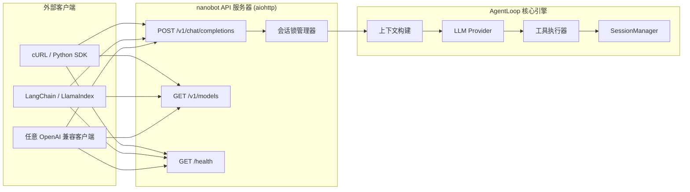
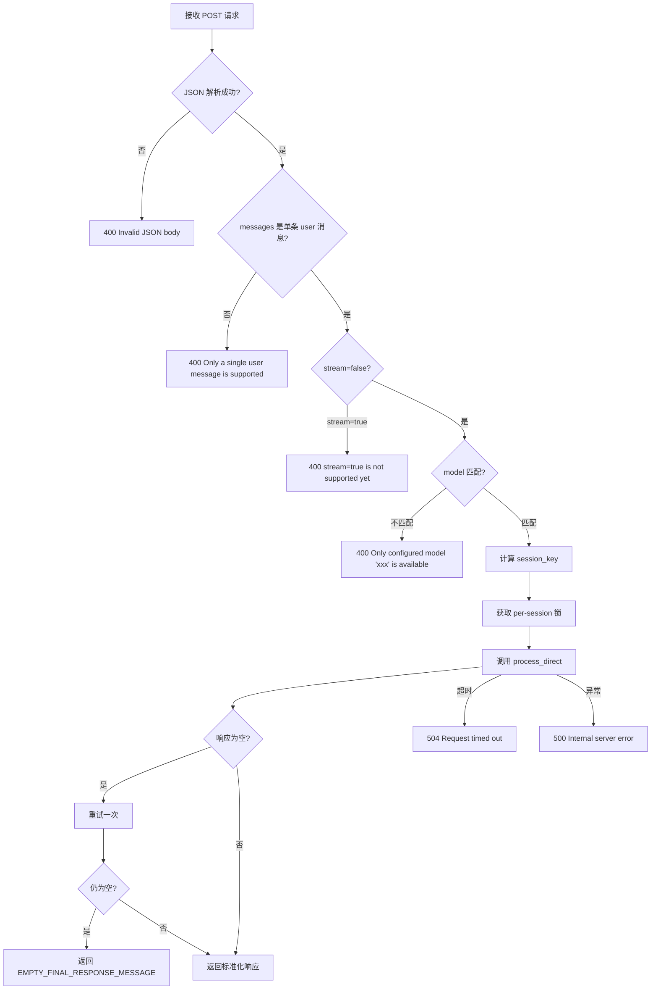

nanobot 的 OpenAI 兼容 HTTP API 将 Agent 的全部能力——包括工具调用、记忆系统、MCP 集成等——暴露为一组标准化的 REST 端点。任何已支持 OpenAI API 的客户端库（Python `openai`、Node.js、cURL、LangChain 等）都可以零修改地接入 nanobot，将其视为一个自托管的 AI 后端。本文将深入解析 API 的端点设计、会话隔离机制、请求处理流水线，并提供完整的集成示例。

Sources: [server.py](nanobot/api/server.py#L1-L5)

## 架构总览：API 层在 nanobot 中的位置

API 服务器是一个轻量级的 HTTP 薄层，桥接外部 OpenAI 兼容客户端与 nanobot 核心的 `AgentLoop` 引擎。它不自行实现 LLM 调用逻辑，而是将每个 HTTP 请求翻译为一次 `process_direct()` 调用，由 AgentLoop 完成上下文组装、LLM 推理、工具执行等全部流程。



整个数据流可以概括为：**HTTP 请求 → JSON 解析与校验 → 会话锁获取 → `process_direct()` 调用 → 响应标准化 → HTTP 返回**。API 服务器通过 `create_app()` 工厂函数构建，将初始化完毕的 `AgentLoop` 实例注入 aiohttp Application 的状态字典中，每个请求处理函数直接读取该实例。

Sources: [server.py](nanobot/api/server.py#L178-L195), [loop.py](nanobot/agent/loop.py#L762-L778)

## 端点详解

API 服务器暴露三个端点，均遵循 OpenAI API 规范或通用健康检查模式。

### 端点一览

| 端点 | 方法 | 功能 | OpenAI 兼容 |
|------|------|------|-------------|
| `/v1/chat/completions` | POST | 提交对话消息，获取 Agent 响应 | ✅ 部分兼容 |
| `/v1/models` | GET | 列出可用模型（返回配置中的模型名） | ✅ 兼容 |
| `/health` | GET | 健康检查，返回 `{"status": "ok"}` | ❋ 自定义 |

Sources: [server.py](nanobot/api/server.py#L192-L194)

### POST /v1/chat/completions

这是核心端点，接收 OpenAI 格式的聊天请求并返回 Agent 处理结果。其请求处理流程包含以下阶段：



**请求体约束**：当前实现要求 `messages` 数组恰好包含**一条** `role: "user"` 的消息。不支持多轮对话的 messages 数组（因为对话历史由 nanobot 的 SessionManager 内部管理），也不支持 `stream: true`（流式输出）。

**多模态内容**：如果 `content` 字段是数组格式（而非字符串），API 会自动提取其中 `type: "text"` 的部分并拼接为纯文本，忽略 `image_url` 等其他类型。这意味着你可以发送 OpenAI 多模态格式的请求体，但 nanobot 当前只处理文本部分。

Sources: [server.py](nanobot/api/server.py#L64-L150)

### GET /v1/models

返回配置中注册的模型列表。由于 nanobot 每个实例只使用一个 LLM 模型，该端点始终返回单个模型条目：

```json
{
  "object": "list",
  "data": [
    {
      "id": "anthropic/claude-opus-4-5",
      "object": "model",
      "created": 0,
      "owned_by": "nanobot"
    }
  ]
}
```

模型名称来自配置文件中 `agents.defaults.model` 字段，通过 `create_app()` 的 `model_name` 参数传入。如果请求中指定了不同的 `model` 值，`/v1/chat/completions` 端点会返回 400 错误。

Sources: [server.py](nanobot/api/server.py#L153-L166)

### GET /health

简单的健康检查端点，返回 `{"status": "ok"}`，适合负载均衡器或 Kubernetes 存活探针使用。

Sources: [server.py](nanobot/api/server.py#L169-L171)

## 响应格式与错误处理

### 成功响应

成功的 chat completion 响应严格遵循 OpenAI 的 `chat.completion` 对象格式：

```json
{
  "id": "chatcmpl-a1b2c3d4e5f6",
  "object": "chat.completion",
  "created": 1718234567,
  "model": "anthropic/claude-opus-4-5",
  "choices": [
    {
      "index": 0,
      "message": {
        "role": "assistant",
        "content": "你好！我是 nanobot，有什么可以帮你的吗？"
      },
      "finish_reason": "stop"
    }
  ],
  "usage": {
    "prompt_tokens": 0,
    "completion_tokens": 0,
    "total_tokens": 0
  }
}
```

注意 `usage` 字段当前返回零值——nanobot 的 token 计数在 AgentLoop 内部通过 Hook 机制记录，未直接暴露到 HTTP 响应中。`id` 字段使用 `chatcmpl-` 前缀加 12 位随机 hex 生成，`finish_reason` 固定为 `"stop"`。

Sources: [server.py](nanobot/api/server.py#L34-L48)

### 错误响应格式

所有错误遵循 OpenAI 的错误对象结构：

```json
{
  "error": {
    "message": "描述性错误信息",
    "type": "invalid_request_error",
    "code": 400
  }
}
```

| HTTP 状态码 | 触发条件 | error.type |
|-------------|----------|------------|
| 400 | JSON 解析失败、messages 格式错误、stream=true、model 不匹配 | `invalid_request_error` |
| 500 | AgentLoop 处理过程中的内部异常 | `server_error` |
| 504 | 请求超过配置的超时时间（默认 120 秒） | `server_error` |

Sources: [server.py](nanobot/api/server.py#L27-L31)

### 空响应重试机制

Agent 执行工具链后可能产生空响应（例如工具执行完毕但 LLM 未生成最终回复）。API 服务器实现了一次自动重试：首次返回为空时，会再次调用 `process_direct()`；若仍为空，则返回预定义的回退消息 `"I completed the tool steps but couldn't produce a final answer. Please try again or narrow the task."`。这确保了客户端始终能收到非空响应。

Sources: [server.py](nanobot/api/server.py#L103-L139), [runtime.py](nanobot/utils/runtime.py#L13-L16)

## 会话管理与隔离

### 会话标识机制

API 服务器通过 **session_key** 实现会话隔离。每个 session_key 映射到 SessionManager 中一个独立的 `Session` 对象，拥有各自的对话历史（`history.jsonl`）和上下文窗口。

| 场景 | session_key 生成规则 | 示例 |
|------|---------------------|------|
| 请求体不含 `session_id` | 固定为 `api:default` | `api:default` |
| 请求体包含 `session_id` | `api:{session_id}` | `api:user-123` |

```python
# 请求体中指定 session_id
{
  "messages": [{"role": "user", "content": "你好"}],
  "session_id": "user-123"  # → session_key = "api:user-123"
}
```

**`session_id` 是 nanobot 的扩展字段**，不在 OpenAI 标准规范内。利用此字段，多个终端用户可以共享同一个 nanobot API 实例，同时保持对话历史完全隔离。这在构建多用户聊天后端时尤为有用。

Sources: [server.py](nanobot/api/server.py#L19-L20), [server.py](nanobot/api/server.py#L97-L99)

### 请求串行化锁

同一个 session_key 的并发请求会被 **per-session asyncio.Lock** 串行化。这意味着同一会话中的第二个请求必须等待第一个请求完成后才能开始处理。不同 session_key 的请求则可以并行执行。

```python
# create_app() 中初始化锁字典
app["session_locks"] = {}  # per-user locks, keyed by session_key

# handle_chat_completions() 中按需创建锁
session_lock = session_locks.setdefault(session_key, asyncio.Lock())
```

这种设计防止了同一会话内对话历史的并发写入冲突，同时允许多个独立会话并行处理，最大化服务器吞吐量。

Sources: [server.py](nanobot/api/server.py#L98-L99), [server.py](nanobot/api/server.py#L106-L148)

### 对话历史的持久化

每个 session_key 对应的 `Session` 对象通过 [SessionManager](nanobot/session/manager.py#L96-L101) 持久化为 JSONL 文件（位于 `{workspace}/sessions/` 目录）。API 服务器使用 `channel="api"` 和 `chat_id="default"` 标记所有来自 HTTP API 的消息。后续请求到达时，AgentLoop 会自动加载对应会话的历史记录作为上下文输入，实现跨请求的连续对话。

Sources: [server.py](nanobot/api/server.py#L108-L114), [events.py](nanobot/bus/events.py#L9-L24)

## 启动与配置

### 通过 CLI 启动

使用 `nanobot serve` 命令启动 API 服务器：

```bash
# 安装 API 依赖
pip install "nanobot-ai[api]"

# 使用默认配置启动（127.0.0.1:8900）
nanobot serve

# 自定义参数
nanobot serve --host 0.0.0.0 --port 9000 --timeout 60 -v

# 指定配置文件和工作区
nanobot serve -c /path/to/config.json -w /path/to/workspace
```

Sources: [commands.py](nanobot/cli/commands.py#L540-L619)

### CLI 参数

| 参数 | 短选项 | 说明 | 默认值 |
|------|--------|------|--------|
| `--port` | `-p` | 监听端口 | `8900`（来自 config） |
| `--host` | `-H` | 绑定地址 | `127.0.0.1`（来自 config） |
| `--timeout` | `-t` | 单请求超时（秒） | `120.0`（来自 config） |
| `--verbose` | `-v` | 显示 nanobot 运行时日志 | `False` |
| `--workspace` | `-w` | 工作区目录 | 配置文件中的值 |
| `--config` | `-c` | 配置文件路径 | `~/.nanobot/config.json` |

Sources: [commands.py](nanobot/cli/commands.py#L542-L548)

### 配置文件

API 相关配置位于 `config.json` 的 `api` 节点下，由 `ApiConfig` 类定义：

```json
{
  "api": {
    "host": "127.0.0.1",
    "port": 8900,
    "timeout": 120.0
  }
}
```

| 字段 | 类型 | 默认值 | 说明 |
|------|------|--------|------|
| `host` | string | `"127.0.0.1"` | 绑定地址。默认仅监听本地回环，安全第一 |
| `port` | int | `8900` | 监听端口 |
| `timeout` | float | `120.0` | 单请求超时秒数 |

**安全提示**：默认 `host` 为 `127.0.0.1`（仅本地访问）。当设置为 `0.0.0.0` 或 `::` 时，CLI 会输出警告：*API is bound to all interfaces. Only do this behind a trusted network boundary, firewall, or reverse proxy.*

Sources: [schema.py](nanobot/config/schema.py#L136-L141), [commands.py](nanobot/cli/commands.py#L596-L605)

### 启动流程

`nanobot serve` 的初始化流程按以下顺序执行：

1. **加载配置**：读取 `config.json`，解析环境变量插值
2. **创建 MessageBus**：消息总线实例（API 模式下实际不经过总线路由）
3. **初始化 Provider**：根据配置自动匹配 LLM 后端
4. **创建 SessionManager**：绑定到工作区的 sessions 目录
5. **构建 AgentLoop**：注入上述依赖，包括工具注册、MCP 服务器等
6. **创建 aiohttp Application**：将 AgentLoop 绑定到应用状态
7. **注册生命周期钩子**：`on_startup` 连接 MCP 服务器，`on_cleanup` 关闭 MCP 连接
8. **启动 HTTP 服务**：`web.run_app()` 阻塞运行

Sources: [commands.py](nanobot/cli/commands.py#L567-L619)

## 集成示例

### cURL

```bash
# 基本请求
curl http://127.0.0.1:8900/v1/chat/completions \
  -H "Content-Type: application/json" \
  -d '{
    "model": "anthropic/claude-opus-4-5",
    "messages": [{"role": "user", "content": "总结一下 nanobot 的核心架构"}]
  }'

# 带会话隔离的请求
curl http://127.0.0.1:8900/v1/chat/completions \
  -H "Content-Type: application/json" \
  -d '{
    "messages": [{"role": "user", "content": "继续上次的讨论"}],
    "session_id": "project-alpha"
  }'

# 查询可用模型
curl http://127.0.0.1:8900/v1/models

# 健康检查
curl http://127.0.0.1:8900/health
```

Sources: [server.py](nanobot/api/server.py#L64-L171)

### Python openai 库

nanobot 兼容 OpenAI Python SDK，只需修改 `base_url` 即可接入：

```python
from openai import OpenAI

# 将 base_url 指向 nanobot 服务器
client = OpenAI(
    base_url="http://127.0.0.1:8900/v1",
    api_key="not-needed",  # nanobot 不验证 API key
)

# 发送请求
response = client.chat.completions.create(
    model="anthropic/claude-opus-4-5",  # 必须与配置中的模型名一致
    messages=[{"role": "user", "content": "你好，请介绍你自己"}],
)

print(response.choices[0].message.content)
```

**注意**：由于 API 只接受单条 user 消息，OpenAI SDK 中传递多轮 `messages` 数组会触发 400 错误。对话的上下文延续由 nanobot 内部的 SessionManager 自动管理。

Sources: [server.py](nanobot/api/server.py#L74-L75)

### LangChain 集成

通过 `ChatOpenAI` 的 `openai_api_base` 参数将 LangChain 应用指向 nanobot：

```python
from langchain_openai import ChatOpenAI
from langchain.schema import HumanMessage

llm = ChatOpenAI(
    model_name="anthropic/claude-opus-4-5",
    openai_api_base="http://127.0.0.1:8900/v1",
    openai_api_key="not-needed",
)

# 简单调用
response = llm.invoke([HumanMessage(content="帮我写一段 Python 快速排序")])
print(response.content)
```

Sources: [server.py](nanobot/api/server.py#L64-L79)

### Docker Compose 部署

`docker-compose.yml` 中已预配置 `nanobot-api` 服务，使用独立工作区 `/home/nanobot/.nanobot/api-workspace`：

```yaml
nanobot-api:
  container_name: nanobot-api
  <<: *common-config
  command: ["serve", "--host", "0.0.0.0", "-w", "/home/nanobot/.nanobot/api-workspace"]
  restart: unless-stopped
  ports:
    - 127.0.0.1:8900:8900  # 仅映射到宿主机本地
```

关键设计决策：端口映射使用 `127.0.0.1:8900:8900` 而非 `0.0.0.0:8900:8900`，确保 API 仅从宿主机本地访问，避免直接暴露到公网。容器内部绑定 `0.0.0.0` 以接收 Docker 网络的端口转发。

Sources: [docker-compose.yml](docker-compose.yml#L32-L47)

## 当前限制与设计权衡

| 限制 | 原因 | 影响 |
|------|------|------|
| 不支持 `stream: true` | 流式输出尚未实现 | 客户端必须等待完整响应 |
| 仅接受单条 user 消息 | 对话历史由 SessionManager 管理 | 不兼容依赖多轮 messages 传递上下文的客户端 |
| `usage` 返回零值 | token 计数在内部 Hook 中记录 | 无法通过 API 获取精确 token 用量 |
| 无认证机制 | nanobot 定位为个人/内网工具 | 需通过反向代理或网络隔离保障安全 |
| `model` 必须匹配配置 | 单实例仅配置一个模型 | 不支持动态模型切换 |

**关于单消息限制的设计意图**：OpenAI 标准要求客户端在每次请求中传递完整对话历史。而 nanobot 的 SessionManager 已经在服务端维护了结构化的对话历史（包括工具调用结果、consolidation 标记等），如果允许客户端覆盖 messages 数组，将破坏 SessionManager 的上下文一致性。因此，API 层选择只接收当前轮次的用户输入，上下文组装完全委托给内部机制。

Sources: [server.py](nanobot/api/server.py#L74-L79), [server.py](nanobot/api/server.py#L47-L48), [server.py](nanobot/api/server.py#L78-L79)

## 进阶阅读

- 如果需要通过 Python 代码而非 HTTP 接口集成 nanobot，请参阅 [Python SDK：Nanobot 门面类与会话隔离](28-python-sdk-nanobot-men-mian-lei-yu-hui-hua-ge-chi)，它提供了更灵活的编程接口，包括 Hook 注入和自定义会话管理。
- 了解会话历史在底层的存储和检索机制，请参阅 [会话管理器：对话历史、消息边界与合并策略](23-hui-hua-guan-li-qi-dui-hua-li-shi-xiao-xi-bian-jie-yu-he-bing-ce-lue)。
- 了解 AgentLoop 如何处理请求并执行工具调用，请参阅 [Agent 主循环与工具调用生命周期](5-agent-zhu-xun-huan-yu-gong-ju-diao-yong-sheng-ming-zhou-qi)。
- API 的网络暴露安全注意事项，请参阅 [网络安全、访问控制与生产环境加固](32-wang-luo-an-quan-fang-wen-kong-zhi-yu-sheng-chan-huan-jing-jia-gu)。