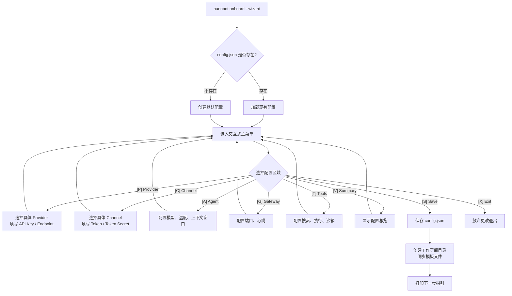
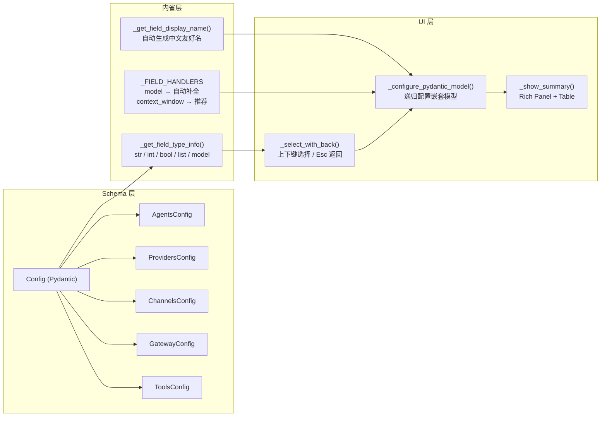
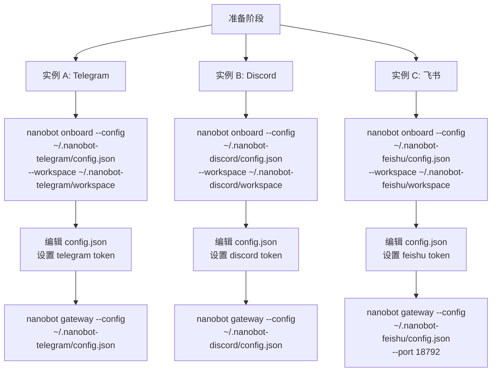

nanobot 提供了两种配置方式：**手动编辑 JSON 配置文件**和**交互式引导向导（Wizard）**。对于刚接触项目的新手而言，交互向导能帮你快速完成 API 密钥、模型选择、通道连接等核心设置，无需翻阅配置 Schema。当你需要同时运行多个 bot（比如 Telegram bot 和 Discord bot 各用一个实例）时，nanobot 通过 `--config` 参数实现完全隔离的多实例部署——每个实例拥有独立的配置文件、工作空间和运行时数据。本文将带你从零跑通向导，并掌握多实例配置的完整流程。

Sources: [onboard.py](nanobot/cli/onboard.py#L1-L46), [commands.py](nanobot/cli/commands.py#L270-L366)

## 向导总览：从 `nanobot onboard --wizard` 开始

交互式引导向导是 `nanobot onboard` 命令的一个模式。在标准初始化命令后追加 `--wizard` 标志即可启动：

```bash
nanobot onboard --wizard
```

向导启动后会进入一个全屏终端 UI，提供以下八个主菜单选项：

| 选项 | 功能说明 |
|------|---------|
| **[P] LLM Provider** | 配置 LLM 提供商的 API 密钥、API 端点等 |
| **[C] Chat Channel** | 配置消息通道（Telegram、Discord、飞书等）的连接参数 |
| **[A] Agent Settings** | 配置默认模型、温度、上下文窗口、时区等代理行为 |
| **[G] Gateway** | 配置网关主机、端口和心跳服务 |
| **[T] Tools** | 配置 Web 搜索、Shell 执行、沙箱等工具参数 |
| **[V] View Configuration Summary** | 查看当前配置总览 |
| **[S] Save and Exit** | 保存配置并退出 |
| **[X] Exit Without Saving** | 放弃所有更改并退出 |

向导的工作流可以概括为如下过程：



在向导内部，每次进入一个配置区域（如 Provider 或 Channel），会看到一个字段列表，你可以选择任一字段进行编辑。按 **Escape** 或 **左箭头** 可返回上一级，编辑过程中所做的修改只在选择 **[Done]** 时才会提交——中途返回会丢弃当前区域的草稿。

Sources: [onboard.py](nanobot/cli/onboard.py#L956-L1024), [commands.py](nanobot/cli/commands.py#L270-L366)

## 向导配置详解

### LLM Provider 配置

nanobot 内置了二十余个 LLM 提供商的配置入口。向导从 Provider 注册表动态获取所有可用提供商，并自动过滤掉需要 OAuth 认证的类型（如 OpenAI Codex、GitHub Copilot），只展示需要 API Key 的提供商。已配置过 API Key 的提供商会在列表末尾显示 `*` 标记。

进入 Provider 配置后，你会看到以下字段：

| 字段 | 类型 | 说明 |
|------|------|------|
| `api_key` | string（敏感） | LLM 提供商的 API 密钥，输入时自动脱敏显示 |
| `api_base` | string \| null | 自定义 API 端点 URL（部分网关类型有默认值） |
| `extra_headers` | dict \| null | 额外 HTTP 请求头（如 AiHubMix 的 APP-Code） |

常见的 Provider 及其特点：

| Provider | 类型 | 说明 |
|----------|------|------|
| **Custom** | 直连 | 任意 OpenAI 兼容端点 |
| **OpenRouter** | 网关 | 全局路由，密钥前缀 `sk-or-` |
| **Anthropic** | 标准 | 原生 SDK，支持 prompt caching |
| **OpenAI** | 标准 | 官方 API |
| **DeepSeek** | 标准 | 国产大模型 |
| **Ollama** | 本地 | 本地部署模型，默认 `localhost:11434` |
| **SiliconFlow** | 网关 | 硅基流动，OpenAI 兼容 |
| **VolcEngine** | 网关 | 火山引擎，按量付费 |

当你在 Provider 列表中选中一个提供商时，向导会自动调用 `_configure_pydantic_model` 进入该提供商的字段编辑界面。敏感字段（包含 `api_key`、`token`、`secret`、`password` 等关键词）在显示时会被自动脱敏，只展示末尾 4 位字符。

Sources: [onboard.py](nanobot/cli/onboard.py#L651-L736), [schema.py](nanobot/config/schema.py#L88-L126), [registry.py](nanobot/providers/registry.py#L75-L200)

### Chat Channel 配置

通道配置部分同样从注册表动态发现所有可用的消息通道。nanobot 支持的内置通道包括 Telegram、Discord、飞书（Feishu）、企业微信（WeCom）、钉钉（DingTalk）、QQ、Slack、Matrix、Email、WhatsApp 等，还会自动扫描通过 `entry_points` 注册的外部通道插件。

每个通道有独立的配置类（如 `TelegramConfig`、`DiscordConfig`），向导通过 Pydantic 模型内省自动生成编辑界面。配置完成后，向导将编辑结果序列化为字典，存入 `config.json` 的 `channels` 字段下对应通道的键中。

Sources: [onboard.py](nanobot/cli/onboard.py#L738-L818), [registry.py](nanobot/channels/registry.py#L54-L71)

### Agent Settings 配置

Agent 设置是控制 AI 行为的核心区域，对应配置 Schema 中的 `agents.defaults`。关键字段包括：

| 字段 | 默认值 | 说明 |
|------|--------|------|
| `workspace` | `~/.nanobot/workspace` | 代理工作空间目录 |
| `model` | `anthropic/claude-opus-4-5` | 默认使用的 LLM 模型 |
| `provider` | `auto` | 指定提供商名称或自动检测 |
| `max_tokens` | `8192` | 单次生成最大 token 数 |
| `context_window_tokens` | `65536` | 上下文窗口大小 |
| `temperature` | `0.1` | 生成温度 |
| `max_tool_iterations` | `200` | 最大工具调用迭代次数 |
| `reasoning_effort` | null | 思考模式：low / medium / high |
| `timezone` | `UTC` | IANA 时区（如 `Asia/Shanghai`） |

向导对 **`model`** 字段做了特殊处理——提供模型名称自动补全功能，当模型变更时还会尝试自动填充对应的 `context_window_tokens` 推荐值。对 **`context_window_tokens`** 字段，你可以手动输入或选择"获取推荐值"来查询模型数据库。

Sources: [onboard.py](nanobot/cli/onboard.py#L437-L518), [schema.py](nanobot/config/schema.py#L62-L80)

### Gateway 与 Tools 配置

**Gateway** 配置控制网关服务器的网络参数和心跳服务：

| 字段 | 默认值 | 说明 |
|------|--------|------|
| `host` | `0.0.0.0` | 监听地址 |
| `port` | `18790` | 监听端口 |
| `heartbeat.enabled` | `true` | 是否启用心跳服务 |
| `heartbeat.interval_s` | `1800` | 心跳间隔（秒） |
| `heartbeat.keep_recent_messages` | `8` | 心跳上下文保留的最近消息数 |

**Tools** 配置控制工具系统的行为（向导中跳过了 `mcp_servers` 字段，需要手动编辑配置文件）：

| 字段 | 默认值 | 说明 |
|------|--------|------|
| `web.enable` | `true` | 启用 Web 工具 |
| `web.search.provider` | `duckduckgo` | 搜索引擎选择 |
| `exec.enable` | `true` | 启用 Shell 执行工具 |
| `exec.timeout` | `60` | Shell 命令超时（秒） |
| `exec.sandbox` | `""` | 沙箱后端（`bwrap` 或无） |
| `restrict_to_workspace` | `false` | 限制工具访问范围到工作空间 |

Sources: [onboard.py](nanobot/cli/onboard.py#L820-L851), [schema.py](nanobot/config/schema.py#L128-L200)

## 向导的技术架构

向导的核心设计基于 **Pydantic 模型内省**——它不需要为每个配置区域手写 UI 代码，而是通过分析 Schema 的字段类型自动生成编辑界面。



**类型自动识别**：向导通过 Python 的 `typing.get_origin` / `get_args` 分析字段注解，将 `str | None` 解析为 `str`、将 `list[str]` 解析为 `list`、将嵌套的 `BaseModel` 解析为 `model`（递归进入子编辑器）。**敏感字段自动脱敏**：字段名包含 `api_key`、`token`、`secret`、`password` 时，显示值被遮盖为 `****XXXX`（仅显示末尾 4 位）。**草稿-提交模式**：每次进入一个配置区域时，向导会深拷贝一份模型实例作为草稿，只有用户明确选择 `[Done]` 时才将草稿写回原配置，中途返回则丢弃草稿。

Sources: [onboard.py](nanobot/cli/onboard.py#L168-L280), [onboard.py](nanobot/cli/onboard.py#L521-L616)

## 多实例配置：同时运行多个 nanobot

当你需要为不同平台、不同团队或不同用途运行多个 nanobot 实例时，核心机制是 `--config` 参数。每个实例使用独立的 `config.json`，nanobot 会从配置文件路径自动派生出独立的运行时数据目录。

### 快速开始：三个实例的完整流程



**第一步：初始化各实例的配置和工作空间**

```bash
# 创建 Telegram 实例
nanobot onboard --config ~/.nanobot-telegram/config.json --workspace ~/.nanobot-telegram/workspace

# 创建 Discord 实例
nanobot onboard --config ~/.nanobot-discord/config.json --workspace ~/.nanobot-discord/workspace

# 创建飞书实例
nanobot onboard --config ~/.nanobot-feishu/config.json --workspace ~/.nanobot-feishu/workspace
```

你也可以在初始化时加上 `--wizard` 标志来启动交互式向导：

```bash
nanobot onboard --config ~/.nanobot-telegram/config.json --workspace ~/.nanobot-telegram/workspace --wizard
```

**第二步：编辑各实例的配置文件**

每个实例的 `config.json` 需要设置不同的通道、模型和工作空间。以下是一个 Telegram 实例的配置示例：

```json
{
  "agents": {
    "defaults": {
      "workspace": "~/.nanobot-telegram/workspace",
      "model": "anthropic/claude-sonnet-4-6"
    }
  },
  "channels": {
    "telegram": {
      "enabled": true,
      "token": "YOUR_TELEGRAM_BOT_TOKEN"
    }
  },
  "gateway": {
    "port": 18790
  }
}
```

**第三步：启动各实例的网关**

```bash
# 实例 A - Telegram bot（默认端口 18790）
nanobot gateway --config ~/.nanobot-telegram/config.json

# 实例 B - Discord bot（也用默认端口会冲突，需指定不同端口）
nanobot gateway --config ~/.nanobot-discord/config.json --port 18791

# 实例 C - 飞书 bot
nanobot gateway --config ~/.nanobot-feishu/config.json --port 18792
```

> **注意**：同时运行多个实例时，每个实例必须使用不同的网关端口，否则会因端口占用而启动失败。

Sources: [README.md](README.md#L1520-L1636), [loader.py](nanobot/config/loader.py#L13-L28)

### 路径解析规则

理解多实例的关键在于路径解析。当你通过 `--config` 指定配置文件路径时，nanobot 从该路径派生出一系列运行时目录：

| 组件 | 解析来源 | 示例路径 |
|------|---------|---------|
| **配置文件** | `--config` 参数值 | `~/.nanobot-telegram/config.json` |
| **运行时数据目录** | 配置文件所在目录 | `~/.nanobot-telegram/` |
| **工作空间** | `--workspace` 参数或配置中的 `agents.defaults.workspace` | `~/.nanobot-telegram/workspace/` |
| **Cron 任务** | 配置目录下 | `~/.nanobot-telegram/cron/` |
| **媒体/运行时状态** | 配置目录下 | `~/.nanobot-telegram/media/` |
| **日志** | 配置目录下 | `~/.nanobot-telegram/logs/` |

运行时数据目录（cron、media、logs 等）始终从配置文件路径派生，与工作空间无关。工作空间路径由配置文件内的 `agents.defaults.workspace` 决定，但可以通过 `--workspace` 参数进行一次性覆盖。

Sources: [paths.py](nanobot/config/paths.py#L1-L63), [loader.py](nanobot/config/loader.py#L17-L28)

### CLI 会话与多实例

`nanobot agent` 命令也支持 `--config` 参数，可以直接与特定实例的工作空间交互：

```bash
# 与 Telegram 实例的工作空间对话
nanobot agent -c ~/.nanobot-telegram/config.json -m "你好"

# 与 Discord 实例的工作空间对话
nanobot agent -c ~/.nanobot-discord/config.json -m "Hello"

# 一次性覆盖工作空间（不影响配置文件中的默认值）
nanobot agent -c ~/.nanobot-telegram/config.json -w /tmp/nanobot-test -m "测试消息"
```

> 需要注意的是，`nanobot agent` 启动的是一个独立的本地 CLI 代理会话，它不会连接到正在运行的 `nanobot gateway` 进程。如果你想测试特定配置下的模型和工具链，这是一个便捷的方式。

Sources: [commands.py](nanobot/cli/commands.py#L863-L879), [README.md](README.md#L1558-L1568)

## 多实例常见场景

| 场景 | 配置策略 |
|------|---------|
| **多平台 Bot** | 每个平台一个实例，各自启用对应的通道 |
| **测试/生产隔离** | 测试实例使用 `--config ~/.nanobot-test/config.json`，生产使用默认路径 |
| **不同模型/团队** | 各实例配置不同的 `model` 和 `provider`，以及独立的工作空间 |
| **多租户服务** | 每个租户一个配置目录，独立的记忆、会话和技能 |

### 注意事项

- **端口隔离**：同时运行多个网关实例时，必须为每个实例分配不同的 `gateway.port`
- **工作空间隔离**：如需独立的记忆、会话和技能，确保每个实例使用不同的 `workspace`
- **`--workspace` 优先级**：命令行 `--workspace` 参数会覆盖配置文件中的工作空间设置
- **环境变量支持**：配置文件中的字符串值支持 `${ENV_VAR}` 格式的环境变量插值，可用于避免在 JSON 中硬编码密钥
- **配置 Schema 的环境变量**：根配置 `Config` 类使用 `NANOBOT_` 前缀和 `__` 嵌套分隔符，如 `NANOBOT_AGENTS__DEFAULTS__MODEL`

Sources: [README.md](README.md#L1624-L1636), [schema.py](nanobot/config/schema.py#L312-L312), [loader.py](nanobot/config/loader.py#L81-L110)

## 下一步

完成初始化配置后，你可以根据需要继续探索：

- 了解 nanobot 的 [整体架构：消息总线驱动的通道-代理模型](4-zheng-ti-jia-gou-xiao-xi-zong-xian-qu-dong-de-tong-dao-dai-li-mo-xing)，理解消息如何在通道和 Agent 之间流转
- 如果需要将实例部署到服务器，参考 [Docker 部署与 docker-compose 配置](30-docker-bu-shu-yu-docker-compose-pei-zhi) 和 [Linux Systemd 服务与多实例运维](33-linux-systemd-fu-wu-yu-duo-shi-li-yun-wei)
- 深入了解配置体系，参阅 [配置体系：schema 定义、环境变量插值与多配置文件](31-pei-zhi-ti-xi-schema-ding-yi-huan-jing-bian-liang-cha-zhi-yu-duo-pei-zhi-wen-jian)
- 开始配置具体的消息通道，参阅 [内置通道配置指南（Telegram、Discord、飞书、微信等）](17-nei-zhi-tong-dao-pei-zhi-zhi-nan-telegram-discord-fei-shu-wei-xin-deng)