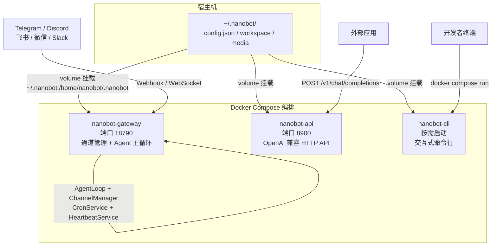
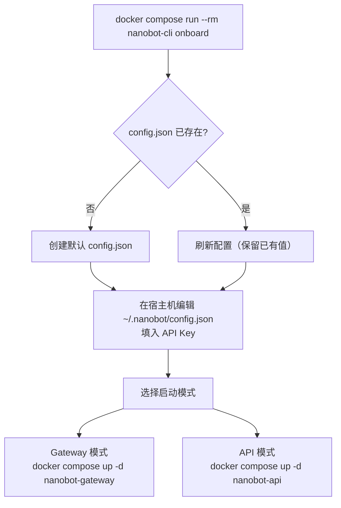

nanobot 提供了开箱即用的 Docker 镜像和 docker-compose 编排方案，让你能在容器化环境中快速运行 **网关模式**（Gateway，连接多平台通道）、**API 模式**（OpenAI 兼容 HTTP 服务）或 **CLI 交互模式**。本文将从镜像构建、compose 编排、数据卷挂载到安全加固，逐步讲解 Docker 部署的每一个环节。

## 整体部署架构

在 Docker 环境中，nanobot 以三种运行模式服务于不同场景。下图展示了各服务之间的关系：



Sources: [docker-compose.yml](docker-compose.yml#L1-L56), [Dockerfile](Dockerfile#L1-L51), [commands.py](nanobot/cli/commands.py#L628-L655)

## 镜像构建：分层缓存与非 root 用户

### 基础镜像与系统依赖

Dockerfile 基于 `ghcr.io/astral-sh/uv:python3.12-bookworm-slim`，这是一个预装了 [uv](https://github.com/astral-sh/uv) 包管理器的精简 Debian 镜像。在系统层安装了以下关键依赖：

| 依赖 | 用途 |
|---|---|
| `nodejs` (20.x) | 编译和运行 WhatsApp Bridge（Baileys 库） |
| `bubblewrap` | 沙箱隔离——限制 Agent 执行 Shell 命令时的文件系统访问 |
| `git`、`openssh-client` | GitStore 版本化管理与 SSH 协议支持 |
| `curl`、`ca-certificates` | 下载 Node.js 仓库签名及 HTTPS 通信 |

Sources: [Dockerfile](Dockerfile#L1-L13)

### 分层缓存策略

镜像构建利用 Docker 层缓存加速重复构建。第一阶段仅复制 `pyproject.toml`、`README.md` 和 `LICENSE` 来安装 Python 依赖——只要项目元数据不变，这一层会被缓存命中：

```dockerfile
# 第一层：安装 Python 依赖（缓存命中条件：pyproject.toml 未变）
COPY pyproject.toml README.md LICENSE ./
RUN mkdir -p nanobot bridge && touch nanobot/__init__.py && \
    uv pip install --system --no-cache . && \
    rm -rf nanobot bridge

# 第二层：复制完整源码并重新安装
COPY nanobot/ nanobot/
COPY bridge/ bridge/
RUN uv pip install --system --no-cache .
```

随后，WhatsApp Bridge 在 `/app/bridge` 目录下通过 `npm install && npm run build` 编译为 JavaScript 产物。构建前还通过 `git config` 将 SSH 协议的 GitHub URL 自动转换为 HTTPS，避免在无 SSH 密钥的容器构建环境中失败。

Sources: [Dockerfile](Dockerfile#L17-L33)

### 非 root 用户与目录权限

镜像创建了 UID 为 1000 的 `nanobot` 用户，并将 `/home/nanobot/.nanobot` 和 `/app` 目录的所有权赋予该用户：

```dockerfile
RUN useradd -m -u 1000 -s /bin/bash nanobot && \
    mkdir -p /home/nanobot/.nanobot && \
    chown -R nanobot:nanobot /home/nanobot /app

USER nanobot
ENV HOME=/home/nanobot
```

容器内所有进程以 `nanobot` 用户身份运行，这是 Docker 安全的最佳实践——即使容器被攻破，攻击者也没有 root 权限。

Sources: [Dockerfile](Dockerfile#L36-L44)

### 入口点与权限检查

[`entrypoint.sh`](entrypoint.sh) 在启动 nanobot 之前，会检测配置目录的写入权限。如果挂载卷的宿主 UID 与容器内 UID (1000) 不匹配，会输出详细的修复指引：

```bash
#!/bin/sh
dir="$HOME/.nanobot"
if [ -d "$dir" ] && [ ! -w "$dir" ]; then
    owner_uid=$(stat -c %u "$dir" 2>/dev/null || stat -f %u "$dir" 2>/dev/null)
    # 输出修复建议：chown / --user / --userns
    exit 1
fi
exec nanobot "$@"
```

注意这里 `stat` 命令同时兼容 Linux (`-c %u`) 和 macOS (`-f %u`) 两种语法，确保在不同宿主系统上都能正确检测权限。

Sources: [entrypoint.sh](entrypoint.sh#L1-L16)

## docker-compose 编排详解

### 公共配置锚点

`docker-compose.yml` 使用 YAML 锚点 `&common-config` 定义了所有服务共享的配置：

```yaml
x-common-config: &common-config
  build:
    context: .
    dockerfile: Dockerfile
  volumes:
    - ~/.nanobot:/home/nanobot/.nanobot
  cap_drop:
    - ALL
  cap_add:
    - SYS_ADMIN
  security_opt:
    - apparmor=unconfined
    - seccomp=unconfined
```

| 配置项 | 作用 |
|---|---|
| `volumes: ~/.nanobot:/home/nanobot/.nanobot` | 将宿主机的 `~/.nanobot` 目录挂载为容器的配置目录，使 `config.json`、workspace、media 等数据在容器重启后持久保留 |
| `cap_drop: ALL` | 丢弃所有 Linux capabilities，实现最小权限原则 |
| `cap_add: SYS_ADMIN` | 重新添加 `SYS_ADMIN`，这是 bubblewrap 沙箱创建 Linux namespace 所需的权限 |
| `security_opt: apparmor=unconfined` / `seccomp=unconfined` | 解除 AppArmor 和 seccomp 的默认限制，允许 bubblewrap 使用 `clone()` 系统调用创建沙箱命名空间 |

> **安全说明**：`SYS_ADMIN` 和解除 seccomp 限制仅用于支持 bubblewrap 沙箱。如果你不需要沙箱功能（例如在 macOS 上运行，bwrap 本身不可用），可以移除这些配置以进一步收紧安全边界。详见 [网络安全、访问控制与生产环境加固](32-wang-luo-an-quan-fang-wen-kong-zhi-yu-sheng-chan-huan-jing-jia-gu)。

Sources: [docker-compose.yml](docker-compose.yml#L1-L14)

### 三种服务模式

#### nanobot-gateway：核心网关服务

```yaml
nanobot-gateway:
  container_name: nanobot-gateway
  <<: *common-config
  command: ["gateway"]
  restart: unless-stopped
  ports:
    - 18790:18790
  deploy:
    resources:
      limits:
        cpus: "1"
        memory: 1G
      reservations:
        cpus: "0.25"
        memory: 256M
```

Gateway 是 nanobot 的核心运行模式。执行 `nanobot gateway` 命令后，容器会启动一个完整的服务栈：

- **AgentLoop**：Agent 主循环，处理消息并调用工具
- **ChannelManager**：管理所有启用的消息通道（Telegram、Discord、飞书等）
- **CronService**：定时任务调度器
- **HeartbeatService**：心跳服务，定期检查和执行后台任务
- **Dream**：长期记忆整合任务

端口 **18790** 是网关的默认端口（可通过 `config.json` 中的 `gateway.port` 修改）。资源限制为 CPU 1 核 / 内存 1 GB，适合单 Agent 场景。

Sources: [docker-compose.yml](docker-compose.yml#L16-L30), [commands.py](nanobot/cli/commands.py#L628-L855)

#### nanobot-api：OpenAI 兼容 API 服务

```yaml
nanobot-api:
  container_name: nanobot-api
  <<: *common-config
  command:
    ["serve", "--host", "0.0.0.0", "-w", "/home/nanobot/.nanobot/api-workspace"]
  restart: unless-stopped
  ports:
    - 127.0.0.1:8900:8900
  deploy:
    resources:
      limits:
        cpus: "1"
        memory: 1G
```

API 服务通过 `nanobot serve` 命令启动一个 OpenAI 兼容的 HTTP 端点（`/v1/chat/completions` 和 `/v1/models`），默认监听 8900 端口。注意两个关键细节：

1. **端口绑定到 `127.0.0.1`**：compose 文件中写的是 `127.0.0.1:8900:8900`，意味着只有宿主机本机可以访问 API，外部网络无法直接连接。如果你需要从其他机器访问，需要改为 `0.0.0.0:8900:8900` 或在前面加反向代理。
2. **独立工作区**：API 使用 `/home/nanobot/.nanobot/api-workspace` 作为工作区，与 Gateway 的工作区隔离，避免会话和文件系统互相干扰。

Sources: [docker-compose.yml](docker-compose.yml#L32-L47), [server.py](nanobot/api/server.py#L1-L196), [commands.py](nanobot/cli/commands.py#L541-L619)

#### nanobot-cli：按需交互式命令行

```yaml
nanobot-cli:
  <<: *common-config
  profiles:
    - cli
  command: ["status"]
  stdin_open: true
  tty: true
```

CLI 服务使用 Docker Compose 的 **profile** 机制，不会在 `docker compose up -d` 时自动启动，只在你显式调用时才运行。`stdin_open: true` 和 `tty: true` 确保交互式终端功能正常（输入消息、查看彩色输出等）。

Sources: [docker-compose.yml](docker-compose.yml#L49-L56)

### 服务对比一览

| 特性 | Gateway | API | CLI |
|---|---|---|---|
| 启动命令 | `nanobot gateway` | `nanobot serve` | `nanobot agent` / `status` 等 |
| 运行方式 | 常驻后台 (`restart: unless-stopped`) | 常驻后台 | 按需运行（`profiles: cli`） |
| 端口暴露 | `18790` (全接口) | `8900` (仅本机) | 无 |
| 核心能力 | 通道管理 + Agent + Cron + 心跳 | OpenAI 兼容 HTTP API | 交互式对话 / 管理操作 |
| 资源限制 | CPU 1 核 / 内存 1 GB | CPU 1 核 / 内存 1 GB | 未设置 |
| 适用场景 | 7×24 生产运行 | 集成到外部应用 | 调试 / 一次性操作 |

Sources: [docker-compose.yml](docker-compose.yml#L15-L56)

## 快速上手：从零部署

### 第一步：构建镜像并初始化配置



```bash
# 构建镜像并运行初始化向导
docker compose run --rm nanobot-cli onboard

# 在宿主机上编辑配置文件，填入 LLM API Key
vim ~/.nanobot/config.json
```

`onboard` 命令会在挂载的 `~/.nanobot` 目录中创建 `config.json`，并自动发现所有已注册的通道插件，将它们的默认配置注入到配置文件中。对于容器化部署，建议在 `config.json` 中使用 `${ENV_VAR}` 语法引用环境变量，避免在配置文件中硬编码密钥。环境变量插值机制详见 [配置体系：schema 定义、环境变量插值与多配置文件](31-pei-zhi-ti-xi-schema-ding-yi-huan-jing-bian-liang-cha-zhi-yu-duo-pei-zhi-wen-jian)。

Sources: [commands.py](nanobot/cli/commands.py#L271-L366), [loader.py](nanobot/config/loader.py#L30-L54)

### 第二步：启动 Gateway

```bash
# 启动网关（后台运行）
docker compose up -d nanobot-gateway

# 查看日志
docker compose logs -f nanobot-gateway
```

启动成功后，终端会输出已启用的通道列表、定时任务状态、心跳间隔和 Dream 记忆整合计划。如果看到 `No channels enabled`，说明需要在 `config.json` 的 `channels` 节点中启用至少一个通道。通道的详细配置方法请参考 [内置通道配置指南](17-nei-zhi-tong-dao-pei-zhi-zhi-nan-telegram-discord-fei-shu-wei-xin-deng)。

Sources: [commands.py](nanobot/cli/commands.py#L807-L831)

### 第三步：使用 CLI 交互或查看状态

```bash
# 查看当前状态（API Key 配置、工作区等）
docker compose run --rm nanobot-cli status

# 发送一条消息测试
docker compose run --rm nanobot-cli agent -m "你好！介绍一下你自己"

# 使用自定义配置文件
docker compose run --rm nanobot-cli agent -m "Hello" --config /home/nanobot/.nanobot/custom-config.json
```

Sources: [commands.py](nanobot/cli/commands.py#L1281-L1314)

## 使用 Docker CLI（不依赖 compose）

如果你更习惯直接使用 `docker` 命令，以下是等效操作：

```bash
# 构建镜像
docker build -t nanobot .

# 初始化配置
docker run -v ~/.nanobot:/home/nanobot/.nanobot --rm nanobot onboard

# 编辑配置（在宿主机上）
vim ~/.nanobot/config.json

# 启动 Gateway
docker run -v ~/.nanobot:/home/nanobot/.nanobot -p 18790:18790 nanobot gateway

# 启动 API 服务
docker run -v ~/.nanobot:/home/nanobot/.nanobot -p 8900:8900 nanobot \
  serve --host 0.0.0.0 -w /home/nanobot/.nanobot/api-workspace

# 一次性命令
docker run -v ~/.nanobot:/home/nanobot/.nanobot --rm nanobot agent -m "Hello!"
docker run -v ~/.nanobot:/home/nanobot/.nanobot --rm nanobot status
```

Sources: [Dockerfile](Dockerfile#L46-L51)

## 数据卷与持久化

容器内的关键数据全部存放在 `/home/nanobot/.nanobot` 目录下，通过 volume 挂载映射到宿主机的 `~/.nanobot`：

```
~/.nanobot/                          # 宿主机目录
├── config.json                      # 主配置文件（API Key、模型、通道等）
├── workspace/                       # Agent 工作区（文件工具的根目录）
├── api-workspace/                   # API 服务的独立工作区
├── cron/                            # 定时任务存储
│   └── jobs.json
├── media/                           # 媒体文件（收发的图片/语音等）
├── history/                         # CLI 命令历史
│   └── cli_history
├── bridge/                          # WhatsApp Bridge 安装目录
└── sessions/                        # 会话数据（历史记录等）
```

如果宿主机的 `~/.nanobot` 目录不存在，首次 `onboard` 时会自动创建。`entrypoint.sh` 会在启动时检查该目录的写入权限——如果宿主机上该目录的 owner UID 不是 1000，你需要先修复权限。

Sources: [paths.py](nanobot/config/paths.py#L1-L63), [entrypoint.sh](entrypoint.sh#L1-L14)

## 常见问题排查

| 问题 | 原因 | 解决方案 |
|---|---|---|
| `Permission denied: ~/.nanobot` | 宿主机目录的 UID 与容器内 `nanobot` 用户 (UID 1000) 不匹配 | `sudo chown -R 1000:1000 ~/.nanobot`，或使用 `docker run --user $(id -u):$(id -g)` |
| `Error: $dir is not writable` | entrypoint.sh 检测到配置目录不可写 | 同上；Podman 用户使用 `--userns=keep-id` |
| `No channels enabled` 警告 | config.json 中没有启用任何消息通道 | 编辑 `~/.nanobot/config.json`，在 `channels` 节点中启用需要的通道 |
| bwrap 沙箱不工作 | 容器缺少 `SYS_ADMIN` capability 或 seccomp 阻止了 `clone()` | 确保 compose 中包含 `cap_add: SYS_ADMIN` 和 `security_opt: seccomp=unconfined` |
| 构建缓慢 | npm install 阶段下载 WhatsApp Bridge 依赖 | 这是正常现象；构建后镜像会被缓存，后续只重新构建代码变更的层 |

Sources: [entrypoint.sh](entrypoint.sh#L1-L14), [docker-compose.yml](docker-compose.yml#L8-L13)

## .dockerignore 优化

项目根目录的 `.dockerignore` 排除了不必要的文件，减小构建上下文的体积：

```
__pycache__        # Python 字节码缓存
*.egg-info         # 包元数据
dist/ / build/     # 构建产物
.git               # Git 历史（通常很大）
.env               # 环境变量文件（避免泄露密钥）
node_modules/      # Node.js 依赖（构建时重新安装）
bridge/dist/       # Bridge 编译产物（构建时重新编译）
```

其中 `.env` 被排除是一个安全考量——防止意外将包含 API Key 的环境文件复制到镜像层中。

Sources: [.dockerignore](.dockerignore#L1-L14)

## 进阶阅读

- **配置文件与环境变量**：了解 `config.json` 的完整 schema 和 `${ENV_VAR}` 插值机制 → [配置体系：schema 定义、环境变量插值与多配置文件](31-pei-zhi-ti-xi-schema-ding-yi-huan-jing-bian-liang-cha-zhi-yu-duo-pei-zhi-wen-jian)
- **生产环境安全加固**：网络安全策略、沙箱配置与访问控制 → [网络安全、访问控制与生产环境加固](32-wang-luo-an-quan-fang-wen-kong-zhi-yu-sheng-chan-huan-jing-jia-gu)
- **Systemd 部署**：不使用 Docker 的 Linux 原生服务管理方案 → [Linux Systemd 服务与多实例运维](33-linux-systemd-fu-wu-yu-duo-shi-li-yun-wei)
- **API 服务集成**：OpenAI 兼容端点的详细用法和集成示例 → [OpenAI 兼容 HTTP API：端点、会话管理与集成示例](29-openai-jian-rong-http-api-duan-dian-hui-hua-guan-li-yu-ji-cheng-shi-li)
- **通道配置**：Telegram、Discord、飞书等通道的具体接入方法 → [内置通道配置指南](17-nei-zhi-tong-dao-pei-zhi-zhi-nan-telegram-discord-fei-shu-wei-xin-deng)