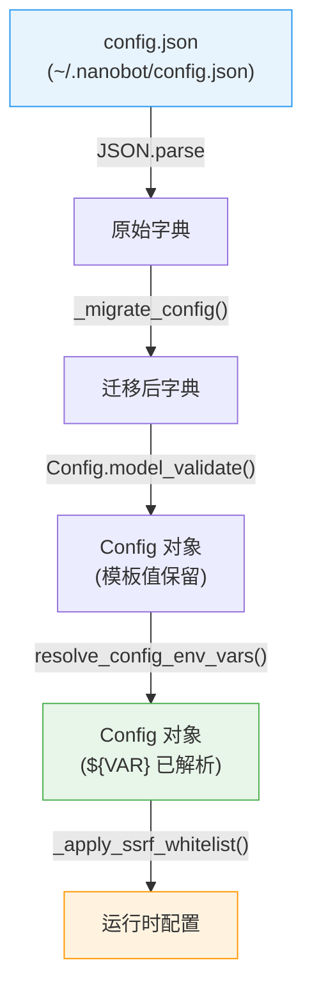
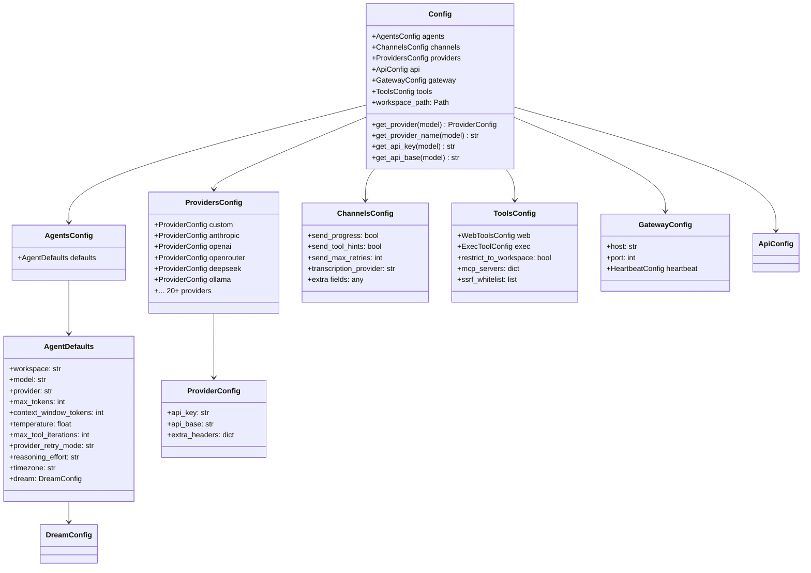
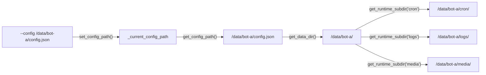

nanobot 的配置体系围绕三层核心机制构建：**Pydantic schema 驱动的类型安全声明**、**`${VAR}` 模板语法的环境变量插值**，以及**基于 `--config` 参数的多实例隔离**。整个配置管道从 `config.json` 文件出发，经过 schema 校验与环境变量解析，最终产出不可变的运行时配置对象——一个贯穿所有子系统的一致性契约。

## 配置加载总览

配置加载过程可以归纳为一条清晰的数据管线：**文件读取 → JSON 解析 → 旧格式迁移 → Pydantic 校验 → 环境变量插值 → 安全策略注入**。每一步都有明确的错误边界，失败时不会崩溃，而是回退到默认配置。



默认配置路径为 `~/.nanobot/config.json`，但通过全局变量 `_current_config_path` 和 `set_config_path()` 函数，可以在运行时切换到任意路径——这是多实例部署的基础。

Sources: [loader.py](nanobot/config/loader.py#L1-L55)

## Schema 层次结构

配置 schema 由 Pydantic v2 的 `BaseModel` 和 `BaseSettings` 构建，形成一棵严格的类型树。所有配置模型继承自自定义的 `Base` 类，该类通过 `alias_generator=to_camel` + `populate_by_name=True` 实现了**camelCase 与 snake_case 双向兼容**——JSON 文件中写 `maxTokens`，Python 代码中访问 `max_tokens`，两者自动映射。



**根对象 `Config`** 继承自 `pydantic_settings.BaseSettings`，这意味着它除了从 JSON 文件读取配置，还能直接从环境变量接收值——通过 `env_prefix="NANOBOT_"` 和 `env_nested_delimiter="__"` 两个关键设置实现。例如，环境变量 `NANOBOT_AGENTS__DEFAULTS__MODEL` 可以覆盖 `config.agents.defaults.model` 的值。

Sources: [schema.py](nanobot/config/schema.py#L1-L200), [schema.py](nanobot/config/schema.py#L202-L313)

## 核心配置区域详解

### Agent 默认配置（AgentDefaults）

`AgentDefaults` 控制着 agent 的核心行为参数，是最常被自定义的配置区域：

| 参数 | 默认值 | 说明 |
|------|--------|------|
| `workspace` | `~/.nanobot/workspace` | Agent 工作目录，影响文件工具的根路径 |
| `model` | `anthropic/claude-opus-4-5` | 默认 LLM 模型，支持 `provider/model` 格式 |
| `provider` | `auto` | Provider 选择策略，`auto` 按模型名自动匹配 |
| `maxTokens` | `8192` | 单次生成最大 token 数 |
| `contextWindowTokens` | `65536` | 上下文窗口大小，影响摘要触发阈值 |
| `temperature` | `0.1` | 生成温度 |
| `maxToolIterations` | `200` | 单次对话最大工具调用轮次 |
| `reasoningEffort` | `None` | 思考模式等级：`low` / `medium` / `high` |
| `timezone` | `UTC` | IANA 时区，影响 Cron 和时间相关工具 |
| `providerRetryMode` | `standard` | 重试模式：`standard` 或 `persistent` |

`DreamConfig` 作为嵌套配置，控制着长期记忆整合的调度参数（详见 [Dream：两阶段长期记忆整合与 GitStore 版本化](22-dream-liang-jie-duan-chang-qi-ji-yi-zheng-he-yu-gitstore-ban-ben-hua)）。

Sources: [schema.py](nanobot/config/schema.py#L62-L79)

### Provider 配置（ProvidersConfig）

`ProvidersConfig` 为每个 LLM 服务商维护独立的 `ProviderConfig`（含 `api_key`、`api_base`、`extra_headers`）。当前内置支持 **25 个 provider**，覆盖了从商业 API（OpenAI、Anthropic、Azure）到本地部署（Ollama、vLLM、OpenVINO）的全场景。

Provider 匹配逻辑在 `_match_provider()` 方法中实现，遵循以下优先级：

1. **强制指定**：当 `provider` 非 `auto` 时，直接使用指定 provider
2. **模型前缀匹配**：模型名如 `anthropic/claude-...` 中的前缀优先匹配
3. **关键词匹配**：按 provider 注册表顺序扫描模型名中的关键词
4. **本地 provider 回退**：对于无前缀的模型名（如 `llama3.2`），匹配配置了 `api_base` 的本地 provider
5. **API Key 回退**：最后尝试任意已配置 API Key 的非 OAuth provider

Sources: [schema.py](nanobot/config/schema.py#L82-L126), [schema.py](nanobot/config/schema.py#L217-L311)

### 通道配置（ChannelsConfig）

`ChannelsConfig` 使用 `extra="allow"` 策略，允许在 JSON 中声明任意通道配置字段而不会触发校验错误。每个通道在初始化时自行解析其专属配置：

```json
{
  "channels": {
    "sendProgress": true,
    "sendToolHints": false,
    "telegram": {
      "enabled": true,
      "token": "${TELEGRAM_BOT_TOKEN}",
      "allowFrom": []
    },
    "discord": {
      "enabled": false,
      "token": "",
      "guildId": ""
    }
  }
}
```

这种"宽松容器 + 通道自治"的设计，使得插件通道可以在不修改 schema 的情况下注入自己的配置结构。

Sources: [schema.py](nanobot/config/schema.py#L18-L32)

### 工具与安全配置（ToolsConfig）

`ToolsConfig` 涵盖 Web 工具、Shell 执行、MCP 服务器和网络安全策略：

| 参数 | 默认值 | 说明 |
|------|--------|------|
| `web.enable` | `true` | 启用 Web 搜索与抓取工具 |
| `web.search.provider` | `duckduckgo` | 搜索引擎：`brave`/`tavily`/`duckduckgo`/`searxng`/`jina` |
| `web.proxy` | `null` | HTTP/SOCKS5 代理 URL |
| `exec.enable` | `true` | 启用 Shell 执行工具 |
| `exec.sandbox` | `""` | 沙箱后端：`""`（无）或 `"bwrap"` |
| `restrictToWorkspace` | `false` | 限制所有工具仅访问工作区 |
| `mcpServers` | `{}` | MCP 服务器连接配置字典 |
| `ssrfWhitelist` | `[]` | SSRF 防护白名单 CIDR 范围 |

`MCPServerConfig` 支持两种连接方式——stdio（本地进程）和 HTTP/SSE（远程服务），并提供了 `enabledTools` 过滤机制精确控制工具暴露范围。

Sources: [schema.py](nanobot/config/schema.py#L162-L200)

## 环境变量插值机制

### `${VAR}` 模板语法

nanobot 支持在 `config.json` 的任意字符串值中使用 `${VAR}` 语法引用环境变量。这在处理 API Key、通道 Token 等敏感信息时尤为关键——配置文件中只保存模板占位符，实际值在运行时从环境中解析。

```json
{
  "providers": {
    "anthropic": {
      "apiKey": "${ANTHROPIC_API_KEY}"
    }
  },
  "channels": {
    "telegram": {
      "token": "${TELEGRAM_BOT_TOKEN}"
    }
  }
}
```

插值由 `resolve_config_env_vars()` 函数驱动，它递归遍历整个配置字典，使用正则表达式 `\$\{([A-Za-z_][A-Za-z0-9_]*)\}` 匹配并替换。关键行为特性：

- **部分替换**：`"https://${HOST}/api"` → `"https://example.com/api"`
- **多变量替换**：`"${USER}:${PASS}"` → `"alice:secret"`
- **类型穿透**：非字符串值（数字、布尔、null）原样保留，不参与替换
- **严格模式**：引用了未设置的环境变量时抛出 `ValueError`，而非静默忽略

### 模板保留：读时解析，存时保留

一个关键设计决策是**环境变量插值发生在加载时，而非保存时**。`resolve_config_env_vars()` 返回一个新的 `Config` 对象，原始对象中的模板字符串（如 `${MY_TOKEN}`）保持不变。当调用 `save_config()` 时，序列化的是原始模板，而非解析后的值。

这意味着：
1. 配置文件可以安全地提交到版本控制系统，不含任何实际密钥
2. 通过修改环境变量即可在不同环境（开发/生产）间切换，无需改动配置文件
3. 重新保存配置（如通过 `onboard` 命令）不会意外地将密钥明文写入磁盘

Sources: [loader.py](nanobot/config/loader.py#L81-L121), [test_env_interpolation.py](tests/config/test_env_interpolation.py#L51-L83)

### Pydantic-Settings 环境变量覆盖

除了 `${VAR}` 模板语法，`Config` 类通过 `pydantic-settings` 提供了另一层环境变量支持。根 `Config` 类声明了：

```python
model_config = ConfigDict(env_prefix="NANOBOT_", env_nested_delimiter="__")
```

这使得环境变量 `NANOBOT_AGENTS__DEFAULTS__MODEL=anthropic/claude-sonnet-4` 可以直接覆盖配置中的嵌套字段。双层下划线 `__` 表示层级分隔符，映射到点号路径 `agents.defaults.model`。这种方式适合容器化部署中通过环境变量进行轻量级覆盖的场景。

Sources: [schema.py](nanobot/config/schema.py#L312-L313)

## 多配置文件与实例隔离

### 配置路径管理

nanobot 通过全局 `_current_config_path` 变量实现多实例支持。`set_config_path()` 设置当前配置路径后，所有后续的路径推导都基于该路径的父目录：



这意味着**每个配置文件自成一个独立的数据目录**——包括会话存储、cron 任务、媒体文件和日志都自动隔离到配置文件所在目录下。

Sources: [loader.py](nanobot/config/loader.py#L14-L28), [paths.py](nanobot/config/paths.py#L1-L63)

### CLI 多实例操作

所有主要 CLI 命令都接受 `--config` / `-c` 参数来指定配置文件路径：

| 命令 | 用途 | 配置参数 |
|------|------|----------|
| `nanobot onboard -c PATH` | 初始化指定实例 | `--config` |
| `nanobot gateway -c PATH` | 启动指定实例的网关 | `--config` |
| `nanobot agent -c PATH` | 使用指定配置对话 | `--config` |
| `nanobot serve -c PATH` | 启动指定实例的 API 服务 | `--config` |
| `nanobot status -c PATH` | 查看指定实例状态 | 隐含使用默认路径 |

对于 Docker 部署场景，`docker-compose.yml` 通过卷挂载 `~/.nanobot:/home/nanobot/.nanobot` 将宿主机配置目录映射到容器内。多实例部署时，每个实例使用不同的配置文件和挂载点即可实现完全隔离。

Sources: [commands.py](nanobot/cli/commands.py#L270-L366), [docker-compose.yml](docker-compose.yml#L1-L56)

### 共享路径与实例路径

并非所有路径都随实例隔离。nanobot 区分了两类路径：

**实例路径（跟随配置文件）：**
- 数据目录：`config.json` 的父目录
- Cron 存储：`<data_dir>/cron/`
- 日志目录：`<data_dir>/logs/`
- 媒体目录：`<data_dir>/media/<channel>/`

**全局共享路径（固定在 `~/.nanobot/`）：**
- CLI 历史记录：`~/.nanobot/history/cli_history`
- WhatsApp Bridge：`~/.nanobot/bridge/`
- 遗留会话目录：`~/.nanobot/sessions/`

这种设计确保了多实例的运行时数据完全隔离，同时共享用户级资源（如命令行历史和桥接安装）。

Sources: [paths.py](nanobot/config/paths.py#L1-L63)

## 配置迁移与兼容性

nanobot 在 `load_config()` 中内置了配置迁移逻辑，确保旧版配置文件能无缝升级到新 schema。当前迁移规则通过 `_migrate_config()` 函数实现：

- `tools.exec.restrictToWorkspace` → `tools.restrictToWorkspace`（字段上移到 `ToolsConfig` 层级）
- 旧的 `memoryWindow` 字段被自动忽略（不再使用，由 `contextWindowTokens` 替代）

此外，`DreamConfig` 中存在一个遗留兼容设计：`model_override` 字段通过 `validation_alias=AliasChoices("modelOverride", "model", "model_override")` 同时接受三种写法（新名、旧名、Python 名），但序列化时只输出 `modelOverride`——新格式的别名。

Sources: [loader.py](nanobot/config/loader.py#L113-L120), [schema.py](nanobot/config/schema.py#L34-L59), [test_config_migration.py](tests/config/test_config_migration.py#L1-L161)

## 配置文件示例

以下是一个涵盖主要功能的完整 `config.json` 示例：

```json
{
  "agents": {
    "defaults": {
      "model": "anthropic/claude-sonnet-4",
      "provider": "auto",
      "maxTokens": 8192,
      "contextWindowTokens": 65536,
      "temperature": 0.1,
      "maxToolIterations": 200,
      "timezone": "Asia/Shanghai",
      "reasoningEffort": "medium",
      "dream": {
        "intervalH": 3,
        "maxBatchSize": 20,
        "maxIterations": 10
      }
    }
  },
  "providers": {
    "anthropic": {
      "apiKey": "${ANTHROPIC_API_KEY}"
    },
    "openrouter": {
      "apiKey": "${OPENROUTER_API_KEY}"
    },
    "ollama": {
      "apiBase": "http://localhost:11434"
    }
  },
  "channels": {
    "telegram": {
      "enabled": true,
      "token": "${TELEGRAM_BOT_TOKEN}",
      "allowFrom": []
    }
  },
  "tools": {
    "web": {
      "enable": true,
      "search": {
        "provider": "duckduckgo",
        "maxResults": 5
      }
    },
    "exec": {
      "enable": true,
      "sandbox": "bwrap"
    },
    "restrictToWorkspace": false,
    "mcpServers": {
      "filesystem": {
        "type": "stdio",
        "command": "npx",
        "args": ["-y", "@modelcontextprotocol/server-filesystem", "/tmp"]
      }
    },
    "ssrfWhitelist": ["100.64.0.0/10"]
  },
  "gateway": {
    "host": "0.0.0.0",
    "port": 18790,
    "heartbeat": {
      "enabled": true,
      "intervalS": 1800
    }
  },
  "api": {
    "host": "127.0.0.1",
    "port": 8900,
    "timeout": 120.0
  }
}
```

## 设计决策与权衡

| 设计决策 | 优势 | 代价 |
|----------|------|------|
| Pydantic schema 驱动 | 类型安全、IDE 自动补全、运行时校验 | 新增字段需修改 Python 代码 |
| camelCase/snake_case 双兼容 | JSON 生态友好（camelCase）+ Python 生态友好（snake_case） | 调试时需注意别名映射 |
| `extra="allow"` 通道容器 | 插件通道无需修改核心 schema | 通道配置无静态类型检查 |
| `${VAR}` 运行时插值 | 配置文件可安全提交版本控制 | 缺失变量时运行时报错（非部署时报错） |
| 全局 `_current_config_path` | 简单直接的实例隔离 | 非线程安全，同一进程内不可并发切换实例 |
| 文件路径推导数据目录 | 多实例零配置隔离 | 配置文件位置影响数据存储位置 |

## 相关阅读

- [Docker 部署与 docker-compose 配置](30-docker-bu-shu-yu-docker-compose-pei-zhi) — 在容器环境中使用多实例配置
- [Provider 注册表与自动发现机制](13-provider-zhu-ce-biao-yu-zi-dong-fa-xian-ji-zhi) — Provider 匹配逻辑的完整实现
- [通道架构：BaseChannel 接口与通道管理器](16-tong-dao-jia-gou-basechannel-jie-kou-yu-tong-dao-guan-li-qi) — 通道配置的解析与使用
- [网络安全、访问控制与生产环境加固](32-wang-luo-an-quan-fang-wen-kong-zhi-yu-sheng-chan-huan-jing-jia-gu) — SSRF 白名单与安全策略的配置
- [沙箱安全：Bubblewrap 隔离与工作区访问控制](12-sha-xiang-an-quan-bubblewrap-ge-chi-yu-gong-zuo-qu-fang-wen-kong-zhi) — `exec.sandbox` 配置详解
- [Python SDK：Nanobot 门面类与会话隔离](28-python-sdk-nanobot-men-mian-lei-yu-hui-hua-ge-chi) — 编程接口中的配置使用方式