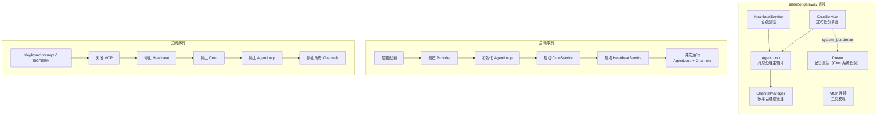
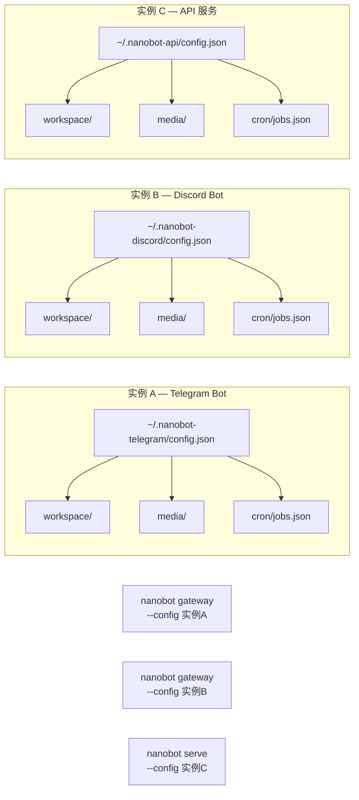

nanobot 的 **Gateway** 是一个长运行进程，它整合了消息通道（Telegram、Discord、飞书等）、定时任务（Cron）、心跳巡检（Heartbeat）和记忆整合（Dream）四大子系统。在 Linux 生产环境中，通过 systemd 将 Gateway 托管为系统服务，可以实现开机自启、故障自动重启、统一日志管理和资源隔离。本文将围绕 systemd 用户服务配置、多实例隔离部署、安全加固与日常运维操作展开，帮助你在单台或多台 Linux 主机上稳定运行多个 nanobot 实例。

Sources: [nanobot/cli/commands.py](nanobot/cli/commands.py#L627-L855), [README.md](README.md#L1853-L1904)

## Gateway 服务模型：理解长运行生命周期

在配置 systemd 之前，需要理解 `nanobot gateway` 命令启动后的完整生命周期。Gateway 进程是一个异步事件驱动的长运行服务，其内部协调多个并发子系统：



**启动序列**按以下顺序执行：首先加载配置并创建 LLM Provider，然后初始化 `AgentLoop`（包含会话管理器、工具注册表和 MCP 连接）。随后依次启动 `CronService`（含 Dream 系统任务注册）、`HeartbeatService`，最后通过 `asyncio.gather` 并发运行 `AgentLoop` 和所有已启用的通道。

**关闭序列**则通过 `finally` 块确保有序清理：关闭 MCP 连接 → 停止心跳 → 停止 Cron → 停止 Agent → 停止所有通道。即使在 `KeyboardInterrupt` 或未捕获异常的情况下，这些清理操作也会执行，保证定时任务状态和工作区文件的一致性。

Sources: [nanobot/cli/commands.py](nanobot/cli/commands.py#L627-L855), [nanobot/heartbeat/service.py](nanobot/heartbeat/service.py#L113-L143), [nanobot/cron/service.py](nanobot/cron/service.py#L195-L209)

## Systemd 用户服务配置

nanobot 推荐使用 **systemd 用户服务**（而非系统级服务），这样可以避免以 root 身份运行，同时仍然获得自动重启和日志管理的能力。配置分为三个步骤。

### 步骤 1：确认安装路径

通过 `which nanobot` 确认可执行文件位置。如果使用 `uv tool install` 或 `pip install --user` 安装，路径通常为 `~/.local/bin/nanobot`。

### 步骤 2：创建服务单元文件

在 `~/.config/systemd/user/` 目录下创建 `nanobot-gateway.service`：

```ini
[Unit]
Description=Nanobot Gateway
After=network.target

[Service]
Type=simple
ExecStart=%h/.local/bin/nanobot gateway
Restart=always
RestartSec=10
NoNewPrivileges=yes
ProtectSystem=strict
ReadWritePaths=%h

[Install]
WantedBy=default.target
```

| 指令 | 作用 | 说明 |
|------|------|------|
| `Type=simple` | 前台进程模式 | `nanobot gateway` 不会 fork，直接运行在前台 |
| `Restart=always` | 无条件重启 | 无论退出码是什么，都尝试重启（崩溃、OOM、信号等） |
| `RestartSec=10` | 重启间隔 | 避免连续崩溃导致 CPU 占满，给上游 API 和本地资源 10 秒恢复窗口 |
| `NoNewPrivileges=yes` | 禁止提权 | 即使二进制设置了 setuid 位，也不允许获取额外权限 |
| `ProtectSystem=strict` | 保护文件系统 | 只读挂载 `/usr`、`/boot`、`/etc` 等系统目录 |
| `ReadWritePaths=%h` | 允许写入用户目录 | `%h` 展开为 `$HOME`，使 nanobot 可以写入 `~/.nanobot` 工作区 |

### 步骤 3：启用并启动服务

```bash
systemctl --user daemon-reload          # 重新加载所有用户服务定义
systemctl --user enable --now nanobot-gateway  # 设为开机自启并立即启动
```

### 保持服务在登出后继续运行

**关键注意点**：systemd 用户服务默认在用户登出所有会话时停止。要让 Gateway 在 SSH 断开后继续运行，必须启用 **lingering**：

```bash
loginctl enable-linger $USER
```

这条命令告诉 logind 即使没有活跃的登录会话，也保留该用户的 systemd 用户实例。执行后，用户的 `systemd --user` 进程将在开机时自动启动，直到关机才停止。

Sources: [README.md](README.md#L1853-L1904), [nanobot/cli/commands.py](nanobot/cli/commands.py#L833-L855)

## 多实例隔离部署

nanobot 通过 `--config` 参数实现多实例隔离——每个实例拥有独立的配置文件、工作区、定时任务和运行时数据。这是运行多个不同用途 bot（例如一个 Telegram bot、一个飞书 bot、一个 OpenAI API 实例）的核心机制。

### 配置隔离原理

当传入 `--config` 时，nanobot 的配置加载器会将该路径的**父目录**作为实例的运行时数据目录。这意味着所有实例级别的运行时状态（Cron 任务存储、媒体文件、日志等）自动与配置文件共存于同一目录树下，无需额外配置。



| 组件 | 解析来源 | 示例路径 |
|------|----------|----------|
| **配置文件** | `--config` 参数 | `~/.nanobot-telegram/config.json` |
| **运行时数据目录** | 配置文件的父目录 | `~/.nanobot-telegram/` |
| **工作区** | 配置中的 `agents.defaults.workspace` 或 `--workspace` | `~/.nanobot-telegram/workspace/` |
| **Cron 任务** | `工作区/cron/jobs.json` | `~/.nanobot-telegram/workspace/cron/jobs.json` |
| **媒体 / 运行时状态** | 运行时数据目录下的子目录 | `~/.nanobot-telegram/media/` |

Sources: [nanobot/config/loader.py](nanobot/config/loader.py#L14-L27), [nanobot/config/paths.py](nanobot/config/paths.py#L11-L34), [README.md](README.md#L1520-L1636)

### 多实例初始化与运行

**初始化**：为每个实例创建独立的配置目录和工作区：

```bash
nanobot onboard --config ~/.nanobot-telegram/config.json --workspace ~/.nanobot-telegram/workspace
nanobot onboard --config ~/.nanobot-discord/config.json --workspace ~/.nanobot-discord/workspace
```

**配置**：编辑各自的 `config.json`，设定不同的通道、模型和端口：

```json
// ~/.nanobot-telegram/config.json
{
  "agents": { "defaults": { "workspace": "~/.nanobot-telegram/workspace", "model": "anthropic/claude-sonnet-4-6" } },
  "channels": { "telegram": { "enabled": true, "token": "${TELEGRAM_TOKEN}" } },
  "gateway": { "port": 18790 }
}
```

```json
// ~/.nanobot-discord/config.json
{
  "agents": { "defaults": { "workspace": "~/.nanobot-discord/workspace", "model": "openai/gpt-4o" } },
  "channels": { "discord": { "enabled": true, "token": "${DISCORD_TOKEN}" } },
  "gateway": { "port": 18791 }
}
```

**运行**：通过 `--config` 指定不同实例：

```bash
nanobot gateway --config ~/.nanobot-telegram/config.json    # 端口 18790
nanobot gateway --config ~/.nanobot-discord/config.json     # 端口 18791
```

> **端口冲突**：每个实例的 `gateway.port` 必须不同。Cron 任务和工作区的隔离则通过配置目录天然实现。

Sources: [README.md](README.md#L1520-L1636), [nanobot/config/schema.py](nanobot/config/schema.py#L144-L151)

### 多实例 Systemd 服务模板

当需要同时运行多个 Gateway 实例时，可以为每个实例创建独立的 systemd 服务文件。利用 systemd 的 **模板单元**（template unit）机制，一个模板文件就能管理所有实例：

```ini
# ~/.config/systemd/user/nanobot@.service
[Unit]
Description=Nanobot Gateway - %i instance
After=network.target

[Service]
Type=simple
ExecStart=%h/.local/bin/nanobot gateway --config %h/.nanobot-%i/config.json
Restart=always
RestartSec=10
NoNewPrivileges=yes
ProtectSystem=strict
ReadWritePaths=%h

[Install]
WantedBy=default.target
```

`%i` 是 systemd 的实例名占位符。启用特定实例时：

```bash
systemctl --user enable --now nanobot@telegram
systemctl --user enable --now nanobot@discord
systemctl --user enable --now nanobot@feishu
```

这会分别启动三个 Gateway 进程，各自读取 `~/.nanobot-telegram/config.json`、`~/.nanobot-discord/config.json`、`~/.nanobot-feishu/config.json`。日志也可以按实例查看：

```bash
journalctl --user -u nanobot@telegram -f
journalctl --user -u nanobot@discord -f
```

Sources: [README.md](README.md#L1853-L1904), [nanobot/cli/commands.py](nanobot/cli/commands.py#L627-L633)

## 安全加固：环境变量与密钥管理

nanobot 的配置文件支持 `${VAR}` 环境变量插值，这意味着 API 密钥、通道 Token 等敏感信息**不应硬编码在 config.json 中**，而应通过环境变量注入。配置加载器在启动时递归扫描所有字符串值，将 `${VAR_NAME}` 替换为对应的环境变量值，如果变量不存在则抛出 `ValueError` 阻止启动。

Sources: [nanobot/config/loader.py](nanobot/config/loader.py#L81-L110)

### EnvironmentFile 方案

对于 systemd 部署，推荐使用 `EnvironmentFile` 指令将密钥从受限文件加载到进程环境中：

```ini
# ~/.config/systemd/user/nanobot@.service（追加）
[Service]
EnvironmentFile=%h/.nanobot-%i/secrets.env
ExecStart=%h/.local/bin/nanobot gateway --config %h/.nanobot-%i/config.json
```

密钥文件的权限设置为仅所有者可读：

```bash
# ~/.nanobot-telegram/secrets.env（权限 600）
TELEGRAM_TOKEN=your-telegram-bot-token
OPENROUTER_API_KEY=sk-or-v1-xxxxx
```

```bash
chmod 600 ~/.nanobot-telegram/secrets.env
```

对应的 `config.json` 使用插值语法引用这些变量：

```json
{
  "channels": { "telegram": { "enabled": true, "token": "${TELEGRAM_TOKEN}" } },
  "providers": { "openrouter": { "apiKey": "${OPENROUTER_API_KEY}" } }
}
```

这种方式下，`config.json` 可以安全提交到版本控制（不含任何实际密钥），而真正的凭证只存在于受文件权限保护的 `.env` 文件中。

### Sandboxing 补充安全指令

除了服务单元中已配置的 `NoNewPrivileges` 和 `ProtectSystem`，还可以添加以下 systemd 沙箱指令进一步收紧：

```ini
[Service]
# 禁止访问 /tmp 之外的临时目录
PrivateTmp=yes
# 禁止通过 ptrace 调试
ProtectProc=invisible
# 限制网络能力（如果不需要入站连接）
# IPAddressAllow=localhost
```

> **注意**：如果 nanobot 需要连接外部 LLM API（如 OpenRouter、Anthropic），不能完全阻断出站网络。但 Gateway 默认绑定 `0.0.0.0:18790`，如果不需要外部访问该端口，可以通过 `--port` 绑定到 `127.0.0.1` 或用防火墙限制。

Sources: [README.md](README.md#L893-L907), [nanobot/config/schema.py](nanobot/config/schema.py#L136-L151), [nanobot/config/loader.py](nanobot/config/loader.py#L81-L110)

## 日常运维操作

### 常用命令速查

| 操作 | 命令 |
|------|------|
| 查看服务状态 | `systemctl --user status nanobot-gateway` |
| 重启服务 | `systemctl --user restart nanobot-gateway` |
| 停止服务 | `systemctl --user stop nanobot-gateway` |
| 查看实时日志 | `journalctl --user -u nanobot-gateway -f` |
| 查看最近 100 行日志 | `journalctl --user -u nanobot-gateway -n 100` |
| 修改配置后重启 | 编辑 `~/.nanobot/config.json` → `systemctl --user restart nanobot-gateway` |
| 修改服务文件后生效 | 编辑 `.service` → `systemctl --user daemon-reload` → `systemctl --user restart nanobot-gateway` |

### 日志管理

nanobot 使用 **loguru** 作为日志框架。在 Gateway 模式下，日志输出到 stderr，systemd 自动将其捕获到 journal。你可以用以下方式过滤日志：

```bash
# 仅看错误日志
journalctl --user -u nanobot-gateway -p err

# 查看今天的日志
journalctl --user -u nanobot-gateway --since today

# 搜索特定通道相关日志
journalctl --user -u nanobot-gateway | grep "telegram"

# 搜索 Cron 任务执行记录
journalctl --user -u nanobot-gateway | grep "Cron:"
```

### 健康检查

Gateway 启动时会输出通道启用状态、Cron 任务数量、心跳间隔和 Dream 调度计划等关键信息。通过 `journalctl` 可以确认启动是否正常：

```bash
journalctl --user -u nanobot-gateway -n 20 | grep "✓"
```

正常启动时应看到类似输出：

```
✓ Channels enabled: telegram, discord
✓ Cron: 3 scheduled jobs
✓ Heartbeat: every 1800s
✓ Dream: every 2h
```

如果使用 `nanobot serve` 启动 OpenAI 兼容 API，它自带 `/health` 端点（返回 `{"status": "ok"}`），可以配合 systemd 的 `ExecStartPost` 或外部监控脚本进行健康检查。

Sources: [nanobot/cli/commands.py](nanobot/cli/commands.py#L807-L831), [nanobot/api/server.py](nanobot/api/server.py#L169-L171)

### 配置变更与重启策略

nanobot 的配置文件在**每次启动时加载**（不是热加载）。因此修改配置后需要重启服务才能生效：

| 修改内容 | 是否需要重启 | 说明 |
|----------|:------------:|------|
| API 密钥 / 通道 Token | ✅ | Provider 和 Channel 在启动时初始化 |
| 模型 / 温度参数 | ✅ | GenerationSettings 在启动时绑定到 Provider |
| Heartbeat 间隔 | ✅ | HeartbeatService 的定时器在启动时设置 |
| Dream 调度计划 | ✅ | Dream 作为系统级 Cron 任务在启动时注册 |
| SOUL.md / USER.md / MEMORY.md | ❌ | Agent 每次处理消息时从磁盘读取最新内容 |
| HEARTBEAT.md | ❌ | Heartbeat 每次触发时从磁盘读取 |
| Cron 任务（通过聊天命令） | ❌ | 运行时动态修改并持久化 |

对于不需要重启的文件（如 SOUL.md），直接编辑工作区中的文件即可在下一轮对话中生效。

Sources: [nanobot/heartbeat/service.py](nanobot/heartbeat/service.py#L79-L85), [nanobot/cron/service.py](nanobot/cron/service.py#L80-L88)

## 生产环境考量

### 资源限制

参考项目 `docker-compose.yml` 中的资源配额，单实例的推荐资源配置为：

| 资源 | 推荐限制 | 推荐预留 |
|------|----------|----------|
| CPU | 1 核 | 0.25 核 |
| 内存 | 1 GB | 256 MB |

在 systemd 中可以通过 `MemoryMax` 和 `CPUQuota` 实现类似限制：

```ini
[Service]
MemoryMax=1G
MemoryHigh=768M
CPUQuota=100%
```

> Gateway 进程本身是轻量的（纯 Python asyncio），大部分 CPU 和内存消耗来自 LLM API 调用期间的序列化/反序列化和上下文构建。如果工作区有大量文件或启用了多个通道，可能需要适当调高内存限制。

Sources: [docker-compose.yml](docker-compose.yml#L23-L30)

### API 服务与 Gateway 共存

如果同时需要 OpenAI 兼容 API 和多平台通道，可以分别部署 `nanobot serve` 和 `nanobot gateway` 作为独立进程。两者可以共享同一个配置文件和工作区（但使用不同的端口）：

```bash
# Gateway：处理通道消息 + Cron + Heartbeat
nanobot gateway --config ~/.nanobot/config.json

# API：提供 OpenAI 兼容的 HTTP 接口
nanobot serve --config ~/.nanobot/config.json --port 8900
```

也可以为 API 服务创建专用的 systemd 服务文件，指向相同或不同的配置。

Sources: [nanobot/cli/commands.py](nanobot/cli/commands.py#L540-L619), [docker-compose.yml](docker-compose.yml#L32-L47)

### 故障恢复与信号处理

Gateway 进程注册了 `SIGINT`、`SIGTERM` 和 `SIGHUP` 信号处理器，确保在收到停止信号时执行有序关闭。`Restart=always` 策略覆盖了以下故障场景：

| 故障类型 | Systemd 行为 | 说明 |
|----------|-------------|------|
| `SIGTERM`（正常停止） | 等 `RestartSec` 后重启 | 如 `systemctl restart` |
| 进程崩溃（SegFault） | 等 `RestartSec` 后重启 | 自动恢复 |
| OOM Kill | 等 `RestartSec` 后重启 | 如已设 `MemoryMax`，内核会杀进程 |
| 上游 API 不可用 | 进程存活但不响应 | Agent 内部有重试机制，不会导致进程退出 |
| 配置文件丢失 | 启动失败，systemd 循环重启 | 检查 `journalctl` 中的 "Config not found" 错误 |

Sources: [nanobot/cli/commands.py](nanobot/cli/commands.py#L833-L855), [nanobot/channels/manager.py](nanobot/channels/manager.py#L248-L276)

## 从 Docker 迁移到原生 Systemd

如果你的 nanobot 最初部署在 Docker 中（参考 [Docker 部署与 docker-compose 配置](30-docker-bu-shu-yu-docker-compose-pei-zhi)），迁移到原生 systemd 部署的步骤如下：

1. **安装 nanobot**：`pip install nanobot-ai` 或 `uv tool install nanobot-ai`
2. **迁移数据**：将 Docker 卷中的 `~/.nanobot` 复制到宿主用户的 `$HOME/.nanobot`
3. **调整权限**：`chown -R $USER:$USER ~/.nanobot`
4. **创建服务文件**：按上文步骤创建 systemd 用户服务
5. **启用 lingering**：`loginctl enable-linger $USER`
6. **停止 Docker 容器**：`docker compose down`
7. **启动 systemd 服务**：`systemctl --user enable --now nanobot-gateway`

原生部署相比 Docker 的优势：更低的资源开销（无容器开销）、更简单的日志管理（直接 journalctl）、以及更灵活的沙箱配置（systemd 安全指令比 Docker cap_drop 更细粒度）。

## 延伸阅读

- [配置体系：schema 定义、环境变量插值与多配置文件](31-pei-zhi-ti-xi-schema-ding-yi-huan-jing-bian-liang-cha-zhi-yu-duo-pei-zhi-wen-jian) — 深入理解 `${VAR}` 插值和配置加载机制
- [Docker 部署与 docker-compose 配置](30-docker-bu-shu-yu-docker-compose-pei-zhi) — 容器化部署方案
- [网络安全、访问控制与生产环境加固](32-wang-luo-an-quan-fang-wen-kong-zhi-yu-sheng-chan-huan-jing-jia-gu) — SSRF 防护和网络安全配置
- [Cron 服务：定时任务调度与多时区支持](24-cron-fu-wu-ding-shi-ren-wu-diao-du-yu-duo-shi-qu-zhi-chi) — 定时任务的运行机制和状态持久化
- [整体架构：消息总线驱动的通道-代理模型](4-zheng-ti-jia-gou-xiao-xi-zong-xian-qu-dong-de-tong-dao-dai-li-mo-xing) — 理解 Gateway 内部子系统的协作方式