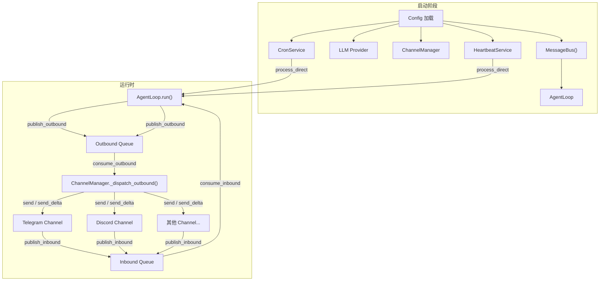

nanobot 的核心设计可以用一句话概括：**消息总线（MessageBus）是中枢神经，通道（Channel）是感知器官，代理循环（AgentLoop）是大脑**。三者通过两个异步队列解耦——入站队列承载从外部世界涌入的消息，出站队列承载 AI 代理生成的回复。这个「通道-总线-代理」三层模型既支撑了 14+ 个聊天平台的无缝接入，也保证了代理核心的单一职责：读消息 → 构建上下文 → 调 LLM → 执行工具 → 写回复。本文将从最内层的总线原语开始，逐层展开整个运行时架构。

Sources: [bus/queue.py](nanobot/bus/queue.py#L8-L44), [bus/events.py](nanobot/bus/events.py#L1-L39)

## 消息总线：两个队列撑起的解耦骨架

`MessageBus` 是整个系统中最精简也最核心的组件，仅有两个 `asyncio.Queue` 实例和一个薄薄的发布/消费接口：

```python
class MessageBus:
    def __init__(self):
        self.inbound: asyncio.Queue[InboundMessage] = asyncio.Queue()
        self.outbound: asyncio.Queue[OutboundMessage] = asyncio.Queue()
```

**入站队列（inbound）**：所有通道收到用户消息后统一调用 `bus.publish_inbound()` 投递；**出站队列（outbound）**：代理循环或工具执行产生的回复通过 `bus.publish_outbound()` 投递。两个队列都是无界的 `asyncio.Queue`，消费端以阻塞等待模式运行——`consume_inbound()` 和 `consume_outbound()` 在队列为空时自动挂起当前协程，不消耗 CPU。

这种「双队列」设计的直接收益是：通道层完全不需要知道代理的存在，代理也完全不需要知道消息来自 Telegram 还是 Discord。新增一个通道只需实现 `BaseChannel` 接口并将消息投递到入站队列，系统其余部分零改动。

Sources: [bus/queue.py](nanobot/bus/queue.py#L16-L44)

### 事件数据模型

在队列上流动的两类事件以 `dataclass` 定义，语义清晰且自带类型约束：

| 字段 | `InboundMessage` | `OutboundMessage` | 说明 |
|------|:---:|:---:|------|
| `channel` | ✅ | ✅ | 通道标识符（如 `"telegram"`、`"discord"`） |
| `sender_id` / `chat_id` | ✅ / ✅ | ❌ / ✅ | 发送者与会话标识 |
| `content` | ✅ | ✅ | 消息文本 |
| `media` | ✅ | ✅ | 媒体 URL 列表 |
| `metadata` | ✅ | ✅ | 通道特有元数据（流式标记、消息 ID 等） |
| `reply_to` | ❌ | ✅ | 回复目标消息 ID |
| `session_key_override` | ✅ | ❌ | 可选的会话键覆盖（线程级隔离） |
| `timestamp` | ✅ | ❌ | 自动填充为 `datetime.now()` |

`InboundMessage` 提供了一个计算属性 `session_key`，优先使用 `session_key_override`，否则按 `"{channel}:{chat_id}"` 格式生成——这是会话隔离的基础键。例如 Telegram 群组中的不同聊天会得到不同的 `session_key`，从而拥有独立的对话历史。

Sources: [bus/events.py](nanobot/bus/events.py#L8-L39)

## 通道层：感知外部世界的统一接口

所有聊天平台的适配器都继承自 `BaseChannel` 抽象基类，通过四个核心方法与系统交互：

```
┌─────────────────────────────────────────────────┐
│                  BaseChannel                     │
├─────────────────────────────────────────────────┤
│  config     : Any          # 通道配置            │
│  bus        : MessageBus   # 共享消息总线        │
├─────────────────────────────────────────────────┤
│  + start()              → 启动监听（长运行协程）  │
│  + stop()               → 停止并清理资源          │
│  + send(OutboundMessage) → 发送完整消息           │
│  + send_delta(...)      → 发送流式增量（可选覆盖）│
│  + login(force)         → 交互式认证（可选覆盖）  │
│  + is_allowed(sender_id)→ 访问控制检查            │
│  # _handle_message(...) → 权限校验+投递到入站队列 │
└─────────────────────────────────────────────────┘
```

通道收到平台消息后调用 `_handle_message()`，该方法执行两步操作：先用 `is_allowed()` 检查发送者是否在 `allowFrom` 白名单中，通过后将消息封装为 `InboundMessage` 并调用 `self.bus.publish_inbound(msg)` 投递到总线。流式支持则通过 `supports_streaming` 属性自动检测：当配置中开启流式输出且子类重写了 `send_delta()` 时，`_handle_message()` 会在 metadata 中注入 `_wants_stream: True` 标记。

Sources: [channels/base.py](nanobot/channels/base.py#L15-L182)

### 通道自动发现机制

`ChannelManager` 的 `_init_channels()` 方法调用 `discover_all()` 获取所有可用的通道类。发现过程分两层：

1. **内置通道**：通过 `pkgutil.iter_modules()` 扫描 `nanobot.channels` 包下所有模块（排除 `base`、`manager`、`registry` 三个内部模块），动态导入并提取 `BaseChannel` 子类
2. **外部插件**：通过 `importlib.metadata.entry_points(group="nanobot.channels")` 加载通过 pip 安装的第三方通道

两者合并时内置通道优先——外部插件不能覆盖同名的内置通道。这种「零配置发现」设计意味着只需把新的 `.py` 文件放入 `nanobot/channels/` 目录，系统就能自动识别。

Sources: [channels/registry.py](nanobot/channels/registry.py#L17-L72)

### 通道管理器与出站调度

`ChannelManager` 不仅初始化通道，还运行一个独立的 **出站调度循环** `_dispatch_outbound()`。该循环持续从总线的出站队列消费消息，根据 `msg.channel` 字段路由到对应的通道实例：

```
出站队列 → ChannelManager._dispatch_outbound()
              │
              ├── 过滤：progress / tool_hint 标记检查
              ├── 合并：连续 _stream_delta 消息合并
              └── 路由：channels[msg.channel].send() / send_delta()
```

调度过程中有两个关键优化：

- **流式增量合并（Delta Coalescing）**：当 LLM 生成速度快于通道处理速度时，出站队列中可能积压多个针对同一 `(channel, chat_id)` 的 `_stream_delta` 消息。调度器会将这些连续消息合并为一条，减少对平台 API 的调用次数
- **指数退避重试**：发送失败时按 1s → 2s → 4s 的间隔重试，最多尝试 `send_max_retries` 次，`CancelledError` 直接传播以支持优雅关闭

Sources: [channels/manager.py](nanobot/channels/manager.py#L20-L296)

## 代理循环：消息处理的核心引擎

`AgentLoop` 是系统中最复杂的组件，但它遵循一个清晰的六步处理流程：

```
接收消息 → 命令路由 → 会话加载/创建 → 上下文构建 → LLM 调用 + 工具执行 → 保存回话 + 发送回复
```

主循环入口 `run()` 方法以 `while self._running` 的无限循环运行，每次迭代从入站队列消费一条消息。对于优先级命令（如 `/stop`），直接同步处理；对于普通消息，封装为 `asyncio.Task` 异步执行——这意味着多个会话的消息可以并发处理。

Sources: [agent/loop.py](nanobot/agent/loop.py#L149-L261)

### 会话隔离与并发控制

每个入站消息携带 `session_key`（格式为 `"{channel}:{chat_id}"`），代理循环为每个 session_key 维护一个 `asyncio.Lock`，确保同一会话内的消息严格串行处理，而不同会话的消息完全并发。此外还有一个全局的 `_concurrency_gate` 信号量（默认容量 3，可通过 `NANOBOT_MAX_CONCURRENT_REQUESTS` 环境变量调整），控制系统整体并发度。

```
                     ┌── Session A Lock ──┐
Inbound Queue ───────┤                    ├── Concurrency Gate (Semaphore=3)
                     ├── Session B Lock ──┤
                     └── Session C Lock ──┘
```

Sources: [agent/loop.py](nanobot/agent/loop.py#L396-L484)

### 消息处理流水线

`_dispatch()` → `_process_message()` → `_run_agent_loop()` 构成了从消息接收到回复生成的完整流水线：

| 阶段 | 方法 | 职责 |
|------|------|------|
| 分发 | `_dispatch()` | 获取会话锁，设置流式回调 |
| 预处理 | `_process_message()` | 命令路由、会话加载/恢复、上下文构建 |
| 执行 | `_run_agent_loop()` | 调用 `AgentRunner.run()` 进行多轮工具调用 |
| 后处理 | `_save_turn()` | 持久化消息到会话历史，触发异步整理 |

流式输出通过 `_dispatch()` 中的闭包回调实现。当消息携带 `_wants_stream` 标记时，`on_stream(delta)` 闭包会将每个增量文本包装为带 `_stream_delta` 元数据的 `OutboundMessage` 投递到出站队列，由 `ChannelManager` 调度到对应通道。流式会话通过 `stream_segment` 计数器支持多次分段（每次工具调用后开始新的流式段）。

Sources: [agent/loop.py](nanobot/agent/loop.py#L509-L614)

## 系统启动：三种运行模式

nanobot 提供三种 CLI 命令对应三种运行模式，它们共享相同的组装逻辑但在拓扑结构上有所不同：

| 模式 | CLI 命令 | 总线 | 通道管理器 | 适用场景 |
|------|----------|:----:|:--------:|----------|
| **CLI 对话** | `nanobot agent` | ✅ 创建但不消费队列 | ❌ | 本地终端交互 |
| **网关服务** | `nanobot gateway` | ✅ | ✅ | 多平台全天候运行 |
| **HTTP API** | `nanobot serve` | ✅ 创建但不消费队列 | ❌ | 程序化集成 |

### 网关模式：完整的总线驱动拓扑

`nanobot gateway` 是最能体现「通道-总线-代理」模型的运行模式。启动时的组装顺序为：



核心运行时以 `asyncio.gather(agent.run(), channels.start_all())` 启动两个并发的长期协程：`agent.run()` 持续从入站队列消费消息，`channels.start_all()` 启动所有通道的监听循环和出站调度循环。`CronService` 和 `HeartbeatService` 作为附加的周期性任务通过 `on_cron_job` 和 `on_heartbeat_execute` 回调注入到代理循环中。

Sources: [cli/commands.py](nanobot/cli/commands.py#L627-L855)

### CLI 模式：绕过总线的直接调用

`nanobot agent` 命令在单消息模式下直接调用 `agent_loop.process_direct()`，完全绕过总线队列——消息从用户输入直接进入 `_process_message()` 流水线，回复直接返回给终端渲染。虽然总线实例仍然被创建（因为工具系统依赖它发送中间消息），但主循环 `agent.run()` 并不启动。交互模式下则通过 CLI 自己实现的输入循环驱动，同样走 `process_direct()` 路径。

Sources: [cli/commands.py](nanobot/cli/commands.py#L863-L938)

## 后台任务系统：代理循环的时间维度

除了响应用户消息，代理循环还通过三种机制接收「系统内部消息」：

### Cron 定时任务

`CronService` 持有持久化的任务列表，触发时通过 `on_cron_job` 回调调用 `agent.process_direct()`，使用 `cron:{job_id}` 作为会话键实现任务隔离。内置的 Dream（长期记忆整合）作为系统级 Cron 任务注册，执行时直接调用 `agent.dream.run()` 而不走代理循环。

### Heartbeat 心跳服务

`HeartbeatService` 以固定间隔（默认 30 分钟）执行两阶段检查：Phase 1 用 LLM 判断 `HEARTBEAT.md` 中是否有待办任务（通过虚拟工具调用实现结构化输出）；Phase 2 仅在 Phase 1 返回 `run` 时执行，通过 `on_execute` 回调走完整的代理循环处理任务。

### Subagent 子代理

`SubagentManager` 通过 `spawn()` 工具创建后台子代理任务。子代理拥有独立的 `ToolRegistry`（不含 `message` 和 `spawn` 工具，防止无限嵌套）和 `AgentRunner`，执行完成后将结果封装为 `InboundMessage(channel="system", sender_id="subagent")` 投递到入站队列，由主代理循环接收并回复用户。

Sources: [agent/subagent.py](nanobot/agent/subagent.py#L41-L259), [heartbeat/service.py](nanobot/heartbeat/service.py#L40-L188)

## LLM Provider：统一的模型后端抽象

所有 LLM 调用通过 `LLMProvider` 抽象基类进行，具体后端实现包括 OpenAI 兼容、Anthropic 原生 SDK、Azure OpenAI、GitHub Copilot OAuth 和 OpenAI Codex。Provider 的选择由 `ProviderRegistry` 中按优先级排列的 `ProviderSpec` 列表决定——先匹配 Gateway 类（如 OpenRouter），再按模型名关键词匹配标准 Provider。

```python
@dataclass(frozen=True)
class ProviderSpec:
    name: str              # 配置字段名
    keywords: tuple[str, ...]  # 模型名匹配关键词
    env_key: str           # API Key 环境变量
    backend: str           # 后端实现类型
    is_gateway: bool       # 是否为网关型（可路由任意模型）
    ...
```

Provider 通过 `chat_with_retry()` 方法提供统一的调用接口，内含重试策略、速率限制处理和错误元数据提取，代理循环无需关心底层差异。

Sources: [providers/registry.py](nanobot/providers/registry.py#L21-L74), [providers/base.py](nanobot/providers/base.py#L47-L80)

## 核心组件关系总览

下表总结了架构中各核心组件的职责边界和协作关系：

| 组件 | 文件路径 | 职责 | 与总线的交互 |
|------|----------|------|:---:|
| `MessageBus` | `bus/queue.py` | 双队列异步消息中介 | — |
| `InboundMessage` | `bus/events.py` | 入站事件数据模型 | 被投递 |
| `OutboundMessage` | `bus/events.py` | 出站事件数据模型 | 被消费 |
| `BaseChannel` | `channels/base.py` | 通道抽象基类 | 投递入站 |
| `ChannelManager` | `channels/manager.py` | 通道生命周期 + 出站调度 | 消费出站 |
| `AgentLoop` | `agent/loop.py` | 消息处理引擎 | 双向 |
| `AgentRunner` | `agent/runner.py` | LLM 调用 + 工具执行循环 | 无直接交互 |
| `ContextBuilder` | `agent/context.py` | 系统提示词 + 上下文组装 | 无 |
| `SessionManager` | `session/manager.py` | 会话历史持久化 | 无 |
| `SubagentManager` | `agent/subagent.py` | 后台任务派发 | 投递入站 |
| `CronService` | `cron/service.py` | 定时任务调度 | 通过回调间接 |
| `HeartbeatService` | `heartbeat/service.py` | 周期性代理唤醒 | 通过回调间接 |

Sources: [bus/queue.py](nanobot/bus/queue.py#L1-L45), [channels/base.py](nanobot/channels/base.py#L1-L182), [agent/loop.py](nanobot/agent/loop.py#L149-L260)

## 架构设计的关键权衡

**选择 `asyncio.Queue` 而非 Redis/Kafka 等外部中间件**：nanobot 定位为「超轻量级个人 AI Agent」，单进程部署意味着进程内队列足够且零依赖。这也使得 `process_direct()` 模式可以完全绕过队列实现低延迟的 CLI/API 调用。

**无界队列的取舍**：两个队列都是无界的。在正常工作负载下（个人使用），LLM 的推理速度本身就是瓶颈，队列不会无限增长。如果需要面向多用户高并发场景，可以考虑引入有界队列 + 背压机制。

**通道的 pull 模型而非 push 模型**：出站消息不是由代理循环直接调用通道发送，而是投递到出站队列由 `ChannelManager` 统一调度。这使得合并、重试、过滤等横切关注点可以在一处集中处理。

## 延伸阅读

理解整体架构后，建议按以下顺序深入各子系统：

- [Agent 主循环与工具调用生命周期](5-agent-zhu-xun-huan-yu-gong-ju-diao-yong-sheng-ming-zhou-qi)：了解 LLM 调用的多轮迭代和工具执行细节
- [通道架构：BaseChannel 接口与通道管理器](16-tong-dao-jia-gou-basechannel-jie-kou-yu-tong-dao-guan-li-qi)：深入通道的接口设计和生命周期管理
- [流式输出与增量消息合并机制](19-liu-shi-shu-chu-yu-zeng-liang-xiao-xi-he-bing-ji-zhi)：理解 delta coalescing 的实现原理
- [会话管理器：对话历史、消息边界与合并策略](23-hui-hua-guan-li-qi-dui-hua-li-shi-xiao-xi-bian-jie-yu-he-bing-ce-lue)：会话隔离和历史持久化的细节
- [子代理（Subagent）：后台任务派发与管理](25-zi-dai-li-subagent-hou-tai-ren-wu-pai-fa-yu-guan-li)：后台任务的生命周期和结果回传机制