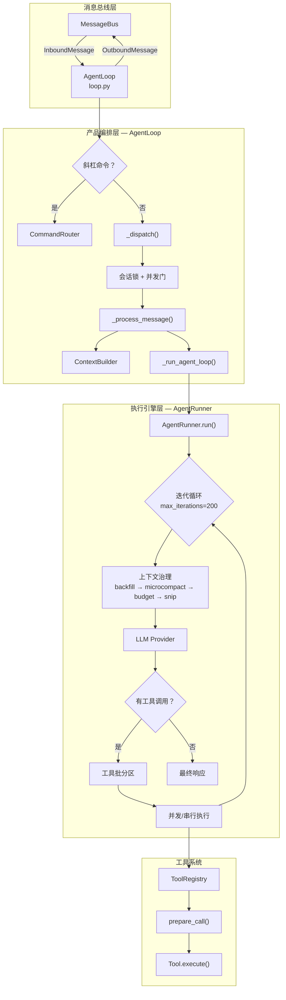
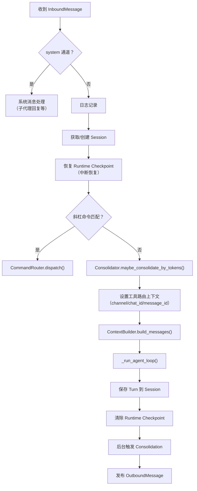
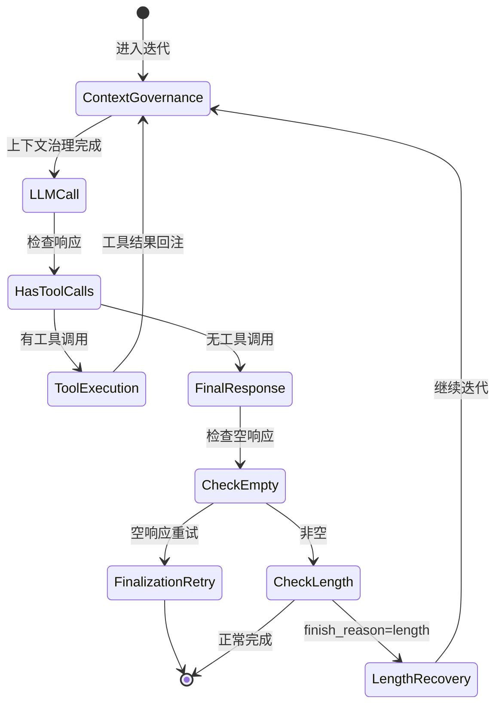
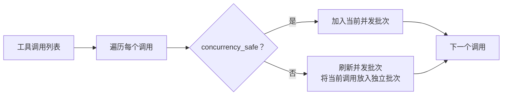
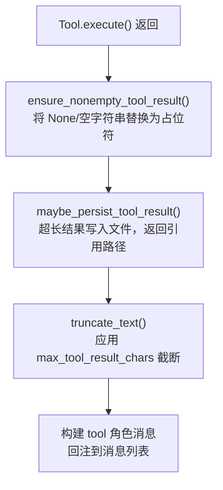
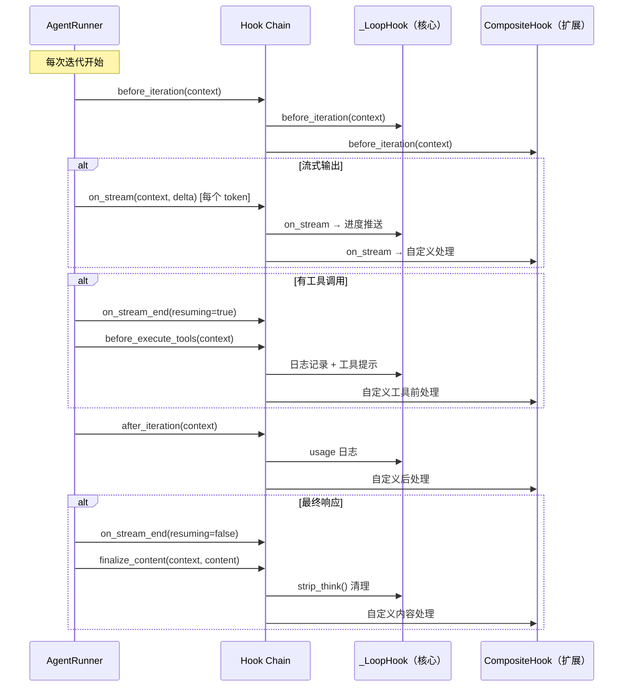

Agent 主循环是 nanobot 的核心引擎——它从消息总线消费用户输入，组装上下文提示词，迭代式地调用 LLM 并执行工具，直到获得最终回答。本文深入剖析这一从消息接收到响应返回的完整生命周期，揭示 `AgentLoop`（产品层编排）、`AgentRunner`（共享执行引擎）与 `ToolRegistry`（工具注册与调度）三者之间的协作机制。

## 架构总览：三层分离的设计

nanobot 的 Agent 循环采用了清晰的**三层分离**架构：**消息总线层**负责解耦通道与代理；**产品编排层**（`AgentLoop`）负责会话管理、上下文构建、斜杠命令拦截等业务逻辑；**执行引擎层**（`AgentRunner`）是一个纯逻辑的 LLM 迭代循环，不依赖任何产品层组件。这种设计使得同一个执行引擎可以同时服务于主代理和子代理。



核心类之间的职责边界如下：

| 层级 | 核心类 | 文件 | 职责 |
|------|--------|------|------|
| 产品编排 | `AgentLoop` | [loop.py](nanobot/agent/loop.py#L149-L161) | 消息消费、会话管理、上下文构建、命令路由、检查点恢复 |
| 执行引擎 | `AgentRunner` | [runner.py](nanobot/agent/runner.py#L83-L84) | LLM 迭代循环、工具调用调度、上下文治理、空响应恢复 |
| 工具注册 | `ToolRegistry` | [registry.py](nanobot/agent/tools/registry.py#L8-L13) | 工具注册/查找、参数校验、执行代理 |
| 工具基类 | `Tool` | [base.py](nanobot/agent/tools/base.py#L117-L118) | 参数类型转换、JSON Schema 校验、OpenAI 格式序列化 |

Sources: [loop.py](nanobot/agent/loop.py#L149-L161), [runner.py](nanobot/agent/runner.py#L83-L84), [registry.py](nanobot/agent/tools/registry.py#L8-L13), [base.py](nanobot/agent/tools/base.py#L117-L118)

## 消息入口：从总线消费到任务派发

`AgentLoop.run()` 是整个代理的入口方法。它在一个 `while self._running` 循环中以 1 秒超时轮询 `MessageBus.consume_inbound()`，确保能响应停止信号。每收到一条 `InboundMessage`，处理流程如下：

1. **优先级命令拦截**：检查消息是否匹配 `CommandRouter` 中的优先级命令（如 `/stop`、`/restart`），如果是则直接处理并跳过后续流程。优先级命令在**派发锁之外**执行，保证即使有长时间运行的任务也能立即响应。
2. **异步任务派发**：非优先级消息通过 `asyncio.create_task(self._dispatch(msg))` 创建独立任务，避免阻塞主循环。任务被注册到 `_active_tasks` 字典中（按 session_key 分组），以支持后续的取消操作。

Sources: [loop.py](nanobot/agent/loop.py#L396-L426)

### 并发模型：会话内串行，会话间并行

`_dispatch()` 方法实现了精细化的并发控制：每个会话（session_key）拥有独立的 `asyncio.Lock`，保证**同一会话内的消息串行处理**——这对于对话一致性至关重要。同时，全局的 `_concurrency_gate`（一个 `asyncio.Semaphore`，默认值 3，可通过 `NANOBOT_MAX_CONCURRENT_REQUESTS` 环境变量调整）限制**跨会话的总并发数**，防止资源耗尽。当信号量设为 ≤0 时，并发数不受限制。

```python
# _dispatch 的核心并发控制
lock = self._session_locks.setdefault(msg.session_key, asyncio.Lock())
gate = self._concurrency_gate or nullcontext()
async with lock, gate:
    # 处理消息...
```

Sources: [loop.py](nanobot/agent/loop.py#L428-L484)

## 消息处理流水线：`_process_message()`

当消息进入 `_process_message()` 后，它需要经过以下处理阶段：



### 检查点恢复机制

在处理新消息之前，`_restore_runtime_checkpoint()` 会检查 Session 元数据中是否存在未完成的运行时检查点。如果存在（意味着上次迭代因进程崩溃而中断），它会将中断时的 assistant 消息、已完成的工具结果和未完成的工具调用（以错误占位符代替）回填到会话历史中。这确保了崩溃后的对话不会因上下文断裂而无法继续。

Sources: [loop.py](nanobot/agent/loop.py#L509-L614), [loop.py](nanobot/agent/loop.py#L711-L760)

## 上下文构建：从历史到提示词

`ContextBuilder.build_messages()` 将会话历史和当前用户消息组装为 LLM 可消费的消息列表。组装过程包含以下关键步骤：

1. **系统提示词构建**：按顺序拼接身份信息、工作区引导文件（`AGENTS.md`、`SOUL.md`、`USER.md`、`TOOLS.md`）、记忆上下文、技能摘要和最近历史记录，各部分以 `---` 分隔。
2. **运行时上下文注入**：在用户消息前注入当前时间、通道名称和 Chat ID 等元数据，标记为 `[Runtime Context — metadata only, not instructions]`，与用户实际指令区分。
3. **消息合并**：如果会话历史最后一条消息与当前用户消息的角色相同（例如上一轮的 assistant 消息后紧接一个系统注入的 user 消息），则合并内容以避免违反 Provider 的连续同角色消息约束。

最终产生的消息列表格式为：`[system_prompt, ...history, current_user_message]`。

Sources: [context.py](nanobot/agent/context.py#L115-L145)

## 核心迭代循环：`AgentRunner.run()`

`_run_agent_loop()` 将控制权转交给 `AgentRunner.run()`，这是真正的 LLM 迭代引擎。它接收一个 `AgentRunSpec` 配置对象，包含初始消息、工具注册表、模型名称、最大迭代次数等参数。



### 迭代循环的完整流程

每次迭代包含以下阶段：

**阶段一：上下文治理**（`runner.py` 第 102-115 行）—— 在每次 LLM 调用前，对消息列表执行四步治理：
- `_backfill_missing_tool_results()`：为"孤儿"工具调用（有 `tool_calls` 但缺少对应的 `tool` 消息）插入合成错误结果，防止 API 报错。
- `_microcompact()`：将超过 10 条的旧工具结果替换为 `[{tool_name} result omitted from context]` 摘要，只保留最近 10 条完整结果。
- `_apply_tool_result_budget()`：对所有工具结果应用 `max_tool_result_chars`（默认 16,000 字符）截断。
- `_snip_history()`：当估计的 token 数超过 `context_window_tokens - max_output - 1024` 预算时，从最早的非系统消息开始裁剪，确保不突破上下文窗口。

**阶段二：LLM 调用**—— 通过 `_request_model()` 调用 Provider。如果 Hook 声明需要流式输出，则使用 `chat_stream_with_retry()`，否则使用 `chat_with_retry()`。

**阶段三：响应分析**—— 检查 LLM 响应的 `has_tool_calls` 属性：
- **有工具调用**：构建 assistant 消息（包含 `tool_calls` 字段），触发 `before_execute_tools` Hook，执行工具，将结果以 `tool` 角色消息回注到消息列表，然后继续下一次迭代。
- **无工具调用**：进入最终响应处理。

Sources: [runner.py](nanobot/agent/runner.py#L89-L320)

### 空响应与截断恢复

执行引擎内置了两层恢复机制来应对 LLM 的异常输出：

| 异常场景 | 检测条件 | 恢复策略 | 最大重试次数 |
|----------|---------|---------|-------------|
| **空响应** | `finish_reason != "error"` 且内容为空白 | 重新迭代（复用同一消息列表） | 2 次 |
| **空响应恢复失败** | 2 次重试后仍为空 | 追加 `_finalization_retry` 提示，无工具模式再调一次 LLM | 1 次 |
| **输出截断** | `finish_reason == "length"` 且内容非空 | 追加 `_length_recovery` 提示，让 LLM 从中断处继续 | 3 次 |
| **最大迭代耗尽** | 迭代次数达到 `max_iterations`（默认 200） | 渲染 `max_iterations_message.md` 模板作为最终响应 | — |

Sources: [runner.py](nanobot/agent/runner.py#L200-L310), [runtime.py](nanobot/utils/runtime.py#L1-L60)

## 工具调用生命周期

当 LLM 响应中包含 `tool_calls` 时，一个完整的工具调用生命周期随之启动。这个生命周期涵盖了从参数解析到结果回注的所有步骤。

### 1. 工具调用解析

LLM 返回的 `ToolCallRequest` 数据结构包含三个核心字段：`id`（调用标识）、`name`（工具名称）、`arguments`（参数字典）。此外还有 `extra_content` 和 `provider_specific_fields` 等可选字段，用于传递 Provider 特有的元数据。

Sources: [base.py](nanobot/providers/base.py#L18-L44)

### 2. 工具并发调度与批分区

`_partition_tool_batches()` 将一组工具调用划分为若干批次。划分策略基于工具的 `concurrency_safe` 属性：



**并发安全判断逻辑**：一个工具的 `concurrency_safe` 为 `True` 当且仅当 `read_only == True` 且 `exclusive == False`。例如，`ReadFileTool` 的 `read_only` 为 `True`、`exclusive` 为 `False`，因此可以并行执行；而 `ExecTool` 的 `exclusive` 为 `True`，必须独占执行。

在每个批次内，如果 `spec.concurrent_tools` 启用且批次包含多个调用，则使用 `asyncio.gather()` 并行执行；否则串行执行。

Sources: [runner.py](nanobot/agent/runner.py#L399-L426), [runner.py](nanobot/agent/runner.py#L699-L722), [base.py](nanobot/agent/tools/base.py#L155-L167)

### 3. 参数校验与类型转换

工具执行前经过两阶段校验：

**阶段一：`ToolRegistry.prepare_call()`**——解析工具名、调用 `Tool.cast_params()` 进行类型转换、调用 `Tool.validate_params()` 进行 JSON Schema 校验。类型转换处理了 LLM 输出中常见的类型偏差（如将字符串 `"42"` 转为整数 `42`、将 `"true"` 转为布尔值 `True`）。

**阶段二：`AgentRunner._run_tool()`**——额外检查重复外部查找（`repeated_external_lookup_error`），防止 LLM 陷入对同一 URL 或搜索查询的循环调用（默认同一签名最多允许 2 次）。

Sources: [registry.py](nanobot/agent/tools/registry.py#L65-L83), [base.py](nanobot/agent/tools/base.py#L180-L232), [runner.py](nanobot/agent/runner.py#L428-L498), [runtime.py](nanobot/utils/runtime.py#L63-L80)

### 4. 工具执行与结果处理

工具执行后，结果经过以下处理流水线：



- `ensure_nonempty_tool_result()` 确保每个工具都有有意义的返回，避免空结果混淆 LLM。
- `maybe_persist_tool_result()` 当结果超长时将其写入工作区的 `.nanobot/results/` 目录，返回文件引用路径而非完整内容。
- `truncate_text()` 对最终内容应用字符级截断（默认 16,000 字符），防止上下文窗口溢出。

工具执行中的任何错误都不会导致循环终止——错误信息会以 `tool` 消息的形式回传给 LLM，让它分析错误并尝试不同的方法。只有当 `fail_on_tool_error` 启用时（子代理场景），错误才会立即终止循环。

Sources: [runner.py](nanobot/agent/runner.py#L524-L550), [runtime.py](nanobot/utils/runtime.py#L28-L45)

### 5. 检查点持久化

在工具执行的**前后**，`_emit_checkpoint()` 将当前迭代状态写入 Session 元数据。每个检查点包含：
- `phase`：当前阶段（`awaiting_tools` / `tools_completed` / `final_response`）
- `iteration`：迭代编号
- `assistant_message`：assistant 消息完整内容
- `completed_tool_results`：已完成的工具结果列表
- `pending_tool_calls`：等待执行的工具调用列表

如果进程在工具执行中途崩溃，下次收到消息时 `_restore_runtime_checkpoint()` 会将这些状态回填到会话历史，实现**崩溃恢复**。

Sources: [runner.py](nanobot/agent/runner.py#L137-L194), [loop.py](nanobot/agent/loop.py#L690-L760)

## Hook 系统：生命周期扩展点

Agent 循环通过 `AgentHook` 抽象类提供了六个可扩展的生命周期方法。`_LoopHook`（主循环内部 Hook）与用户自定义 Hook 通过 `_LoopHookChain` 组合，确保核心 Hook 始终先执行。



关键设计决策：`CompositeHook` 对异步方法实现了**错误隔离**——单个 Hook 的异常会被捕获并记录日志，不会传播到其他 Hook 或主循环。但 `finalize_content()` 作为内容管线不做隔离，确保错误能及时暴露。

Sources: [hook.py](nanobot/agent/hook.py#L29-L96), [loop.py](nanobot/agent/loop.py#L43-L147)

## 内置工具注册一览

`AgentLoop` 在初始化时通过 `_register_default_tools()` 注册所有内置工具。每个工具都继承自 `Tool` 基类，通过 `@tool_parameters` 装饰器声明 JSON Schema，并实现 `execute()` 异步方法。

| 工具名 | 类 | `read_only` | `exclusive` | 并发安全 | 注册条件 |
|--------|-----|:-----------:|:-----------:|:--------:|---------|
| `read_file` | `ReadFileTool` | ✅ | ❌ | ✅ | 始终注册 |
| `write_file` | `WriteFileTool` | ❌ | ❌ | ❌ | 始终注册 |
| `edit_file` | `EditFileTool` | ❌ | ❌ | ❌ | 始终注册 |
| `list_dir` | `ListDirTool` | ❌ | ❌ | ❌ | 始终注册 |
| `glob` | `GlobTool` | ✅ | ❌ | ✅ | 始终注册 |
| `grep` | `GrepTool` | ✅ | ❌ | ✅ | 始终注册 |
| `exec` | `ExecTool` | ❌ | ✅ | ❌ | `exec.enable=true` |
| `web_search` | `WebSearchTool` | ❌ | ❌ | ❌ | `web.enable=true` |
| `web_fetch` | `WebFetchTool` | ❌ | ❌ | ❌ | `web.enable=true` |
| `message` | `MessageTool` | ❌ | ❌ | ❌ | 始终注册 |
| `spawn` | `SpawnTool` | ❌ | ❌ | ❌ | 始终注册 |
| `cron` | `CronTool` | ❌ | ❌ | ❌ | 需 `CronService` 实例 |

当工作区隔离（`restrict_to_workspace=true`）或沙箱模式启用时，文件系统和 Shell 工具会被限制在工作区目录内。

Sources: [loop.py](nanobot/agent/loop.py#L262-L287), [filesystem.py](nanobot/agent/tools/filesystem.py#L41-L55), [shell.py](nanobot/agent/tools/shell.py#L85-L87)

## Turn 保存与历史持久化

每次迭代循环完成后，`_save_turn()` 将本轮新增的消息追加到 Session 的 `messages` 列表中。保存前会执行以下清理：

- **空 assistant 消息过滤**：跳过既无内容又无 `tool_calls` 的空 assistant 消息，防止污染会话上下文。
- **工具结果截断**：超过 `max_tool_result_chars` 的字符串结果被截断。
- **多模态块清理**：`_sanitize_persisted_blocks()` 将 base64 编码的内联图片替换为占位文本，将运行时上下文前缀从 user 消息中剥离。
- **运行时上下文清理**：以 `_RUNTIME_CONTEXT_TAG` 开头的 user 消息只保留实际用户文本。

Sources: [loop.py](nanobot/agent/loop.py#L616-L688)

## 完整生命周期时序图

以下时序图展示了一次完整的消息处理流程，包含工具调用场景：

```mermaid
sequenceDiagram
    actor User
    participant Bus as MessageBus
    participant Loop as AgentLoop
    participant Runner as AgentRunner
    participant Provider as LLMProvider
    participant Registry as ToolRegistry
    participant Tool as Tool 实例

    User->>Bus: InboundMessage
    Bus->>Loop: consume_inbound()
    Loop->>Loop: is_priority() → 否
    Loop->>Loop: create_task(_dispatch)
    Loop->>Loop: 获取会话锁 + 并发信号量
    Loop->>Loop: _process_message()
    Loop->>Loop: 恢复 checkpoint + consolidation
    Loop->>Loop: ContextBuilder.build_messages()
    Loop->>Runner: runner.run(AgentRunSpec)

    Note over Runner: 迭代 #0 开始
    Runner->>Runner: 上下文治理（4步）
    Runner->>Runner: hook.before_iteration()
    Runner->>Provider: chat_with_retry(messages, tools)
    Provider-->>Runner: LLMResponse(tool_calls=[...])
    Runner->>Runner: hook.on_stream_end(resuming=true)
    Runner->>Runner: emit_checkpoint(awaiting_tools)
    Runner->>Runner: hook.before_execute_tools()

    Note over Runner: 工具并发调度
    Runner->>Runner: _partition_tool_batches()
    Runner->>Registry: prepare_call(name, params)
    Registry->>Tool: cast_params() + validate_params()
    Runner->>Tool: execute(**params)
    Tool-->>Runner: result
    Runner->>Runner: normalize + persist + truncate
    Runner->>Runner: emit_checkpoint(tools_completed)
    Runner->>Runner: hook.after_iteration()

    Note over Runner: 迭代 #1 开始
    Runner->>Provider: chat_with_retry(messages, tools)
    Provider-->>Runner: LLMResponse(content="最终回答")
    Runner->>Runner: hook.finalize_content()
    Runner->>Runner: emit_checkpoint(final_response)
    Runner-->>Loop: AgentRunResult

    Loop->>Loop: _save_turn()
    Loop->>Loop: 清除 checkpoint
    Loop->>Bus: publish_outbound(OutboundMessage)
    Bus-->>User: 最终回答
```

## 关键配置参数

以下参数直接影响主循环行为，通过 `AgentDefaults` 定义（位于配置文件的 `agents.defaults` 节点下）：

| 参数 | 默认值 | 作用 |
|------|--------|------|
| `max_tool_iterations` | 200 | 单次请求最大迭代轮数，防止无限循环 |
| `max_tool_result_chars` | 16,000 | 单个工具结果的最大字符数 |
| `context_window_tokens` | 65,536 | 上下文窗口 token 预算，用于历史裁剪 |
| `context_block_limit` | None | 可选的硬性上下文块大小限制 |
| `provider_retry_mode` | `"standard"` | 重试模式：`standard`（固定延迟）或 `persistent`（指数退避） |
| `temperature` | 0.1 | LLM 生成温度 |
| `max_tokens` | 8,192 | 单次 LLM 响应的最大 token 数 |

环境变量 `NANOBOT_MAX_CONCURRENT_REQUESTS`（默认 3）控制跨会话的最大并发请求数。

Sources: [schema.py](nanobot/config/schema.py#L62-L79), [loop.py](nanobot/agent/loop.py#L163-L242)

---

### 延伸阅读

- **[Agent Runner：共享执行引擎与上下文压缩策略](6-agent-runner-gong-xiang-zhi-xing-yin-qing-yu-shang-xia-wen-ya-suo-ce-lue)**：深入了解执行引擎的上下文治理细节，包括 microcompact 和 snip_history 算法。
- **[上下文构建器：系统提示词组装与身份注入](7-shang-xia-wen-gou-jian-qi-xi-tong-ti-shi-ci-zu-zhuang-yu-shen-fen-zhu-ru)**：了解系统提示词的完整组装流程。
- **[Agent 生命周期 Hook 机制与 CompositeHook 错误隔离](8-agent-sheng-ming-zhou-qi-hook-ji-zhi-yu-compositehook-cuo-wu-ge-chi)**：深入 Hook 系统的错误隔离设计和扩展模式。
- **[工具注册表与动态管理](11-gong-ju-zhu-ce-biao-yu-dong-tai-guan-li)**：工具注册表的动态管理机制和 MCP 工具发现。