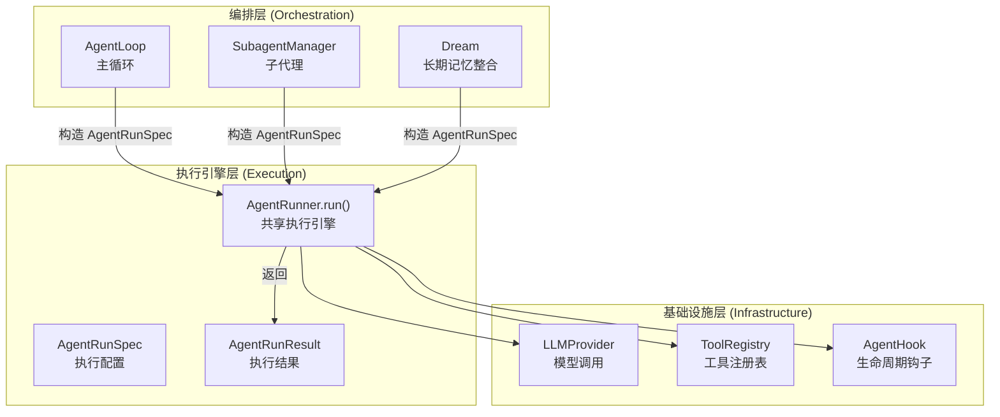
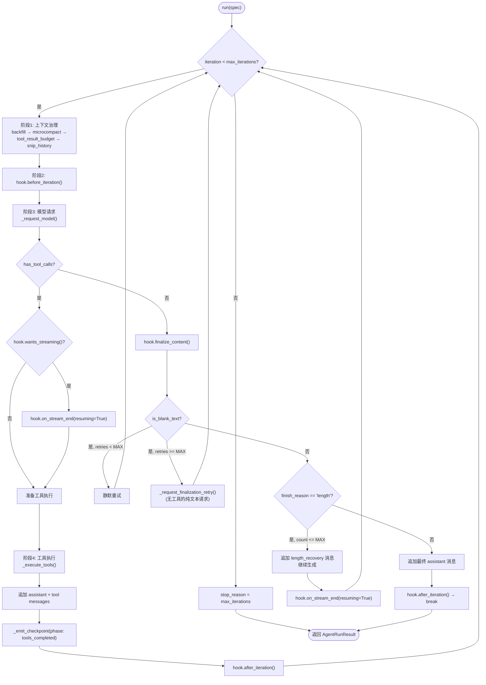
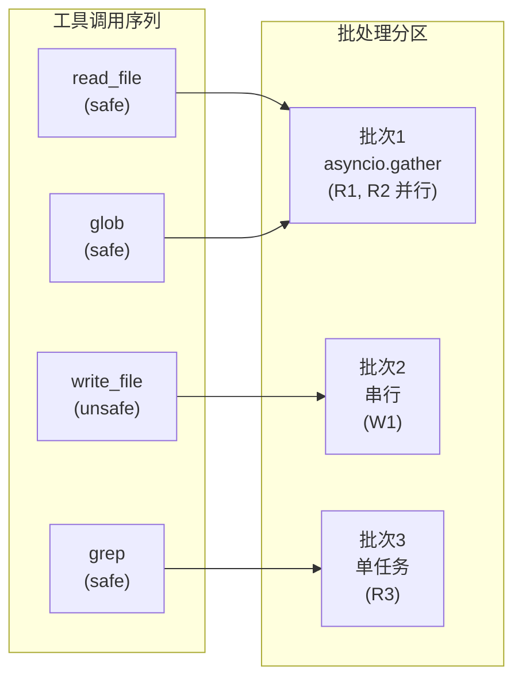
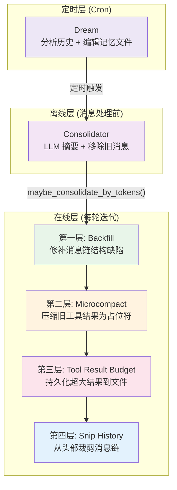

`AgentRunner` 是 nanobot 代理系统的**核心无状态执行引擎**——一个完全与产品层（通道、会话、总线）解耦的 LLM 工具调用循环。它被 `AgentLoop`（主循环）、`SubagentManager`（子代理）、`Dream`（长期记忆整合）三个上层编排器共享，形成一个**单引擎、多编排器**的架构模式。本文档将深入解析 `AgentRunner` 的执行生命周期、三层上下文压缩管道（backfill → microcompact → snip）、以及它如何通过 `AgentRunSpec`/`AgentRunResult` 数据类与 `AgentHook` 生命周期接口实现控制反转。

Sources: [runner.py](nanobot/agent/runner.py#L1-L44), [__init__.py](nanobot/agent/__init__.py#L1-L21)

## 架构定位：共享引擎与多编排器

在 nanobot 的架构分层中，`AgentRunner` 位于**最内层执行核心**。它不知道"通道"、"会话"、"消息总线"等概念——它只接收一组消息、一个工具注册表和一个 LLM Provider，然后循环执行"模型请求 → 工具调用 → 模型请求"直到产出最终回复。这种设计使得同一套推理-工具循环逻辑被三种完全不同的使用场景复用。

Sources: [runner.py](nanobot/agent/runner.py#L83-L87)



**三个共享者各自的配置差异**体现了 `AgentRunSpec` 作为通用执行契约的灵活性：

| 调用方 | `max_iterations` | `concurrent_tools` | `fail_on_tool_error` | 用途 |
|---|---|---|---|---|
| **AgentLoop** | 用户配置（默认 25） | `True` | `False` | 常规对话，容忍工具错误 |
| **SubagentManager** | 15 | 默认 `False` | `True` | 后台任务，工具错误即终止 |
| **Dream** | 10 | 默认 `False` | `False` | 记忆编辑，使用最小工具集（read_file + edit_file） |

Sources: [loop.py](nanobot/agent/loop.py#L372-L388), [subagent.py](nanobot/agent/subagent.py#L139-L149), [memory.py](nanobot/agent/memory.py#L626-L633)

## AgentRunSpec 与 AgentRunResult：执行契约

`AgentRunSpec` 是一个 `@dataclass(slots=True)` 数据类，封装了单次执行所需的全部配置。它不仅包含运行时的动态参数（消息列表、工具注册表），还承载了上下文治理策略的参数（`context_window_tokens`、`context_block_limit`、`max_tool_result_chars`）。`slots=True` 的使用避免了动态属性字典的内存开销，对可能长时间运行的高迭代场景有实际意义。

Sources: [runner.py](nanobot/agent/runner.py#L44-L68)

`AgentRunSpec` 的关键字段及其职责：

| 字段 | 类型 | 职责 |
|---|---|---|
| `initial_messages` | `list[dict]` | 传递给首次模型调用的完整消息链 |
| `tools` | `ToolRegistry` | 可用工具集，同时提供定义与执行能力 |
| `model` | `str` | LLM 模型标识符 |
| `max_iterations` | `int` | 工具调用轮次上限，防止无限循环 |
| `context_window_tokens` | `int \| None` | 上下文窗口大小，驱动 `_snip_history` 裁剪 |
| `context_block_limit` | `int \| None` | 可选的精确上下文预算，覆盖自动计算 |
| `max_tool_result_chars` | `int` | 单条工具结果的最大字符数 |
| `hook` | `AgentHook \| None` | 生命周期钩子，实现控制反转 |
| `checkpoint_callback` | `Any \| None` | 运行时检查点回调，用于断点恢复 |
| `concurrent_tools` | `bool` | 是否并发执行可并行工具 |
| `fail_on_tool_error` | `bool` | 工具执行异常是否立即终止 |

`AgentRunResult` 则是执行结束后的结构化输出，包含 `final_content`（最终回复文本）、完整的 `messages` 链（含工具调用中间态）、`tools_used`（按序使用的工具名列表）、累积的 `usage`（token 用量统计）、以及 `stop_reason` 和 `tool_events`。

Sources: [runner.py](nanobot/agent/runner.py#L70-L81)

## 执行生命周期：迭代循环的五个阶段

`AgentRunner.run()` 的主循环是一个最多执行 `max_iterations` 轮的 `for` 迭代。每轮迭代可以分解为五个阶段：**上下文治理** → **Hook 前置通知** → **模型请求** → **工具执行**（或最终回复） → **Hook 后置通知**。

Sources: [runner.py](nanobot/agent/runner.py#L89-L320)



### 上下文治理阶段：三层压缩管道

每轮迭代的**第一步**不是模型请求，而是上下文治理。这四个方法按序执行，构成一个**渐进式压缩管道**——先修补结构缺陷，再压缩冗余内容，最后裁剪超限部分。整个管道被 `try/except` 包裹，任何异常都只是降级到原始消息（`messages_for_model = messages`），确保上下文治理失败不会中断对话。

Sources: [runner.py](nanobot/agent/runner.py#L102-L115)

#### 第一层：Backfill 缺失工具结果

`_backfill_missing_tool_results()` 解决一个常见的消息链完整性问题：当检查点恢复或历史裁剪导致某些 `tool_use` 调用缺少对应的 `tool` 结果消息时，大多数 LLM Provider 会拒绝该请求。该方法扫描所有 assistant 消息中声明的 `tool_calls`，与已存在的 `tool` 结果消息进行配对，为所有孤儿调用插入合成错误消息 `"[Tool result unavailable — call was interrupted or lost]"`。

Sources: [runner.py](nanobot/agent/runner.py#L552-L591)

插入逻辑精确计算位置：对每个缺失的工具结果，从其对应的 assistant 消息之后开始，跳过已存在的连续 `tool` 消息（保持工具结果的连续排列），在正确位置插入。该方法返回原始列表的副本仅在存在缺失结果时，否则返回同一对象（零拷贝优化）。

Sources: [runner.py](nanobot/agent/runner.py#L576-L591)

#### 第二层：Microcompact 陈旧工具结果压缩

`_microcompact()` 是一个轻量级的在线压缩策略，目标是减少长工具调用链中的上下文占用。它仅处理 `_COMPACTABLE_TOOLS` 集合中的工具类型（`read_file`、`exec`、`grep`、`glob`、`web_search`、`web_fetch`、`list_dir`），保留最近 `_MICROCOMPACT_KEEP_RECENT`（10）条结果，将更早的、长度超过 `_MICROCOMPACT_MIN_CHARS`（500）字符的工具结果替换为 `"[{tool_name} result omitted from context]"`。

Sources: [runner.py](nanobot/agent/runner.py#L593-L617)

| 参数 | 值 | 含义 |
|---|---|---|
| `_COMPACTABLE_TOOLS` | `read_file, exec, grep, glob, web_search, web_fetch, list_dir` | 可压缩的工具集 |
| `_MICROCOMPACT_KEEP_RECENT` | `10` | 保留最近 N 条工具结果 |
| `_MICROCOMPACT_MIN_CHARS` | `500` | 仅压缩超过此长度的结果 |

关键设计决策：**短结果不压缩**（`len(content) < 500` 跳过），因为替换它们反而可能增加上下文长度（原始文本 vs 占位符）；**非可压缩工具不处理**（如 `message`、`spawn`），因为它们的结果通常含有语义关键信息。

Sources: [runner.py](nanobot/agent/runner.py#L593-L617)

#### 第三层：Tool Result Budget 与大结果持久化

`_apply_tool_result_budget()` 对所有 `tool` 角色消息执行预算约束。它调用 `_normalize_tool_result()`，后者首先通过 `ensure_nonempty_tool_result()` 将 `None` 或空白结果替换为语义明确的占位符（如 `"(read_file completed with no output)"`），然后尝试通过 `maybe_persist_tool_result()` 将超大结果写入文件系统并替换为引用字符串。

Sources: [runner.py](nanobot/agent/runner.py#L524-L550), [runtime.py](nanobot/utils/runtime.py#L28-L45)

**大结果持久化**的工作机制：当工具结果超过 `max_tool_result_chars` 时，内容被原子写入（`_write_text_atomic`）到 `.nanobot/tool-results/{session_key}/{tool_call_id}.{suffix}` 文件中，原始内容被替换为结构化引用：

```
[tool output persisted]
Full output saved to: /path/to/file
Original size: 20000 chars
Preview:
(前 1200 字符预览)
```

这个持久化机制同时具备**自动清理**能力：`_cleanup_tool_result_buckets()` 会删除超过 7 天的旧结果目录，并将总桶数限制在 32 个以内。

Sources: [helpers.py](nanobot/utils/helpers.py#L137-L233)

#### 第四层：Snip History 历史裁剪

`_snip_history()` 是最激进的上下文压缩手段——当估算的 prompt token 数超过预算时，从历史消息的**尾部**开始保留，丢弃最早的消息。预算计算公式为：

```
budget = context_block_limit 或 (context_window_tokens - max_output - _SNIP_SAFETY_BUFFER)
```

其中 `_SNIP_SAFETY_BUFFER`（1024 tokens）为 tokenizer 估算误差预留空间。

Sources: [runner.py](nanobot/agent/runner.py#L640-L697)

裁剪算法的关键约束：
1. **系统消息不可裁剪**：所有 `system` 角色消息始终保留
2. **消息链完整性**：裁剪后的起始消息必须通过 `find_legal_message_start()` 校验——确保不存在孤立的 `tool` 结果（即没有对应 `assistant` 消息中的 `tool_calls` 声明的工具结果）
3. **用户消息优先**：裁剪结果必须以 `user` 消息开头（跳过可能残留在开头的 assistant/tool 消息）
4. **最低保障**：如果裁剪后消息为空，至少保留最后 4 条非系统消息

Sources: [helpers.py](nanobot/utils/helpers.py#L100-L120), [runner.py](nanobot/agent/runner.py#L684-L697)

Token 估算使用**双通道策略**：优先调用 Provider 自带的 `estimate_prompt_tokens()` 方法（可能使用 Provider 精确计数器），回退到 `tiktoken` 的 `cl100k_base` 编码器。

Sources: [helpers.py](nanobot/utils/helpers.py#L368-L387)

### 模型请求阶段：流式与非流式双路径

`_request_model()` 根据 `hook.wants_streaming()` 选择两条不同的调用路径。**非流式路径**直接调用 `provider.chat_with_retry()`，**流式路径**调用 `provider.chat_stream_with_retry()` 并传入 `on_content_delta` 回调，将增量文本实时转发给 Hook 的 `on_stream()` 方法。两条路径共享相同的请求参数构建逻辑（`_build_request_kwargs()`），包括 `temperature`、`max_tokens`、`reasoning_effort` 等可选参数。

Sources: [runner.py](nanobot/agent/runner.py#L344-L364)

### 工具执行阶段：并发批处理与外部调用节流

工具执行由 `_execute_tools()` 协调，它通过 `_partition_tool_batches()` 将工具调用序列分割为**批处理单元**。分割依据是每个工具的 `concurrency_safe` 属性——只有 `read_only=True` 且 `exclusive=False` 的工具才能并发执行。批处理策略是：连续的 `concurrency_safe` 工具归入同一批次并行执行，遇到非安全工具时先刷新当前批次，然后将非安全工具作为独立批次串行执行。

Sources: [runner.py](nanobot/agent/runner.py#L699-L722)



**外部调用节流**（`repeated_external_lookup_error`）防止 LLM 在循环中对同一 URL 或搜索查询反复调用 `web_fetch`/`web_search`。每个唯一签名（如 `web_fetch:https://example.com`）最多允许 2 次调用，超出后返回错误消息 `"Error: repeated external lookup blocked..."`，引导 LLM 使用已有结果。

Sources: [runtime.py](nanobot/utils/runtime.py#L63-L97)

### 终止与恢复策略

Runner 处理多种异常终止场景，每种都有对应的恢复策略：

| 场景 | 检测条件 | 恢复策略 | `stop_reason` |
|---|---|---|---|
| **空回复重试** | `is_blank_text(clean) && finish_reason != "error"` | 静默重试最多 `_MAX_EMPTY_RETRIES`（2）次 | 继续循环 |
| **空回复终局** | 重试耗尽后仍为空 | 发送 `_request_finalization_retry()`（无工具的纯文本请求） | `"empty_final_response"` |
| **输出截断恢复** | `finish_reason == "length"` | 追加 `LENGTH_RECOVERY_PROMPT` 继续生成，最多 `_MAX_LENGTH_RECOVERIES`（3）次 | 继续循环 |
| **模型错误** | `finish_reason == "error"` | 立即终止，返回错误内容 | `"error"` |
| **工具致命错误** | `fail_on_tool_error=True` 时工具异常 | 立即终止 | `"tool_error"` |
| **迭代上限** | `iteration >= max_iterations` | 生成格式化的上限消息 | `"max_iterations"` |

Sources: [runner.py](nanobot/agent/runner.py#L200-L320), [runtime.py](nanobot/utils/runtime.py#L13-L60)

**长度恢复机制**特别值得注意：当 `finish_reason == "length"` 时，Runner 将部分输出追加为 assistant 消息，然后注入一条 `LENGTH_RECOVERY_PROMPT`（`"Output limit reached. Continue exactly where you left off..."`）作为新的 user 消息，让模型从断点处继续生成。流式场景下，`on_stream_end(resuming=True)` 通知 Hook 保持活跃状态。

Sources: [runner.py](nanobot/agent/runner.py#L232-L251)

## AgentHook 生命周期：控制反转接口

`AgentHook` 定义了 Runner 暴露给外部编排器的六个生命周期扩展点，实现了**控制反转**——Runner 不需要知道具体的通道（Telegram、CLI、Discord）、流式输出策略或进度显示机制，全部通过 Hook 委托。

Sources: [hook.py](nanobot/agent/hook.py#L29-L51)

| 钩子方法 | 调用时机 | 典型用途 |
|---|---|---|
| `before_iteration(context)` | 每轮迭代的上下文治理之后、模型请求之前 | 日志、指标采集 |
| `on_stream(context, delta)` | 流式增量文本到达时 | 实时推送到通道 |
| `on_stream_end(context, *, resuming)` | 流式段结束时 | 更新 UI 状态（spinner 重启或停止） |
| `before_execute_tools(context)` | 工具执行前 | 进度提示（显示"正在调用 xxx 工具..."） |
| `after_iteration(context)` | 每轮迭代结束时 | 使用量日志 |
| `finalize_content(context, content)` | 最终回复确定后 | 内容后处理（如剥离 `<think...>` 标签） |

`AgentHookContext` 是一个 `@dataclass(slots=True)` 的可变上下文对象，在每轮迭代中传递完整的运行状态：当前迭代号、消息列表、LLM 响应、使用量、工具调用列表、工具结果、工具事件、最终内容、停止原因和错误信息。

Sources: [hook.py](nanobot/agent/hook.py#L13-L26)

`CompositeHook` 实现了**扇出+错误隔离**模式：对列表中的每个 Hook 依次调用，单个 Hook 的异常被捕获并记录日志，不会影响其他 Hook 或主循环。唯一的例外是 `finalize_content()`——它作为管道执行（前一个 Hook 的输出是下一个的输入），不隔离错误，因为内容处理的 bug 应该尽早暴露。

Sources: [hook.py](nanobot/agent/hook.py#L54-L96)

## AgentLoop 中的 Runner 集成

`AgentLoop` 是 Runner 的主要消费者，它通过 `_run_agent_loop()` 方法将产品层关注点与 Runner 的无状态执行解耦。该方法构造 `_LoopHook`（核心 Hook）并通过 `_LoopHookChain` 与额外的 `AgentHook` 实例组合，然后将所有配置打包为 `AgentRunSpec` 传入 `Runner.run()`。

Sources: [loop.py](nanobot/agent/loop.py#L333-L394)

`_LoopHook` 在 `before_execute_tools` 中完成三项关键工作：
1. **进度推送**：对非流式场景，将 assistant 的思考内容作为进度提示发送
2. **工具提示**：通过 `_tool_hint()` 生成精简的工具调用摘要（如 `"📂 read_file: src/main.py"`）
3. **上下文注入**：调用 `_set_tool_context()` 将当前通道/聊天 ID 注入到 `message`、`spawn`、`cron` 等需要路由信息的工具中

Sources: [loop.py](nanobot/agent/loop.py#L84-L97)

**运行时检查点机制**（`_set_runtime_checkpoint` / `_restore_runtime_checkpoint`）提供了跨进程重启的恢复能力。Runner 在每个关键阶段（`awaiting_tools`、`tools_completed`、`final_response`）通过 `checkpoint_callback` 将当前状态快照写入 Session 元数据。如果进程在工具执行期间中断，下次处理该会话消息时，`_restore_runtime_checkpoint()` 会将未完成的 assistant 消息和工具结果（包括对未完成工具调用的合成错误）注入到 Session 历史中，确保对话可以继续。

Sources: [loop.py](nanobot/agent/loop.py#L690-L760)

## SubagentManager 中的 Runner 集成

`SubagentManager` 使用 Runner 的模式与 `AgentLoop` 有显著差异：它构造一个**精简的工具集**（不包含 `message`、`spawn`、`cron` 工具），使用专用的 `_SubagentHook`（仅记录日志），并启用 `fail_on_tool_error=True` 确保后台任务在工具异常时立即终止。子代理完成后的结果通过 `_announce_result()` 注入为 `channel="system"` 的 `InboundMessage`，触发主循环的新一轮处理。

Sources: [subagent.py](nanobot/agent/subagent.py#L101-L209)

## 三层压缩策略对比

nanobot 的上下文管理采用了**三级防御**策略，每一级在前一级不够用时触发：



| 层级 | 机制 | 触发时机 | 压缩粒度 | 信息损失 |
|---|---|---|---|---|
| Backfill | 结构修补 | 每轮迭代 | 消息级 | 无（插入合成错误） |
| Microcompact | 占位符替换 | 每轮迭代 | 工具结果级 | 低（仅替换 >500 字符的旧结果） |
| Tool Result Budget | 文件持久化 | 每轮迭代 | 字符级 | 无（文件可读回） |
| Snip History | 消息裁剪 | 每轮迭代（超限时） | 消息级 | 高（丢弃整条消息） |
| Consolidator | LLM 摘要 | 消息处理前 | 消息块级 | 中（摘要保留语义） |
| Dream | LLM 分析+编辑 | Cron 定时 | 历史批次级 | 低（编辑记忆文件） |

在线层（Backfill → Microcompact → Tool Result Budget → Snip）在 Runner 的每轮迭代中执行，确保发送给模型的消息链始终在预算内。离线层（Consolidator）在每条新消息处理前触发，通过 LLM 摘要将旧消息归档到 `history.jsonl` 并从 Session 历史中移除。定时层（Dream）则通过 Cron 周期性分析 `history.jsonl` 中的未处理条目，将学习到的长期知识写入 `MEMORY.md`、`SOUL.md`、`USER.md`。

Sources: [runner.py](nanobot/agent/runner.py#L102-L107), [memory.py](nanobot/agent/memory.py#L346-L512), [memory.py](nanobot/agent/memory.py#L519-L675)

## 与其他页面的关系

- Runner 的上游调用者详见 [Agent 主循环与工具调用生命周期](5-agent-zhu-xun-huan-yu-gong-ju-diao-yong-sheng-ming-zhou-qi)，其中描述了 `AgentLoop` 如何将总线消息转换为 `AgentRunSpec`
- 上下文治理中使用的系统提示词构建逻辑参见 [上下文构建器：系统提示词组装与身份注入](7-shang-xia-wen-gou-jian-qi-xi-tong-ti-shi-ci-zu-zhuang-yu-shen-fen-zhu-ru)
- Consolidator 和 Dream 的完整工作机制分别在 [Consolidator：对话摘要与上下文窗口管理](21-consolidator-dui-hua-zhai-yao-yu-shang-xia-wen-chuang-kou-guan-li) 和 [Dream：两阶段长期记忆整合与 GitStore 版本化](22-dream-liang-jie-duan-chang-qi-ji-yi-zheng-he-yu-gitstore-ban-ben-hua) 中详细解析
- Hook 机制的错误隔离设计参见 [Agent 生命周期 Hook 机制与 CompositeHook 错误隔离](8-agent-sheng-ming-zhou-qi-hook-ji-zhi-yu-compositehook-cuo-wu-ge-chi)