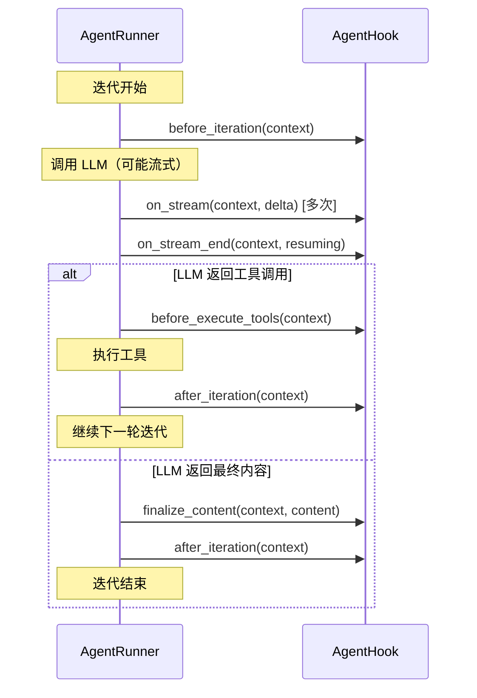
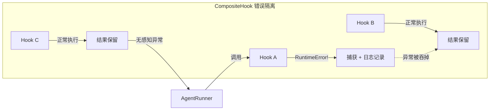
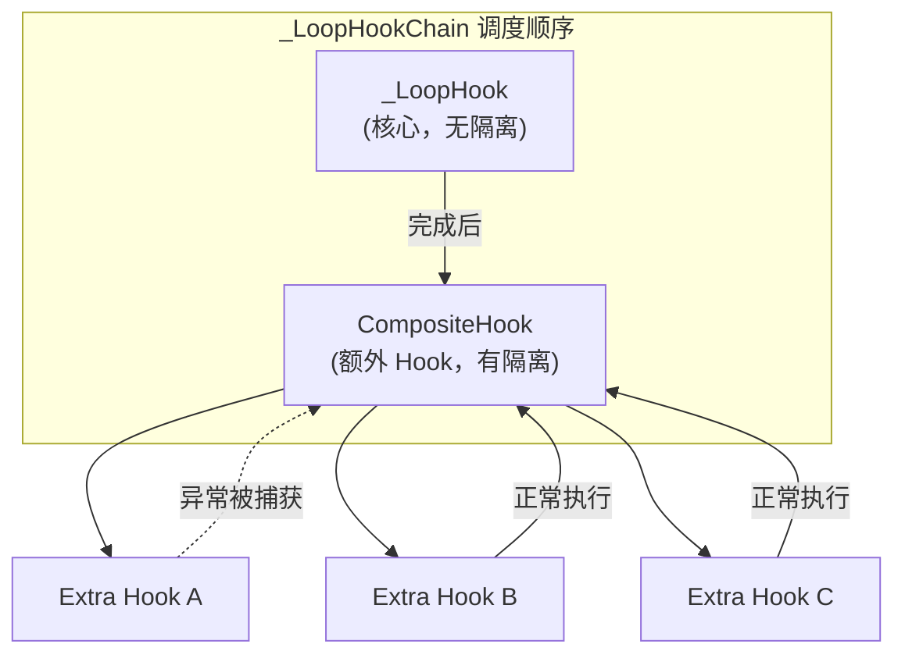

Hook（钩子）机制是 nanobot Agent 架构中面向扩展性与可观测性的核心抽象。它定义了一套标准化的生命周期接口，允许外部代码在不修改 Agent 主循环内部逻辑的前提下，注入自定义行为——例如日志记录、流式输出转发、内容后处理等。本文将深入剖析 Hook 的接口设计、`CompositeHook` 的扇出与错误隔离策略，以及从 `AgentLoop` → `AgentRunner` 的完整调用链路。

Sources: [hook.py](nanobot/agent/hook.py#L1-L96)

## 设计动机与核心抽象

在 nanobot 的分层架构中，[Agent Runner：共享执行引擎与上下文压缩策略](6-agent-runner-gong-xiang-zhi-xing-yin-qing-yu-shang-xia-wen-ya-suo-ce-lue) 作为纯粹的执行引擎，自身不关心"如何展示进度"或"如何转发流式增量"这类产品层关注点。Hook 机制正是这一关注点分离的载体：Runner 在迭代的关键节点触发 Hook 回调，而具体行为由 Hook 实现决定。

整个 Hook 体系由三个核心类构成：

| 类名 | 职责 | 位置 |
|------|------|------|
| **`AgentHookContext`** | 每次迭代的可变状态容器 | `nanobot/agent/hook.py` |
| **`AgentHook`** | 生命周期接口基类（6 个钩子方法） | `nanobot/agent/hook.py` |
| **`CompositeHook`** | 扇出调度器 + 错误隔离层 | `nanobot/agent/hook.py` |

Sources: [hook.py](nanobot/agent/hook.py#L1-L96), [\_\_init\_\_.py](nanobot/agent/__init__.py#L1-L21)

## AgentHookContext：迭代状态的快照

`AgentHookContext` 是一个使用 `@dataclass(slots=True)` 定义的数据类，作为每次迭代的共享可变状态对象，由 `AgentRunner` 创建并传递给所有 Hook：

```python
@dataclass(slots=True)
class AgentHookContext:
    iteration: int                                    # 当前迭代编号（从 0 开始）
    messages: list[dict[str, Any]]                    # 完整消息历史
    response: LLMResponse | None = None               # LLM 响应（迭代内填充）
    usage: dict[str, int] = field(default_factory=dict)  # Token 用量统计
    tool_calls: list[ToolCallRequest] = field(default_factory=list)  # 本轮工具调用
    tool_results: list[Any] = field(default_factory=list)            # 工具执行结果
    tool_events: list[dict[str, str]] = field(default_factory=list)  # 工具事件记录
    final_content: str | None = None                  # 最终输出内容
    stop_reason: str | None = None                    # 终止原因
    error: str | None = None                          # 错误信息
```

关键设计要点：`AgentHookContext` 在迭代过程中是**逐步填充**的。初始创建时只有 `iteration` 和 `messages`；随着 Runner 的推进，`response`、`usage`、`tool_calls` 等字段会被依次赋值。Hook 实现可以读取这些字段来做出决策（例如，根据 `usage` 调整行为），也可以在合法范围内修改它们。

Sources: [hook.py](nanobot/agent/hook.py#L13-L27)

## AgentHook：六方法生命周期接口

`AgentHook` 定义了六个钩子方法，精确对应 Agent 迭代循环中的关键节点：



每个方法的调用时机与语义如下：

| 方法 | 类型 | 调用时机 | 典型用途 |
|------|------|----------|----------|
| `wants_streaming()` | 同步 | Runner 初始化时查询 | 声明是否需要流式增量 |
| `before_iteration(context)` | 异步 | 每次迭代开始、LLM 调用前 | 初始化状态、预热缓存 |
| `on_stream(context, delta)` | 异步 | 流式响应的每个增量片段 | 转发增量文本到 UI |
| `on_stream_end(context, *, resuming)` | 异步 | 流式结束，`resuming=True` 表示后续有工具调用 | 关闭 spinner / 发送结束信号 |
| `before_execute_tools(context)` | 异步 | 工具执行前 | 日志记录、参数校验 |
| `after_iteration(context)` | 异步 | 每次迭代结束时 | 用量统计、资源清理 |
| `finalize_content(context, content)` | 同步 | 最终内容确定后、返回前 | 内容后处理（过滤、格式化） |

注意 `finalize_content` 是唯一的**同步**方法，且具有**管道语义**——前一个 Hook 的返回值作为下一个 Hook 的输入。这个设计差异至关重要，下文将详细讨论。

Sources: [hook.py](nanobot/agent/hook.py#L29-L52)

## CompositeHook：扇出与错误隔离

`CompositeHook` 是 Hook 体系中最精巧的设计。它将多个 `AgentHook` 组合成一个统一的 `AgentHook` 实例，对外呈现单一接口，对内实现**扇出（fan-out）**调度。

### 扇出模式

所有异步钩子方法通过统一的 `_for_each_hook_safe` 调度器实现扇出——按注册顺序依次调用每个 Hook：

```python
async def _for_each_hook_safe(self, method_name: str, *args, **kwargs) -> None:
    for h in self._hooks:
        try:
            await getattr(h, method_name)(*args, **kwargs)
        except Exception:
            logger.exception("AgentHook.{} error in {}", method_name, type(h).__name__)
```

而 `wants_streaming` 使用**任意语义**（`any()`），`finalize_content` 则使用**管道语义**（pipeline）：

```python
def wants_streaming(self) -> bool:
    return any(h.wants_streaming() for h in self._hooks)

def finalize_content(self, context, content):
    for h in self._hooks:
        content = h.finalize_content(context, content)
    return content
```

### 错误隔离：异步方法的容错屏障

这是 `CompositeHook` 最关键的设计决策。对于所有异步方法（`before_iteration`、`on_stream`、`on_stream_end`、`before_execute_tools`、`after_iteration`），单个 Hook 的异常会被捕获并记录到日志，**不会传播到 Runner 或影响其他 Hook 的执行**。



这一设计确保了一个有缺陷的第三方 Hook 不会导致整个 Agent 循环崩溃。测试用例 `test_composite_error_isolation_before_iteration` 和 `test_composite_error_isolation_on_stream` 精确验证了这一行为——即使 `Bad` Hook 抛出 `RuntimeError`，排在后面的 `Good` Hook 仍然被正常调用。

### finalize_content：不做隔离的管道

与异步方法相反，`finalize_content` **不提供错误隔离**。这是一个有意为之的设计权衡：内容后处理是确定性逻辑，如果 Hook 在此阶段抛出异常，说明存在 Bug，应当立即暴露而非静默吞掉。管道语义意味着多个 Hook 形成链式处理——第一个 Hook 的输出成为第二个的输入：

```
原始内容 "hello" → [Upper Hook] → "HELLO" → [Suffix Hook] → "HELLO!"
```

Sources: [hook.py](nanobot/agent/hook.py#L54-L96), [test_hook_composite.py](tests/agent/test_hook_composite.py#L1-L353)

## _LoopHook 与 _LoopHookChain：核心实现层

nanobot 内置了两个特殊的 Hook 实现，构成了 Agent 主循环的"产品层"逻辑。

### _LoopHook：主循环的核心 Hook

`_LoopHook` 是 `AgentLoop` 的内部 Hook 实现，承载了主循环需要的所有产品层行为：

| 方法 | 行为 |
|------|------|
| `wants_streaming()` | 根据是否传入了 `on_stream` 回调决定 |
| `on_stream()` | 增量文本去重（`strip_think`），只转发真正的新增内容 |
| `on_stream_end()` | 调用通道的流结束回调，重置流缓冲区 |
| `before_execute_tools()` | 发送思考进度 + 工具提示，记录工具调用日志，设置工具上下文 |
| `after_iteration()` | 记录 LLM 用量到 debug 日志 |
| `finalize_content()` | 剥离 `<think…>` 标签块 |

特别值得注意的是 `on_stream` 中的**增量去重**逻辑：`_LoopHook` 维护一个 `_stream_buf` 缓冲区，每次收到新 delta 时，通过比较 `strip_think` 前后的长度差来计算真正的增量文本，避免重复发送已转发的部分。

### _LoopHookChain：核心优先链

当用户通过 `hooks` 参数传入额外的 Hook 时，`AgentLoop` 会将核心的 `_LoopHook` 与用户 Hook 组合成 `_LoopHookChain`：

```python
hook: AgentHook = (
    _LoopHookChain(loop_hook, self._extra_hooks)
    if self._extra_hooks
    else loop_hook
)
```

`_LoopHookChain` 的设计原则是**核心 Hook 优先执行**：在每一个生命周期节点，先调用 `_LoopHook`（核心），再通过 `CompositeHook` 调用所有额外 Hook。这意味着：

1. **核心 Hook 的 `on_stream` 先处理**——确保增量去重逻辑先执行，后续 Hook 收到的是已清洁的内容
2. **核心 Hook 的 `finalize_content` 先执行**——确保 `<think…>` 标签先被剥离
3. **额外 Hook 通过 CompositeHook 获得**错误隔离保护——第三方 Hook 不会干扰核心逻辑



Sources: [loop.py](nanobot/agent/loop.py#L43-L147), [loop.py](nanobot/agent/loop.py#L352-L365)

## _SubagentHook：轻量级日志 Hook

子代理（Subagent）使用了一个极简的 `_SubagentHook`——它只覆写了 `before_execute_tools`，用于将工具调用参数记录到 debug 日志。这体现了 Hook 机制的另一个设计优势：不同执行场景可以选择不同粒度的 Hook 实现，而无需修改 `AgentRunner` 本身。

```python
class _SubagentHook(AgentHook):
    def __init__(self, task_id: str) -> None:
        self._task_id = task_id

    async def before_execute_tools(self, context: AgentHookContext) -> None:
        for tool_call in context.tool_calls:
            args_str = json.dumps(tool_call.arguments, ensure_ascii=False)
            logger.debug("Subagent [{}] executing: {} with arguments: {}", ...)
```

Sources: [subagent.py](nanobot/agent/subagent.py#L26-L38)

## 完整生命周期时序

以下时序图展示了从 `AgentLoop` 接收消息到完成一次 Agent 迭代的完整 Hook 触发流程：

```mermaid
sequenceDiagram
    participant Loop as AgentLoop
    participant Chain as _LoopHookChain
    participant Core as _LoopHook
    participant Comp as CompositeHook
    participant Runner as AgentRunner
    
    Loop->>Loop: 创建 _LoopHook + 组装 _LoopHookChain
    Loop->>Runner: runner.run(AgentRunSpec with hook)
    
    loop 每次迭代 (0..max_iterations)
        Runner->>Chain: before_iteration(context)
        Chain->>Core: before_iteration(context)
        Chain->>Comp: before_iteration(context)
        
        Runner->>Chain: wants_streaming()?
        
        alt 流式模式
            loop 每个增量
                Runner->>Chain: on_stream(context, delta)
                Chain->>Core: on_stream(context, delta)
                Chain->>Comp: on_stream(context, delta)
            end
        end
        
        alt LLM 返回工具调用
            Runner->>Chain: on_stream_end(resuming=True)
            Runner->>Chain: before_execute_tools(context)
            Runner->>Runner: 执行工具
            Runner->>Chain: after_iteration(context)
        else LLM 返回最终内容
            Runner->>Chain: on_stream_end(resuming=False)
            Runner->>Chain: finalize_content(context, content)
            Runner->>Chain: after_iteration(context)
        end
    end
```

Sources: [runner.py](nanobot/agent/runner.py#L89-L320), [loop.py](nanobot/agent/loop.py#L333-L394)

## 自定义 Hook 实践指南

通过 Python SDK 或直接传入 `hooks` 参数，开发者可以轻松注入自定义行为。以下是几个典型场景的实现模式：

### 场景一：用量监控 Hook

```python
from nanobot.agent.hook import AgentHook, AgentHookContext

class UsageMonitorHook(AgentHook):
    """累计追踪所有迭代的 Token 用量。"""

    def __init__(self):
        self.total_prompt = 0
        self.total_completion = 0

    async def after_iteration(self, context: AgentHookContext) -> None:
        self.total_prompt += context.usage.get("prompt_tokens", 0)
        self.total_completion += context.usage.get("completion_tokens", 0)
```

### 场景二：内容过滤 Hook

```python
class ContentFilterHook(AgentHook):
    """在 finalize_content 管道中过滤敏感内容。"""

    FORBIDDEN = {"secret_key", "api_key"}

    def finalize_content(self, context, content):
        if not content:
            return content
        for word in self.FORBIDDEN:
            content = content.replace(word, "***")
        return content
```

### 通过 Python SDK 使用

```python
from nanobot import Nanobot

bot = Nanobot.from_config()
result = await bot.run("分析这段代码", hooks=[UsageMonitorHook(), ContentFilterHook()])
```

`Nanobot.run()` 内部会临时替换 `AgentLoop._extra_hooks`，在调用完成后恢复原值，确保多次调用之间互不干扰。

Sources: [nanobot.py](nanobot/nanobot.py#L87-L113)

## 设计决策总结

| 设计决策 | 原因 |
|----------|------|
| 异步方法做错误隔离，`finalize_content` 不做 | 异步方法可能包含 I/O 或外部依赖，容错是必要的；内容变换是确定性逻辑，Bug 应立即暴露 |
| `wants_streaming` 使用 `any` 语义 | 只要有任意一个 Hook 需要流式数据，Runner 就应启用流式模式 |
| `_LoopHookChain` 核心 Hook 不经 CompositeHook | 核心 Hook 是系统逻辑，必须可靠执行，错误应直接传播 |
| `AgentHookContext` 使用 `slots=True` | 减少内存开销，每次迭代创建一个实例，高频场景下性能更优 |
| `finalize_content` 是同步方法 | 内容变换是纯函数操作，不需要异步；同步调用链更简单、更可预测 |

Sources: [hook.py](nanobot/agent/hook.py#L54-L96), [loop.py](nanobot/agent/loop.py#L112-L147), [test_hook_composite.py](tests/agent/test_hook_composite.py#L1-L353)

## 延伸阅读

- [Agent Runner：共享执行引擎与上下文压缩策略](6-agent-runner-gong-xiang-zhi-xing-yin-qing-yu-shang-xia-wen-ya-suo-ce-lue) — 了解 Hook 在 Runner 迭代循环中的精确调用位置
- [Agent 主循环与工具调用生命周期](5-agent-zhu-xun-huan-yu-gong-ju-diao-yong-sheng-ming-zhou-qi) — 从消息总线视角理解完整生命周期
- [子代理（Subagent）：后台任务派发与管理](25-zi-dai-li-subagent-hou-tai-ren-wu-pai-fa-yu-guan-li) — `_SubagentHook` 的使用场景
- [Python SDK：Nanobot 门面类与会话隔离](28-python-sdk-nanobot-men-mian-lei-yu-hui-hua-ge-chi) — 通过 SDK 传入自定义 Hook 的编程接口