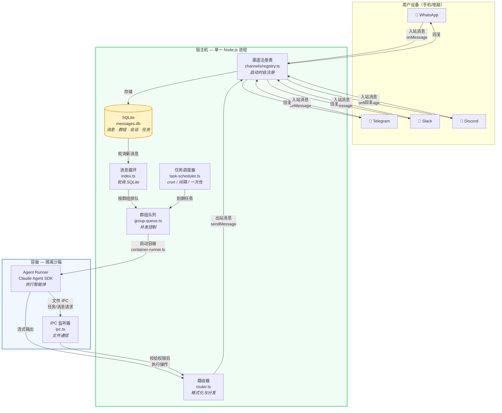

**NanoClaw** 是一个轻量级、安全的个人 AI 助手系统。它让你通过 WhatsApp、Telegram、Discord、Slack 等即时通讯工具与 Claude 对话，而 Claude 的智能体（Agent）运行在隔离的 Linux 容器中——这意味着它只能看到你明确授权的文件，即使执行 Bash 命令也完全不会影响你的主机系统。整个编排器只有一个 Node.js 进程，代码量小到你可以完整阅读并理解它。

Sources: [README.md](README.md#L1-L7), [README_zh.md](README_zh.md#L1-L7)

## 为什么需要 NanoClaw

### 问题背景：个人 AI 助手的安全困境

当你让一个 AI 助手访问你的文件系统、执行命令、管理日程时，你实际上是在给一个黑箱赋予权力。现有的开源方案（如 OpenClaw）虽然功能强大，但代码量接近 50 万行、依赖项超过 70 个、配置文件多达 53 个——**你真的能审查完它对你的系统做的每一件事吗？** 安全机制停留在应用层（白名单、配置检查），一旦被绕过，后果不堪设想。

Sources: [README.md](README.md#L19-L23), [docs/REQUIREMENTS.md](docs/REQUIREMENTS.md#L1-L12)

### NanoClaw 的回答：小到能审计，安全靠隔离

NanoClaw 的核心理念可以用一句话概括：**代码少到你能读完，安全不靠承诺而靠操作系统级别的隔离。** 智能体运行在 Linux 容器（Apple Container 或 Docker）中，而非依赖应用层权限检查。容器只能看到被显式挂载的目录，命令运行在沙箱内而非你的宿主机上。这种"物理隔离"比任何权限系统都可靠。

Sources: [docs/SECURITY.md](docs/SECURITY.md#L14-L23), [README_zh.md](README_zh.md#L37-L43)

### 设计哲学一览

| 原则 | 含义 | 对你的影响 |
|------|------|-----------|
| **小到能看懂** | 单进程、少量源文件、无微服务 | 你可以阅读并理解整个代码库 |
| **隔离即安全** | 智能体在容器中运行，OS 级隔离 | 即使 AI 被恶意指令引导，也无法触碰主机 |
| **为个人用户设计** | 不是企业框架，是个人定制的软件 | Fork 后用 Claude Code 修改，完全匹配你的需求 |
| **定制即代码修改** | 不用配置文件，直接改代码 | 零配置泛滥，行为精确可控 |
| **Skills 优于 Features** | 新功能以"技能"形式贡献，不进入核心 | 你的安装只包含你需要的功能，不会膨胀 |
| **AI 原生** | 安装、调试、运维全部由 Claude Code 辅助 | 无需学习运维工具，对话即操作 |

Sources: [README.md](README.md#L37-L55), [docs/REQUIREMENTS.md](docs/REQUIREMENTS.md#L14-L43)

## 核心架构总览

NanoClaw 的架构可以概括为一条数据流水线：

```
渠道消息 → SQLite 暂存 → 轮询循环 → 容器（Claude Agent SDK） → 响应
```

只有一个 Node.js 进程在主机上运行，负责消息路由、任务调度和容器生命周期管理。消息渠道（如 WhatsApp、Telegram）通过"技能"系统安装，启动时自动注册——编排器连接所有配置了凭据的渠道。智能体在隔离的 Linux 容器中执行，每个群组拥有独立的消息队列和并发控制。

Sources: [README.md](README.md#L122-L141), [docs/SPEC.md](docs/SPEC.md#L24-L72)

下面的 Mermaid 图展示了系统各组件之间的关系和消息流转方向：



> **前置说明**：上图中的"渠道注册表"使用了**工厂模式（Factory Pattern）**——每个渠道（如 WhatsApp）在模块加载时调用 `registerChannel()` 注册自己。编排器启动时遍历所有已注册的工厂，有凭据的渠道就被连接，没有凭据的则被跳过。这意味着添加新渠道不需要修改编排器代码。

Sources: [docs/SPEC.md](docs/SPEC.md#L87-L214), [src/channels/registry.ts](src/channels/registry.ts#L1-L30)

## 功能全景

NanoClaw 提供以下核心能力，每一项都经过精简设计：

| 功能 | 说明 | 如何使用 |
|------|------|---------|
| **多渠道消息** | 同时接入 WhatsApp、Telegram、Discord、Slack、Gmail | 用技能添加，如 `/add-whatsapp` |
| **群组隔离** | 每个群组有独立的 CLAUDE.md 记忆、文件系统、容器沙箱 | 自动实现，无需配置 |
| **主频道管理** | 你的私聊频道用于管理控制，其他群组完全隔离 | 在主频道中用触发词下达管理指令 |
| **定时任务** | 支持 cron 表达式、固定间隔、一次性任务 | 对话中告诉 Claude："每天早上 9 点发简报" |
| **网络访问** | 搜索和抓取网页内容 | 智能体内置 WebSearch、WebFetch 工具 |
| **容器隔离** | 智能体在 Apple Container (macOS) 或 Docker 中运行 | 安装时自动配置 |
| **智能体集群** | 启动多个专业智能体团队协作完成复杂任务 | 首个支持此功能的个人 AI 助手 |
| **浏览器自动化** | 通过 agent-browser 在容器内操控 Chromium | 内置于容器镜像 |
| **流式响应** | 智能体的输出实时推送到你的聊天窗口 | 自动实现，无需等待全部完成 |

Sources: [README_zh.md](README_zh.md#L53-L62), [docs/REQUIREMENTS.md](docs/REQUIREMENTS.md#L70-L84)

## 技能系统：扩展而不膨胀

传统软件通过添加功能来扩展——用户安装了不需要的功能，代码库不断膨胀。NanoClaw 用**技能（Skills）**替代了这一模式。社区贡献者不向核心代码库添加新功能，而是提供 Claude Code 技能文件（`.claude/skills/` 目录下），这些技能会**改造你的 Fork**。你只安装你需要的，得到的代码干净且只做你需要的事。

当前可用的技能包括：

| 技能 | 用途 |
|------|------|
| `/setup` | 首次安装：依赖、认证、容器、服务配置 |
| `/add-whatsapp` | 添加 WhatsApp 渠道 |
| `/add-telegram` | 添加 Telegram 渠道 |
| `/add-discord` | 添加 Discord 渠道 |
| `/add-slack` | 添加 Slack 渠道 |
| `/add-gmail` | 添加 Gmail 集成 |
| `/customize` | 引导式修改：触发词、行为、目录挂载 |
| `/debug` | 容器调试与日志排查 |
| `/add-image-vision` | 图片识别能力 |
| `/add-voice-transcription` | 语音转文字 |
| `/add-pdf-reader` | PDF 文档阅读 |
| `/add-parallel` | 并行智能体 |
| `/convert-to-apple-container` | 切换到 Apple Container 运行时 |

Sources: [README.md](README.md#L96-L103), [.claude/skills](.claude/skills)

## 项目技术栈与规模

NanoClaw 刻意保持极简的技术栈。以下是核心依赖：

| 组件 | 技术 | 用途 |
|------|------|------|
| 编排器运行时 | Node.js 20+ (TypeScript) | 主进程，消息路由、调度 |
| 数据库 | SQLite (better-sqlite3) | 消息存储、群组/会话/任务状态 |
| 日志 | Pino + pino-pretty | 结构化日志 |
| 容器运行时 | Docker 或 Apple Container | 沙箱隔离 |
| 智能体 SDK | @anthropic-ai/claude-agent-sdk | 容器内运行 Claude |
| 配置校验 | Zod | Schema 验证 |
| 任务调度 | cron-parser | 解析 cron 表达式 |

生产依赖仅 **7 个包**（better-sqlite3、cron-parser、pino、pino-pretty、yaml、zod + Node.js 内置模块），容器内依赖仅 **4 个包**。对比那些动辄上百依赖的项目，这种精简意味着更小的攻击面和更少的维护负担。

Sources: [package.json](package.json#L1-L43), [container/agent-runner/package.json](container/agent-runner/package.json#L1-L21)

## 系统要求

| 项目 | 要求 |
|------|------|
| 操作系统 | macOS 或 Linux |
| Node.js | 20+ |
| Claude Code | 从 [claude.ai](https://claude.ai/download) 下载 |
| 容器运行时 | [Apple Container](https://github.com/apple/container)（macOS）或 [Docker](https://docker.com)（macOS/Linux） |
| 许可证 | MIT |

Sources: [README_zh.md](README_zh.md#L112-L118)

## 项目目录结构速览

以下是你 clone 项目后会看到的核心结构，帮助你快速建立对代码组织的心智模型：

```
nanoclaw/
├── src/                        # 🟢 宿主机编排器（核心逻辑）
│   ├── index.ts                # 主入口：状态管理、消息循环、Agent 调度
│   ├── config.ts               # 配置常量（触发词、路径、间隔）
│   ├── types.ts                # TypeScript 类型定义
│   ├── db.ts                   # SQLite 数据库层
│   ├── router.ts               # 消息格式化与出站路由
│   ├── container-runner.ts     # 容器启动与输出流处理
│   ├── container-runtime.ts    # 容器运行时抽象（Docker/Apple Container）
│   ├── group-queue.ts          # 分组队列与并发控制
│   ├── task-scheduler.ts       # 定时任务调度
│   ├── ipc.ts                  # 进程间通信监听
│   ├── mount-security.ts       # 容器挂载安全验证
│   ├── sender-allowlist.ts     # 发送者白名单
│   └── channels/               # 渠道系统
│       ├── registry.ts         # 渠道工厂注册表
│       └── index.ts            # 渠道自注册入口
│
├── container/                  # 🔵 容器内运行的代码
│   ├── Dockerfile              # 容器镜像定义（Node.js 22 + Chromium）
│   ├── agent-runner/           # Agent 运行器
│   │   └── src/
│   │       ├── index.ts        # 容器入口：读 stdin、运行 Agent、写 stdout
│   │       └── ipc-mcp-stdio.ts  # MCP 服务器（任务/消息 IPC）
│   └── skills/                 # 容器内技能（如浏览器自动化）
│
├── groups/                     # 📂 分组数据（运行时生成）
│   ├── CLAUDE.md               # 全局记忆
│   └── {channel}_{group}/      # 各群组独立文件夹
│       ├── CLAUDE.md           # 群组记忆
│       └── logs/               # 任务执行日志
│
├── .claude/skills/             # 🛠️ Claude Code 技能
│   ├── setup/                  # 首次安装技能
│   ├── add-whatsapp/           # WhatsApp 渠道技能
│   ├── add-telegram/           # Telegram 渠道技能
│   └── ...                     # 更多可安装技能
│
├── setup/                      # 安装向导模块
├── docs/                       # 项目文档
└── launchd/                    # macOS 服务配置
```

Sources: [docs/SPEC.md](docs/SPEC.md#L239-L323), [CLAUDE.md](CLAUDE.md#L1-L22)

## 推荐阅读路径

本文档是入门指南的第一页。理解了 NanoClaw 是什么之后，建议按照以下顺序继续阅读：

1. **安装与运行** → [快速安装与首次运行指南](2-kuai-su-an-zhuang-yu-shou-ci-yun-xing-zhi-nan) — 三步启动你的 NanoClaw
2. **基本用法** → [与助手对话：触发词、群组和基本用法](3-yu-zhu-shou-dui-hua-hong-fa-ci-qun-zu-he-ji-ben-yong-fa) — 学会与助手交互
3. **深入理解架构** → [整体架构：单进程编排器与容器化智能体](9-zheng-ti-jia-gou-dan-jin-cheng-bian-pai-qi-yu-rong-qi-hua-zhi-neng-ti) — 深入理解系统设计

如果你已经迫不及待想要动手，直接跳到 [快速安装与首次运行指南](2-kuai-su-an-zhuang-yu-shou-ci-yun-xing-zhi-nan) 即可。