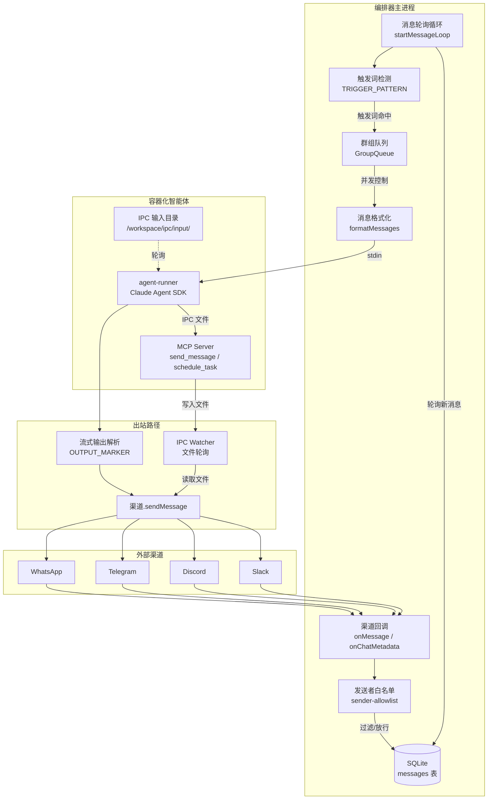
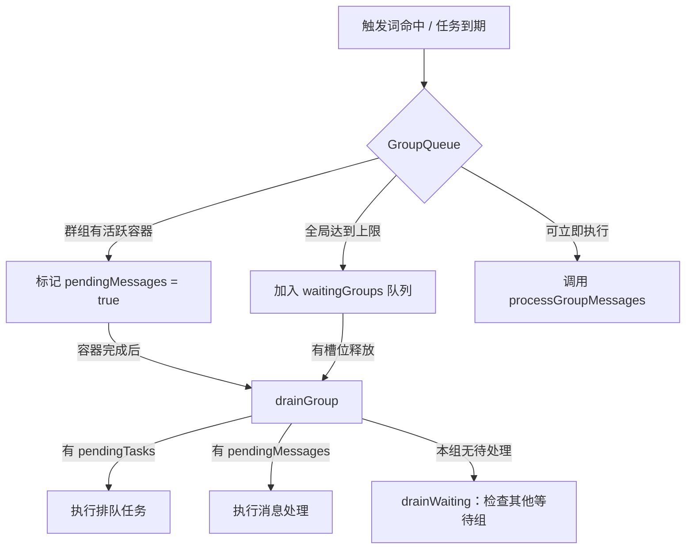
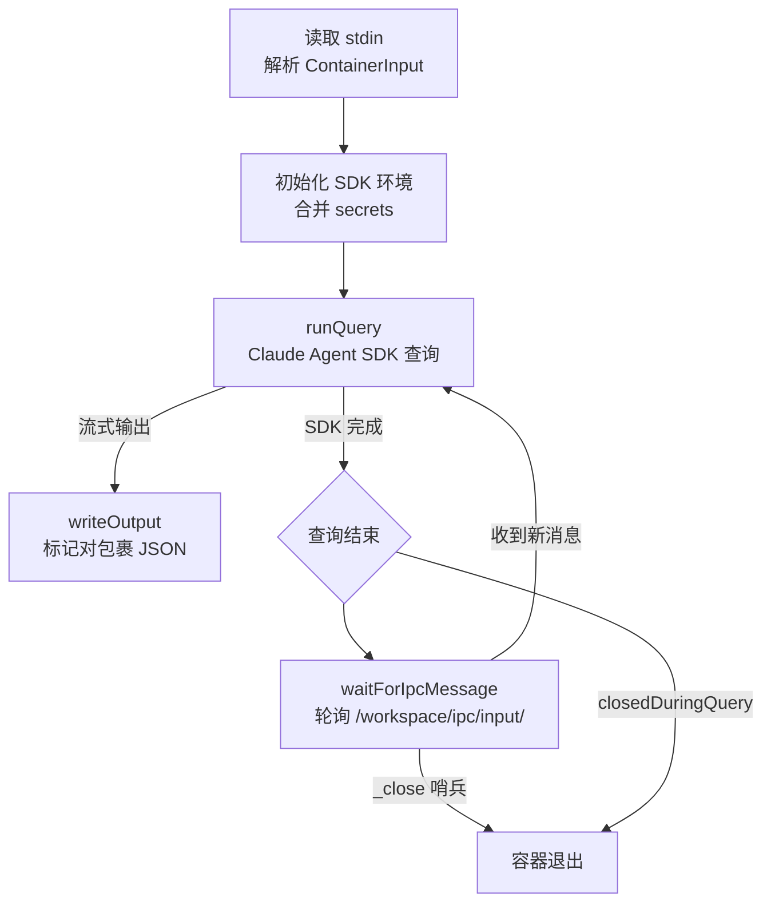

本文聚焦 NanoClaw 系统中一条消息从外部渠道（WhatsApp、Telegram、Discord、Slack）到达智能体容器、再从智能体响应返回用户的全链路过程。我们将逐一拆解每个阶段的职责、数据转换与关键决策点，帮助中级开发者建立对系统消息处理管线的完整心智模型。

## 全链路概览

在深入每个阶段之前，先通过一张架构图建立全局视野。消息在 NanoClaw 中的流转遵循一个**单向管线 + 反馈回路**的拓扑：入站消息从渠道经过存储、检测、排队后进入容器化智能体；智能体的响应则通过流式解析和 IPC 机制回传至渠道。



Sources: [index.ts](src/index.ts#L465-L575), [types.ts](src/types.ts#L80-L108)

---

## 阶段一：入站采集 — 渠道回调与消息存储

所有渠道实例都实现统一的 `Channel` 接口，其中 `connect()` 方法在建立连接后，通过两个回调函数将外部事件传递给编排器：

| 回调 | 签名 | 用途 |
|------|------|------|
| `onMessage` | `(chatJid, msg) => void` | 将完整的聊天消息（含内容、发送者、时间戳）注入系统 |
| `onChatMetadata` | `(chatJid, timestamp, name?, channel?, isGroup?) => void` | 仅记录聊天元数据（名称、最后活跃时间），不存储消息内容 |

在 `main()` 启动阶段，编排器创建统一的 `channelOpts` 对象，将其传递给每个渠道工厂：

```typescript
const channelOpts = {
  onMessage: (chatJid: string, msg: NewMessage) => {
    // 发送者白名单过滤（drop 模式）
    if (!msg.is_from_me && !msg.is_bot_message && registeredGroups[chatJid]) {
      const cfg = loadSenderAllowlist();
      if (shouldDropMessage(chatJid, cfg) && !isSenderAllowed(chatJid, msg.sender, cfg)) {
        return; // 静默丢弃
      }
    }
    storeMessage(msg); // 写入 SQLite
  },
  onChatMetadata: (chatJid, timestamp, name?, channel?, isGroup?) =>
    storeChatMetadata(chatJid, timestamp, name, channel, isGroup),
  registeredGroups: () => registeredGroups,
};
```

**关键设计决策**：`onMessage` 回调在存储之前执行发送者白名单的 **drop 模式**检查。这意味着被拒绝的消息不会占用任何数据库空间——它们在入口处就被静默丢弃。只有 `storeMessage(msg)` 成功执行的消息才会进入后续处理管线。

Sources: [index.ts](src/index.ts#L481-L510), [types.ts](src/types.ts#L95-L107), [sender-allowlist.ts](src/sender-allowlist.ts#L108-L113)

---

## 阶段二：消息轮询 — 检测与分发

入站消息被存入 SQLite 后，编排器的主循环 `startMessageLoop()` 通过定时轮询（默认 2 秒间隔）检测新消息。这不是事件驱动，而是**数据库轮询模式**，这种选择带来了天然的持久化和崩溃恢复能力。

轮询的核心逻辑分为三个步骤：

**① 获取新消息**：调用 `getNewMessages(jids, lastTimestamp, ASSISTANT_NAME)` 查询所有已注册群组中时间戳大于 `lastTimestamp` 的消息，同时过滤掉机器人自身发出的消息和空内容消息。

**② 按群组分组**：将消息按 `chat_jid` 去重分组，形成 `Map<chatJid, NewMessage[]>`。

**③ 触发词检测与分发**：对每个群组分别处理：

| 群组类型 | 触发词要求 | 行为 |
|----------|------------|------|
| **主群组**（`isMain=true`） | 无需触发词 | 每条新消息都触发处理 |
| **普通群组**（默认） | 需要触发词（`@助手名`） | 仅当消息中包含触发词时才触发；非触发消息静默累积，等待下次触发时作为上下文一并处理 |

对于普通群组，当触发词命中时，系统不是只处理触发消息本身，而是拉取自上次智能体处理以来（`lastAgentTimestamp`）的**所有累积消息**作为上下文——这确保智能体不会错过触发词之间的对话内容。

Sources: [index.ts](src/index.ts#L341-L439), [config.ts](src/config.ts#L61-L64), [db.ts](src/db.ts#L305-L364)

---

## 阶段三：并发控制 — GroupQueue 调度

当消息需要被处理时，它不会直接进入容器，而是被提交到 `GroupQueue`。这个队列系统管理着 NanoClaw 中最关键的并发约束：**全局最多同时运行 `MAX_CONCURRENT_CONTAINERS` 个容器**（默认 5 个），且**每个群组同一时间只能有一个活跃容器**。



当某个群组的容器正在运行时，新到达的触发词消息会触发一条特殊的优化路径：如果容器处于空闲等待状态（`idleWaiting`），编排器会直接将新消息通过 IPC 输入目录**管道传输**给正在运行的容器，而不是关闭旧容器再启动新容器。这种"热追加"机制显著降低了连续对话的延迟。

Sources: [group-queue.ts](src/group-queue.ts#L30-L130), [index.ts](src/index.ts#L414-L432), [config.ts](src/config.ts#L52-L55)

---

## 阶段四：消息格式化 — XML 结构化

在消息进入容器之前，`formatMessages()` 函数将原始消息数组转换为一个结构化的 XML 字符串，作为智能体的输入上下文：

```xml
<context timezone="Asia/Shanghai" />
<messages>
  <message sender="张三" time="Jan 15, 2025, 2:30 PM">帮我查一下今天的天气</message>
  <message sender="李四" time="Jan 15, 2025, 2:31 PM">@Andy 你能帮忙吗？</message>
</messages>
```

这个 XML 格式设计有两个考量：一是保持与 LLM 提示词模板的兼容性，二是通过 `escapeXml()` 防止消息内容中的特殊字符破坏结构。时间戳从 UTC ISO 格式转换为用户本地时区的可读格式，使用 `Intl.DateTimeFormat` API 实现，无需额外依赖。

Sources: [router.ts](src/router.ts#L4-L25), [timezone.ts](src/timezone.ts#L1-L17)

---

## 阶段五：容器启动与智能体执行

`processGroupMessages()` 调用 `runAgent()`，后者通过 `runContainerAgent()` 完成容器的完整生命周期管理。这是整个消息流转链路中最复杂的阶段。

### 容器构建与挂载

`buildVolumeMounts()` 根据群组类型构建不同的卷挂载方案：

| 挂载点 | 主群组 | 普通群组 | 说明 |
|--------|--------|----------|------|
| `/workspace/project` | ✅ 只读 | ❌ | 项目根目录，仅主群组可见 |
| `/workspace/group` | ✅ 读写 | ✅ 读写 | 群组专属工作目录 |
| `/workspace/global` | ❌ | ✅ 只读 | 全局记忆目录 |
| `/home/node/.claude` | ✅ 读写 | ✅ 读写 | Claude 会话与技能目录（每组隔离） |
| `/workspace/ipc` | ✅ 读写 | ✅ 读写 | IPC 通信目录（每组隔离命名空间） |
| `/workspace/extra/*` | ✅ 按配置 | ✅ 按配置 | 额外挂载目录（受白名单校验） |

### 输入传递协议

容器输入通过 **stdin** 传递（而非环境变量或文件挂载），这是一个关键的安全决策：敏感凭据（OAuth Token、API Key）只存在于进程内存中，从不写入磁盘。输入协议为：

```typescript
interface ContainerInput {
  prompt: string;        // 格式化后的消息 XML
  sessionId?: string;    // 恢复会话 ID
  groupFolder: string;   // 群组标识
  chatJid: string;       // 聊天 JID
  isMain: boolean;       // 是否主群组
  assistantName?: string;
  secrets?: { ... };     // 凭据（传递后即删除）
}
```

### 流式输出解析

容器进程的 stdout 中嵌入了一种**标记协议**，允许编排器在容器仍在运行时就开始提取智能体的响应：

```
---NANOCLAW_OUTPUT_START---
{"status":"success","result":"这是智能体的回复内容","newSessionId":"sess-abc123"}
---NANOCLAW_OUTPUT_END---
```

编排器的 `container.stdout.on('data')` 处理器维护一个 `parseBuffer`，增量扫描 `OUTPUT_START_MARKER` / `OUTPUT_END_MARKER` 标记对。每当发现完整的标记对时，立即解析 JSON 并调用 `onOutput` 回调——这意味着**智能体的响应在生成过程中就开始发送给用户**，无需等待容器退出。

Sources: [container-runner.ts](src/container-runner.ts#L258-L400), [container-runner.ts](src/container-runner.ts#L57-L211), [container/agent-runner/src/index.ts](container/agent-runner/src/index.ts#L98-L116)

---

## 阶段六：容器内执行 — Agent Runner

容器内部的 `agent-runner` 是消息链路的核心执行端。它的生命周期遵循一个**查询循环**模式：



### MessageStream 异步迭代器

`runQuery()` 使用自定义的 `MessageStream` 类实现了一个推模式的异步迭代器。它的工作原理是：将初始 prompt 推入队列后，SDK 的 `query()` 函数开始消费这个异步迭代器。在查询执行期间，一个并行的 IPC 轮询器持续检查输入目录，将新到达的消息推入同一个 `MessageStream`，从而实现**对话上下文的动态扩展**——智能体可以在一次查询中处理多轮追加消息。

### MCP 工具集成

`agent-runner` 启动一个 stdio MCP 服务器（`ipc-mcp-stdio.ts`），为智能体提供以下工具：

| 工具名 | 功能 | IPC 方向 |
|--------|------|----------|
| `send_message` | 即时发送消息到当前群组 | 写入 `/workspace/ipc/messages/` |
| `schedule_task` | 创建定时/循环/一次性任务 | 写入 `/workspace/ipc/tasks/` |
| `list_tasks` | 查看已调度任务 | 读取 `/workspace/ipc/current_tasks.json` |
| `pause_task` | 暂停任务 | 写入 tasks IPC |
| `resume_task` | 恢复任务 | 写入 tasks IPC |
| `cancel_task` | 取消任务 | 写入 tasks IPC |
| `update_task` | 修改任务 | 写入 tasks IPC |

这些工具通过**文件系统 IPC**与宿主通信——每个工具调用都写入一个 JSON 文件到容器挂载的 IPC 目录中，宿主的 IPC Watcher 通过文件轮询消费这些文件。

Sources: [container/agent-runner/src/index.ts](container/agent-runner/src/index.ts#L357-L491), [container/agent-runner/src/index.ts](container/agent-runner/src/index.ts#L66-L96), [container/agent-runner/src/ipc-mcp-stdio.ts](container/agent-runner/src/ipc-mcp-stdio.ts#L37-L63)

---

## 阶段七：出站路径 — 响应回传用户

智能体的响应通过**两条并行路径**返回用户：

### 路径 A：流式输出（主路径）

`processGroupMessages()` 注册了一个 `onOutput` 回调，每当 `runContainerAgent()` 解析到一个完整的输出标记对时，回调被触发：

1. **内部标签剥离**：`<internal>...</internal>` 标签被正则移除——智能体可以用这些标签进行内部推理，而不会暴露给用户
2. **发送到渠道**：通过 `channel.sendMessage(chatJid, text)` 将纯文本响应发送到原始群组
3. **空闲计时器重置**：收到实际输出后重置 30 分钟空闲计时器，延长容器存活时间
4. **打字指示器**：容器处理期间持续显示"正在输入"状态，直到所有输出完成

如果容器发生错误，系统执行**光标回滚**：将 `lastAgentTimestamp` 重置为处理前的值，使下次轮询能重新处理这批消息。但如果错误发生前已经发送了部分输出给用户，则跳过回滚以防止重复消息。

### 路径 B：IPC 消息（辅助路径）

`startIpcWatcher()` 以 1 秒间隔扫描所有群组的 IPC 消息目录。当发现 JSON 文件时：

1. **权限校验**：验证源群组是否有权向目标 JID 发送消息（主群组可向任意群组发送；普通群组只能发给自己）
2. **消息分发**：调用 `deps.sendMessage(chatJid, text)` 发送到对应渠道
3. **文件清理**：处理完成后删除 IPC 文件；处理失败则移至 `errors/` 目录

这条路径使智能体能够在一次查询中通过 `send_message` MCP 工具发送多条消息，而无需等待查询完成。

Sources: [index.ts](src/index.ts#L207-L232), [index.ts](src/index.ts#L237-L258), [router.ts](src/router.ts#L27-L35), [ipc.ts](src/ipc.ts#L29-L154)

---

## 阶段八：状态持久化与崩溃恢复

整个消息流转管线通过三个关键状态变量保证**至少一次处理**语义：

| 状态变量 | 存储位置 | 作用 |
|----------|----------|------|
| `lastTimestamp` | `router_state` 表 | 全局消息游标，标记已扫描的最新时间戳 |
| `lastAgentTimestamp[jid]` | `router_state` 表（JSON） | 每群组的处理游标，标记该群组最后被智能体处理的消息时间戳 |
| `sessions[folder]` | `sessions` 表 | 每群组的 Claude 会话 ID，用于跨容器调用恢复上下文 |

系统启动时调用 `recoverPendingMessages()`，扫描所有已注册群组中 `lastAgentTimestamp` 之后未处理的消息，并将它们重新加入队列。这意味着即使编排器在推进游标后、处理消息前崩溃，重启后这些消息也不会丢失。

Sources: [index.ts](src/index.ts#L68-L83), [index.ts](src/index.ts#L85-L88), [index.ts](src/index.ts#L446-L458), [db.ts](src/db.ts#L68-L85)

---

## 全链路数据转换汇总

下表总结了消息在流转过程中的关键数据格式变化：

| 阶段 | 数据格式 | 关键字段 |
|------|----------|----------|
| 渠道入站 | `NewMessage` 对象 | `id, chat_jid, sender, sender_name, content, timestamp` |
| 数据库存储 | SQLite `messages` 表行 | 增加 `is_from_me, is_bot_message` 标记 |
| 轮询提取 | `NewMessage[]` 数组 | 过滤掉机器人消息和空内容 |
| 触发词检测 | 原始 `content` 字符串 | 对 `TRIGGER_PATTERN` 正则匹配 |
| 格式化输出 | XML 字符串 | `<message sender="..." time="...">...</message>` |
| 容器输入 | `ContainerInput` JSON | `prompt`（XML）+ `sessionId` + `secrets` |
| SDK 查询 | `MessageStream` 异步迭代器 | `SDKUserMessage` 对象流 |
| 智能体输出 | 标记对包裹的 JSON | `---NANOCLAW_OUTPUT_START---{...}---NANOCLAW_OUTPUT_END---` |
| 出站文本 | 纯文本（已剥离 `<internal>` 标签） | 通过 `channel.sendMessage()` 发送 |

Sources: [types.ts](src/types.ts#L45-L54), [router.ts](src/router.ts#L13-L25), [container-runner.ts](src/container-runner.ts#L33-L49)

---

## 延伸阅读

理解消息流转全链路后，你可以继续深入以下方向：

- **渠道注册与工厂模式**：了解各渠道如何自注册并实现统一的 `Channel` 接口 → [渠道注册表：自注册工厂模式与渠道接口设计](11-qu-dao-zhu-ce-biao-zi-zhu-ce-gong-han-mo-shi-yu-qu-dao-jie-kou-she-ji)
- **并发与排队机制**：深入 `GroupQueue` 的重试策略、空闲检测与优雅关闭 → [群组队列（src/group-queue.ts）：并发控制与任务排队机制](14-qun-zu-dui-lie-src-group-queue-ts-bing-fa-kong-zhi-yu-ren-wu-pai-dui-ji-zhi)
- **容器运行时细节**：容器镜像构建、挂载策略与超时管理 → [容器运行器（src/container-runner.ts）：容器生命周期与卷挂载](13-rong-qi-yun-xing-qi-src-container-runner-ts-rong-qi-sheng-ming-zhou-qi-yu-juan-gua-zai)
- **Agent Runner 内部**：Claude Agent SDK 集成、会话管理与查询循环 → [Agent Runner（container/agent-runner）：Claude Agent SDK 集成、IPC 轮询与会话管理](20-agent-runner-container-agent-runner-claude-agent-sdk-ji-cheng-ipc-lun-xun-yu-hui-hua-guan-li)
- **IPC 权限模型**：主群组与非主群组的能力差异 → [IPC 授权模型：主群组与非主群组的权限差异](24-ipc-shou-quan-mo-xing-zhu-qun-zu-yu-fei-zhu-qun-zu-de-quan-xian-chai-yi)
- **消息格式化与路由**：出站消息的格式处理与渠道分发 → [消息路由（src/router.ts）：消息格式化与出站分发](16-xiao-xi-lu-you-src-router-ts-xiao-xi-ge-shi-hua-yu-chu-zhan-fen-fa)