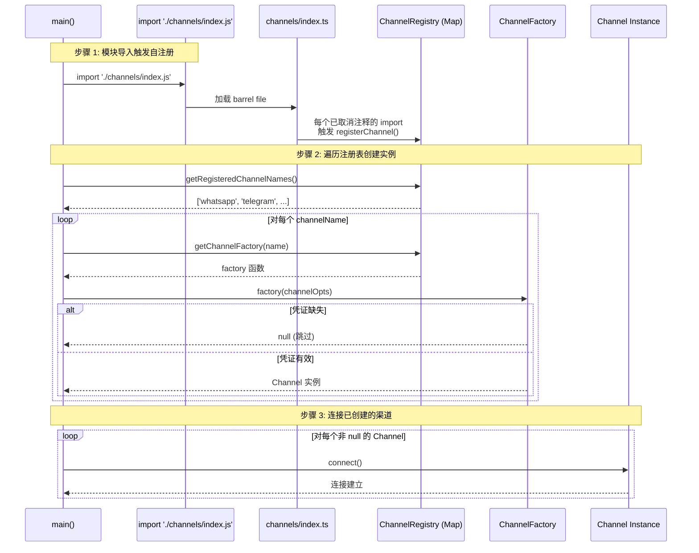

NanoClaw 通过一套精心设计的**自注册工厂模式**（Self-Registering Factory Pattern）实现消息渠道的动态发现与加载。该模式将渠道定义从核心编排器中彻底解耦——编排器无需知道有哪些渠道存在，只需遍历注册表即可完成所有渠道的初始化。本文深入剖析 `Channel` 接口契约、`ChannelFactory` 工厂函数的凭证守卫语义、模块副作用驱动的自注册机制，以及 barrel file（桶文件）如何充当渠道技能的接入点。

Sources: [registry.ts](src/channels/registry.ts#L1-L29), [types.ts](src/types.ts#L80-L108)

## Channel 接口契约：统一的消息渠道抽象

所有消息渠道必须实现 `Channel` 接口。这个接口定义了七个方法，其中五个是必需的、两个是可选的，它们共同构成了一套完整的渠道生命周期协议：

```typescript
export interface Channel {
  name: string;
  connect(): Promise<void>;
  sendMessage(jid: string, text: string): Promise<void>;
  isConnected(): boolean;
  ownsJid(jid: string): boolean;
  disconnect(): Promise<void>;
  setTyping?(jid: string, isTyping: boolean): Promise<void>;
  syncGroups?(force: boolean): Promise<void>;
}
```

**`name`** 是渠道的字符串标识符，用于注册表的键和日志中的渠道归属标识。**`connect()`** 负责建立与消息平台的连接（WebSocket、长轮询、OAuth 等），并设置事件处理器监听入站消息。**`sendMessage(jid, text)`** 将文本回复发送到指定的 JID 地址。**`isConnected()`** 和 **`ownsJid(jid)`** 共同实现路由分发——编排器先用 `ownsJid` 判断哪个渠道拥有某个 JID，再用 `isConnected` 确认连接状态。**`disconnect()`** 在服务关闭时释放资源。

两个可选方法遵循接口隔离原则：**`setTyping`** 用于支持"正在输入"提示的平台（WhatsApp、Telegram、Discord 支持；Slack 是 no-op），**`syncGroups`** 用于支持主动同步群组元数据的平台（WhatsApp 实现；Telegram 在消息事件中内联传递名称，无需单独同步）。

Sources: [types.ts](src/types.ts#L82-L93)

## ChannelOpts：回调驱动的控制反转

渠道不直接操作数据库或编排器状态，而是通过 `ChannelOpts` 接收三个回调函数，实现控制反转（Inversion of Control）：

```typescript
export interface ChannelOpts {
  onMessage: OnInboundMessage;
  onChatMetadata: OnChatMetadata;
  registeredGroups: () => Record<string, RegisteredGroup>;
}
```

**`onMessage`** 是渠道在收到消息时调用的回调，签名是 `(chatJid: string, message: NewMessage) => void`。编排器在 `main()` 中将此回调绑定到 `storeMessage(msg)`，完成消息持久化。**`onChatMetadata`** 用于推送聊天元数据（群组名称、是否为群聊、所属渠道等），编排器将其绑定到 `storeChatMetadata()`。**`registeredGroups`** 是一个惰性求值函数（thunk），返回当前已注册群组的快照——渠道在每个消息事件中调用它来决定是否投递消息（未注册群组的消息仅存储元数据但不投递给智能体）。

这种设计确保了渠道实现完全不需要了解编排器的内部状态结构。以 Telegram 渠道为例，在处理消息事件时，它调用 `this.opts.registeredGroups()[chatJid]` 来判断当前聊天是否已注册，未注册时仅记录日志并跳过。

Sources: [registry.ts](src/channels/registry.ts#L8-L12), [index.ts](src/index.ts#L482-L510), [telegram.ts](.claude/skills/add-telegram/add/src/channels/telegram.ts#L100-L108)

## 注册表核心：Map 工厂存储与三函数 API

注册表本身极其精简——一个模块级 `Map<string, ChannelFactory>` 加上三个纯函数：

| 函数 | 签名 | 职责 |
|---|---|---|
| `registerChannel` | `(name: string, factory: ChannelFactory) => void` | 注册渠道工厂到 Map |
| `getChannelFactory` | `(name: string) => ChannelFactory \| undefined` | 按名称获取工厂 |
| `getRegisteredChannelNames` | `() => string[]` | 返回所有已注册渠道名称 |

`ChannelFactory` 的类型定义是 `(opts: ChannelOpts) => Channel | null`。**返回 `null` 是关键的语义设计**——它表示"渠道已安装但凭证缺失"。编排器在 `main()` 中据此做出优雅降级：工厂返回 `null` 时仅输出警告日志并跳过该渠道，而非崩溃退出。这意味着用户可以安装全部五个渠道技能，但只为其中两个配置了凭证——系统只会连接那两个渠道并正常工作。

Sources: [registry.ts](src/channels/registry.ts#L14-L29), [index.ts](src/index.ts#L515-L527)

## 自注册机制：模块副作用与 Barrel File 模式

自注册的核心洞察是利用 JavaScript 模块的**加载副作用**（load-time side effect）。每个渠道文件的最后一行都会调用 `registerChannel()`：

```typescript
// whatsapp.ts 末尾
registerChannel('whatsapp', (opts: ChannelOpts) => new WhatsAppChannel(opts));

// telegram.ts 末尾
registerChannel('telegram', (opts: ChannelOpts) => {
  const token = process.env.TELEGRAM_BOT_TOKEN || readEnvFile(['TELEGRAM_BOT_TOKEN']).TELEGRAM_BOT_TOKEN || '';
  if (!token) return null; // 凭证守卫
  return new TelegramChannel(token, opts);
});

// gmail.ts 末尾
registerChannel('gmail', (opts: ChannelOpts) => {
  if (!fs.existsSync(path.join(os.homedir(), '.gmail-mcp/gcp-oauth.keys.json')) ||
      !fs.existsSync(path.join(os.homedir(), '.gmail-mcp/credentials.json'))) {
    return null; // 凭证守卫
  }
  return new GmailChannel(opts);
});
```

当 Node.js 的 ES 模块系统加载某个渠道文件时，模块顶层代码立即执行，`registerChannel()` 调用将工厂函数写入全局注册表。这个时机发生在任何业务代码运行之前——它纯粹是模块解析阶段的副作用。

Barrel file（`src/channels/index.ts`）是这一机制的编排中枢。它的注释精确描述了设计意图：

```
// Channel self-registration barrel file.
// Each import triggers the channel module's registerChannel() call.

// discord
// gmail
// slack
// telegram
// whatsapp
```

默认情况下，所有渠道名称都是被注释掉的占位符。当用户通过技能系统安装某个渠道时（例如 `add-whatsapp`），技能引擎的 modify 操作会将对应行的注释取消，添加 `import './whatsapp.js';`。对应渠道的 SKILL.md 中明确定义了这个 intent："Add `import './whatsapp.js';` to the channel barrel file so the WhatsApp module self-registers with the channel registry on startup. This is an append-only change — existing import lines for other channels must be preserved."

Sources: [index.ts (channels barrel)](src/channels/index.ts#L1-L13), [whatsapp.ts](.claude/skills/add-whatsapp/add/src/channels/whatsapp.ts#L398-L399), [telegram.ts](.claude/skills/add-telegram/add/src/channels/telegram.ts#L248-L257), [gmail.ts](.claude/skills/add-gmail/add/src/channels/gmail.ts#L342-L352), [modify/index.ts.intent.md](.claude/skills/add-whatsapp/modify/src/channels/index.ts.intent.md#L1-L8)

## 编排器的渠道初始化流程

在 `main()` 函数中，渠道初始化是一个清晰的三步过程：



第一步，`import './channels/index.js'` 语句（位于 `src/index.ts` 第 11 行）触发 barrel file 的加载，进而执行所有已注册渠道的 `registerChannel()` 调用。第二步，`main()` 通过 `getRegisteredChannelNames()` 获取所有已注册的渠道名称，逐个获取工厂函数并调用。工厂函数接收共享的 `channelOpts` 回调集——`onMessage`（绑定到 `storeMessage`）、`onChatMetadata`（绑定到 `storeChatMetadata`）和 `registeredGroups`（返回当前注册群组快照的惰性函数）。第三步，对每个非 `null` 的渠道实例调用 `connect()` 建立平台连接。如果所有渠道都返回 `null`（没有任何凭证），系统以 `fatal` 级别日志退出。

Sources: [index.ts](src/index.ts#L11-L16), [index.ts](src/index.ts#L512-L531)

## 五个渠道的工厂函数策略对比

每个渠道的工厂函数根据自身的认证模型采用不同的凭证守卫策略：

| 渠道 | 凭证来源 | 守卫策略 | 工厂参数 |
|---|---|---|---|
| **WhatsApp** | Baileys auth state 目录 | 无显式守卫（`connect()` 内处理 QR 认证流程） | 仅 `opts` |
| **Telegram** | `.env` 文件 + `process.env` | 读取 `TELEGRAM_BOT_TOKEN`，空则返回 `null` | `token` + `opts` |
| **Discord** | `.env` 文件 + `process.env` | 读取 `DISCORD_BOT_TOKEN`，空则返回 `null` | `token` + `opts` |
| **Slack** | `.env` 文件（构造函数内读取） | 读取 `SLACK_BOT_TOKEN` + `SLACK_APP_TOKEN`，缺失则 `throw` | 仅 `opts` |
| **Gmail** | `~/.gmail-mcp/` 目录下的 OAuth 文件 | 检查两个文件是否存在，缺失则返回 `null` | 仅 `opts` |

值得注意的是 Slack 渠道的异常行为——它在构造函数中读取凭证并直接抛出异常（`throw new Error(...)`），而非返回 `null`。这是一个与注册表约定不一致的边缘情况，在实际运行时被工厂函数外部的 `readEnvFile` 守卫所补偿。

WhatsApp 是唯一一个在工厂函数中不做凭证检查的渠道。它总是返回实例，将认证推迟到 `connect()` 阶段——因为 WhatsApp 使用 Baileys 的 Multi-Device 认证流程，首次连接需要扫描 QR 码，后续连接依赖本地 auth state 文件。

Sources: [whatsapp.ts](.claude/skills/add-whatsapp/add/src/channels/whatsapp.ts#L398-L399), [telegram.ts](.claude/skills/add-telegram/add/src/channels/telegram.ts#L248-L257), [discord.ts](.claude/skills/add-discord/add/src/channels/discord.ts#L241-L250), [slack.ts](.claude/skills/add-slack/add/src/channels/slack.ts#L293-L300), [gmail.ts](.claude/skills/add-gmail/add/src/channels/gmail.ts#L342-L352)

## JID 命名空间与 ownsJid 路由分发

每个渠道通过 `ownsJid(jid)` 方法声明对特定 JID 前缀的管辖权。编排器的 `findChannel()` 函数（在 `router.ts` 中定义）遍历渠道数组，返回第一个 `ownsJid` 返回 `true` 的渠道：

| 渠道 | JID 模式 | `ownsJid` 实现 | 示例 |
|---|---|---|---|
| **WhatsApp** | `@g.us` / `@s.whatsapp.net` | `jid.endsWith('@g.us') \|\| jid.endsWith('@s.whatsapp.net')` | `120363xxx@g.us` |
| **Telegram** | `tg:` 前缀 | `jid.startsWith('tg:')` | `tg:-1001234567890` |
| **Discord** | `dc:` 前缀 | `jid.startsWith('dc:')` | `dc:1234567890` |
| **Slack** | `slack:` 前缀 | `jid.startsWith('slack:')` | `slack:C01234567` |
| **Gmail** | `gmail:` 前缀 | `jid.startsWith('gmail:')` | `gmail:18f3a2b1c4d5e6f7` |

WhatsApp 使用后缀匹配（`endsWith`），因为它遵循 WhatsApp 自己的 JID 格式规范（群组为 `@g.us`，个人聊天为 `@s.whatsapp.net`）。其他四个渠道使用带命名空间前缀的格式（`tg:`、`dc:`、`slack:`、`gmail:`），通过 `startsWith` 匹配。这种设计确保 JID 命名空间不会冲突，且 `sendMessage` 的实现可以通过 `jid.replace(/^tg:/, '')` 等简单操作提取平台原生 ID。

Sources: [router.ts](src/router.ts#L47-L52), [whatsapp.ts](.claude/skills/add-whatsapp/add/src/channels/whatsapp.ts#L283-L285), [telegram.ts](.claude/skills/add-telegram/add/src/channels/telegram.ts#L225-L227), [discord.ts](.claude/skills/add-discord/add/src/channels/discord.ts#L215-L217), [slack.ts](.claude/skills/add-slack/add/src/channels/slack.ts#L198-L200), [gmail.ts](.claude/skills/add-gmail/add/src/channels/gmail.ts#L164-L166)

## 消息长度限制与分片策略

不同平台对单条消息有各自的字符上限。渠道在 `sendMessage` 中自行处理分片逻辑，对编排器完全透明：

| 渠道 | 单条上限 | 分片策略 |
|---|---|---|
| **WhatsApp** | 无明确限制（实践约 65536） | 不分片 |
| **Telegram** | 4096 | 按 4096 切片顺序发送 |
| **Discord** | 2000 | 按 2000 切片顺序发送 |
| **Slack** | ~4000 | 按 4000 切片顺序发送 |
| **Gmail** | 无限制（邮件正文） | 不分片 |

WhatsApp 和 Slack 还实现了**离线消息队列**——当 `isConnected()` 为 `false` 时，`sendMessage` 将消息推入本地数组，在连接恢复后由 `flushOutgoingQueue()` 批量发送。这保证了在网络抖动场景下的消息零丢失。

Sources: [telegram.ts](.claude/skills/add-telegram/add/src/channels/telegram.ts#L200-L218), [discord.ts](.claude/skills/add-discord/add/src/channels/discord.ts#L196-L209), [slack.ts](.claude/skills/add-slack/add/src/channels/slack.ts#L160-L192), [whatsapp.ts](.claude/skills/add-whatsapp/add/src/channels/whatsapp.ts#L249-L277)

## 测试策略：模块级状态的隔离挑战

注册表是模块级单例状态，这给测试带来了隔离性挑战。测试文件中的注释精确描述了这一约束："The registry is module-level state, so we need a fresh module per test." 实际测试策略选择接受状态共享，通过有序测试覆盖核心行为：

1. **未知渠道返回 `undefined`** — 验证查询未注册名称时的安全性
2. **注册-查询往返** — 验证 `registerChannel` + `getChannelFactory` 的基本功能
3. **累积注册** — 验证多次注册后 `getRegisteredChannelNames` 包含所有名称
4. **覆盖语义** — 验证同名重复注册时后者覆盖前者

Sources: [registry.test.ts](src/channels/registry.test.ts#L1-L42)

## 扩展新渠道：自注册模式的工作流

基于上述架构，添加新渠道的工作流遵循固定模式：

1. **创建渠道实现文件**（如 `src/channels/matrix.ts`），实现 `Channel` 接口的全部必需方法和可选方法
2. **在文件末尾添加 `registerChannel()` 调用**，传入渠道名称和工厂函数，工厂函数内包含凭证守卫逻辑
3. **通过技能系统（skill）定义 modify 操作**，将 `import './matrix.js';` 添加到 barrel file 的对应位置
4. **编写技能的 manifest.yaml**，声明 `adds`（新增文件）和 `modifies`（修改 barrel file）

这种"文件级自注册 + barrel file 编排"的模式使得新渠道的添加完全不需要修改核心编排器代码（`src/index.ts`），实现了真正的开放-封闭原则（Open-Closed Principle）。

Sources: [manifest.yaml](.claude/skills/add-whatsapp/manifest.yaml#L1-L24), [modify/index.ts.intent.md](.claude/skills/add-whatsapp/modify/src/channels/index.ts.intent.md#L1-L8)

---

**下一步阅读**：了解渠道在消息流转全链路中的角色，参阅 [消息流转全链路：从渠道到智能体响应](10-xiao-xi-liu-zhuan-quan-lian-lu-cong-qu-dao-dao-zhi-neng-ti-xiang-ying)。深入了解编排器如何调度渠道实例处理消息，参阅 [编排器（src/index.ts）：状态管理、消息循环与智能体调度](12-bian-pai-qi-src-index-ts-zhuang-tai-guan-li-xiao-xi-xun-huan-yu-zhi-neng-ti-diao-du)。理解消息格式化与出站分发逻辑，参阅 [消息路由（src/router.ts）：消息格式化与出站分发](16-xiao-xi-lu-you-src-router-ts-xiao-xi-ge-shi-hua-yu-chu-zhan-fen-fa)。