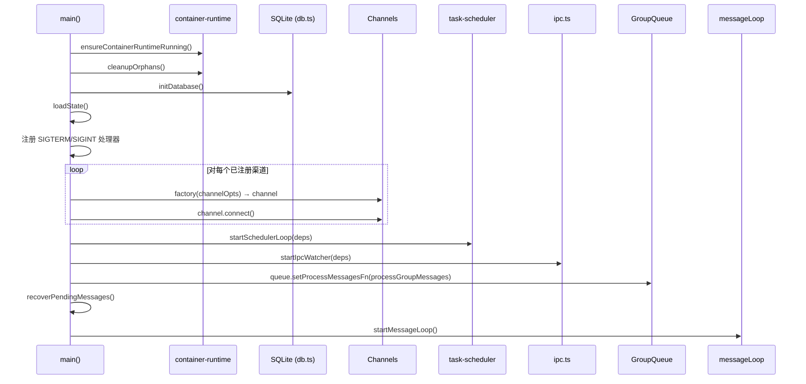
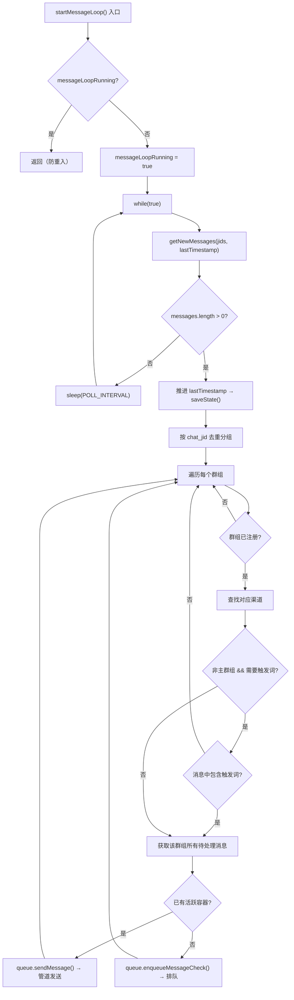

`src/index.ts` 是 NanoClaw 的**中枢神经系统**——一个在单进程内运行的事件驱动编排器，负责协调消息采集、状态持久化、触发词判定、容器调度和流式输出处理。它不实现任何具体的消息协议或容器运行时逻辑，而是通过组合多个独立子系统（渠道注册表、群组队列、任务调度器、IPC 监听器）完成端到端的消息→智能体→响应闭环。理解这个文件，就理解了 NanoClaw 运行时的完整心跳。

Sources: [src/index.ts](src/index.ts#L1-L57)

---

## 模块顶部：依赖关系与架构角色

编排器的导入结构揭示了它所整合的子系统边界：

| 导入来源 | 角色 | 关键导出 |
|---|---|---|
| `./config.ts` | 运行时常量 | `ASSISTANT_NAME`, `TRIGGER_PATTERN`, `POLL_INTERVAL`, `IDLE_TIMEOUT` |
| `./channels/index.js` | 渠道自注册触发 | 桶文件（barrel import），副作用驱动 |
| `./channels/registry.ts` | 渠道工厂查询 | `getChannelFactory()`, `getRegisteredChannelNames()` |
| `./container-runner.ts` | 容器生命周期 | `runContainerAgent()`, `writeGroupsSnapshot()`, `writeTasksSnapshot()` |
| `./container-runtime.ts` | 运行时管理 | `ensureContainerRuntimeRunning()`, `cleanupOrphans()` |
| `./db.ts` | 数据持久化 | 消息存储、群组查询、会话管理、路由状态 |
| `./group-queue.ts` | 并发调度器 | `GroupQueue` 类 |
| `./ipc.ts` | IPC 监听 | `startIpcWatcher()` |
| `./router.ts` | 消息格式化 | `formatMessages()`, `findChannel()` |
| `./sender-allowlist.ts` | 发送者过滤 | `isSenderAllowed()`, `shouldDropMessage()` |
| `./task-scheduler.ts` | 定时任务 | `startSchedulerLoop()` |

第 11 行的 `import './channels/index.js'` 尤其值得注意：这是一个**纯副作用导入**（side-effect import），它触发所有已安装渠道模块的 `registerChannel()` 调用，将渠道工厂注册到全局 `Map` 中。这意味着编排器无需硬编码任何渠道类型——渠道系统通过自注册模式实现了开放-封闭原则。

Sources: [src/index.ts](src/index.ts#L1-L57), [src/channels/registry.ts](src/channels/registry.ts#L16-L28)

---

## 内存状态模型：四个核心变量

编排器在模块顶层维护四个关键的可变状态变量，构成运行时的**内存快照**：

```typescript
let lastTimestamp = '';                              // 全局消息游标
let sessions: Record<string, string> = {};           // folder → sessionId
let registeredGroups: Record<string, RegisteredGroup> = {};  // jid → 群组信息
let lastAgentTimestamp: Record<string, string> = {};  // jid → 上次处理时间戳
let messageLoopRunning = false;                      // 防重入标志
```

这些变量通过 `loadState()` 在启动时从 SQLite 恢复，并通过 `saveState()` 在每次状态变更时同步回数据库。这是一种**写穿缓存**（write-through cache）模式——内存变量用于热路径的快速读取，而数据库是持久化的真实来源。

```
┌─────────────────────────────────────────────────────────────────┐
│                    编排器内存状态模型                              │
├──────────────────────┬──────────────────────────────────────────┤
│  lastTimestamp        │  全局消息"已读"游标                        │
│                      │  → 标识轮询循环中已处理消息的上界            │
├──────────────────────┼──────────────────────────────────────────┤
│  lastAgentTimestamp   │  按群组分组的智能体处理游标                 │
│  (jid → timestamp)   │  → 每个群组独立的处理进度追踪               │
├──────────────────────┼──────────────────────────────────────────┤
│  sessions            │  按群组文件夹索引的会话 ID                  │
│  (folder → sessionId)│  → 容器重启后可恢复的 Claude 会话上下文     │
├──────────────────────┼──────────────────────────────────────────┤
│  registeredGroups    │  已注册群组的完整信息                       │
│  (jid → RegGroup)    │  → 触发词配置、权限级别、容器挂载配置        │
└──────────────────────┴──────────────────────────────────────────┘
         ↕ loadState() 启动恢复  /  saveState() 变更持久化
┌──────────────────────────────────────────────────────────────────┐
│                     SQLite (router_state 表)                     │
│  key: 'last_timestamp'          → 全局游标                        │
│  key: 'last_agent_timestamp'    → JSON 序列化的按群组游标          │
└──────────────────────────────────────────────────────────────────┘
```

`loadState()` 从数据库读取 `last_timestamp` 和 `last_agent_timestamp`，并加载全部会话和群组注册数据。`saveState()` 则仅在两个游标变量变更时被调用，将它们写入 `router_state` 表。`sessions` 和 `registeredGroups` 的变更通过各自专用的数据库函数（`setSession()`, `setRegisteredGroup()`）独立持久化，不经过 `saveState()`。

Sources: [src/index.ts](src/index.ts#L59-L88), [src/db.ts](src/db.ts#L501-L538)

---

## 启动序列：main() 函数的生命周期管理

`main()` 函数编排了从初始化到消息循环的完整启动序列。以下是关键步骤的时序关系：



启动序列中每个步骤的职责清晰分层：

**容器运行时就绪**（第 466-463 行）：先确保容器运行时（Docker 或 Apple Container）正在运行，然后清理任何上一轮遗留的孤立容器。

**数据库初始化与状态恢复**（第 467-469 行）：`initDatabase()` 创建或打开 SQLite 数据库并执行 schema 迁移；`loadState()` 将持久化状态加载到内存。

**渠道连接**（第 512-531 行）：遍历自注册的渠道工厂，逐一实例化并连接。未配置凭据的渠道会返回 `null` 并被跳过。若所有渠道都不可用，进程以 `fatal` 错误退出。渠道在创建时接收三个回调：`onMessage`（入站消息处理）、`onChatMetadata`（会话元数据记录）和 `registeredGroups`（群组状态访问器）。

**子系统启动**（第 534-569 行）：任务调度器、IPC 监听器和群组队列的处理函数注册都在消息循环开始前完成，确保所有路径都已接通。

**恢复未处理消息**（第 570 行）：`recoverPendingMessages()` 检查每个已注册群组中是否存在 `lastAgentTimestamp` 之后的未处理消息——这处理了编排器在推进全局游标后、但智能体尚未处理完消息时崩溃的边界情况。

Sources: [src/index.ts](src/index.ts#L465-L575)

---

## 入站消息处理：onMessage 回调与发送者过滤

渠道通过 `onMessage` 回调将入站消息投递到编排器。这个回调在 `main()` 中定义，构成了消息进入系统的第一道关卡：

```typescript
onMessage: (chatJid: string, msg: NewMessage) => {
  // 1. 发送者白名单 drop 模式过滤
  if (!msg.is_from_me && !msg.is_bot_message && registeredGroups[chatJid]) {
    const cfg = loadSenderAllowlist();
    if (shouldDropMessage(chatJid, cfg) && !isSenderAllowed(chatJid, msg.sender, cfg)) {
      return;  // 静默丢弃
    }
  }
  // 2. 存入数据库
  storeMessage(msg);
}
```

过滤逻辑采用**三层守卫**设计：来自自己（`is_from_me`）的消息跳过过滤，机器人消息（`is_bot_message`）跳过过滤，未注册群组的消息直接入库（稍后在消息循环中被忽略）。只有对已注册群组中的非自身发送者消息，才检查 `sender-allowlist` 配置的 drop 模式——该模式下，不在白名单中的发送者的消息会被静默丢弃，不会进入数据库，更不会被智能体处理。

所有通过过滤的消息最终都通过 `storeMessage()` 写入 SQLite 的 `messages` 表，确保消息不会因为进程崩溃而丢失。数据库成为消息的持久化缓冲区，而后续的消息循环只需查询数据库即可获取待处理消息。

Sources: [src/index.ts](src/index.ts#L482-L510), [src/sender-allowlist.ts](src/sender-allowlist.ts#L1-L60)

---

## 消息循环：轮询、去重与智能分发

`startMessageLoop()` 是编排器心跳的核心实现——一个永不退出的 `while(true)` 轮询循环，每 2 秒（`POLL_INTERVAL = 2000`）执行一次：



### 关键设计决策

**全局游标先推进原则**（第 363-364 行）：`lastTimestamp` 在检测到新消息后**立即**推进并持久化，而不是等到智能体处理完毕。这意味着即使智能体处理过程中编排器崩溃，这些消息也不会被重复拾取——它们已被标记为"已看到"。真正的处理进度由 `lastAgentTimestamp` 跟踪，两者形成**两层游标**体系。

**管道发送 vs 新容器调度**（第 415-432 行）：当消息循环发现某群组已有活跃容器运行时，它会尝试将消息通过 `queue.sendMessage()` 管道发送到正在运行的容器（通过 IPC 文件机制），而不是启动新容器。这是会话连续性的关键——用户可以在同一个容器内与智能体进行多轮对话。如果管道发送失败（无活跃容器），才退回为 `enqueueMessageCheck()` 创建新容器。

**非触发词消息的积累效应**：对于非主群组，消息循环只检查新消息中是否包含触发词，但不立即处理。真正的处理发生在 `processGroupMessages()` 中，它会拉取 `lastAgentTimestamp` 以来**所有**未处理消息（包括非触发词消息），作为上下文一起发送给智能体。这确保了智能体在收到触发时能看到完整的对话历史。

Sources: [src/index.ts](src/index.ts#L341-L440), [src/config.ts](src/config.ts#L16)

---

## 群组消息处理：processGroupMessages() 的原子性保障

`processGroupMessages()` 是 `GroupQueue` 调度的核心处理函数，负责为单个群组执行完整的消息→智能体→响应流程：

**触发词校验**（第 165-173 行）：对于非主群组且 `requiresTrigger !== false` 的情况，在处理前再次检查未处理消息中是否存在有效触发词。这层冗余校验确保了即使消息循环的初步筛选有遗漏（例如竞态条件下新到达的消息），也不会误触发智能体。

**游标推进与回滚**（第 179-254 行）：`lastAgentTimestamp[chatJid]` 在消息被发送给智能体之前就推进到最后一条消息的时间戳。如果智能体处理失败且**没有**向用户发送过任何输出（`outputSentToUser === false`），游标会被回滚到之前的位置，使这些消息在下次重试时能被重新处理。但如果已经向用户发送了部分输出，游标不会被回滚——防止重试导致重复消息。

**流式输出处理**（第 207-232 行）：智能体的输出通过回调函数流式处理。每段输出都经过 `<internal>` 标签剥离（用于智能体内部推理），然后通过渠道的 `sendMessage()` 发送回用户。同时维护一个空闲计时器：如果智能体在 `IDLE_TIMEOUT`（默认 30 分钟）内没有产生新输出，容器的 stdin 会被关闭，触发优雅退出。

**空闲超时与会话保活**：`resetIdleTimer()` 在每次智能体产生实际结果时重置超时计数器。当智能体发送 `status: 'success'` 标记时，`queue.notifyIdle()` 通知队列该群组进入空闲等待状态——此时如果有待处理的任务，队列会立即中断空闲等待去执行。

Sources: [src/index.ts](src/index.ts#L143-L258)

---

## 智能体调度：runAgent() 与容器集成

`runAgent()` 函数是编排器与容器运行时之间的桥梁，封装了智能体调用的完整生命周期：

**快照预写入**（第 270-292 行）：在启动容器之前，编排器会写入两个 JSON 快照文件——任务快照和群组快照。这些文件被挂载到容器的 `/workspace/` 目录中，使容器内的 agent-runner 无需通过 IPC 就能读取当前的任务列表和可用群组信息。主群组能看到所有群组（包括未注册的），而非主群组只能看到自己。

**会话恢复**（第 267 行）：通过 `sessions[group.folder]` 查找上一次的会话 ID，传递给 `runContainerAgent()`。如果容器返回了新的会话 ID（通过流式输出或最终输出），编排器会同时更新内存和数据库中的会话记录。

**双层输出捕获**：`wrappedOnOutput` 回调包裹了用户提供的 `onOutput`，在转发之前拦截 `newSessionId` 并即时持久化。这意味着即使容器在最终输出之前崩溃，已经建立的会话上下文也不会丢失。

```typescript
// 简化的调用链路
processGroupMessages(chatJid)
  → runAgent(group, prompt, chatJid, onOutput)
    → writeTasksSnapshot()           // 预写入任务数据
    → writeGroupsSnapshot()          // 预写入群组数据
    → runContainerAgent(             // 启动容器
        group,
        { prompt, sessionId, groupFolder, chatJid, isMain },
        (proc, name) => queue.registerProcess(chatJid, proc, name, group.folder),
        wrappedOnOutput              // 流式输出回调
      )
```

Sources: [src/index.ts](src/index.ts#L260-L339)

---

## 并发调度：GroupQueue 的协作式多路复用

编排器通过 `GroupQueue` 实例（`queue`）管理所有群组的容器调度。`GroupQueue` 实现了一个基于**信号量模式**的并发控制器，核心约束是 `MAX_CONCURRENT_CONTAINERS`（默认 5）：

```
┌─────────────────────────────────────────────────────────────────────┐
│                    GroupQueue 并发调度模型                            │
│                                                                     │
│  activeCount = 2                          MAX = 5                   │
│  ┌──────────┐  ┌──────────┐                                         │
│  │ Group A  │  │ Group C  │  ← 活跃容器                              │
│  │ (proc)   │  │ (proc)   │                                         │
│  └──────────┘  └──────────┘                                         │
│                                                                     │
│  waitingGroups: [Group B, Group D]                                  │
│  ┌──────────┐  ┌──────────┐                                         │
│  │ Group B  │  │ Group D  │  ← 等待空位                              │
│  │ pending  │  │ pending  │                                         │
│  └──────────┘  └──────────┘                                         │
│                                                                     │
│  排空优先级: pendingTasks > pendingMessages                          │
│  重试策略: 指数退避, 5次上限, 基础间隔 5s                             │
└─────────────────────────────────────────────────────────────────────┘
```

`GroupQueue` 的关键接口及其在编排器中的使用：

| 方法 | 调用场景 | 行为 |
|---|---|---|
| `enqueueMessageCheck(jid)` | 新消息到达但无活跃容器 | 排队或立即启动容器处理 |
| `sendMessage(jid, text)` | 活跃容器存在时的管道发送 | 写入 IPC 输入文件 |
| `closeStdin(jid)` | 空闲超时或有待处理任务 | 写入 `_close` 哨兵文件 |
| `notifyIdle(jid)` | 智能体报告处理成功 | 标记空闲，检查待处理任务 |
| `registerProcess(jid, proc, name, folder)` | 容器进程启动时 | 关联进程与群组 |
| `setProcessMessagesFn(fn)` | 启动时一次性设置 | 注入 `processGroupMessages` |
| `shutdown(gracePeriod)` | SIGTERM/SIGINT | 不杀进程，容器自行退出并由 `--rm` 清理 |

队列的排空逻辑（`drainGroup` → `drainWaiting`）遵循**任务优先**原则：当一个群组的容器完成工作后，先检查是否有待处理的定时任务（任务不会被数据库自动重新发现），再检查待处理消息（消息可以通过数据库重新获取）。等待中的群组按照 FIFO 顺序被调度。

Sources: [src/group-queue.ts](src/group-queue.ts#L1-L366), [src/index.ts](src/index.ts#L64-L66)

---

## 群组注册：动态加入与路径安全

`registerGroup()` 函数在编排器中实现了群组的动态注册能力，被 IPC 监听器和外部调用共同使用：

```typescript
function registerGroup(jid: string, group: RegisteredGroup): void {
  // 1. 验证群组文件夹路径安全性
  let groupDir: string;
  try {
    groupDir = resolveGroupFolderPath(group.folder);
  } catch (err) {
    logger.warn({ jid, folder: group.folder, err }, 'Rejecting group registration...');
    return;
  }

  // 2. 更新内存和数据库
  registeredGroups[jid] = group;
  setRegisteredGroup(jid, group);

  // 3. 确保目录结构存在
  fs.mkdirSync(path.join(groupDir, 'logs'), { recursive: true });
}
```

路径安全校验由 `resolveGroupFolderPath()` 完成，它执行**三重防护**：正则校验（仅允许 `[A-Za-z0-9][A-Za-z0-9_-]{0,63}` 格式）、保留名检查（`global` 被禁止）、路径穿越检测（确保解析后的路径不会逃出 `GROUPS_DIR` 基础目录）。这防止了恶意构造的文件夹名通过目录遍历攻击访问宿主机的敏感文件。

Sources: [src/index.ts](src/index.ts#L90-L112), [src/group-folder.ts](src/group-folder.ts#L1-L44)

---

## 优雅关机与错误恢复

编排器通过 `main()` 中注册的信号处理器实现优雅关机：

```typescript
const shutdown = async (signal: string) => {
  logger.info({ signal }, 'Shutdown signal received');
  await queue.shutdown(10000);       // 10 秒宽限期
  for (const ch of channels) await ch.disconnect();
  process.exit(0);
};
process.on('SIGTERM', () => shutdown('SIGTERM'));
process.on('SIGINT', () => shutdown('SIGINT'));
```

`GroupQueue.shutdown()` 采用了一种独特的**分离式关机**策略：它不杀死正在运行的容器进程，而是让它们自然完成（通过空闲超时或容器超时退出）。容器的 `--rm` 标志会在进程退出后自动清理容器实例。这种设计避免了 WhatsApp 重连等场景下重启编排器时中断正在工作的智能体。

**崩溃恢复**（第 446-458 行）：`recoverPendingMessages()` 在启动时扫描所有已注册群组，检查 `lastAgentTimestamp` 之后是否有未处理的消息。如果发现未处理消息，会将其入队等待处理。结合消息循环中的"全局游标先推进"策略，这覆盖了两种崩溃场景：

1. **崩溃发生在智能体处理前**：全局游标已推进，但 `lastAgentTimestamp` 未更新 → `recoverPendingMessages()` 重新入队
2. **崩溃发生在智能体处理中**：输出可能已部分发送给用户 → 游标不回滚（防止重复），未发送的消息在恢复后被重新处理

Sources: [src/index.ts](src/index.ts#L446-L479), [src/group-queue.ts](src/group-queue.ts#L347-L365)

---

## 直接运行守卫

文件末尾的守卫逻辑确保 `main()` 仅在被直接执行（`node dist/index.js`）时运行，而在被测试文件导入时不会启动整个运行时：

```typescript
const isDirectRun =
  process.argv[1] &&
  new URL(import.meta.url).pathname ===
    new URL(`file://${process.argv[1]}`).pathname;

if (isDirectRun) {
  main().catch((err) => {
    logger.error({ err }, 'Failed to start NanoClaw');
    process.exit(1);
  });
}
```

测试文件可以通过导入 `_setRegisteredGroups()` 等 `@internal` 导出函数来注入测试状态，而无需触发数据库初始化或渠道连接。这种设计使得编排器的各个内部函数可以被单元测试单独验证。

Sources: [src/index.ts](src/index.ts#L577-L589)

---

## 相关阅读

- [消息流转全链路：从渠道到智能体响应](10-xiao-xi-liu-zhuan-quan-lian-lu-cong-qu-dao-dao-zhi-neng-ti-xiang-ying) — 编排器在整个消息链路中的位置
- [容器运行器（src/container-runner.ts）：容器生命周期与卷挂载](13-rong-qi-yun-xing-qi-src-container-runner-ts-rong-qi-sheng-ming-zhou-qi-yu-juan-gua-zai) — `runContainerAgent()` 的完整实现
- [群组队列（src/group-queue.ts）：并发控制与任务排队机制](14-qun-zu-dui-lie-src-group-queue-ts-bing-fa-kong-zhi-yu-ren-wu-pai-dui-ji-zhi) — GroupQueue 的详细并发模型
- [IPC 通信（src/ipc.ts）：基于文件的进程间通信与权限校验](15-ipc-tong-xin-src-ipc-ts-ji-yu-wen-jian-de-jin-cheng-jian-tong-xin-yu-quan-xian-xiao-yan) — 编排器与容器内 agent-runner 的通信协议
- [消息路由（src/router.ts）：消息格式化与出站分发](16-xiao-xi-lu-you-src-router-ts-xiao-xi-ge-shi-hua-yu-chu-zhan-fen-fa) — 消息格式化与渠道查找的实现