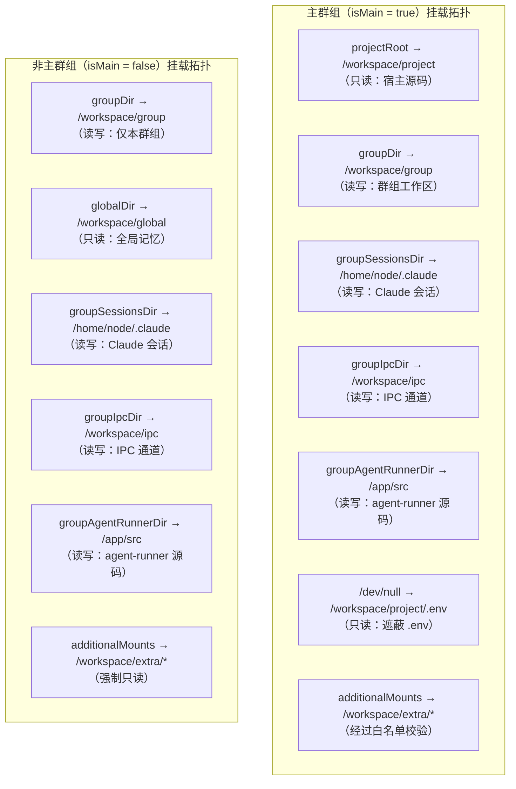
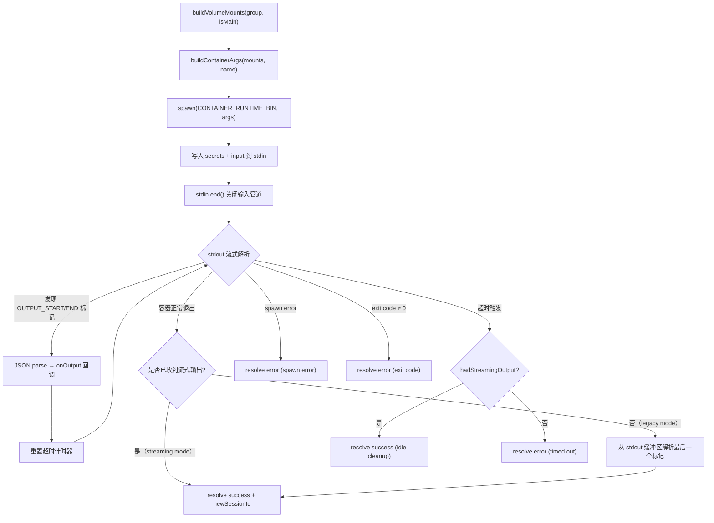
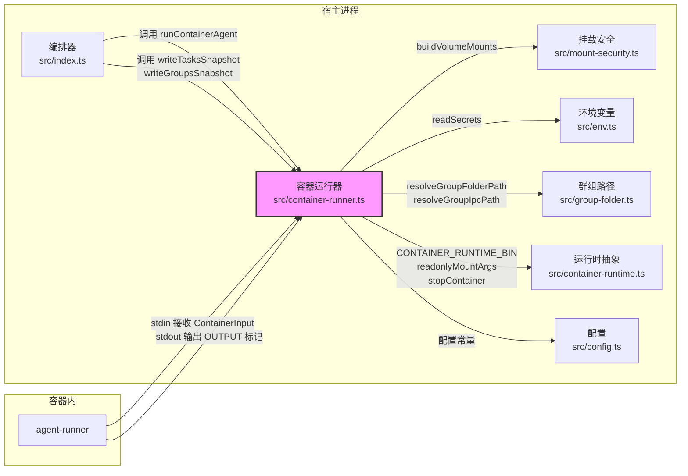

**容器运行器**是 NanoClaw 主进程与容器化智能体之间的唯一桥梁。它负责构建卷挂载策略、注入秘密凭据、管理容器的完整生命周期（启动 → 通信 → 超时回收），并将容器的流式输出解析为结构化结果。理解这个模块，就理解了 NanoClaw "宿主编排 + 容器隔离"架构的核心实现。

Sources: [container-runner.ts](src/container-runner.ts#L1-L31)

## 数据契约：ContainerInput 与 ContainerOutput

容器运行器通过两个精确定义的接口与容器内 agent-runner 进行通信。`ContainerInput` 是宿主向容器传递的输入载荷，包含提示词、会话 ID、群组标识、是否主群组等上下文信息。`ContainerOutput` 是容器返回的结构化结果，包含执行状态、智能体响应文本和可选的新会话 ID。这两个接口通过 **stdin/stdout 管道** 传输——宿主将 `ContainerInput` 序列化为 JSON 写入容器的 stdin，agent-runner 在容器内解析、执行后，通过 stdout 输出被哨兵标记（`---NANOCLAW_OUTPUT_START---` / `---NANOCLAW_OUTPUT_END---`）包裹的 `ContainerOutput` JSON。这种设计避免了文件系统的竞争条件，实现了真正的流式通信。

| 字段 | ContainerInput | ContainerOutput |
|------|---------------|-----------------|
| 核心数据 | `prompt`（提示词）、`sessionId`（会话 ID） | `status`（success/error）、`result`（响应文本） |
| 上下文 | `groupFolder`、`chatJid`、`isMain` | `newSessionId`（新会话 ID） |
| 控制信息 | `isScheduledTask`、`assistantName` | `error`（错误描述） |
| 敏感数据 | `secrets`（运行时注入，见下文） | — |

Sources: [container-runner.ts](src/container-runner.ts#L33-L49)

## 卷挂载架构：buildVolumeMounts 的分层策略

卷挂载是容器运行器的安全核心。`buildVolumeMounts` 函数根据群组是否为主群组（`isMain`）构建完全不同的挂载拓扑——这是 NanoClaw 权限隔离模型的物理基础。

**主群组与非主群组的挂载差异**体现了最小权限原则。主群组获得整个项目根目录的只读挂载（`/workspace/project`），使智能体能读取所有源码、配置和 CLAUDE.md 记忆文件，但通过将 `/dev/null` 覆盖挂载到 `/workspace/project/.env` 来防止智能体读取宿主的秘密凭据。非主群组仅获得自己的群组文件夹（`/workspace/group`）和全局记忆目录（`/workspace/global`，只读），完全隔离了项目源码。

Sources: [container-runner.ts](src/container-runner.ts#L51-L211)

### 共享挂载层：会话、IPC 与 Agent Runner

无论群组类型如何，以下三组挂载对所有容器一致提供。**第一**，每群组 Claude 会话目录（`data/sessions/{group}/.claude` → `/home/node/.claude`）：挂载前自动创建 `settings.json` 配置文件，启用 agent teams 实验特性、多目录 CLAUDE.md 加载和自动记忆功能；同时将 `container/skills/` 下的技能目录同步到 `.claude/skills/`，使容器内的 Claude Agent 可以使用浏览器等工具技能。**第二**，每群组 IPC 命名空间（`data/ipc/{group}` → `/workspace/ipc`）：独立创建 `messages/`、`tasks/`、`input/` 三个子目录，防止跨群组的 IPC 权限提升。**第三**，每群组 agent-runner 源码副本（`data/sessions/{group}/agent-runner-src` → `/app/src`）：首次运行时从 `container/agent-runner/src` 复制，允许各群组独立定制 agent-runner 行为而不影响其他群组。

Sources: [container-runner.ts](src/container-runner.ts#L114-L198)

### 额外挂载：白名单校验集成

群组的 `containerConfig.additionalMounts` 允许将宿主上的额外目录挂载到容器中，但这些挂载必须经过 [挂载安全模块](src/mount-security.ts) 的严格校验。`validateAdditionalMounts` 函数对外部白名单文件（`~/.config/nanoclaw/mount-allowlist.json`）进行校验，白名单文件本身**不会被挂载到任何容器中**，从而保证容器内的智能体无法篡改安全配置。所有通过校验的额外挂载统一映射到 `/workspace/extra/` 路径下。

Sources: [container-runner.ts](src/container-runner.ts#L200-L208), [mount-security.ts](src/mount-security.ts#L336-L385)

## 容器生命周期：runContainerAgent 的完整流程

`runContainerAgent` 是容器运行器的主入口，它编排了从容器创建到结果返回的完整生命周期。该函数接收群组信息、输入载荷、进程回调和一个可选的流式输出回调，返回一个 `Promise<ContainerOutput>`。

Sources: [container-runner.ts](src/container-runner.ts#L258-L637)

### 容器启动参数构建

`buildContainerArgs` 函数将挂载列表转化为具体的容器运行时命令行参数。核心参数包括：`-i`（交互模式，保持 stdin 开放）、`--rm`（容器退出后自动删除）、时区环境变量传递（`TZ=${TIMEZONE}`）、以及基于宿主 UID/GID 的用户映射。当宿主进程以非 root 且非 UID 1000（容器内 node 用户）身份运行时，通过 `--user` 参数映射宿主用户身份，确保挂载文件的读写权限一致，同时设置 `HOME=/home/node` 保持容器内 home 目录的正确性。

Sources: [container-runner.ts](src/container-runner.ts#L226-L256)

## 秘密凭据注入：stdin 管道而非文件挂载

容器运行器对秘密凭据的处理遵循一个严格的零磁盘原则。`readSecrets` 函数从 `.env` 文件中仅读取四个预定义的凭据键（`CLAUDE_CODE_OAUTH_TOKEN`、`ANTHROPIC_API_KEY`、`ANTHROPIC_BASE_URL`、`ANTHROPIC_AUTH_TOKEN`），这些值被附加到 `ContainerInput.secrets` 字段后通过 stdin 管道传递给容器。传递完成后立即执行 `delete input.secrets` 将其从输入对象中移除，确保后续的日志记录和错误报告中不会意外泄露凭据。这种设计与 `.env` 遮蔽挂载（主群组的 `/dev/null` → `/workspace/project/.env`）配合，形成了双重防护：文件系统层面无法读到 `.env`，stdin 管道传输后立即清除。

Sources: [container-runner.ts](src/container-runner.ts#L213-L318)

## 流式输出解析与哨兵标记协议

容器运行器支持两种输出模式：**流式模式**（`onOutput` 回调存在时）和**遗留模式**（无回调时从完整 stdout 缓冲区解析）。流式模式采用增量解析策略：维护一个 `parseBuffer` 字符串缓冲区，每当 stdout 收到新数据块时追加到缓冲区，然后循环搜索 `OUTPUT_START_MARKER` 和 `OUTPUT_END_MARKER` 标记对。找到完整的标记对后，提取中间的 JSON 文本并解析为 `ContainerOutput`。这种设计允许智能体在长时间运行中多次输出中间结果，每次输出都会触发 `onOutput` 回调并重置超时计时器，实现真正的流式响应。

| 特性 | 流式模式 | 遗留模式 |
|------|---------|---------|
| 触发条件 | `onOutput` 回调存在 | `onOutput` 未提供 |
| 解析时机 | stdout 数据到达时实时解析 | 容器退出后从缓冲区解析最后一个标记 |
| 多次输出 | 支持，每对标记触发一次回调 | 仅取最后一对标记 |
| 超时重置 | 每次输出后重置 | 不重置 |
| 回退策略 | 无效 JSON 记录警告并跳过 | 无标记时取 stdout 最后一行（向后兼容） |

Sources: [container-runner.ts](src/container-runner.ts#L319-L373)

## 超时管理：硬超时与活动检测

容器的超时管理是一个多层防护机制。**基础超时值**取群组自定义 `containerConfig.timeout` 与全局 `CONTAINER_TIMEOUT`（默认 30 分钟）的较大者，再与 `IDLE_TIMEOUT + 30秒` 比较取最大值——这确保了优雅关闭的宽限期始终大于空闲超时。当超时触发时，`killOnTimeout` 先执行 `docker stop`（15 秒宽限期），如果优雅停止失败则回退到 `SIGKILL` 强制终止。关键的行为分支是：如果超时时已有流式输出（`hadStreamingOutput = true`），则视为空闲清理而非错误，返回 `success` 状态；仅当超时时没有任何输出才返回 `error`。

Sources: [container-runner.ts](src/container-runner.ts#L398-L478)

## 日志系统与诊断

每次容器运行结束后，无论成功与否，运行器都会在群组的 `logs/` 目录下生成详细的运行日志。日志文件以 ISO 时间戳命名（`container-{timestamp}.log`），内容根据日志级别和退出状态分级：错误退出（code ≠ 0）或 debug/trace 级别时记录完整的输入载荷、容器参数、挂载列表、stdout 和 stderr；正常退出时仅记录输入摘要和挂载路径。stdout 和 stderr 都有 10MB 的上限（`CONTAINER_MAX_OUTPUT_SIZE`），超出部分会被截断并在日志中标注。

Sources: [container-runner.ts](src/container-runner.ts#L297-L537)

## 上下文快照：writeTasksSnapshot 与 writeGroupsSnapshot

除了主运行循环，容器运行器还导出两个快照写入函数，用于向容器提供运行时上下文。`writeTasksSnapshot` 将当前任务列表写入群组 IPC 目录的 `current_tasks.json`——主群组看到所有任务，非主群组仅看到自己的任务。`writeGroupsSnapshot` 将可用群组信息写入 `available_groups.json`——仅主群组能看到所有群组（用于群组激活功能），非主群组看到空列表。这些快照在 [编排器](12-bian-pai-qi-src-index-ts-zhuang-tai-guan-li-xiao-xi-xun-huan-yu-zhi-neng-ti-diao-du) 的消息循环中被调用，确保容器内的 agent-runner 始终能读取到最新的上下文信息。

Sources: [container-runner.ts](src/container-runner.ts#L640-L702)

## 容器命名与孤儿回收

容器命名遵循 `nanoclaw-{safeGroupFolder}-{timestamp}` 的格式，其中群组文件夹名经过正则过滤（仅保留 `a-zA-Z0-9-`）确保容器名称的合法性。每次主进程启动时，[容器运行时抽象层](src/container-runtime.ts) 的 `cleanupOrphans` 函数会扫描所有以 `nanoclaw-` 开头的运行中容器并逐一停止，防止上次运行遗留的容器持续消耗资源。`stopContainer` 函数生成 `docker stop` 命令，`ensureContainerRuntimeRunning` 则通过 `docker info` 探测运行时可用性。

Sources: [container-runtime.ts](src/container-runtime.ts#L9-L87), [container-runner.ts](src/container-runner.ts#L270-L271)

## 容器运行器与上下游模块的关系

容器运行器在模块依赖图中处于中心枢纽位置：向上为 [编排器](12-bian-pai-qi-src-index-ts-zhuang-tai-guan-li-xiao-xi-xun-huan-yu-zhi-neng-ti-diao-du) 提供容器执行能力，向下协调挂载安全、路径解析、运行时抽象和配置管理等基础设施。在理解了容器的生命周期管理后，下一步建议阅读 [群组队列（src/group-queue.ts）：并发控制与任务排队机制](14-qun-zu-dui-lie-src-group-queue-ts-bing-fa-kong-zhi-yu-ren-wu-pai-dui-ji-zhi) 了解多个容器如何被并发调度，以及 [IPC 通信（src/ipc.ts）：基于文件的进程间通信与权限校验](15-ipc-tong-xin-src-ipc-ts-ji-yu-wen-jian-de-jin-cheng-jian-tong-xin-yu-quan-xian-xiao-yan) 了解容器内 agent-runner 如何通过 IPC 通道与宿主进行双向通信。