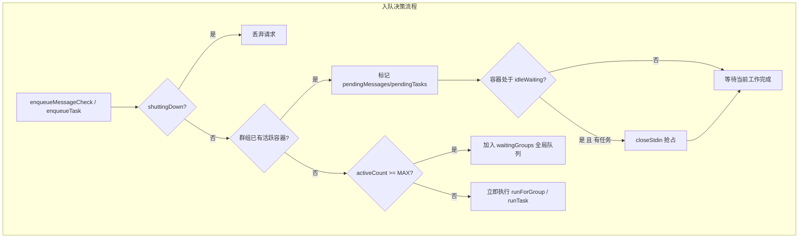
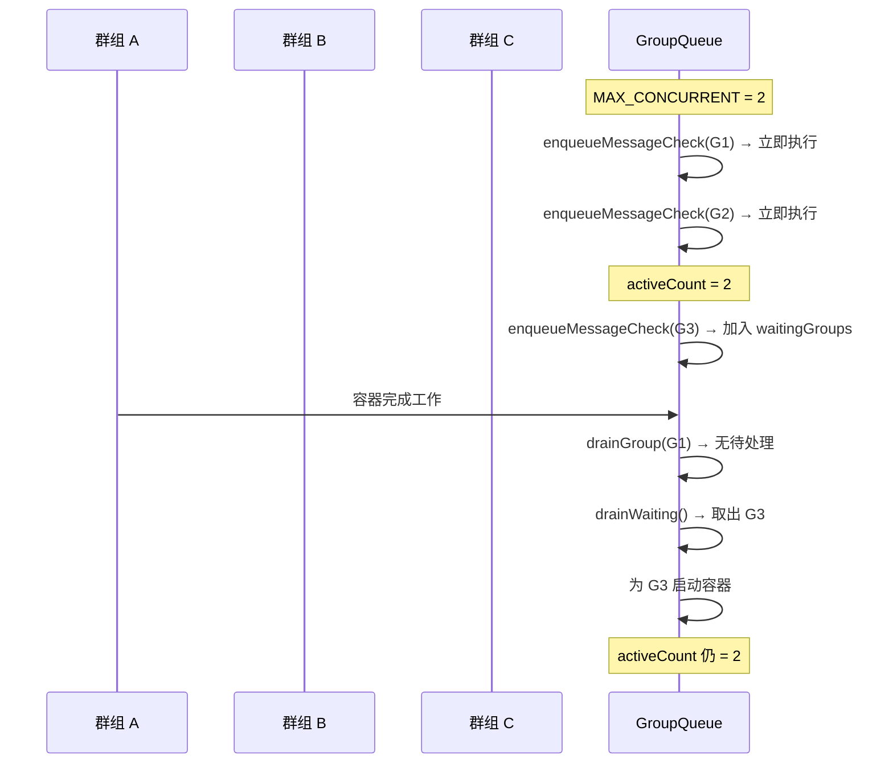
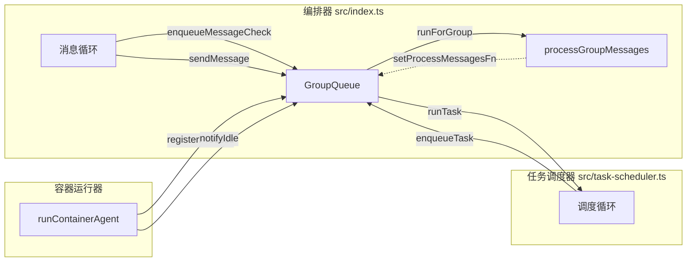

`GroupQueue` 是 NanoClaw 编排器的核心调度枢纽，负责管理所有群组的容器启动请求——无论这些请求来自即时消息处理还是定时任务执行。它实现了一个**双层并发控制**模型：在群组维度上保证同一群组任意时刻最多运行一个容器，在全局维度上限制同时活跃的容器总数不超过 `MAX_CONCURRENT_CONTAINERS`（默认 5）。当任一层级达到上限时，后续请求进入排队队列，待资源释放后按优先级顺序调度。这种设计确保了系统资源不会因过多并发容器而耗尽，同时保证每个群组的消息处理和任务执行不会互相冲突。

Sources: [group-queue.ts](src/group-queue.ts#L1-L36), [config.ts](src/config.ts#L52-L55)

## 核心数据结构：GroupState 与全局状态

`GroupQueue` 使用一个 `Map<string, GroupState>` 来追踪每个群组的运行状态。每个 `GroupState` 实例包含以下关键字段：

| 字段 | 类型 | 职责 |
|------|------|------|
| `active` | `boolean` | 当前群组是否有容器正在运行 |
| `idleWaiting` | `boolean` | 容器是否处于空闲等待状态（等待 IPC 输入） |
| `isTaskContainer` | `boolean` | 当前容器是否由定时任务创建（影响消息投递策略） |
| `runningTaskId` | `string \| null` | 当前正在执行的任务 ID（用于去重） |
| `pendingMessages` | `boolean` | 是否有待处理的消息 |
| `pendingTasks` | `QueuedTask[]` | 待执行任务队列 |
| `process` | `ChildProcess \| null` | 关联的子进程引用 |
| `containerName` | `string \| null` | 容器名称 |
| `groupFolder` | `string \| null` | 群组文件夹路径 |
| `retryCount` | `number` | 当前重试次数 |

全局层面还有三个控制变量：`activeCount` 记录当前活跃容器总数，`waitingGroups` 是一个 FIFO 数组用于存储等待并发槽位的群组，`shuttingDown` 标记系统是否正在关闭。`getGroup()` 方法采用懒初始化策略——首次访问某个群组 JID 时自动创建默认状态的 `GroupState` 实例。

Sources: [group-queue.ts](src/group-queue.ts#L8-L56)

## 入队机制：消息与任务的分流

### 消息入队（enqueueMessageCheck）

当消息循环检测到某个群组有新消息时，调用 `enqueueMessageCheck(groupJid)` 进入调度流程。该方法执行三级判断：

1. **关闭检查**：若 `shuttingDown` 为 true，直接丢弃请求
2. **群组级排队**：若该群组已有活跃容器（`state.active === true`），设置 `pendingMessages = true` 并返回——消息将在容器完成当前工作后被处理
3. **全局级排队**：若 `activeCount >= MAX_CONCURRENT_CONTAINERS`，将群组 JID 加入 `waitingGroups` 数组并标记 `pendingMessages = true`
4. **立即执行**：通过 `runForGroup()` 启动新容器处理消息

Sources: [group-queue.ts](src/group-queue.ts#L62-L88)

### 任务入队（enqueueTask）

定时任务调度器通过 `enqueueTask(groupJid, taskId, fn)` 提交任务。相比消息入队，它多了一个**去重机制**：在入队前检查 `runningTaskId` 和 `pendingTasks` 数组中是否已存在相同 `taskId`，防止调度器轮询时重复提交同一个任务（这是 [Issue #138](src/group-queue.test.ts#L246) 修复的核心问题）。任务入队还引入了**空闲抢占**逻辑：当容器处于 `idleWaiting` 状态且有新任务待执行时，立即调用 `closeStdin()` 终止空闲容器，为任务腾出资源。

Sources: [group-queue.ts](src/group-queue.ts#L90-L130)

Sources: [group-queue.ts](src/group-queue.ts#L62-L130)

## 优先级调度：任务优先于消息

`drainGroup()` 是容器完成工作后的核心回调，负责清理当前群组状态并决定下一步调度。它严格执行**任务优先于消息**的调度策略：

1. **优先执行待处理任务**：`pendingTasks` 数组中的任务按 FIFO 顺序取出执行
2. **其次处理待处理消息**：只有无待处理任务时，才会处理 `pendingMessages`
3. **最后释放全局槽位**：若当前群组无待处理工作，调用 `drainWaiting()` 为全局等待队列中的群组分配资源

这个优先级设计的理由很明确：**消息可以从 SQLite 数据库重新拉取，但定时任务是单次执行的机会**——如果错过了执行窗口，需要等到下一次调度周期才能重试。因此任务总是被赋予更高的调度优先级。

Sources: [group-queue.ts](src/group-queue.ts#L286-L316)

## 全局等待队列（drainWaiting）

`drainWaiting()` 管理跨群组的资源分配。当某个群组释放了全局并发槽位后，该方法从 `waitingGroups` FIFO 队列头部取出等待中的群组，检查其是否有待处理的工作（同样遵循任务优先于消息的原则），若有则立即启动执行。循环持续到 `waitingGroups` 为空或全局并发上限再次达到为止。这保证了在系统高负载时，群组按请求到达的顺序公平获得处理机会。

Sources: [group-queue.ts](src/group-queue.ts#L318-L345)

Sources: [group-queue.ts](src/group-queue.ts#L286-L345)

## 空闲抢占机制（Idle Preemption）

容器在完成智能体响应后不会立即销毁，而是进入 **idle-waiting** 状态，等待用户可能的后续消息（通过 IPC 文件传递）。`notifyIdle()` 方法标记容器进入此状态。但这个等待不是无限的——如果此时有定时任务入队（`enqueueTask` 检测到 `idleWaiting === true` 且有 `pendingTasks`），系统会立即通过 `closeStdin()` 写入 `_close` 哨兵文件来抢占空闲容器。

抢占机制的关键细节在于 `sendMessage()` 会**重置** `idleWaiting` 标志：当新消息通过 IPC 管道发送给容器后，容器从空闲状态回到工作状态，此时即使有任务入队也不会触发抢占。这避免了在智能体正在处理消息时强行中断它。

Sources: [group-queue.ts](src/group-queue.ts#L148-L178)

## IPC 消息投递与关闭哨兵

`sendMessage()` 和 `closeStdin()` 是 `GroupQueue` 向运行中容器传递信号的两个方法：

| 方法 | 行为 | 使用场景 |
|------|------|----------|
| `sendMessage()` | 向 `{DATA_DIR}/ipc/{groupFolder}/input/` 写入 JSON 文件（原子写入：先写 `.tmp` 再 `rename`） | 消息循环发现有活跃容器时，将新消息追加给正在运行的智能体 |
| `closeStdin()` | 向同一目录写入 `_close` 空文件 | 空闲超时、任务抢占或系统关闭时通知容器终止 |

`sendMessage()` 有一个重要限制：**任务容器（`isTaskContainer === true`）不接受消息投递**。这是因为定时任务容器是单轮执行模式，不支持用户消息追加。当任务容器正在运行时，该群组的新消息会被排队等待下一个处理周期。

Sources: [group-queue.ts](src/group-queue.ts#L160-L194)

## 重试与指数退避

当 `processMessagesFn` 返回 `false` 或抛出异常时，`scheduleRetry()` 启动指数退避重试机制：

| 重试次数 | 延迟时间 | 计算公式 |
|----------|----------|----------|
| 第 1 次 | 5 秒 | `5000 × 2^0` |
| 第 2 次 | 10 秒 | `5000 × 2^1` |
| 第 3 次 | 20 秒 | `5000 × 2^2` |
| 第 4 次 | 40 秒 | `5000 × 2^3` |
| 第 5 次 | 80 秒 | `5000 × 2^4` |
| 超过 5 次 | 放弃重试 | 重置 `retryCount`，等待下次消息触发 |

每次 `processMessagesFn` 成功返回 `true` 时，`retryCount` 重置为 0。超过最大重试次数后，系统不会永远阻塞——它会放弃当前批次消息，等待该群组的下一条消息自然触发新一轮处理。

Sources: [group-queue.ts](src/group-queue.ts#L263-L284)

## 优雅关闭（shutdown）

`shutdown()` 方法的行为值得特别关注：它**不主动杀死任何运行中的容器**。`shuttingDown` 标志仅阻止新的入队请求，已运行的容器通过 `--rm` Docker 标志或自身的超时机制自然退出。这个设计是有意为之——在 WhatsApp 等渠道的自动重连场景中，编排器进程可能会因网络断开而重启，此时杀死正在工作的智能体容器会造成数据丢失。通过分离关闭，系统获得了更好的容错性。

Sources: [group-queue.ts](src/group-queue.ts#L347-L365)

## 与其他模块的集成

`GroupQueue` 在系统中的位置是消息循环、任务调度器和容器运行器之间的协调中枢：

- **编排器**（[src/index.ts](src/index.ts#L66)）在启动时创建唯一实例，通过 `setProcessMessagesFn` 注入 `processGroupMessages` 回调，在消息循环中调用 `enqueueMessageCheck` 和 `sendMessage`
- **任务调度器**（[src/task-scheduler.ts](src/task-scheduler.ts#L19)）通过依赖注入接收 `GroupQueue` 实例，在每个轮询周期中对到期任务调用 `enqueueTask`
- **容器运行器**（[src/container-runner.ts](src/container-runner.ts)）的输出回调通过 `queue.notifyIdle()` 和 `queue.registerProcess()` 与队列交互

Sources: [index.ts](src/index.ts#L66), [task-scheduler.ts](src/task-scheduler.ts#L19), [task-scheduler.ts](src/task-scheduler.ts#L264)

## 设计决策总结

| 设计点 | 决策 | 理由 |
|--------|------|------|
| 双层并发控制 | 群组级 + 全局级 | 避免同一群组容器冲突，同时限制系统资源消耗 |
| 任务优先于消息 | `drainGroup` 中先检查 `pendingTasks` | 消息可从 DB 重拉，任务错过窗口则延迟整轮 |
| 运行中任务去重 | 检查 `runningTaskId` 和 `pendingTasks` | 防止调度器轮询重复提交（Issue #138） |
| 容器非强制关闭 | `shutdown` 不 kill 进程 | 适应渠道自动重连场景，保护正在工作的智能体 |
| 任务容器拒绝消息 | `isTaskContainer` 时 `sendMessage` 返回 false | 任务容器是单轮执行，不支持消息追加 |
| 原子文件写入 | `.tmp` → `rename` 模式 | 防止 IPC 读取方读到不完整的 JSON |

Sources: [group-queue.ts](src/group-queue.ts#L1-L366)

## 延伸阅读

- 了解群组队列在整体消息流转中的位置：[消息流转全链路：从渠道到智能体响应](10-xiao-xi-liu-zhuan-quan-lian-lu-cong-qu-dao-dao-zhi-neng-ti-xiang-ying)
- 了解容器如何被启动和管理：[容器运行器（src/container-runner.ts）：容器生命周期与卷挂载](13-rong-qi-yun-xing-qi-src-container-runner-ts-rong-qi-sheng-ming-zhou-qi-yu-juan-gua-zai)
- 了解任务调度器如何使用 `enqueueTask`：[任务调度器（src/task-scheduler.ts）：Cron、间隔与一次性任务](18-ren-wu-diao-du-qi-src-task-scheduler-ts-cron-jian-ge-yu-ci-xing-ren-wu)
- 了解容器内的 IPC 消息接收机制：[IPC 通信（src/ipc.ts）：基于文件的进程间通信与权限校验](15-ipc-tong-xin-src-ipc-ts-ji-yu-wen-jian-de-jin-cheng-jian-tong-xin-yu-quan-xian-xiao-yan)