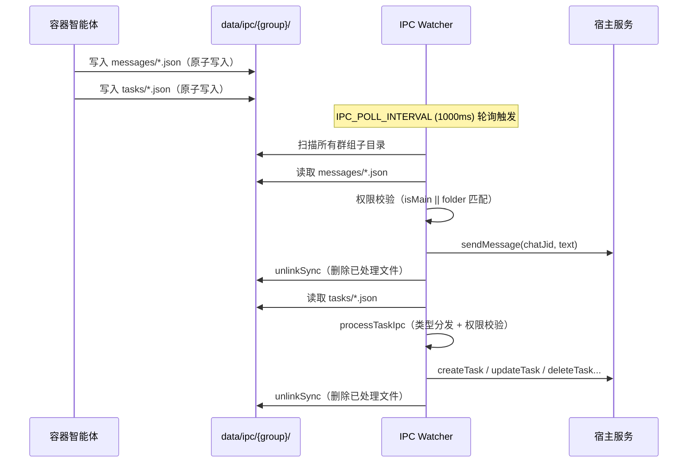
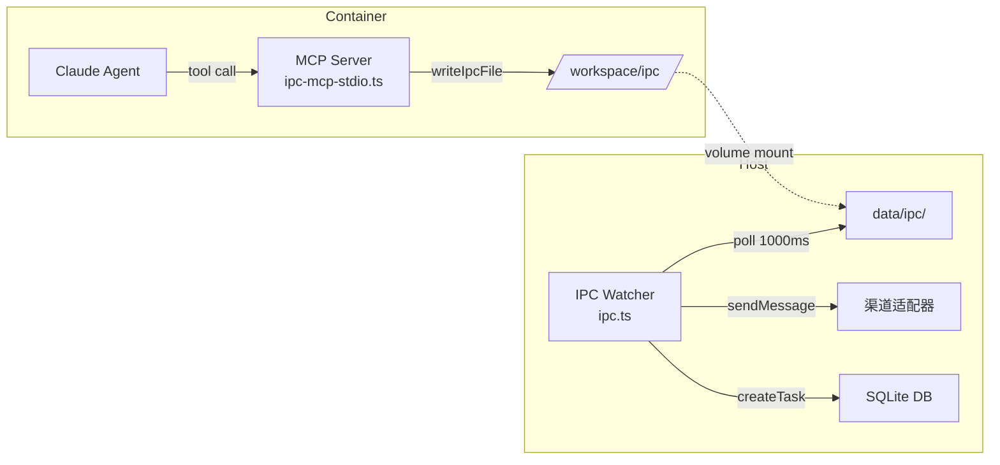
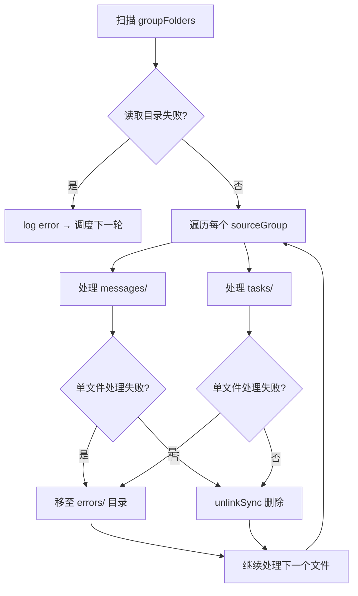

NanoClaw 的架构核心是一个根本性的隔离约束：**智能体运行在容器沙箱内，编排器（host）运行在宿主机上**。两者之间没有共享内存、没有网络端口、没有 Unix Socket——唯一的通信桥梁是文件系统上的 JSON 文件。`src/ipc.ts` 正是这一桥梁的 host 端实现，它通过轮询机制扫描每个群组的 IPC 目录，读取容器智能体写入的消息和任务请求，并在执行前完成权限校验。

这种设计的选择并非偶然：容器运行时（Docker / Apple Container）原生支持卷挂载（volume mount），文件系统的读写语义天然具备原子性保证（通过 temp + rename），且无需在容器网络配置上引入额外复杂度。代价是延迟——默认轮询间隔为 1 秒（`IPC_POLL_INTERVAL`）——但在聊天助手的场景下，这个延迟完全可以接受。

Sources: [src/ipc.ts](src/ipc.ts#L1-L154), [src/config.ts](src/config.ts#L50-L50)

## 目录结构与身份模型

IPC 通信的基础是**按群组隔离的目录命名空间**。每个群组在 `data/ipc/` 下拥有独立的子目录，目录名即群组的 `folder` 标识符。这种设计将"身份"绑定在文件系统路径上——容器无法伪造自己的来源，因为 `host` 端通过目录名直接确定消息的发送者。

```
data/ipc/
├── {group-folder}/              # 每个群组独立的 IPC 命名空间
│   ├── messages/                # 容器写入的出站消息（JSON 文件）
│   ├── tasks/                   # 容器写入的任务操作（JSON 文件）
│   ├── input/                   # Host 写入容器的输入文件
│   ├── current_tasks.json       # Host 写入的任务快照（只读）
│   └── available_groups.json    # Host 写入的群组快照（只读）
├── errors/                      # 处理失败的 IPC 文件被移至此处
```

**写入方向的对称性**值得注意：容器通过 `messages/` 和 `tasks/` 向 `host` 发起请求，而 `host` 通过 `current_tasks.json` 和 `available_groups.json` 向容器提供只读状态。`input/` 目录用于 `host` 向容器传递上下文信息。这种单向文件流的设计简化了并发问题——每个方向只有一个写入者。

`host` 端在启动容器时通过 `buildVolumeMounts` 将群组的 IPC 目录挂载到容器内的 `/workspace/ipc` 路径。路径解析由 `resolveGroupIpcPath` 完成，它先校验 `folder` 名称的合法性（正则 `/^[A-Za-z0-9][A-Za-z0-9_-]{0,63}$/`，禁止路径遍历和保留字），再拼接为 `data/ipc/{folder}`，最后验证解析后的路径没有逃逸出基础目录。

Sources: [src/group-folder.ts](src/group-folder.ts#L38-L44), [src/container-runner.ts](src/container-runner.ts#L164-L174), [src/group-folder.ts](src/group-folder.ts#L5-L16)

## 轮询机制与文件处理流程

`startIpcWatcher` 是整个 IPC 子系统的入口。它建立一个自循环的异步处理链：每次执行完毕后通过 `setTimeout(processIpcFiles, IPC_POLL_INTERVAL)` 调度下一次轮询，而不是使用 `setInterval`——这保证了上一轮处理完全结束后才开始下一轮，避免并发竞态。



每轮轮询的处理逻辑分为两个阶段：

**消息处理**（messages 目录）：读取所有 `.json` 文件，解析后检查 `type === 'message'` 且包含 `chatJid` 和 `text` 字段。通过权限校验后调用 `deps.sendMessage` 发送消息。无论成功或失败，文件都会被删除（`fs.unlinkSync`），处理失败的文件会被移至 `data/ipc/errors/` 目录并以 `{sourceGroup}-{filename}` 格式重命名，方便事后排查。

**任务处理**（tasks 目录）：读取 `.json` 文件后调用 `processTaskIpc`，该函数根据 `type` 字段分发到不同的处理逻辑，每个分支都包含独立的权限校验。错误处理与消息处理一致。

Sources: [src/ipc.ts](src/ipc.ts#L29-L154)

## 权限模型：主群组与普通群组的二态授权

IPC 的权限校验基于一个二元模型：**主群组（isMain = true）拥有全局权限，普通群组仅能操作自身资源**。`isMain` 标志不是从 IPC 文件内容中读取的（那会被容器伪造），而是 `host` 端从 `registeredGroups` 中查询得到——这是一个关键的安全设计决策。

具体来说，在每轮轮询开始时，`processIpcFiles` 先遍历所有已注册群组，构建一个 `folderIsMain` 映射表。然后对每个 IPC 目录（其名称即 `sourceGroup`），查表得到对应的 `isMain` 状态：

| 操作类型 | 主群组（isMain=true） | 普通群组（isMain=false） |
|---|---|---|
| 发送消息 | 可发送至任意 chatJid | 仅能发送至自身 folder 对应的 chatJid |
| 创建任务（schedule_task） | 可为任意群组创建任务 | 仅能为自身创建任务 |
| 暂停任务（pause_task） | 可暂停任意任务 | 仅能暂停自身 folder 下的任务 |
| 恢复任务（resume_task） | 可恢复任意任务 | 仅能恢复自身 folder 下的任务 |
| 取消任务（cancel_task） | 可取消任意任务 | 仅能取消自身 folder 下的任务 |
| 更新任务（update_task） | 可更新任意任务 | 仅能更新自身 folder 下的任务 |
| 刷新群组（refresh_groups） | ✅ 允许 | ❌ 拒绝 |
| 注册群组（register_group） | ✅ 允许（含安全校验） | ❌ 拒绝 |

权限校验的核心代码模式高度一致——对于任务操作，统一使用 `isMain || task.group_folder === sourceGroup` 的判断；对于消息操作，使用 `isMain || (targetGroup && targetGroup.folder === sourceGroup)`。这意味着权限检查不依赖 IPC 文件中的任何字段，完全由 `host` 端基于目录名和注册信息独立判定。

Sources: [src/ipc.ts](src/ipc.ts#L53-L93), [src/ipc.ts](src/ipc.ts#L276-L328), [src/types.ts](src/types.ts#L35-L43)

## IPC 任务类型详解

`processTaskIpc` 函数通过 `switch (data.type)` 分发到 7 种操作类型，每种都有独立的参数校验和权限检查。

### schedule_task — 创建计划任务

这是最复杂的操作类型。它需要验证目标群组存在、权限通过、调度表达式合法，然后计算 `next_run` 时间并写入数据库。支持三种调度模式：

- **cron**：使用 `cron-parser` 解析标准 cron 表达式，结合 `TIMEZONE` 配置计算下次运行时间
- **interval**：解析毫秒整数值（必须 > 0），`next_run = now + interval`
- **once**：解析 ISO 时间戳，直接作为 `next_run`

`context_mode` 参数控制任务执行时的上下文范围：`group` 模式继承群组会话历史，`isolated` 模式在全新会话中运行。非法值默认回退为 `isolated`。

Sources: [src/ipc.ts](src/ipc.ts#L182-L274)

### pause_task / resume_task / cancel_task — 任务生命周期控制

这三个操作共享相同的权限模式：查询任务是否存在，检查 `isMain || task.group_folder === sourceGroup`，然后更新状态或删除记录。其中 `cancel_task` 使用 `deleteTask` 从数据库中永久移除任务记录。

Sources: [src/ipc.ts](src/ipc.ts#L276-L328)

### update_task — 更新任务参数

允许修改 `prompt`、`schedule_type` 和 `schedule_value`，采用部分更新策略——仅更新传入的字段。当调度参数变更时，会重新计算 `next_run`。如果新的 cron 表达式无效，操作会中止（`break`），不会写入数据库。

Sources: [src/ipc.ts](src/ipc.ts#L330-L392)

### refresh_groups — 刷新群组元数据

仅主群组可调用。触发 `deps.syncGroups(true)` 强制同步所有渠道的群组信息，随后立即写入更新后的群组快照。这允许主群组的智能体在注册新群组后立刻获得最新的群组列表。

Sources: [src/ipc.ts](src/ipc.ts#L394-L416)

### register_group — 注册新群组

仅主群组可调用，且额外要求 `jid`、`name`、`folder`、`trigger` 四个字段全部存在。`folder` 名称必须通过 `isValidGroupFolder` 校验——正则匹配、禁止路径遍历、排除保留字 `global`。这里有一个**纵深防御**的设计注释：`register_group` 的 IPC 处理中**刻意不设置 `isMain` 字段**，确保容器智能体无法通过 IPC 将自己注册为主群组。

Sources: [src/ipc.ts](src/ipc.ts#L418-L450), [src/group-folder.ts](src/group-folder.ts#L5-L16)

## 依赖注入接口（IpcDeps）

`startIpcWatcher` 和 `processTaskIpc` 不直接依赖具体实现，而是通过 `IpcDeps` 接口注入所需能力。这种设计使得测试可以完全解耦——`ipc-auth.test.ts` 中的所有测试用例都使用 mock 的 `deps` 对象，无需启动真实的消息渠道或文件系统。

```typescript
export interface IpcDeps {
  sendMessage: (jid: string, text: string) => Promise<void>;
  registeredGroups: () => Record<string, RegisteredGroup>;
  registerGroup: (jid: string, group: RegisteredGroup) => void;
  syncGroups: (force: boolean) => Promise<void>;
  getAvailableGroups: () => AvailableGroup[];
  writeGroupsSnapshot: (groupFolder, isMain, availableGroups, registeredJids) => void;
}
```

`sendMessage` 对应渠道适配器的发送能力（如 WhatsApp / Telegram 的 SDK 调用），`registeredGroups` 返回当前所有已注册群组的映射表，`syncGroups` 触发渠道层的群组元数据同步。`getAvailableGroups` 和 `writeGroupsSnapshot` 用于在 `refresh_groups` 操作后向容器的 IPC 目录写入最新的群组列表。

Sources: [src/ipc.ts](src/ipc.ts#L13-L25)

## 容器端写入：MCP 工具与原子写入

容器内的智能体通过 `ipc-mcp-stdio.ts` 暴露的 MCP（Model Context Protocol）工具与 IPC 系统交互。这个 MCP Server 以 stdio 传输模式运行，作为 Claude Agent SDK 的工具提供者，将自然语言工具调用转化为文件写入操作。



`writeIpcFile` 是容器端的原子写入原语：先写入 `.tmp` 临时文件，再通过 `fs.renameSync` 原子重命名为目标文件名。这保证了 host 端的 IPC Watcher 永远不会读到半写状态的文件——`rename` 在 POSIX 文件系统上是原子操作。

MCP Server 提供的工具与 `processTaskIpc` 的操作类型一一对应：

| MCP 工具 | 写入的 IPC type | 关键参数 |
|---|---|---|
| `send_message` | `message` | text, sender |
| `schedule_task` | `schedule_task` | prompt, schedule_type, schedule_value, context_mode, target_group_jid |
| `list_tasks` | — | 读取 `current_tasks.json`，不写入 |
| `pause_task` | `pause_task` | task_id |
| `resume_task` | `resume_task` | task_id |
| `cancel_task` | `cancel_task` | task_id |
| `update_task` | `update_task` | task_id, prompt?, schedule_type?, schedule_value? |
| `register_group` | `register_group` | jid, name, folder, trigger |

值得注意的是 `list_tasks` 不走 IPC 文件写入——它直接读取 `host` 预先写入的 `current_tasks.json` 快照文件。主群组能看到所有任务，普通群组只能看到 `groupFolder` 匹配自身的任务。

Sources: [container/agent-runner/src/ipc-mcp-stdio.ts](container/agent-runner/src/ipc-mcp-stdio.ts#L23-L35), [container/agent-runner/src/ipc-mcp-stdio.ts](container/agent-runner/src/ipc-mcp-stdio.ts#L155-L191)

## 错误处理与防御机制

IPC 系统的错误处理遵循"永远不阻塞轮询"的原则。单个文件的处理异常不会中断整个轮询周期——外层 `try/catch` 捕获单个群组目录级别的错误，内层 `try/catch` 捕获单个文件级别的错误。处理失败的文件被移至 `data/ipc/errors/` 目录，以 `{sourceGroup}-{filename}` 格式保存，便于运维排查。



在安全防御方面，系统采用**多层纵深防御**策略：

1. **目录名即身份**：容器无法伪造自己的群组归属，因为 IPC 目录名由 host 端的 `resolveGroupIpcPath` 确定。
2. **权限不依赖文件内容**：`isMain` 标志从 host 端的注册表查询，不读取 IPC 文件中的字段。
3. **群组注册隔离**：`register_group` 处理中刻意不设置 `isMain` 字段，防止智能体自我提权。
4. **folder 名称校验**：`isValidGroupFolder` 使用严格正则，禁止 `..`、`/`、`\` 等路径遍历字符，排除 `global` 保留字。
5. **路径逃逸检查**：`ensureWithinBase` 确保解析后的路径不超出基础目录范围。

Sources: [src/ipc.ts](src/ipc.ts#L96-L108), [src/ipc.ts](src/ipc.ts#L435-L436), [src/group-folder.ts](src/group-folder.ts#L24-L29)

## 延伸阅读

本文档聚焦于 IPC 的 host 端轮询机制与权限校验。要完整理解整个通信链路，建议按以下顺序阅读：

- **[Agent Runner（container/agent-runner）：Claude Agent SDK 集成、IPC 轮询与会话管理](20-agent-runner-container-agent-runner-claude-agent-sdk-ji-cheng-ipc-lun-xun-yu-hui-hua-guan-li)** — 了解容器端如何通过 MCP Server 暴露 IPC 工具给 Claude Agent
- **[IPC 授权模型：主群组与非主群组的权限差异](24-ipc-shou-quan-mo-xing-zhu-qun-zu-yu-fei-zhu-qun-zu-de-quan-xian-chai-yi)** — 深入探讨权限设计的安全考量与测试覆盖
- **[容器运行器（src/container-runner.ts）：容器生命周期与卷挂载](13-rong-qi-yun-xing-qi-src-container-runner-ts-rong-qi-sheng-ming-zhou-qi-yu-juan-gua-zai)** — 理解 IPC 目录如何通过卷挂载注入容器
- **[任务调度器（src/task-scheduler.ts）：Cron、间隔与一次性任务](18-ren-wu-diao-du-qi-src-task-scheduler-ts-cron-jian-ge-yu-ci-xing-ren-wu)** — 了解 IPC 创建的任务如何被调度执行