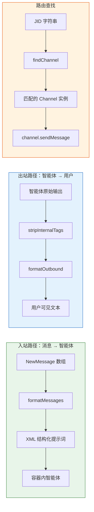

`src/router.ts` 是 NanoClaw 消息管线中的**双向格式化枢纽**——它既负责将入站消息格式化为 XML 结构供容器内智能体消费，也负责在出站方向上剥离智能体的内部推理标签，确保用户只看到干净的回复内容。整个模块仅 53 行代码，导出五个职责清晰的函数：`escapeXml`、`formatMessages`、`stripInternalTags`、`formatOutbound`、`routeOutbound` 和 `findChannel`，覆盖了从原始消息到结构化提示词、从智能体原始输出到用户可见文本的完整转换链路。

Sources: [router.ts](src/router.ts#L1-L53)

## 模块架构总览

router.ts 承担了三条明确的数据转换路径，每条路径服务于消息流转的不同阶段。下方的 Mermaid 图展示了这些函数在整个消息管线中的位置与数据流向——你需要在阅读此图之前了解两个前提概念：**JID（Jabber ID）** 是各渠道中对聊天会话的唯一标识符（如 WhatsApp 的 `group@g.us`、`user@s.whatsapp.net`），而 **Channel** 是 [渠道注册表](11-qu-dao-zhu-ce-biao-zi-zhu-ce-gong-han-mo-shi-yu-qu-dao-jie-kou-she-ji) 中定义的渠道接口，提供 `ownsJid()`、`sendMessage()` 等方法。



Sources: [router.ts](src/router.ts#L1-L53)

## 入站格式化：从消息到 XML 提示词

### formatMessages 函数

`formatMessages` 是入站路径的核心函数，它接收两个参数——`NewMessage[]` 消息数组和 `timezone` 时区字符串——返回一段结构化的 XML 文本。这段 XML 会被直接写入容器挂载卷，供 [Agent Runner](20-agent-runner-container-agent-runner-claude-agent-sdk-ji-cheng-ipc-lun-xun-yu-hui-hua-guan-li) 读取并注入到 Claude 会话中。XML 格式的选择并非随意：结构化标记让智能体能精确区分消息边界、发送者身份和时间戳，而不会被自然语言的歧义干扰。

Sources: [router.ts](src/router.ts#L13-L25)

函数的输出结构如下：

```xml
<context timezone="America/New_York" />
<messages>
<message sender="Alice" time="Jan 1, 2024, 1:30 PM">hello</message>
<message sender="Bob" time="Jan 1, 2024, 2:00 PM">hey</message>
</messages>
```

每个 `<message>` 标签携带两个属性——`sender`（经过 XML 转义的发送者名称）和 `time`（通过 [formatLocalTime](src/timezone.ts#L5-L16) 转换为本地时间的人类可读时间戳）。顶部的 `<context>` 标签声明了时区信息，使智能体具备时间感知能力。值得关注的是，当传入空数组时，函数仍然会输出完整的 XML 骨架（`<context>` + 空 `<messages>`），这意味着即使没有待处理消息，智能体也能获得结构一致的上下文框架。时间转换依赖于 Node.js 内置的 `Intl.DateTimeFormat` API，使用 `'en-US'` locale 格式化为 `"Jan 1, 2024, 1:30 PM"` 这样的可读形式，完全不依赖外部时区库。

Sources: [router.ts](src/router.ts#L13-L25), [timezone.ts](src/timezone.ts#L5-L16), [formatting.test.ts](src/formatting.test.ts#L60-L124)

### escapeXml：XML 注入防护

`escapeXml` 是 `formatMessages` 的安全基石。它对四个 XML 特殊字符（`&`、`<`、`>`、`"`）执行逐一转义，确保消息内容中的任意文本——无论是发送者昵称还是消息正文——都无法破坏 XML 结构或注入恶意标签。转义顺序是关键的实现细节：`&` 必须最先被处理（否则后续转义产生的 `&amp;` 等序列会被二次转义）。函数对空字符串有明确的短路处理（直接返回 `''`），避免在消息内容为空时产生意外行为。

| 原始字符 | 转义结果 | 出现场景 |
|---------|---------|---------|
| `&` | `&amp;` | 短信缩写 "u & me"、HTML 粘贴内容 |
| `<` | `&lt;` | 数学比较、HTML 片段 |
| `>` | `&gt;` | 数学比较、引用标记 |
| `"` | `&quot;` | 昵称中的引号、对话引用 |

Sources: [router.ts](src/router.ts#L4-L11), [formatting.test.ts](src/formatting.test.ts#L26-L56)

## 出站格式化：从智能体输出到用户消息

### stripInternalTags 与内部推理标签

智能体（Claude）在生成回复时，可能会使用 `<internal>...</internal>` 标签包裹仅供自身推理的中间内容——类似于"思考过程"。这些内容不应暴露给终端用户。`stripInternalTags` 使用正则表达式 `/<internal>[\s\S]*?<\/internal>/g` 来移除所有此类标签块，其中 `[\s\S]*?` 的非贪婪匹配确保每个 `<internal>` 标签只匹配到最近的 `</internal>` 闭合标签，而 `g` 标志确保一段文本中的多个内部标签块都被清除。正则还通过 `[\s\S]`（而非 `.`）正确处理跨行内容，因为智能体的内部推理往往是多行的。

Sources: [router.ts](src/router.ts#L27-L29), [formatting.test.ts](src/formatting.test.ts#L166-L188)

### formatOutbound：最终的出站清洁器

`formatOutbound` 将 `stripInternalTags` 的输出再经过一次空内容检测：如果清理后结果为空字符串（即整段输出都是内部推理），函数返回 `''`，调用方据此**跳过发送**——避免向用户发送空白消息。这个设计决策在编排器 [index.ts](src/index.ts#L540-L547) 中体现为：调度器回调中先调用 `formatOutbound`，仅在结果非空时才调用 `channel.sendMessage()`。

Sources: [router.ts](src/router.ts#L31-L35), [formatting.test.ts](src/formatting.test.ts#L190-L204)

值得注意的一个实现差异是：在 `processGroupMessages` 的流式输出回调中（[index.ts](src/index.ts#L214-L219)），内部标签的剥离是通过**内联正则** `raw.replace(/<internal>[\s\S]*?<\/internal>/g, '').trim()` 直接完成的，而非调用 `formatOutbound`。这是因为在流式输出路径中，编排器需要同时处理结果为 `null` 的会话更新标记（非文本结果），所以采用了更灵活的内联处理。而 `formatOutbound` 则主要服务于任务调度器（[index.ts](src/index.ts#L540-L547)）等非流式出站路径。

Sources: [index.ts](src/index.ts#L214-L219), [router.ts](src/router.ts#L31-L35)

## 路由查找：JID 到 Channel 的映射

### findChannel 函数

`findChannel` 是 router.ts 中唯一的**路由决策函数**。给定一个 JID 字符串和一个 Channel 实例数组，它通过 `Array.find` 遍历所有已连接渠道，调用每个渠道的 `ownsJid(jid)` 方法来识别归属——`ownsJid` 的实现由各渠道自行定义，例如 WhatsApp 渠道会检查 JID 是否以 `@g.us` 或 `@s.whatsapp.net` 结尾。函数返回第一个匹配的 Channel 实例（或 `undefined`）。

Sources: [router.ts](src/router.ts#L47-L52)

这个函数在编排器中被**高频调用**，贯穿三个核心路径：

| 调用位置 | 用途 | 失败处理 |
|---------|------|---------|
| [processGroupMessages](src/index.ts#L147-L151) | 查找处理群组消息的渠道 | 跳过并记录警告 |
| [startMessageLoop](src/index.ts#L381-L385) | 消息循环中查找管道目标 | 跳过并记录警告 |
| [调度器/IPC sendMessage 回调](src/index.ts#L540-L554) | 将智能体输出发送回渠道 | 调度器跳过，IPC 抛出错误 |

在 IPC 路径（[index.ts](src/index.ts#L551-L554)）中，`findChannel` 未找到匹配时会直接抛出 `Error`——因为 IPC 消息来自容器内的智能体，如果连目标渠道都找不到，说明系统处于严重不一致状态，应该向上传播错误而非静默忽略。

Sources: [router.ts](src/router.ts#L47-L52), [index.ts](src/index.ts#L147-L151), [index.ts](src/index.ts#L381-L385), [index.ts](src/index.ts#L540-L554)

### routeOutbound：完整出站流水线

`routeOutbound` 将查找和发送合二为一——先通过 `ownsJid` + `isConnected()` 双重条件查找渠道，再直接调用 `channel.sendMessage()`。`isConnected()` 的额外检查是关键：某些渠道可能已注册但暂时断开（如 WhatsApp 的 WebSocket 断连），这个条件确保消息不会被发送到一个无效的连接上。当前该函数在主编排器中尚未被直接引用（编排器选择在调用处分别组合 `findChannel` + `formatOutbound` + `sendMessage`），但它作为独立的工具函数可供外部模块或未来扩展使用。

Sources: [router.ts](src/router.ts#L37-L45)

## 数据流全景：router 在消息管线中的位置

下方的序列图展示了 router.ts 各函数在一次完整的消息处理周期中的调用时序。从用户在渠道中发送触发消息，到智能体回复最终送达用户，router 在入站和出站两个方向各执行一次格式化转换。

```mermaid
sequenceDiagram
    participant User as 用户
    participant Channel as Channel 渠道
    participant Loop as startMessageLoop
    participant Router as router.ts
    participant Queue as GroupQueue
    participant Agent as 容器内智能体

    User->>Channel: 发送消息 "@Andy 帮我查天气"
    Channel->>Loop: onMessage → storeMessage
    Loop->>Router: findChannel(channels, jid)
    Router-->>Loop: WhatsApp Channel 实例
    Loop->>Router: formatMessages(messages, TIMEZONE)
    Note right of Router: escapeXml 转义 + formatLocalTime 时区转换
    Router-->>Loop: XML 结构化提示词
    Loop->>Queue: queue.sendMessage(jid, formatted)
    Queue->>Agent: 写入容器挂载卷

    Agent-->>Queue: 流式输出结果
    Note over Queue: 内联 stripInternalTags
    Queue->>Channel: channel.sendMessage(jid, text)
    Channel->>User: "北京今天晴，最高 28°C"
```

Sources: [router.ts](src/router.ts#L1-L53), [index.ts](src/index.ts#L143-L258), [index.ts](src/index.ts#L341-L439)

## 函数接口速查

| 函数 | 签名 | 职责 | 使用者 |
|------|------|------|--------|
| `escapeXml` | `(s: string) => string` | XML 特殊字符转义 | `formatMessages` 内部调用 |
| `formatMessages` | `(messages: NewMessage[], timezone: string) => string` | 消息数组 → XML 提示词 | 编排器入站路径、群组队列 |
| `stripInternalTags` | `(text: string) => string` | 移除 `<internal>` 标签块 | `formatOutbound` 内部调用 |
| `formatOutbound` | `(rawText: string) => string` | 清理智能体输出，空内容返回 `''` | 调度器 sendMessage 回调 |
| `findChannel` | `(channels: Channel[], jid: string) => Channel \| undefined` | JID → Channel 路由查找 | 编排器消息循环、IPC、调度器 |
| `routeOutbound` | `(channels: Channel[], jid: string, text: string) => Promise<void>` | 查找渠道并发送消息 | 工具函数（当前未在编排器中直接引用） |

Sources: [router.ts](src/router.ts#L1-L53)

## 设计哲学与扩展点

router.ts 的设计遵循了 **单一转换职责** 原则：每个函数只做一件事——转义、格式化、剥离、查找——组合而非堆叠。这种设计使得每个转换步骤都可以独立测试（项目的 `formatting.test.ts` 和 `routing.test.ts` 完整覆盖了所有边界情况），也使得编排器可以灵活选择组合方式——比如流式输出路径用内联剥离而非 `formatOutbound`，就是这种灵活性带来的实际收益。

对于想要扩展系统的开发者，有几个值得关注的扩展点：**新增渠道**时需要在渠道实现中正确编写 `ownsJid()` 方法，这是 `findChannel` 路由正确的核心前提（详见 [渠道注册表](11-qu-dao-zhu-ce-biao-zi-zhu-ce-gong-han-mo-shi-yu-qu-dao-jie-kou-she-ji)）；**修改消息格式**时，`formatMessages` 的 XML 结构变更需要同步考虑容器内 Agent Runner 的解析逻辑（详见 [Agent Runner](20-agent-runner-container-agent-runner-claude-agent-sdk-ji-cheng-ipc-lun-xun-yu-hui-hua-guan-li)）；**新增过滤标签**时，可以参照 `stripInternalTags` 的正则模式，添加新的标签类型支持。

Sources: [router.ts](src/router.ts#L1-L53)

---

**下一步阅读建议**：了解路由查找背后的渠道接口定义，请继续阅读 [渠道注册表：自注册工厂模式与渠道接口设计](11-qu-dao-zhu-ce-biao-zi-zhu-ce-gong-han-mo-shi-yu-qu-dao-jie-kou-she-ji)。要理解 `findChannel` 返回的渠道如何与容器编排协同工作，参见 [编排器（src/index.ts）：状态管理、消息循环与智能体调度](12-bian-pai-qi-src-index-ts-zhuang-tai-guan-li-xiao-xi-xun-huan-yu-zhi-neng-ti-diao-du)。