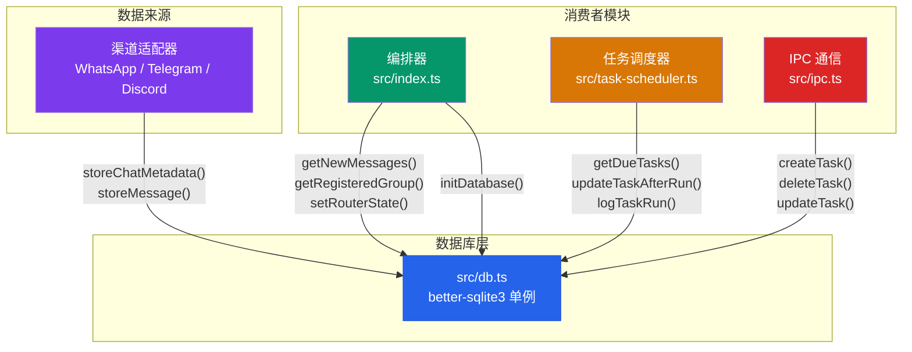

NanoClaw 采用 **better-sqlite3** 作为唯一持久化引擎，数据库文件位于 `store/messages.db`（由 [config.ts](src/config.ts#L36) 中 `STORE_DIR` 定义路径）。整个数据库层封装在单个模块 `src/db.ts` 中，以模块级单例 + 纯函数导出的形式对外暴露，不使用 ORM，所有 SQL 均为手写预处理语句（Prepared Statements）。这种设计选择使得数据库操作是**同步阻塞**的——better-sqlite3 的 API 天然同步，与 Node.js 事件循环配合时，短查询不会产生回调嵌套，代码可读性极高。对于 NanoClaw 的规模（单进程编排器，每秒消息量极低），同步 I/O 模型的吞吐完全足够，且消除了异步数据库驱动常见的连接池管理与事务嵌套复杂度。

Sources: [db.ts](src/db.ts#L1-L15), [config.ts](src/config.ts#L36-L38), [package.json](package.json#L22)

## 架构定位：数据库层在系统中的角色

下图展示了 `src/db.ts` 在 NanoClaw 系统中的数据消费关系——它是**唯一的写入端点**，同时也是所有核心模块的读取来源：



数据库模块从编排器 [`src/index.ts`](src/index.ts#L467) 的启动流程中通过 `initDatabase()` 初始化。初始化过程完成三件事：确保 `store/` 目录存在、打开/创建 SQLite 数据库文件、执行 Schema 创建与增量迁移。模块内维护一个**模块级变量** `let db: Database.Database` 作为全局唯一连接实例，所有导出函数都通过这个隐式闭包访问数据库，调用方无需传递连接对象。

Sources: [db.ts](src/db.ts#L144-L159), [index.ts](src/index.ts#L467)

## Schema 设计：六张表与一个特殊约定

数据库包含 **6 张业务表**，外加一个利用 `chats` 表存储的内部元数据约定。核心设计原则是**最小化敏感数据存储**——系统只对已注册群组存储完整消息内容，未注册群组仅保留元数据（JID、名称、最后活跃时间）。

### chats —— 聊天元数据表

| 列名 | 类型 | 约束 | 说明 |
|------|------|------|------|
| `jid` | TEXT | PRIMARY KEY | 聊天的 Jabber ID，跨渠道唯一标识 |
| `name` | TEXT | — | 聊天显示名称，首次同步时填充 |
| `last_message_time` | TEXT | — | ISO 8601 时间戳，用于排序和增量查询锚点 |
| `channel` | TEXT | — | 渠道标识：`whatsapp` / `discord` / `telegram` |
| `is_group` | INTEGER | DEFAULT 0 | 是否群组聊天（0=个人, 1=群组） |

此表同时承载一个**内部约定**：JID 为 `__group_sync__` 的特殊行用于记录群组元数据最后同步时间，由 `getLastGroupSync()` / `setLastGroupSync()` 读写。这种"在业务表中塞入控制行"的模式虽然不够优雅，但在单表键值存储场景下避免了额外的 DDL。

Sources: [db.ts](src/db.ts#L19-L25), [db.ts](src/db.ts#L241-L257)

### messages —— 消息内容表

| 列名 | 类型 | 约束 | 说明 |
|------|------|------|------|
| `id` | TEXT | PRIMARY KEY (复合) | 消息 ID |
| `chat_jid` | TEXT | PRIMARY KEY (复合), FK → chats.jid | 所属聊天 |
| `sender` | TEXT | — | 发送者 JID |
| `sender_name` | TEXT | — | 发送者显示名 |
| `content` | TEXT | — | 消息正文 |
| `timestamp` | TEXT | INDEXED | ISO 8601 时间戳，索引加速范围查询 |
| `is_from_me` | INTEGER | — | 是否为自己发送的消息 |
| `is_bot_message` | INTEGER | DEFAULT 0 | 是否为机器人回复（迁移新增列） |

复合主键 `(id, chat_jid)` 的设计反映了消息 ID 在不同聊天中可能重复的跨渠道现实。`INSERT OR REPLACE` 策略使得同 ID+chat_jid 的消息天然支持幂等写入。`idx_timestamp` 索引支撑 `getNewMessages()` 和 `getMessagesSince()` 的时间范围查询性能。

Sources: [db.ts](src/db.ts#L26-L39)

### scheduled_tasks —— 定时任务表

| 列名 | 类型 | 约束 | 说明 |
|------|------|------|------|
| `id` | TEXT | PRIMARY KEY | UUID 格式的任务 ID |
| `group_folder` | TEXT | NOT NULL | 所属群组的文件夹名（逻辑外键） |
| `chat_jid` | TEXT | NOT NULL | 关联聊天的 JID |
| `prompt` | TEXT | NOT NULL | 任务执行时的提示词 |
| `schedule_type` | TEXT | NOT NULL | 调度类型：`cron` / `interval` / `once` |
| `schedule_value` | TEXT | NOT NULL | 调度值（cron 表达式 / 毫秒间隔 / ISO 时间戳） |
| `context_mode` | TEXT | DEFAULT 'isolated' | 上下文模式：`isolated`（隔离）/ `group`（群组历史） |
| `next_run` | TEXT | INDEXED | 下次执行时间，`idx_next_run` 加速调度查询 |
| `last_run` | TEXT | — | 上次执行时间 |
| `last_result` | TEXT | — | 上次执行结果摘要 |
| `status` | TEXT | DEFAULT 'active', INDEXED | 任务状态：`active` / `paused` / `completed` |
| `created_at` | TEXT | NOT NULL | 创建时间 |

此表的索引设计直接服务于任务调度器的轮询模式：`idx_next_run` + `idx_status` 联合支撑 `getDueTasks()` 的高效查询——仅扫描 `status='active'` 且 `next_run <= now()` 的行。

Sources: [db.ts](src/db.ts#L40-L55)

### task_run_logs —— 任务执行日志表

| 列名 | 类型 | 约束 | 说明 |
|------|------|------|------|
| `id` | INTEGER | PRIMARY KEY AUTOINCREMENT | 自增主键 |
| `task_id` | TEXT | NOT NULL, FK → scheduled_tasks.id | 关联任务 |
| `run_at` | TEXT | NOT NULL | 执行开始时间 |
| `duration_ms` | INTEGER | NOT NULL | 执行耗时（毫秒） |
| `status` | TEXT | NOT NULL | 执行结果：`success` / `error` |
| `result` | TEXT | — | 执行输出摘要 |
| `error` | TEXT | — | 错误信息 |

复合索引 `idx_task_run_logs(task_id, run_at)` 支持按任务维度回溯执行历史。`deleteTask()` 在删除任务时会先清除其所有日志行以尊重外键约束。

Sources: [db.ts](src/db.ts#L56-L66), [db.ts](src/db.ts#L449-L453)

### router_state 与 sessions —— 键值存储表

`router_state` 和 `sessions` 是两张轻量级的键值表，结构完全一致：

| 表名 | 键列 | 值列 | 用途 |
|------|------|------|------|
| `router_state` | `key` (PK) | `value` | 路由器状态：`last_timestamp`（最后处理时间戳）、`last_agent_timestamp`（按群组的智能体时间戳 JSON） |
| `sessions` | `group_folder` (PK) | `session_id` | 群组与 Claude Agent 会话 ID 的映射，用于会话持久化与上下文恢复 |

这两张表的写入模式都是 `INSERT OR REPLACE`，天然幂等。`getAllSessions()` 返回 `Record<string, string>` 的扁平映射，供编排器在启动时一次性加载。

Sources: [db.ts](src/db.ts#L68-L75), [db.ts](src/db.ts#L499-L538)

### registered_groups —— 群组注册表

| 列名 | 类型 | 约束 | 说明 |
|------|------|------|------|
| `jid` | TEXT | PRIMARY KEY | 群组 JID |
| `name` | TEXT | NOT NULL | 群组名称 |
| `folder` | TEXT | NOT NULL, UNIQUE | 群组数据目录名，经 `isValidGroupFolder()` 校验 |
| `trigger_pattern` | TEXT | NOT NULL | 触发词模式（如 `@Andy`） |
| `added_at` | TEXT | NOT NULL | 注册时间 |
| `container_config` | TEXT | — | JSON 格式的容器配置（挂载、超时等） |
| `requires_trigger` | INTEGER | DEFAULT 1 | 是否需要触发词才响应 |
| `is_main` | INTEGER | DEFAULT 0 | 是否为主控群组（迁移新增列） |

`folder` 的 UNIQUE 约束确保每个群组目录只被一个 JID 绑定。写入前通过 [`isValidGroupFolder()`](src/group-folder.ts#L8-L16) 校验目录名合法性——正则模式 `/^[A-Za-z0-9][A-Za-z0-9_-]{0,63}$/`、禁用路径穿越字符、排除 `global` 保留名。这是数据库层与文件系统安全模型的交汇点：无效的 folder 名会在 `setRegisteredGroup()` 中直接抛出异常。

Sources: [db.ts](src/db.ts#L76-L84), [db.ts](src/db.ts#L582-L598), [group-folder.ts](src/group-folder.ts#L5-L16)

## 迁移策略：ALTER TABLE + try/catch + JSON 回填

NanoClaw 没有采用版本化迁移框架（如 Knex migrations 或 Flyway），而是使用一种**零依赖的渐进式迁移**策略：在 `createSchema()` 函数中，先执行 `CREATE TABLE IF NOT EXISTS` 确保表结构存在，然后通过一系列 `ALTER TABLE ADD COLUMN` 语句添加后续版本新增的列。每条 ALTER 语句都被独立的 `try/catch` 包裹，捕获"列已存在"的错误后静默跳过。

这种模式的优势在于**无状态**——不需要维护 `schema_migrations` 版本表，代码即迁移。代价是每次启动都会执行（并失败）那些已应用的 ALTER 语句，但 SQLite 的 DDL 失败是零副作用的，不会影响数据完整性。

### 四次增量迁移详览

| 迁移 | 目标表 | 新增列 | 回填逻辑 |
|------|--------|--------|----------|
| M1 | `scheduled_tasks` | `context_mode TEXT DEFAULT 'isolated'` | 无需回填，DEFAULT 值自动生效 |
| M2 | `messages` | `is_bot_message INTEGER DEFAULT 0` | 回填：`UPDATE messages SET is_bot_message = 1 WHERE content LIKE 'Andy:%'`——将历史中符合机器人前缀格式的消息标记为 bot |
| M3 | `registered_groups` | `is_main INTEGER DEFAULT 0` | 回填：`UPDATE registered_groups SET is_main = 1 WHERE folder = 'main'`——将已有的 main 文件夹群组标记为主控 |
| M4 | `chats` | `channel TEXT`, `is_group INTEGER DEFAULT 0` | 回填：按 JID 模式推断渠道类型——`@g.us` → WhatsApp 群组，`@s.whatsapp.net` → WhatsApp 个人，`dc:` → Discord，`tg:` → Telegram |

迁移 M2 特别值得注意：它体现了一种**双重防护**设计。迁移前写入的 bot 消息通过内容前缀 `"AssistantName:"` 标识；迁移后新写入的消息通过 `is_bot_message` 列标识。查询函数 `getNewMessages()` 和 `getMessagesSince()` 同时使用两个条件过滤：`is_bot_message = 0 AND content NOT LIKE ?`。这种"新列 + 旧模式"的回退策略确保历史数据和新数据都能被正确过滤。

Sources: [db.ts](src/db.ts#L87-L141), [db.ts](src/db.ts#L314-L327)

### JSON 文件迁移：从文件系统到 SQLite

`migrateJsonState()` 函数在每次 `initDatabase()` 调用时执行，负责将旧版本的 JSON 文件迁移到 SQLite 表中。它处理三个文件：

| JSON 文件 | 目标表 | 迁移行为 |
|-----------|--------|----------|
| `data/router_state.json` | `router_state` | 解析 `last_timestamp` 和 `last_agent_timestamp` 字段，分别写入两行 |
| `data/sessions.json` | `sessions` | 遍历 `{ folder: sessionId }` 映射，逐条插入 |
| `data/registered_groups.json` | `registered_groups` | 遍历 `{ jid: group }` 映射，逐条插入，跳过无效 folder |

迁移采用**移动即标记**策略：读取成功后将原文件重命名为 `.migrated` 后缀（如 `router_state.json.migrated`），确保不会重复迁移。若文件不存在则静默跳过，若解析失败（如 JSON 损坏）同样静默跳过——这是**容错优先**的设计，宁可丢失旧状态也不阻塞启动。

Sources: [db.ts](src/db.ts#L637-L697)

## 查询接口：按领域分组导出

数据库模块导出约 25 个函数，按业务领域可分为五组。以下按调用频率和架构重要性排列。

### 消息存储与检索

`storeChatMetadata()` 是系统中**调用最频繁**的写入函数——每条入站消息都会触发一次，无论该聊天是否已注册。它使用 `ON CONFLICT(jid) DO UPDATE` 的 UPSERT 模式，保证幂等。关键设计细节：当传入 `name` 参数时，覆盖现有名称；不传时保留原名称不变。`last_message_time` 始终取 `MAX(旧值, 新值)`，防止乱序消息导致时间戳倒退。`channel` 和 `is_group` 列使用 `COALESCE(excluded, current)` 策略——只在首次写入时设置，后续更新不覆盖。

`storeMessage()` 仅对**已注册群组**的消息调用，存储完整内容。`storeMessageDirect()` 是其简化变体，接受扁平对象而非 `NewMessage` 接口。

`getNewMessages()` 和 `getMessagesSince()` 是两个核心读取函数。它们共享一个精巧的**子查询排序模式**：内层子查询按 `timestamp DESC` 取最近 N 条（LIMIT），外层再按 `timestamp ASC` 重排为时间正序。这确保结果既是"最新的 N 条"又是"按时间顺序排列"的——直接 `ORDER BY timestamp ASC LIMIT N` 会返回最早的 N 条，而非最新的。

```sql
-- getNewMessages 的子查询结构（简化）
SELECT * FROM (
  SELECT ... FROM messages
  WHERE timestamp > ? AND chat_jid IN (...)
    AND is_bot_message = 0 AND content NOT LIKE ?
    AND content != '' AND content IS NOT NULL
  ORDER BY timestamp DESC
  LIMIT ?
) ORDER BY timestamp  -- 外层重排为时间正序
```

`getNewMessages()` 额外维护一个 `newTimestamp` 返回值——它是结果集中最大的时间戳，调用方将其存入 `router_state` 作为下次查询的锚点，构成增量拉取的游标。

Sources: [db.ts](src/db.ts#L165-L364)

### 任务 CRUD 与调度查询

任务操作函数形成标准 CRUD 四元组：

| 函数 | 操作 | 特殊行为 |
|------|------|----------|
| `createTask()` | INSERT | `context_mode` 默认 `'isolated'` |
| `getTaskById()` | SELECT by PK | — |
| `updateTask()` | 动态 UPDATE | 仅更新传入的字段，空更新直接跳过 |
| `deleteTask()` | DELETE | 先删子表 `task_run_logs`，再删主表，尊重 FK 约束 |

`updateTask()` 的动态字段构建值得注意：它遍历 `Partial<Pick<ScheduledTask, ...>>` 类型的 updates 对象，仅将非 `undefined` 的字段拼入 SET 子句。这种模式比全字段 UPDATE 更安全——未传入的字段不会被意外置 NULL。

`getDueTasks()` 是调度器的核心查询，筛选 `status = 'active' AND next_run IS NOT NULL AND next_run <= now()`，按 `next_run` 升序返回。`updateTaskAfterRun()` 在一次执行中完成四个更新：设置 `next_run`（周期任务）或标记 `completed`（一次性任务）、记录 `last_run` 时间和 `last_result` 结果。它使用 `CASE WHEN ? IS NULL THEN 'completed' ELSE status END` 实现条件状态转换——当 `next_run` 为 NULL（一次性任务已完成）时自动将状态改为 `completed`，否则保持原状态。

`logTaskRun()` 独立于任务更新，将每次执行的耗时、状态、结果/错误记录到 `task_run_logs` 表，形成可审计的执行历史。

Sources: [db.ts](src/db.ts#L366-L497)

### 群组注册管理

`getRegisteredGroup()` 和 `getAllRegisteredGroups()` 在读取时执行**行级校验**：对每一行的 `folder` 字段调用 `isValidGroupFolder()`，无效的 folder 会被跳过并记录警告日志。这是防御性编程的体现——即使数据库中存在脏数据（如手动编辑或迁移异常），系统也不会因无效路径产生文件系统安全风险。

`setRegisteredGroup()` 在写入前进行同样的校验，无效 folder 直接抛出异常（`throw new Error`）。`containerConfig` 字段以 JSON 字符串形式存储，读取时通过 `JSON.parse()` 反序列化；`requiresTrigger` 和 `isMain` 布尔值在 SQLite 的 INTEGER(0/1) 与 TypeScript 的 boolean 之间做显式转换。

Sources: [db.ts](src/db.ts#L540-L635)

### 会话与路由状态

`getSession()` / `setSession()` / `getAllSessions()` 管理群组与 Claude Agent 会话 ID 的映射。`getRouterState()` / `setRouterState()` 提供通用的键值存取，当前存储两个键：

- `last_timestamp`：全局最后处理的消息时间戳
- `last_agent_timestamp`：按群组的智能体响应时间戳 JSON 字符串

Sources: [db.ts](src/db.ts#L499-L538)

### 辅助与测试接口

`updateChatName()` 用于渠道同步群组名称时更新，不影响时间戳。`_initTestDatabase()` 创建内存数据库（`:memory:`），仅供测试文件使用——每个测试用例通过 `beforeEach()` 调用，确保测试隔离。模块通过 JSDoc `@internal` 标注此函数的访问约束。

Sources: [db.ts](src/db.ts#L206-L213), [db.ts](src/db.ts#L155-L159)

## 设计模式总结

| 模式 | 实现 | 优势 |
|------|------|------|
| **模块级单例** | `let db: Database.Database` + 闭包 | 零配置依赖注入，调用方无需管理连接 |
| **UPSERT 幂等写入** | `INSERT OR REPLACE` / `ON CONFLICT DO UPDATE` | 消息去重、状态覆盖天然安全 |
| **COALESCE 列保护** | `COALESCE(excluded.channel, channel)` | 仅首次写入设置，后续更新不覆盖 |
| **子查询排序** | 内层 DESC+LIMIT → 外层 ASC | 取最新 N 条并保持时间正序 |
| **双重 Bot 过滤** | `is_bot_message = 0 AND content NOT LIKE ?` | 兼容迁移前后的 bot 消息标识 |
| **动态字段更新** | 遍历 Partial 对象构建 SET 子句 | 安全的部分更新，未传字段不受影响 |
| **行级校验读取** | `isValidGroupFolder()` 过滤脏数据 | 数据库脏行不会传导为安全风险 |
| **移动即标记迁移** | `.json` → `.json.migrated` | 幂等、无版本表、容错优先 |

## 接下来的阅读

数据库层的 Schema 设计在 [SQLite 数据库 Schema：消息、群组、会话、任务与路由状态](28-sqlite-shu-ju-ku-schema-xiao-xi-qun-zu-hui-hua-ren-wu-yu-lu-you-zhuang-tai) 中有更详细的结构分析。数据库最大的消费者是编排器，其启动初始化和消息循环逻辑在 [编排器（src/index.ts）：状态管理、消息循环与智能体调度](12-bian-pai-qi-src-index-ts-zhuang-tai-guan-li-xiao-xi-xun-huan-yu-zhi-neng-ti-diao-du) 中完整阐述。任务调度器如何消费 `getDueTasks()` 和 `logTaskRun()` 详见 [任务调度器（src/task-scheduler.ts）：Cron、间隔与一次性任务](18-ren-wu-diao-du-qi-src-task-scheduler-ts-cron-jian-ge-yu-ci-xing-ren-wu)。群组文件夹校验的安全上下文参见 [挂载安全：外部白名单、符号链接防护与路径校验](22-gua-zai-an-quan-wai-bu-bai-ming-dan-fu-hao-lian-jie-fang-hu-yu-lu-jing-xiao-yan)。