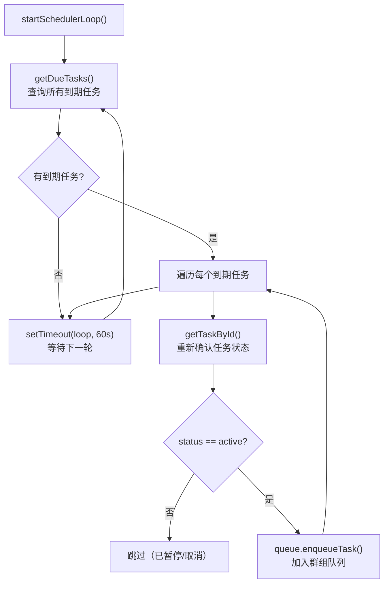

任务调度器是 NanoClaw 中实现**自动化定时执行**的核心模块。它允许用户在群组对话中通过自然语言指令创建计划任务——例如"每天早上 9 点汇报项目状态"或"每隔 30 分钟检查一次服务健康"——系统会在无人值守的情况下，按既定时间表启动容器化智能体执行对应指令，并将结果自动推送回原始对话。本文将深入剖析调度器的三种调度模式（Cron 表达式、固定间隔、一次性执行）、防漂移的间隔锚定算法、与群组队列的并发协作机制，以及任务执行结果的完整生命周期。

Sources: [task-scheduler.ts](src/task-scheduler.ts#L1-L282), [types.ts](src/types.ts#L56-L78)

## 核心数据模型：ScheduledTask

每个调度任务在 SQLite 数据库中以 `ScheduledTask` 结构存储，它是调度器运转的基础数据单元：

| 字段 | 类型 | 说明 |
|------|------|------|
| `id` | `string` | 任务唯一标识（UUID） |
| `group_folder` | `string` | 所属群组的文件夹路径 |
| `chat_jid` | `string` | 目标对话的 JID（用于回送结果） |
| `prompt` | `string` | 执行时发送给智能体的提示词 |
| `schedule_type` | `'cron' \| 'interval' \| 'once'` | 调度类型 |
| `schedule_value` | `string` | Cron 表达式 / 毫秒间隔 / ISO 时间戳 |
| `context_mode` | `'group' \| 'isolated'` | 会话上下文模式 |
| `next_run` | `string \| null` | 下次执行的 ISO 时间戳，`null` 表示已完成 |
| `last_run` | `string \| null` | 上次执行时间 |
| `last_result` | `string \| null` | 最近一次执行结果摘要（截断至 200 字符） |
| `status` | `'active' \| 'paused' \| 'completed'` | 任务状态 |
| `created_at` | `string` | 创建时间 |

`schedule_type` 决定了 `schedule_value` 的语义：Cron 类型使用标准 Cron 表达式（如 `0 9 * * *` 表示每天 9:00），间隔类型使用毫秒整数字符串（如 `60000` 表示 60 秒），一次性类型使用 ISO 时间戳（如 `2026-03-01T09:00:00.000Z`）。

Sources: [types.ts](src/types.ts#L56-L69)

## 数据库 Schema 与索引策略

任务数据存储在两张表中。`scheduled_tasks` 表保存任务定义，`task_run_logs` 表记录每次执行的详细日志（执行时间、耗时、成功/失败状态、结果或错误信息），两者通过外键关联。Schema 设计上有两个关键索引：`idx_next_run` 针对 `next_run` 列，加速调度循环中最频繁的"查找到期任务"查询；`idx_status` 针对 `status` 列，确保过滤 `active` 状态的任务时走索引路径。

```sql
-- 核心查询：调度循环每分钟执行一次
SELECT * FROM scheduled_tasks
WHERE status = 'active' AND next_run IS NOT NULL AND next_run <= ?
ORDER BY next_run
```

这个查询利用 `idx_status` 和 `idx_next_run` 的联合过滤能力，在大量任务场景下保持亚毫秒级响应。`context_mode` 列通过迁移脚本按需添加（默认值 `'isolated'`），体现了对已有数据库的向前兼容设计。

Sources: [db.ts](src/db.ts#L40-L66), [db.ts](src/db.ts#L87-L94), [db.ts](src/db.ts#L455-L466)

## 调度循环：轮询驱动的单线程模型

调度器的核心是一个基于 `setTimeout` 递归调用的长轮询循环。`startSchedulerLoop` 函数在编排器启动时被调用，以 `SCHEDULER_POLL_INTERVAL`（默认 60 秒）为周期持续运行。每一轮循环执行以下流程：



这种设计的核心优势在于**幂等性**：每次轮询都会从数据库重新读取最新状态，而非依赖内存缓存。即使任务在两次轮询之间被用户暂停或删除，下一轮循环会自动感知并跳过。`schedulerRunning` 布尔守卫防止重复启动循环——在测试环境中通过 `_resetSchedulerLoopForTests()` 重置此标志。

Sources: [task-scheduler.ts](src/task-scheduler.ts#L240-L281), [config.ts](src/config.ts#L17)

## 三种调度模式与 computeNextRun 算法

`computeNextRun` 是调度器中最关键的纯函数，负责在任务执行完毕后计算下次运行时间。它的行为根据 `schedule_type` 分叉：

### Cron 模式

使用 `cron-parser` 库解析标准 Cron 表达式，结合系统时区（`TIMEZONE`，默认取 `process.env.TZ` 或系统时区）计算下一次触发时刻。例如 `0 9 * * 1-5` 表示工作日每天 9:00。

### 间隔模式（防漂移锚定）

这是调度器中最精巧的算法。间隔任务面临一个经典问题：**时间漂移**。朴素的做法是每次执行后以 `Date.now() + interval` 作为下次运行时间，但如果执行耗时 5 秒，60 秒间隔的任务会从"每整分钟"逐渐偏移为"每 1 分 5 秒"。

NanoClaw 采用**锚定策略**：以任务的 `next_run`（即计划执行时间）为锚点，加上间隔毫秒数，然后向前跳过所有已错过的周期：

```typescript
let next = new Date(task.next_run!).getTime() + ms;
while (next <= now) {
  next += ms;
}
```

这确保了间隔任务始终对齐到原始调度网格。例如，一个 60 秒间隔的任务如果因系统负载错过了 10 个周期（600 秒），算法会跳过这 10 个错过的周期，直接调度到下一个未来时刻，且该时刻与原始锚点的时间差恰好是 60 秒的整数倍。

### 一次性模式

`once` 类型任务执行后 `computeNextRun` 返回 `null`，`updateTaskAfterRun` 随即将任务状态设为 `'completed'`，实现"执行即归档"的语义。

| 模式 | schedule_value 格式 | 执行后行为 | 防漂移 |
|------|---------------------|-----------|--------|
| `cron` | Cron 表达式（如 `0 */2 * * *`） | 计算下一个 Cron 触发时刻 | 由 cron-parser 保证 |
| `interval` | 毫秒字符串（如 `3600000`） | 锚定到计划时间 + 间隔 | ✅ 锚定算法 |
| `once` | ISO 时间戳（如 `2026-03-01T09:00:00Z`） | 状态变更为 `completed` | N/A |

Sources: [task-scheduler.ts](src/task-scheduler.ts#L24-L63), [task-scheduler.ts](src/task-scheduler.ts#L231-L237), [config.ts](src/config.ts#L66-L69)

## 任务执行流程：从调度到容器

当一个到期任务被调度循环捕获并通过群组队列开始执行时，`runTask` 函数接管完整的执行生命周期：

```mermaid
sequenceDiagram
    participant Loop as 调度循环
    participant Queue as 群组队列
    participant RunTask as runTask()
    participant DB as SQLite
    participant CR as Container Runner
    participant Agent as 容器智能体
    participant Channel as 消息渠道

    Loop->>DB: getDueTasks()
    DB-->>Loop: 到期任务列表
    Loop->>Queue: enqueueTask(chat_jid, taskId, fn)
    Queue->>RunTask: 执行 fn()（当获得并发槽位）
    RunTask->>DB: resolveGroupFolderPath()
    alt 群组路径无效
        RunTask->>DB: updateTask → paused
        RunTask->>DB: logTaskRun → error
    end
    RunTask->>DB: getAllTasks() → writeTasksSnapshot()
    RunTask->>CR: runContainerAgent()
    CR->>Agent: 启动容器，传递 prompt
    Agent-->>CR: 流式输出结果
    CR-->>RunTask: ContainerOutput
    CR->>Channel: sendMessage(chat_jid, result)
    Note over RunTask: 10 秒延迟后关闭容器
    RunTask->>DB: logTaskRun()
    RunTask->>DB: updateTaskAfterRun(computeNextRun)
```

执行流程中有几个值得注意的设计细节：

**群组路径校验与反重试保护**：如果任务的 `group_folder` 指向无效路径（如被删除或路径遍历攻击），`runTask` 会立即将任务状态设为 `paused` 并记录错误日志。这防止了无效任务在每次轮询中被反复拾取导致的**重试风暴**（retry churn）。

**任务快照隔离**：执行前调用 `writeTasksSnapshot` 将当前所有任务写入群组的 IPC 目录（`current_tasks.json`）。主群组可见全部任务，非主群组只能看到自己的任务。这让容器内的智能体能感知到自身的调度上下文。

**流式结果转发**：容器的输出通过 `onOutput` 回调流式传回。当第一个有效结果到达时，立即通过 `sendMessage` 推送到用户对话，不等待容器完全结束。随后启动 10 秒延迟定时器（`TASK_CLOSE_DELAY_MS`）关闭容器的 stdin 管道，避免等待 IDLE_TIMEOUT（30 分钟）的超时。这是因为定时任务是**单轮执行**——不需要像交互式对话那样保持容器活跃。

Sources: [task-scheduler.ts](src/task-scheduler.ts#L78-L238), [container-runner.ts](src/container-runner.ts#L640-L664)

## 上下文模式：group 与 isolated

`context_mode` 字段决定了任务执行时是否继承群组的现有会话上下文：

- **`isolated`（默认）**：每次执行创建全新会话，任务之间完全隔离。适用于日志分析、数据报告等无状态重复任务。
- **`group`**：复用群组当前的 `sessionId`，任务执行结果会延续到该群组的对话历史中。适用于需要累积上下文的场景，如"基于上次分析结果继续深入研究"。

在 `runTask` 中，会话 ID 的选择逻辑如下：

```typescript
const sessionId =
  task.context_mode === 'group' ? sessions[task.group_folder] : undefined;
```

`undefined` 的 `sessionId` 会让容器内的 Agent Runner 启动全新会话，而传入现有会话 ID 则会恢复之前的对话上下文。

Sources: [task-scheduler.ts](src/task-scheduler.ts#L153-L155), [db.ts](src/db.ts#L87-L94)

## 与群组队列的并发协作

调度器本身不直接管理容器并发——它通过 `GroupQueue.enqueueTask` 将任务投递到群组队列，由队列统一调度容器生命周期。这种分层设计使得定时任务和用户交互消息共享同一套并发控制机制：

- **去重保护**：`enqueueTask` 检查任务是否已在运行或已排队，防止同一任务被重复投递。
- **并发上限**：全局 `MAX_CONCURRENT_CONTAINERS`（默认 5）限制同时运行的容器数量。超出时任务进入等待队列。
- **群组串行**：同一群组内的任务（无论来自调度器还是用户消息）按顺序执行，不会并行处理同一群组的请求。

当容器完成当前任务进入空闲状态后，`notifyIdle` 方法检查是否有排队的任务，如果有则立即通过 `closeStdin` 中断空闲等待，启动下一个任务。这种"**空闲抢占**"机制确保了任务调度的低延迟。

Sources: [group-queue.ts](src/group-queue.ts#L90-L130), [group-queue.ts](src/group-queue.ts#L148-L154)

## 依赖注入与可测试性

`SchedulerDependencies` 接口定义了调度器与外部系统的全部耦合点。编排器（`src/index.ts`）在启动时注入这些依赖：

| 依赖 | 类型 | 说明 |
|------|------|------|
| `registeredGroups` | `() => Record<string, RegisteredGroup>` | 获取当前注册群组（惰性求值） |
| `getSessions` | `() => Record<string, string>` | 获取群组会话映射 |
| `queue` | `GroupQueue` | 群组并发队列 |
| `onProcess` | `(jid, proc, containerName, folder) => void` | 容器进程注册回调 |
| `sendMessage` | `(jid, text) => Promise<void>` | 消息发送（路由到对应渠道） |

这种依赖注入模式使得测试时可以用轻量的 mock 对象替换真实依赖。测试文件中通过 `vi.fn()` 创建桩函数，使用 `vi.useFakeTimers()` 控制时间流逝，验证调度行为而无需启动真实的容器或数据库。

Sources: [task-scheduler.ts](src/task-scheduler.ts#L65-L76), [index.ts](src/index.ts#L534-L549), [task-scheduler.test.ts](src/task-scheduler.test.ts#L1-L129)

## 错误处理与运维韧性

调度器的错误处理策略遵循"**记录并继续**"原则：

1. **无效群组路径**：暂停任务（`paused`），记录错误，防止重试风暴。
2. **群组未找到**：记录错误但不暂停任务（群组可能只是暂时离线）。
3. **循环异常**：外层 try-catch 捕获所有意外错误，确保 `setTimeout(loop, ...)` 始终被执行，循环不会中断。
4. **间隔值异常**：`computeNextRun` 对非正整数间隔值做防护，回退到 60 秒后的时间点，避免无限循环。

每次任务执行都会写入 `task_run_logs` 表，记录执行耗时（`duration_ms`）、成功/失败状态和结果摘要。这为运维排查提供了完整的审计轨迹。

Sources: [task-scheduler.ts](src/task-scheduler.ts#L44-L52), [task-scheduler.ts](src/task-scheduler.ts#L86-L103), [task-scheduler.ts](src/task-scheduler.ts#L268-L270)

## 相关页面

- [群组队列（src/group-queue.ts）：并发控制与任务排队机制](14-qun-zu-dui-lie-src-group-queue-ts-bing-fa-kong-zhi-yu-ren-wu-pai-dui-ji-zhi) — 调度器投递任务的并发队列
- [数据库层（src/db.ts）：SQLite Schema、迁移与查询接口](17-shu-ju-ku-ceng-src-db-ts-sqlite-schema-qian-yi-yu-cha-xun-jie-kou) — 任务表 Schema 与查询接口定义
- [容器运行器（src/container-runner.ts）：容器生命周期与卷挂载](13-rong-qi-yun-xing-qi-src-container-runner-ts-rong-qi-sheng-ming-zhou-qi-yu-juan-gua-zai) — 任务执行时的容器启动与快照写入
- [编排器（src/index.ts）：状态管理、消息循环与智能体调度](12-bian-pai-qi-src-index-ts-zhuang-tai-guan-li-xiao-xi-xun-huan-yu-zhi-neng-ti-diao-du) — 调度器的启动入口与依赖注入