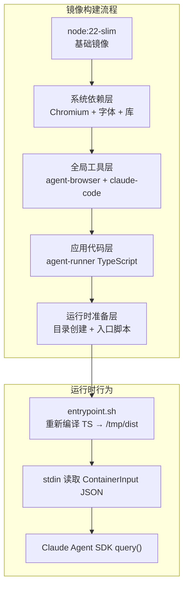
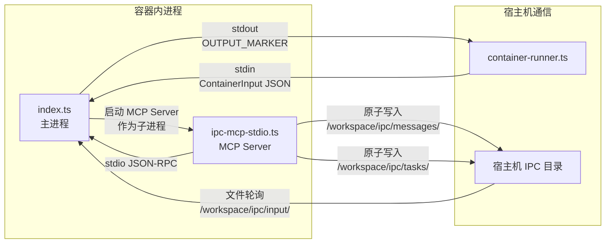
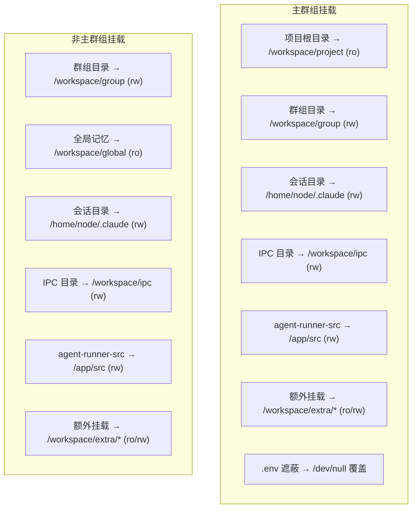

NanoClaw 的核心设计原则是将 AI 智能体的执行环境完全隔离在容器内——宿主机进程仅负责消息路由与编排，所有 Claude Agent SDK 的调用、文件系统操作和浏览器自动化均在容器内完成。本文深入解析容器镜像的构建过程、内部架构，以及镜像与宿主机之间的数据流交互协议。理解这一层是掌握 NanoClaw 安全模型和二次开发能力的关键前提。

Sources: [container/Dockerfile](container/Dockerfile#L1-L70), [container/agent-runner/src/index.ts](container/agent-runner/src/index.ts#L1-L15)

## 镜像构建概览：Dockerfile 分层设计

容器镜像基于 `node:22-slim` 构建，采用分层缓存策略优化构建速度。整个构建过程可以分为四个逻辑层：**系统依赖层**、**全局工具层**、**应用代码层**和**运行时准备层**。



**系统依赖层**安装了 Chromium 运行所需的全部系统库（`libnss3`、`libatk-bridge2.0-0`、`libgtk-3-0` 等），以及中日韩字体（`fonts-noto-cjk`）和 Emoji 字体（`fonts-noto-color-emoji`），确保浏览器自动化场景下的文本渲染质量。`curl` 和 `git` 也在此层安装，为 Claude Agent 的 `Bash` 工具提供网络访问和版本控制能力。

**全局工具层**通过 `npm install -g` 安装了两个关键全局包：`agent-browser` 提供浏览器自动化能力（对应 `container/skills/agent-browser/SKILL.md` 中定义的技能接口），`@anthropic-ai/claude-code` 则是 Claude Code 的 CLI 工具。这两个包安装在全局 `node_modules` 中，不随应用代码变更而重建，充分利用了 Docker 的层缓存机制。

Sources: [container/Dockerfile](container/Dockerfile#L1-L34)

## 应用代码层：agent-runner 的构建与安装

应用代码采用经典的 Docker 缓存优化模式——先复制 `package*.json` 安装依赖，再复制源码并编译 TypeScript。这一策略确保只有当依赖版本变化时才重新执行 `npm install`，而源码修改只触发 TypeScript 编译。

| 构建步骤 | 指令 | 缓存失效条件 |
|---------|------|------------|
| 依赖安装 | `COPY agent-runner/package*.json ./` + `npm install` | `package.json` 或 `package-lock.json` 变更 |
| 源码编译 | `COPY agent-runner/ ./` + `npm run build` | `src/` 目录下任何文件变更 |

agent-runner 的依赖集合非常精简，仅包含四个核心包：

| 依赖 | 版本 | 用途 |
|------|------|------|
| `@anthropic-ai/claude-agent-sdk` | `^0.2.34` | Claude Agent SDK，驱动智能体查询循环 |
| `@modelcontextprotocol/sdk` | `^1.12.1` | MCP SDK，构建 stdio MCP Server |
| `cron-parser` | `^5.0.0` | Cron 表达式解析，用于任务调度验证 |
| `zod` | `^4.0.0` | 运行时类型校验，用于 MCP 工具参数定义 |

Sources: [container/Dockerfile](container/Dockerfile#L39-L49), [container/agent-runner/package.json](container/agent-runner/package.json#L1-L22)

## 运行时准备层：目录结构与入口脚本

镜像在 `/workspace` 下预创建了四个核心目录，构成容器内部的文件系统布局：

```
/workspace/
├── group/          # 群组工作目录（可读写，宿主机挂载）
├── global/         # 全局 CLAUDE.md 记忆目录（只读，非主群组挂载）
├── extra/          # 额外挂载点（由宿主机的 allowlist 控制）
└── ipc/
    ├── messages/   # 智能体→宿主机的消息投递
    ├── tasks/      # 任务调度请求
    └── input/      # 宿主机→智能体的后续消息注入
```

**入口脚本**（`entrypoint.sh`）是整个容器运行时的启动核心，其设计包含三个关键步骤：

1. **重新编译 TypeScript**：将 `/app/src` 编译到 `/tmp/dist`。这一步看似冗余，实则是为了支持**群组级别的 agent-runner 定制化**——宿主机在每个群组的会话目录中维护一份独立的 `agent-runner-src`，通过卷挂载覆盖 `/app/src`，使不同群组可以拥有不同的 agent-runner 行为。编译产物写入 `/tmp/dist` 并通过 `chmod -R a-w` 设为只读，防止运行时篡改。

2. **读取 stdin JSON**：通过 `cat > /tmp/input.json` 将宿主机通过管道传入的 `ContainerInput` JSON 暂存。这种 stdin 传输机制确保**密钥（OAuth Token、API Key）永远不会写入磁盘**——宿主机通过管道注入密钥，agent-runner 读取后立即删除临时文件。

3. **执行 agent-runner**：`node /tmp/dist/index.js < /tmp/input.json` 启动主进程。

Sources: [container/Dockerfile](container/Dockerfile#L51-L69)

## 容器安全模型：非 root 执行与权限分离

Dockerfile 在安全层面采用了多层防护策略。镜像通过 `USER node` 切换到非 root 用户运行，这是 Claude Agent SDK `--dangerously-skip-permissions` 模式的前置要求——该模式需要非 root 用户环境以降低权限提升风险。可写目录（`/workspace`）通过 `chown -R node:node` 赋予 node 用户所有权，而 `/home/node` 通过 `chmod 777` 确保容器内 Claude Code 的配置写入不会因权限问题失败。

宿主机侧的权限控制更加精细。当宿主机用户的 UID 不是 0（root）也不是 1000（容器内 node 用户的默认 UID）时，`container-runner.ts` 通过 `--user` 参数将容器进程映射到宿主机用户身份，确保卷挂载的文件读写权限与宿主机一致。对于 Apple Container 运行时，则采用先以 root 启动再通过 `setpriv` 降权的策略。

Sources: [container/Dockerfile](container/Dockerfile#L59-L63), [src/container-runner.ts](src/container-runner.ts#L236-L243)

## 构建脚本与运行时抽象

`container/build.sh` 是镜像构建的统一入口，支持通过 `CONTAINER_RUNTIME` 环境变量切换容器运行时。默认使用 Docker，但可通过 `CONTAINER_RUNTIME=container` 切换到 Apple Container。构建完成后，脚本提供了测试命令模板，通过 stdin 注入空 JSON 验证镜像基本可用性。

```bash
# 默认构建
./container/build.sh

# 指定标签
./container/build.sh v1.2.0

# 使用 Apple Container
CONTAINER_RUNTIME=container ./container/build.sh
```

`src/container-runtime.ts` 将运行时差异抽象为三个核心接口：`CONTAINER_RUNTIME_BIN` 定义运行时二进制名称，`readonlyMountArgs()` 生成只读挂载参数，`stopContainer()` 生成停止命令。这种抽象使得切换运行时只需修改一个文件，所有调用方保持不变。`ensureContainerRuntimeRunning()` 在启动时检查运行时可用性，`cleanupOrphans()` 清理上次运行遗留的容器实例。

Sources: [container/build.sh](container/build.sh#L1-L24), [src/container-runtime.ts](src/container-runtime.ts#L1-L88)

## Setup 集成：镜像构建作为安装步骤

镜像构建被集成到 NanoClaw 的 setup 流程中（`setup/container.ts`），作为安装的第 5 步执行。该步骤接收 `--runtime` 参数（`docker` 或 `apple-container`），执行以下验证与构建流程：

1. **运行时检测**：验证指定运行时已安装且可用。Docker 需要通过 `docker info` 确认守护进程运行中，Apple Container 需要确认 `container` 命令存在。
2. **镜像构建**：在 `container/` 目录下执行构建命令，生成 `nanoclaw-agent:latest` 镜像。
3. **冒烟测试**：通过 `echo '{}' | <runtime> run -i --rm --entrypoint /bin/echo nanoclaw-agent:latest "Container OK"` 验证镜像可正常启动。
4. **状态报告**：通过 `emitStatus()` 输出构建结果，包括运行时类型、构建状态、测试状态等结构化信息。

构建后的镜像名称 `nanoclaw-agent:latest` 在 `src/config.ts` 中通过 `CONTAINER_IMAGE` 常量引用，可通过 `CONTAINER_IMAGE` 环境变量覆盖。

Sources: [setup/container.ts](setup/container.ts#L1-L145), [src/config.ts](src/config.ts#L40-L41)

## agent-runner 源码架构：双进程模型

容器内的 agent-runner 由两个 TypeScript 模块构成，形成**主进程 + MCP Server**的双进程协作模型：



**index.ts（主进程）** 负责核心的智能体执行循环。它从 stdin 读取 `ContainerInput`，调用 Claude Agent SDK 的 `query()` 函数启动智能体查询，并通过 `MessageStream`（一个基于 AsyncGenerator 的推流模型）持续接收后续 IPC 消息。主进程管理会话状态（`sessionId`），在每次查询结束后等待新的 IPC 消息或 `_close` 关闭信号，实现会话的持续复用。

**ipc-mcp-stdio.ts（MCP Server）** 作为独立的 stdio 进程运行，通过 MCP 协议向 Claude Agent 暴露 NanoClaw 的宿主机交互能力。它通过环境变量（`NANOCLAW_CHAT_JID`、`NANOCLAW_GROUP_FOLDER`、`NANOCLAW_IS_MAIN`）获取当前群组上下文，注册了 `send_message`、`schedule_task`、`list_tasks`、`pause_task`、`resume_task`、`cancel_task`、`update_task` 和 `register_group` 等 MCP 工具。所有 IPC 写入采用**原子文件操作**（先写 `.tmp` 再 `rename`），避免宿主机读到不完整的 JSON。

Sources: [container/agent-runner/src/index.ts](container/agent-runner/src/index.ts#L356-L490), [container/agent-runner/src/ipc-mcp-stdio.ts](container/agent-runner/src/ipc-mcp-stdio.ts#L1-L40)

## 输出协议：标记分隔的流式通信

容器与宿主机之间的输出通信采用自定义的标记分隔协议，定义在两端的同步常量中：

- **OUTPUT_START_MARKER**: `---NANOCLAW_OUTPUT_START---`
- **OUTPUT_END_MARKER**: `---NANOCLAW_OUTPUT_END---`

每次智能体产生结果（`result` 类型消息）或会话状态变更时，agent-runner 将 `ContainerOutput` JSON 包裹在这两个标记之间输出到 stdout。宿主机的 `container-runner.ts` 实现了**流式解析器**——它不等待容器退出，而是在数据到达时实时扫描标记对，提取 JSON 并通过 `onOutput` 回调立即投递给消息路由器。这种设计使得长会话中的中间结果可以被实时发送给用户，而不必等到整个容器运行结束。

`ContainerOutput` 的数据结构同时支持成功和错误两种状态：

| 字段 | 类型 | 说明 |
|------|------|------|
| `status` | `'success' \| 'error'` | 执行结果状态 |
| `result` | `string \| null` | 智能体文本响应（可能为 null 表示无文本输出） |
| `newSessionId` | `string`（可选） | 新创建的会话 ID，用于后续消息的会话恢复 |
| `error` | `string`（可选） | 错误描述信息 |

Sources: [container/agent-runner/src/index.ts](container/agent-runner/src/index.ts#L108-L115), [src/container-runner.ts](src/container-runner.ts#L29-L49)

## 卷挂载架构：宿主机与容器的文件系统映射

宿主机通过精心设计的卷挂载策略将文件系统资源注入容器。`buildVolumeMounts()` 函数根据群组类型（主群组 vs 非主群组）构建不同的挂载配置：



主群组独有的挂载包括：项目根目录（只读，供智能体阅读源码但不允许修改）、`.env` 文件遮蔽（将 `/dev/null` 挂载到 `/workspace/project/.env` 防止密钥泄露）。非主群组则挂载全局记忆目录 `/workspace/global`（只读），共享主群组发布的全局知识。

两种群组类型共享的关键挂载包括：**会话目录**（每个群组独立的 `.claude/` 目录，包含 `settings.json`、技能文件和会话历史）、**IPC 目录**（消息和任务调度的双向文件通道）、以及**agent-runner 源码目录**（首次运行时从 `container/agent-runner/src/` 复制到群组会话目录，后续挂载覆盖容器内的 `/app/src`，支持群组级别的运行时定制）。额外的目录挂载通过 `validateAdditionalMounts()` 校验，确保仅允许白名单中的路径。

Sources: [src/container-runner.ts](src/container-runner.ts#L57-L210)

## TypeScript 编译配置

agent-runner 的 TypeScript 配置面向 Node.js 22 运行时优化，采用 ES2022 目标和 NodeNext 模块解析策略。输出声明文件（`declaration: true`）以支持类型检查。严格的 `strict` 模式确保代码质量，`skipLibCheck` 跳过第三方库类型检查以加速编译。

| 配置项 | 值 | 说明 |
|--------|-----|------|
| `target` | `ES2022` | 使用 Node 22 支持的最新 JS 特性 |
| `module` | `NodeNext` | 原生 ESM 模块解析 |
| `moduleResolution` | `NodeNext` | 匹配模块系统的解析策略 |
| `outDir` | `./dist` | 编译输出目录（构建时使用） |
| `rootDir` | `./src` | 源码根目录 |
| `strict` | `true` | 启用所有严格类型检查 |
| `declaration` | `true` | 生成 `.d.ts` 声明文件 |

值得注意的设计细节是 `entrypoint.sh` 中的重新编译机制——它将 `/tmp/dist` 作为输出目录而非默认的 `./dist`，并通过符号链接复用 `/app/node_modules`。编译后的产物被设为只写保护（`chmod -R a-w`），防止 Agent 在运行时意外篡改编译结果。

Sources: [container/agent-runner/tsconfig.json](container/agent-runner/tsconfig.json#L1-L16), [container/Dockerfile](container/Dockerfile#L57-L57)

## 内置技能：agent-browser

镜像中预装了 `agent-browser` 技能（位于 `container/skills/agent-browser/`），通过 `SKILL.md` 定义其行为。该技能在宿主机侧被同步到每个群组的 `.claude/skills/` 目录中，作为 Claude Agent 的可用工具集。

agent-browser 基于 Chromium 提供完整的浏览器自动化能力：页面导航、DOM 快照（返回带 `@ref` 引用的可交互元素）、点击/填写/截图等操作。在 Dockerfile 中，Chromium 的可执行路径通过 `AGENT_BROWSER_EXECUTABLE_PATH` 和 `PLAYWRIGHT_CHROMIUM_EXECUTABLE_PATH` 两个环境变量指向系统安装的 `/usr/bin/chromium`。

Sources: [container/Dockerfile](container/Dockerfile#L29-L34), [container/skills/agent-browser/SKILL.md](container/skills/agent-browser/SKILL.md#L1-L18)

## 镜像定制与扩展指引

对于希望定制镜像的开发者，以下是关键修改点：

**添加系统级依赖**：在 Dockerfile 的 `apt-get install` 块中添加所需包，并保持 `rm -rf /var/lib/apt/lists/*` 清理缓存以控制镜像体积。

**添加全局 npm 包**：在 `RUN npm install -g` 行追加包名。注意全局包的安装层会在依赖变化时完全重建。

**修改 agent-runner 行为**：有两种方式——直接修改 `container/agent-runner/src/` 下的源码（影响所有群组），或利用群组级别的源码覆盖机制（每个群组的 `data/sessions/<group>/agent-runner-src/` 可独立定制，entrypoint.sh 会在启动时重新编译）。

**添加容器内技能**：在 `container/skills/` 目录下创建新的技能目录（包含 `SKILL.md`），构建时无需修改 Dockerfile——宿主机的 `buildVolumeMounts()` 会自动将技能同步到群组的 `.claude/skills/` 目录。

Sources: [container/Dockerfile](container/Dockerfile#L7-L27), [src/container-runner.ts](src/container-runner.ts#L147-L157), [src/container-runner.ts](src/container-runner.ts#L177-L198)

## 延伸阅读

- [Agent Runner（container/agent-runner）：Claude Agent SDK 集成、IPC 轮询与会话管理](20-agent-runner-container-agent-runner-claude-agent-sdk-ji-cheng-ipc-lun-xun-yu-hui-hua-guan-li) — 深入理解容器内主进程的查询循环、MCP Server 的工具注册和会话管理机制
- [容器运行器（src/container-runner.ts）：容器生命周期与卷挂载](13-rong-qi-yun-xing-qi-src-container-runner-ts-rong-qi-sheng-ming-zhou-qi-yu-juan-gua-zai) — 宿主机如何编排容器生命周期、超时管理和流式输出解析
- [容器隔离：文件系统沙箱与进程隔离](21-rong-qi-ge-chi-wen-jian-xi-tong-sha-xiang-yu-jin-cheng-ge-chi) — 容器安全模型的完整分析
- [挂载安全：外部白名单、符号链接防护与路径校验](22-gua-zai-an-quan-wai-bu-bai-ming-dan-fu-hao-lian-jie-fang-hu-yu-lu-jing-xiao-yan) — 卷挂载安全校验机制
- [容器运行时选择与构建（Docker / Apple Container）](5-rong-qi-yun-xing-shi-xuan-ze-yu-gou-jian-docker-apple-container) — 安装阶段的运行时选择与构建指南