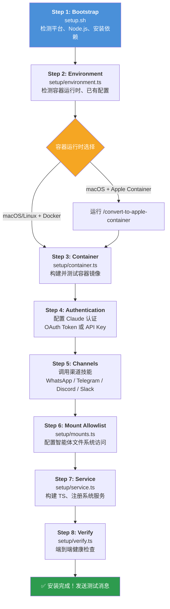

NanoClaw 的安装流程由 **Claude Code 驱动**——您无需手动编辑配置文件或运行一连串命令。只需启动 Claude Code CLI 并输入 `/setup`，一个交互式的向导将引导您完成从依赖安装到服务启动的全部过程。本文档将帮您理解这条安装流水线的每一步在做什么、需要什么前提条件，以及在遇到问题时该如何排查。

## 系统要求

在开始之前，请确认您的环境满足以下最低要求：

| 要求 | 最低版本 | 说明 |
|------|---------|------|
| **操作系统** | macOS 或 Linux | Windows 需通过 WSL2 运行 |
| **Node.js** | ≥ 20（推荐 22） | [.nvmrc](.nvmrc#L1) 指定版本 22 |
| **Claude Code** | 最新版 | 从 [claude.ai/download](https://claude.ai/download) 获取 |
| **容器运行时** | Docker 或 Apple Container | macOS 可选 Docker 或 Apple Container；Linux 仅 Docker |
| **构建工具** | Xcode CLI（macOS）/ gcc+make（Linux） | 编译 better-sqlite3 原生模块所需 |

> **WSL 用户注意**：NanoClaw 支持在 WSL2 上运行，但由于 WSL 默认不含 systemd，服务管理会自动降级为 nohup 模式。您可以在安装后通过编辑 `/etc/wsl.conf` 启用 systemd 来获得更好的体验。

Sources: [README_zh.md](README_zh.md#L112-L118), [.nvmrc](.nvmrc#L1), [package.json](package.json#L39-L41)

## 安装流水线总览

整个 `/setup` 过程分为 8 个有序步骤，由一个 Bash 引导脚本和多个 TypeScript 模块协同完成。Claude Code 扮演"编排者"角色——它按顺序调用各步骤脚本，解析每步输出的结构化状态块，在需要用户交互时暂停询问，在遇到错误时自动诊断并尝试修复。



每一步都会通过 `emitStatus()` 输出一个结构化的状态块到标准输出，格式如下：

```
=== NANOCLAW SETUP: CHECK_ENVIRONMENT ===
PLATFORM: macos
DOCKER: running
STATUS: success
=== END ===
```

Claude Code 解析这些状态块，判断步骤是否成功，并决定下一步操作。

Sources: [setup/status.ts](setup/status.ts#L1-L17), [.claude/skills/setup/SKILL.md](.claude/skills/setup/SKILL.md#L8-L13)

## 三分钟快速启动

如果您急于体验，只需以下三条命令：

```bash
git clone https://github.com/qwibitai/nanoclaw.git
cd nanoclaw
claude
```

然后在 Claude Code 的提示符中输入 `/setup`，按照屏幕上的交互提示操作即可。Claude Code 会处理一切——依赖安装、身份验证、容器构建、服务配置。当它需要您的操作时（比如扫描 WhatsApp 二维码或粘贴 API 密钥），会明确告知您。

> **重要提示**：以 `/` 开头的命令（如 `/setup`、`/add-whatsapp`）是 Claude Code 技能，必须在 `claude` CLI 提示符中输入，而不是在普通终端 shell 中。

Sources: [README_zh.md](README_zh.md#L27-L35)

## 各步骤详解

以下对各步骤进行概要说明。每个步骤的详细配置和排错信息，请参阅对应的专题页面。

### Step 1：Bootstrap —— 环境引导

**脚本**：[setup.sh](setup.sh)（项目中唯一的 Bash 安装脚本）

这一步完成三件事：

1. **平台检测**：识别 macOS / Linux，检测是否为 WSL 环境，是否以 root 运行
2. **Node.js 检查**：验证 Node.js 版本 ≥ 20，若不满足则标记 `NODE_OK=false`
3. **依赖安装**：执行 `npm install`，并验证 `better-sqlite3` 原生模块能否正常加载

| 状态值 | 含义 | 建议操作 |
|--------|------|---------|
| `success` | 全部通过 | 继续下一步 |
| `node_missing` | Node.js 未安装或版本过低 | 安装 Node.js 22 后重新运行 |
| `deps_failed` | npm install 失败 | 删除 `node_modules` 和 `package-lock.json` 后重试 |
| `native_failed` | better-sqlite3 编译失败 | 安装构建工具（macOS: `xcode-select --install`）后重试 |

详细的环境检测与依赖安装步骤说明，参见 [环境检测与依赖安装（setup 步骤 1-2）](4-huan-jing-jian-ce-yu-yi-lai-an-zhuang-setup-bu-zou-1-2)。

Sources: [setup.sh](setup.sh#L15-L161)

### Step 2：Environment —— 环境快照

**模块**：[setup/environment.ts](setup/environment.ts)

此步骤探测当前环境的完整快照：操作系统平台、WSL 状态、Apple Container 和 Docker 的安装与运行状态、已有配置文件（`.env`、认证目录）以及已注册的群组数据。Claude Code 根据这些信息决定后续步骤的路径——例如，如果检测到 Docker 未运行，会尝试启动它；如果已有 WhatsApp 认证，会提示是否复用。

Sources: [setup/environment.ts](setup/environment.ts#L15-L94)

### Step 3：Container —— 容器运行时选择与构建

**模块**：[setup/container.ts](setup/container.ts)

此步骤需要您选择容器运行时，然后构建并测试 `nanoclaw-agent:latest` 镜像。

**运行时选择逻辑**：

| 平台 | Apple Container 状态 | 默认选择 |
|------|---------------------|---------|
| Linux | N/A | Docker（唯一选项） |
| macOS | 已安装 | Claude Code 会询问您选择哪个 |
| macOS | 未安装 | Docker |

构建过程在 `container/` 目录下执行 Dockerfile，镜像基于 `node:22-slim`，包含 Chromium 浏览器和 Claude Code CLI。构建完成后，会运行一个简单的 echo 测试验证容器能正常启动。

详细的容器运行时对比和构建流程，参见 [容器运行时选择与构建（Docker / Apple Container）](5-rong-qi-yun-xing-shi-xuan-ze-yu-gou-jian-docker-apple-container)。

Sources: [setup/container.ts](setup/container.ts#L23-L144), [container/Dockerfile](container/Dockerfile#L1-L69)

### Step 4：Claude 认证配置

此步骤没有独立的脚本模块——Claude Code 直接与您交互来完成认证配置。您需要在 `.env` 文件中配置以下**其中一种**凭据：

| 认证方式 | 环境变量 | 适用场景 |
|---------|---------|---------|
| Claude 订阅（Pro/Max） | `CLAUDE_CODE_OAUTH_TOKEN` | 个人用户首选 |
| Anthropic API Key | `ANTHROPIC_API_KEY` | 开发者 / 企业用户 |

获取 OAuth Token 的方法：在另一个终端运行 `claude setup-token`，复制输出的 token 值。Claude Code 不会在聊天中收集您的密钥——它会告诉您如何自行添加到 `.env` 文件中。

如果需要使用第三方或开源模型，还可以配置 `ANTHROPIC_BASE_URL` 环境变量指向兼容端点。

详细的认证配置步骤，参见 [Claude 认证配置（OAuth Token / API Key）](6-claude-ren-zheng-pei-zhi-oauth-token-api-key)。

Sources: [setup/verify.ts](setup/verify.ts#L99-L107), [README_zh.md](README_zh.md#L160-L172)

### Step 5：消息渠道安装

此步骤是安装中交互最密集的环节。Claude Code 会询问您想启用哪些消息渠道，然后依次调用对应的技能来完成代码安装、认证和注册：

| 渠道 | 技能命令 | 认证方式 |
|------|---------|---------|
| WhatsApp | `/add-whatsapp` | QR 码或配对码扫描 |
| Telegram | `/add-telegram` | Bot Token（从 @BotFather 获取） |
| Discord | `/add-discord` | Bot Token（从 Discord Developer Portal） |
| Slack | `/add-slack` | Bot Token + App Token（Socket Mode） |

每个渠道技能会自动完成四件事：安装渠道代码到项目中、收集并写入凭据到 `.env`、完成认证验证、将聊天注册到 SQLite 数据库。您可以同时启用多个渠道。

详细的各渠道安装指南，参见 [消息渠道安装与认证（WhatsApp、Telegram、Discord、Slack）](7-xiao-xi-qu-dao-an-zhuang-yu-ren-zheng-whatsapp-telegram-discord-slack)。

Sources: [.claude/skills/setup/SKILL.md](.claude/skills/setup/SKILL.md#L86-L110)

### Step 6：挂载白名单

**模块**：[setup/mounts.ts](setup/mounts.ts)

挂载白名单控制智能体容器可以访问宿主机上的哪些目录。配置文件存储在项目外部（`~/.config/nanoclaw/mount-allowlist.json`），确保安全策略不会被意外挂载进容器。

您可以选择：

- **不挂载任何目录**：智能体完全隔离，无法访问宿主机文件
- **指定目录和权限**：每个目录可单独设置读写或只读权限，并支持阻止特定路径模式

以下是一个典型的白名单配置示例：

```json
{
  "allowedRoots": [
    { "path": "~/projects", "allowReadWrite": true, "description": "开发项目" },
    { "path": "~/Documents", "allowReadWrite": false, "description": "文档（只读）" }
  ],
  "blockedPatterns": ["password", "secret", "token"],
  "nonMainReadOnly": true
}
```

其中 `nonMainReadOnly: true` 表示非主群组只能以只读方式访问挂载目录，进一步限制非信任群组的权限。

详细的挂载配置说明，参见 [挂载白名单与服务启动](8-gua-zai-bai-ming-dan-yu-fu-wu-qi-dong)。

Sources: [setup/mounts.ts](setup/mounts.ts#L26-L115), [config-examples/mount-allowlist.json](config-examples/mount-allowlist.json#L1-L26)

### Step 7：服务注册与启动

**模块**：[setup/service.ts](setup/service.ts)

此步骤先执行 TypeScript 编译（`npm run build`），然后根据平台注册系统服务：

| 平台 | 服务管理器 | 配置位置 |
|------|----------|---------|
| macOS | launchd | `~/Library/LaunchAgents/com.nanoclaw.plist` |
| Linux（有 systemd） | systemd | `~/.config/systemd/user/nanoclaw.service` |
| Linux（root） | systemd（系统级） | `/etc/systemd/system/nanoclaw.service` |
| WSL（无 systemd） | nohup | 生成 `start-nanoclaw.sh` 脚本 |

launchd 配置设置了 `RunAtLoad`（开机自启）和 `KeepAlive`（崩溃自动重启），确保服务持续运行。服务日志输出到项目目录下的 `logs/nanoclaw.log` 和 `logs/nanoclaw.error.log`。

Sources: [setup/service.ts](setup/service.ts#L23-L69), [launchd/com.nanoclaw.plist](launchd/com.nanoclaw.plist#L1-L33)

### Step 8：Verify —— 端到端验证

**模块**：[setup/verify.ts](setup/verify.ts)

验证步骤是对整个安装的全面健康检查，覆盖六个维度：

| 检查项 | 通过条件 |
|--------|---------|
| 服务状态 | launchd/systemd/nohup 报告进程正在运行 |
| 容器运行时 | Docker 或 Apple Container 可用 |
| Claude 凭据 | `.env` 中存在 `CLAUDE_CODE_OAUTH_TOKEN` 或 `ANTHROPIC_API_KEY` |
| 渠道认证 | 至少一个消息渠道的凭据已配置 |
| 已注册群组 | SQLite 数据库中至少有一条群组记录 |
| 挂载白名单 | `~/.config/nanoclaw/mount-allowlist.json` 文件存在 |

只有全部通过，验证状态才为 `success`。Claude Code 会针对每一项失败给出具体的修复建议和重试命令。

验证通过后，Claude Code 会建议您发送一条测试消息来确认端到端通信正常，并提示使用 `tail -f logs/nanoclaw.log` 实时查看日志。

Sources: [setup/verify.ts](setup/verify.ts#L25-L192), [.claude/skills/setup/SKILL.md](.claude/skills/setup/SKILL.md#L149-L161)

## 首次运行测试

安装完成后，在您注册的消息渠道中发送一条带有触发词的消息（默认为 `@Andy`）：

```
@Andy 你好，请做个自我介绍
```

如果一切正常，您会看到助手在几秒到十几秒内回复。首次响应可能稍慢，因为需要拉取和启动容器实例。

您可以在项目目录下查看实时日志来跟踪消息处理过程：

```bash
tail -f logs/nanoclaw.log
```

Sources: [README_zh.md](README_zh.md#L64-L79)

## 常见问题排查

| 问题 | 可能原因 | 排查方法 |
|------|---------|---------|
| 安装脚本报 `node_missing` | Node.js 未安装或版本 < 20 | 运行 `node --version` 确认，安装 Node.js 22 |
| `better-sqlite3` 加载失败 | 缺少编译工具链 | macOS: `xcode-select --install`；Linux: `apt install build-essential` |
| 容器构建失败 | 构建缓存损坏 | Docker: `docker builder prune -f`；重试构建 |
| 服务启动后立即退出 | `.env` 配置缺失或 Node 路径错误 | 检查 `logs/nanoclaw.error.log`；重新运行 step 7 |
| 消息无响应 | 触发词不匹配或渠道未连接 | 检查触发词（默认 `@Andy`）；确认渠道凭据；重启服务 |
| Docker 权限不足（Linux） | 用户未加入 docker 组 | `sudo usermod -aG docker $USER`，然后重新登录 |
| WSL 服务无法自启 | 无 systemd | 启用 systemd 或手动运行 `./start-nanoclaw.sh` |

如果遇到以上方法无法解决的问题，在 Claude Code 中运行 `/debug`，让 Claude 为您诊断。

Sources: [.claude/skills/setup/SKILL.md](.claude/skills/setup/SKILL.md#L163-L174), [README_zh.md](README_zh.md#L174-L180)

## 下一步

安装完成后，建议按以下顺序继续阅读：

1. **[与助手对话：触发词、群组和基本用法](3-yu-zhu-shou-dui-hua-hong-fa-ci-qun-zu-he-ji-ben-yong-fa)** —— 学习如何与您的助手高效交互
2. **[定制化实践：修改触发词、行为调整与目录挂载](32-ding-zhi-hua-shi-jian-xiu-gai-hong-fa-ci-xing-wei-tiao-zheng-yu-mu-lu-gua-zai)** —— 根据个人需求调整助手行为
3. **[服务管理：launchd / systemd 配置与日志排查](31-fu-wu-guan-li-launchd-systemd-pei-zhi-yu-ri-zhi-pai-cha)** —— 了解如何管理后台服务

如果您想深入了解系统架构，从 [整体架构：单进程编排器与容器化智能体](9-zheng-ti-jia-gou-dan-jin-cheng-bian-pai-qi-yu-rong-qi-hua-zhi-neng-ti) 开始阅读是最佳选择。