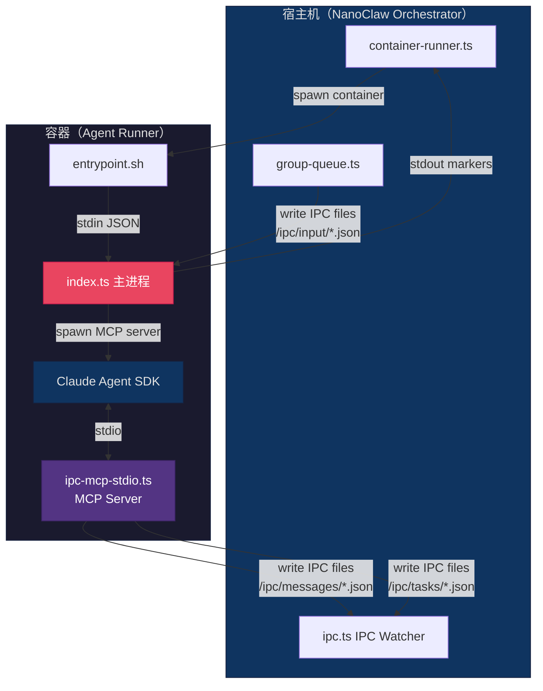
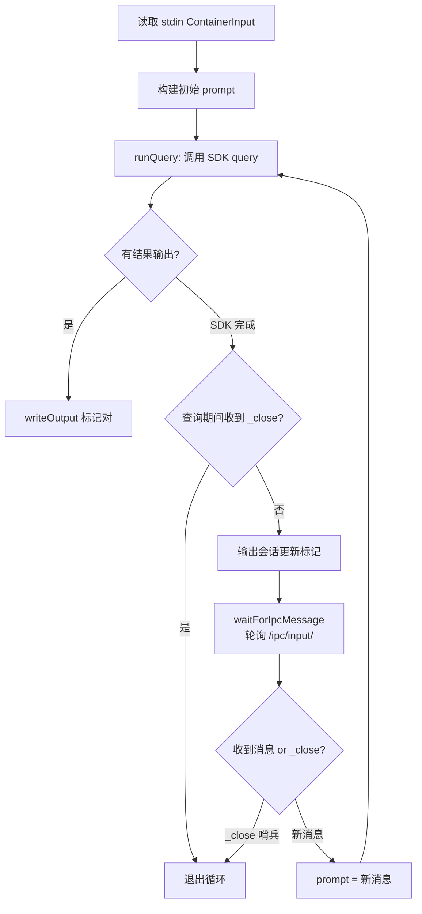
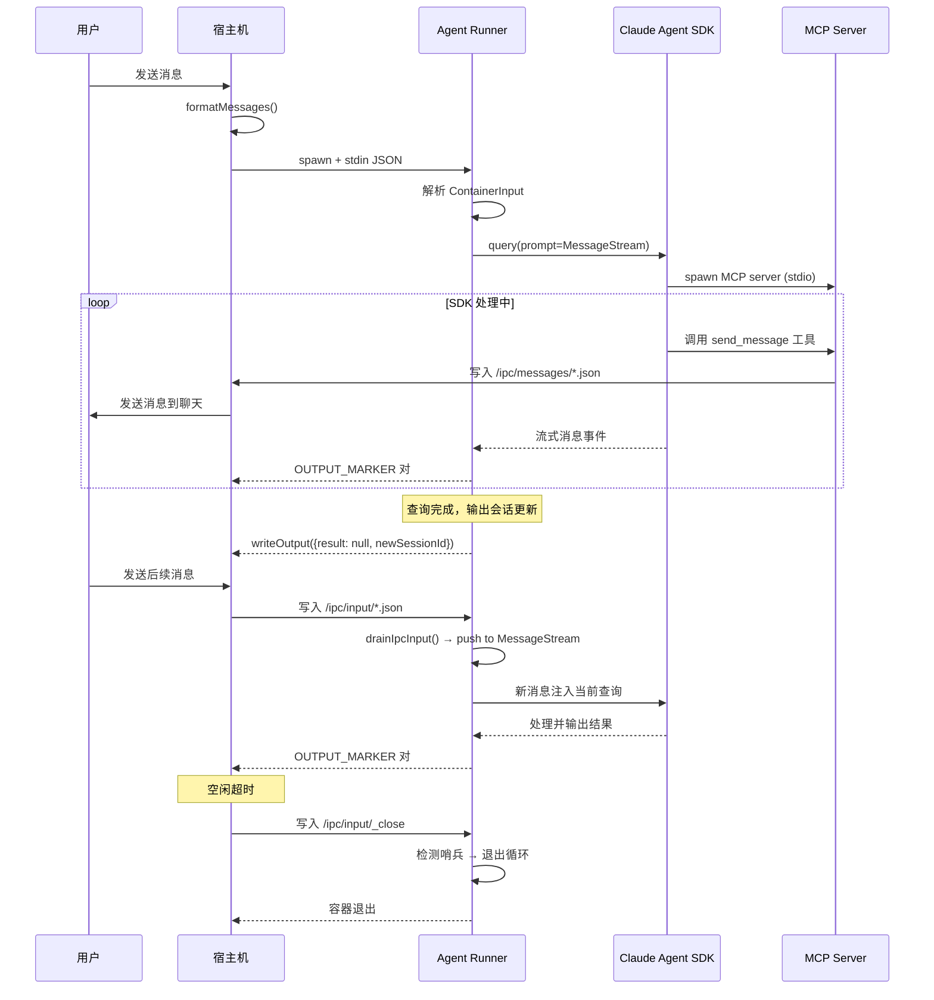

Agent Runner 是 NanoClaw 系统中运行在**容器内部**的核心执行引擎。它接收宿主机通过 stdin 传入的初始化配置，调用 Claude Agent SDK 运行智能体查询，通过基于文件的 IPC 通道与宿主机保持双向通信，并将会话状态持久化以实现上下文恢复。本文档深入剖析其架构设计、通信协议、SDK 集成方式以及会话生命周期管理。

## 模块结构与依赖

Agent Runner 位于 `container/agent-runner/` 目录下，仅包含两个 TypeScript 源文件，但它们分别承担了截然不同的职责：

| 文件 | 职责 | 运行方式 |
|------|------|----------|
| [`src/index.ts`](container/agent-runner/src/index.ts) | 主入口：stdin 解析、SDK 调用、IPC 轮询循环、会话管理 | 容器主进程 |
| [`src/ipc-mcp-stdio.ts`](container/agent-runner/src/ipc-mcp-stdio.ts) | MCP 工具服务器：为智能体提供消息发送、任务调度等能力 | SDK 子进程（stdio 传输） |

其依赖关系精简而聚焦：

```
@anthropic-ai/claude-agent-sdk   — Claude Agent SDK 核心（query 函数）
@modelcontextprotocol/sdk        — MCP 协议实现（StdioServerTransport）
cron-parser                      — Cron 表达式验证
zod                              — 工具参数 Schema 校验
```

Sources: [package.json](container/agent-runner/package.json#L1-L22), [src/index.ts](container/agent-runner/src/index.ts#L1-L15)

## 整体架构：双进程协作模型

在理解具体实现之前，需要先把握 Agent Runner 的进程模型。容器启动时，宿主机通过 stdin 注入初始化 JSON，Agent Runner 解析后进入**查询循环**。同时，Claude Agent SDK 会以子进程方式启动 MCP 工具服务器（`ipc-mcp-stdio.js`），为智能体提供 NanoClaw 专属的工具集。



上图展示了关键的数据流向：宿主机 → 容器（通过 stdin 和 IPC input 文件），容器 → 宿主机（通过 stdout 标记和 IPC messages/tasks 文件）。两条通信路径分工明确——**stdin/stdout 负责初始化与结果输出**，**IPC 文件负责运行时双向通信**。

Sources: [src/index.ts](container/agent-runner/src/index.ts#L1-L15), [src/ipc-mcp-stdio.ts](container/agent-runner/src/ipc-mcp-stdio.ts#L1-L9)

## 容器启动流程

容器的生命周期始于 `entrypoint.sh`，它在容器启动时执行三个关键步骤：

1. **编译 TypeScript**：`npx tsc --outDir /tmp/dist`——将源码编译到临时目录，确保运行的是最新代码（支持宿主机挂载覆盖 `src/` 目录来自定义行为）
2. **链接 node_modules**：`ln -s /app/node_modules /tmp/dist/node_modules`——避免重复安装
3. **读取 stdin 并启动**：`cat > /tmp/input.json && node /tmp/dist/index.js < /tmp/input.json`——先写入临时文件再重定向给 Node，确保 secrets 不残留在进程参数中

Dockerfile 中预设的目录结构反映了容器的运行时拓扑：

```
/workspace/
├── group/          # 群组工作目录（可写，挂载自宿主机）
├── global/         # 全局 CLAUDE.md 目录（非主群组只读）
├── extra/          # 额外挂载目录（技能、自定义内容）
└── ipc/
    ├── input/      # 宿主机 → 容器 的消息输入
    ├── messages/   # 容器 → 宿主机 的消息输出
    └── tasks/      # 容器 → 宿主机 的任务调度请求
```

Sources: [Dockerfile](container/Dockerfile#L52-L69), [container-runner.ts](src/container-runner.ts#L164-L198)

## 输入协议：ContainerInput

Agent Runner 通过 stdin 接收一个完整的 JSON 对象，定义了此次容器运行所需的全部上下文：

```typescript
interface ContainerInput {
  prompt: string;              // 用户消息（已格式化）
  sessionId?: string;          // 会话 ID（用于恢复上下文）
  groupFolder: string;         // 群组文件夹标识（如 "whatsapp_family"）
  chatJid: string;             // 群组 JID（消息目标地址）
  isMain: boolean;             // 是否为主群组（决定权限级别）
  isScheduledTask?: boolean;   // 是否为定时任务触发
  assistantName?: string;      // 助手显示名称
  secrets?: Record<string, string>; // 认证密钥（OAuth Token / API Key）
}
```

值得注意的是 **secrets 的安全处理**：宿主机从 `.env` 文件读取密钥后，仅通过 stdin JSON 传入容器。Agent Runner 在读取后立即删除临时文件 `/tmp/input.json`，并将 secrets 仅注入 SDK 的独立环境变量（`sdkEnv`），**绝不在 `process.env` 中设置**。这确保了 Bash 工具启动的子进程无法访问这些敏感信息。额外的安全层由 `PreToolUse` Hook 实现——它在每个 Bash 命令前注入 `unset ANTHROPIC_API_KEY CLAUDE_CODE_OAUTH_TOKEN` 前缀。

Sources: [src/index.ts L22-L31](container/agent-runner/src/index.ts#L22-L31), [src/index.ts L493-L516](container/agent-runner/src/index.ts#L493-L516), [src/index.ts L188-L210](container/agent-runner/src/index.ts#L188-L210)

## 输出协议：标记分隔流

Agent Runner 的输出并非简单的 JSON 行，而是采用**标记分隔协议**来支持流式多结果输出：

```
---NANOCLAW_OUTPUT_START---
{"status":"success","result":"你好！有什么可以帮你的？","newSessionId":"sess_abc123"}
---NANOCLAW_OUTPUT_END---
---NANOCLAW_OUTPUT_START---
{"status":"success","result":null,"newSessionId":"sess_abc123"}
---NANOCLAW_OUTPUT_END---
```

每个 `ContainerOutput` 对象被 `OUTPUT_START_MARKER` 和 `OUTPUT_END_MARKER` 包裹。宿主机的 `container-runner.ts` 通过流式解析器逐块扫描这些标记对，在容器仍在运行时即可触发回调处理结果（如发送消息到聊天群组）。这种设计实现了**流式响应**——智能体可以在一次会话中输出多条消息，而不必等待整个会话结束。

`ContainerOutput` 的三种典型场景：

| status | result | newSessionId | 含义 |
|--------|--------|--------------|------|
| `success` | 有文本 | 有值 | 正常查询结果，需发送给用户 |
| `success` | `null` | 有值 | 会话状态更新（查询间隙的保活标记） |
| `error` | `null` | 可选 | 错误，`error` 字段包含描述 |

Sources: [src/index.ts L33-L38](container/agent-runner/src/index.ts#L33-L38), [src/index.ts L108-L115](container/agent-runner/src/index.ts#L108-L115), [container-runner.ts L29-L49](src/container-runner.ts#L29-L49)

## IPC 轮询机制：MessageStream 与查询循环

Agent Runner 的核心运行模式是一个**查询循环**（Query Loop），它协调 SDK 调用与 IPC 消息消费：



这个循环的关键在于 **`MessageStream`**——一个基于 `AsyncGenerator` 的推送式消息流。SDK 的 `query()` 函数接受一个 `AsyncIterable<SDKUserMessage>` 作为 prompt 输入，而非一次性字符串。`MessageStream` 维护一个内部队列，当新消息到达时（无论是初始 prompt 还是后续 IPC 消息），都通过 `push()` 方法注入队列，并通过 `waiting` 回调唤醒正在等待的 Generator。

```typescript
class MessageStream {
  private queue: SDKUserMessage[] = [];
  private waiting: (() => void) | null = null;
  private done = false;

  push(text: string): void { /* 入队并唤醒 */ }
  end(): void { /* 标记结束 */ }

  async *[Symbol.asyncIterator](): AsyncGenerator<SDKUserMessage> {
    while (true) {
      while (this.queue.length > 0) yield this.queue.shift()!;
      if (this.done) return;
      await new Promise<void>(r => { this.waiting = r; });
    }
  }
}
```

这个设计使得 SDK 保持 `isSingleUserTurn=false` 状态，允许 Agent Teams（子代理编排）运行至完成。在查询执行期间，一个并行的 IPC 轮询定时器每 500ms 检查 `/workspace/ipc/input/` 目录，将新消息实时推入 `MessageStream`，实现**查询内消息注入**——用户可以在智能体思考时继续发送消息，这些消息会被即时送入当前会话。

Sources: [src/index.ts L66-L96](container/agent-runner/src/index.ts#L66-L96), [src/index.ts L357-L391](container/agent-runner/src/index.ts#L357-L391), [src/index.ts L538-L574](container/agent-runner/src/index.ts#L538-L574)

## IPC 文件协议细节

### 入站方向（宿主机 → 容器）

宿主机通过 `group-queue.ts` 的 `sendMessage()` 方法向容器的 IPC 输入目录写入 JSON 文件：

```typescript
// 消息文件：{timestamp}-{random}.json
{ "type": "message", "text": "用户的新消息" }

// 关闭哨兵：_close（空文件）
```

Agent Runner 端通过 `drainIpcInput()` 消费这些文件——按文件名排序读取、解析、删除（消费即删除，保证不重复处理）。`shouldClose()` 函数专门检查 `_close` 哨兵文件的存在。

文件写入采用**原子操作**：先写 `.tmp` 临时文件，再通过 `fs.renameSync()` 原子重命名，避免容器读到半写状态的不完整 JSON。

Sources: [src/index.ts L58-L60](container/agent-runner/src/index.ts#L58-L60), [src/index.ts L301-L327](container/agent-runner/src/index.ts#L301-L327), [group-queue.ts L160-L194](src/group-queue.ts#L160-L194)

### 出站方向（容器 → 宿主机）

MCP 工具服务器（`ipc-mcp-stdio.ts`）通过向 `/workspace/ipc/messages/` 和 `/workspace/ipc/tasks/` 写入 JSON 文件来与宿主机通信。宿主机的 `ipc.ts` 维护一个全局 IPC Watcher，以轮询方式扫描所有群组的 IPC 目录，处理以下类型的请求：

| 目录 | 文件类型 | 处理逻辑 |
|------|----------|----------|
| `messages/` | `type: "message"` | 经权限校验后发送到目标聊天 |
| `tasks/` | `type: "schedule_task"` | 创建定时任务到 SQLite |
| `tasks/` | `type: "pause_task"` / `resume_task` / `cancel_task` | 更新任务状态 |
| `tasks/` | `type: "register_group"` | 仅主群组可用，注册新群组 |

Sources: [ipc-mcp-stdio.ts L23-L35](container/agent-runner/src/ipc-mcp-stdio.ts#L23-L35), [ipc.ts L29-L154](src/ipc.ts#L29-L154)

## MCP 工具服务器：智能体的能力扩展

`ipc-mcp-stdio.ts` 实现了一个基于标准 MCP（Model Context Protocol）的工具服务器，通过 stdio 传输层与 Claude Agent SDK 通信。它通过三个环境变量获取运行时上下文：

```typescript
const chatJid = process.env.NANOCLAW_CHAT_JID!;        // 当前群组 JID
const groupFolder = process.env.NANOCLAW_GROUP_FOLDER!;  // 群组文件夹名
const isMain = process.env.NANOCLAW_IS_MAIN === '1';     // 是否主群组
```

这些环境变量由 Agent Runner 在 SDK 配置的 `mcpServers.nanoclaw.env` 中注入。以下是该服务器提供的完整工具集：

| 工具名 | 功能 | 权限约束 |
|--------|------|----------|
| `send_message` | 向用户/群组发送即时消息 | 主群组可发往任意已注册群组；非主群组只能发往自身 |
| `schedule_task` | 调度定时/循环任务（cron/interval/once） | 同上，支持 `context_mode` 选择是否携带上下文 |
| `list_tasks` | 列出已调度任务 | 主群组看全部，非主群组只看自己的 |
| `pause_task` | 暂停任务 | 主群组可暂停任意任务 |
| `resume_task` | 恢复暂停的任务 | 同上 |
| `cancel_task` | 取消并删除任务 | 同上 |
| `update_task` | 更新已有任务的 prompt 或调度配置 | 仅更新提供的字段 |
| `register_group` | 注册新的聊天群组 | **仅主群组可用** |

`schedule_task` 工具特别值得注意——它在写入 IPC 文件前执行完整的参数验证：使用 `cron-parser` 校验 cron 表达式、验证 interval 为正整数毫秒、检查 `once` 类型时间戳不含 UTC 后缀（`Z` 或 `+HH:MM`）。这种"前置验证"策略避免了无效请求写入 IPC 后才被宿主机拒绝。

Sources: [ipc-mcp-stdio.ts L19-L21](container/agent-runner/src/ipc-mcp-stdio.ts#L19-L21), [ipc-mcp-stdio.ts L37-L339](container/agent-runner/src/ipc-mcp-stdio.ts#L37-L339)

## Claude Agent SDK 集成

`runQuery()` 函数是 Agent Runner 与 Claude Agent SDK 交互的核心。它通过 SDK 的 `query()` 函数发起查询，配置项精细控制了 SDK 的行为：

```typescript
for await (const message of query({
  prompt: stream,                    // MessageStream AsyncIterable
  options: {
    cwd: '/workspace/group',         // 工作目录
    resume: sessionId,               // 恢复会话
    resumeSessionAt: resumeAt,       // 从特定消息 UUID 恢复
    permissionMode: 'bypassPermissions',
    allowDangerouslySkipPermissions: true,
    allowedTools: [ /* 工具白名单 */ ],
    mcpServers: { nanoclaw: { /* MCP 配置 */ } },
    hooks: { PreCompact: [...], PreToolUse: [...] },
    // ...
  }
})) { /* 处理流式消息 */ }
```

### 工具白名单

SDK 被限制只能使用以下工具，这是容器安全模型的关键一环：

| 类别 | 工具 |
|------|------|
| **文件操作** | Read, Write, Edit, Glob, Grep |
| **执行** | Bash |
| **网络** | WebSearch, WebFetch |
| **代理编排** | Task, TaskOutput, TaskStop, TeamCreate, TeamDelete, SendMessage |
| **辅助** | TodoWrite, ToolSearch, Skill, NotebookEdit |
| **NanoClaw MCP** | `mcp__nanoclaw__*`（所有 nanoclaw MCP 工具） |

### 会话恢复机制

SDK 通过 `resume` 和 `resumeSessionAt` 两个参数实现会话恢复。`resume` 接受之前的 `sessionId`，让 SDK 在相同的会话上下文中继续对话。`resumeSessionAt` 指定从哪条助手消息之后恢复（使用 UUID 标识），这确保了多轮对话中**上下文窗口被正确裁剪**——不丢失历史，也不重复已处理的消息。

在查询循环中，每次 `runQuery()` 返回后，`lastAssistantUuid` 被更新为最近一条助手消息的 UUID。下一次查询使用这个 UUID 作为恢复点，形成**无缝的多轮对话链**。

Sources: [src/index.ts L357-L491](container/agent-runner/src/index.ts#L357-L491), [src/index.ts L417-L457](container/agent-runner/src/index.ts#L417-L457)

## Hook 系统：安全与归档

Agent Runner 通过 SDK 的 Hook 机制注入两个关键的预处理回调：

### PreCompact Hook：对话归档

当 SDK 触发上下文压缩（compaction）时，`PreCompact` Hook 在压缩前归档完整对话记录。它执行以下步骤：

1. 读取 SDK 的 transcript 文件（JSONL 格式）
2. 解析其中的 user/assistant 消息
3. 从 `sessions-index.json` 获取对话摘要作为标题
4. 将对话格式化为 Markdown 并保存到 `/workspace/group/conversations/` 目录

归档文件命名为 `{date}-{summary}.md`，例如 `2025-01-15-discussing-api-design.md`，确保用户可以回顾历史对话。

### PreToolUse Hook：Bash 环境净化

每当 SDK 调用 Bash 工具时，`PreToolUse` Hook 在命令前注入 `unset ANTHROPIC_API_KEY CLAUDE_CODE_OAUTH_TOKEN 2>/dev/null;`。这是**深度防御**策略的一部分——即使 secrets 意外泄露到子进程环境中，Bash 命令也无法访问它们。

Sources: [src/index.ts L146-L210](container/agent-runner/src/index.ts#L146-L210), [src/index.ts L452-L455](container/agent-runner/src/index.ts#L452-L455)

## 会话生命周期管理

一次完整的会话生命周期涉及宿主机和容器的协作：



会话 ID 的传递路径是关键：SDK 在 `system/init` 消息中生成 `newSessionId` → Agent Runner 通过 `writeOutput` 输出到宿主机 → 宿主机保存到 `sessions[group.folder]` → 下次启动容器时通过 `ContainerInput.sessionId` 传回。这个闭环确保了**跨容器实例的会话持续性**。

Sources: [src/index.ts L462-L486](container/agent-runner/src/index.ts#L462-L486), [container-runner.ts L294-L319](src/container-runner.ts#L294-L319), [index.ts L295-L324](src/index.ts#L295-L324)

## 全局记忆与额外目录

Agent Runner 在运行时会加载两类额外的上下文来源：

**全局 CLAUDE.md**（`/workspace/global/CLAUDE.md`）：仅对非主群组加载，作为 `systemPrompt.append` 追加到 SDK 的预设系统提示中。这使得管理员可以在全局层面定义所有非主群组共享的行为准则。

**额外挂载目录**（`/workspace/extra/*`）：宿主机可以将技能目录、项目代码等挂载到这个路径下。Agent Runner 扫描该目录的所有子目录并传递给 SDK 的 `additionalDirectories`，SDK 会自动加载这些目录中的 `CLAUDE.md` 文件，实现**层级式记忆系统**。

Sources: [src/index.ts L394-L415](container/agent-runner/src/index.ts#L394-L415), [src/index.ts L424-L426](container/agent-runner/src/index.ts#L424-L426)

## 总结：设计决策与权衡

Agent Runner 的架构体现了几个关键的设计权衡：

| 决策 | 方案 | 权衡考量 |
|------|------|----------|
| 进程间通信 | 基于文件的 IPC（非 Unix Socket/管道） | 容器内外文件系统天然隔离，卷挂载即可打通；无需额外网络配置 |
| 消息传递 | 轮询（500ms）而非 inotify | 轮询在容器环境更可靠，inotify 在某些容器运行时中不可用 |
| 会话持久化 | Session ID + UUID 双指针恢复 | 精确控制恢复点，避免上下文窗口浪费 |
| Secrets 传递 | stdin JSON + Hook 净化 | 端到端避免 secrets 泄露到磁盘或子进程 |
| MCP 工具集 | 独立进程 + stdio 传输 | 隔离工具执行环境，SDK 自动管理子进程生命周期 |
| TypeScript 运行时编译 | 每次启动编译到 /tmp | 支持宿主机挂载覆盖源码进行自定义，代价是约 2-3 秒启动延迟 |

**延伸阅读**：
- 容器镜像的完整构建过程参见 [容器镜像构建：Dockerfile 与 agent-runner 架构](19-rong-qi-jing-xiang-gou-jian-dockerfile-yu-agent-runner-jia-gou)
- 宿主机端如何管理容器生命周期参见 [容器运行器（src/container-runner.ts）：容器生命周期与卷挂载](13-rong-qi-yun-xing-qi-src-container-runner-ts-rong-qi-sheng-ming-zhou-qi-yu-juan-gua-zai)
- IPC 授权模型的权限差异参见 [IPC 授权模型：主群组与非主群组的权限差异](24-ipc-shou-quan-mo-xing-zhu-qun-zu-yu-fei-zhu-qun-zu-de-quan-xian-chai-yi)
- 宿主机端 IPC 消息处理参见 [IPC 通信（src/ipc.ts）：基于文件的进程间通信与权限校验](15-ipc-tong-xin-src-ipc-ts-ji-yu-wen-jian-de-jin-cheng-jian-tong-xin-yu-quan-xian-xiao-yan)