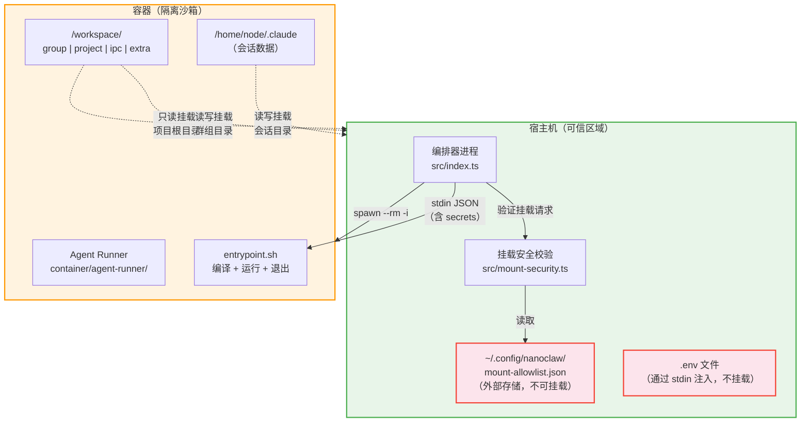
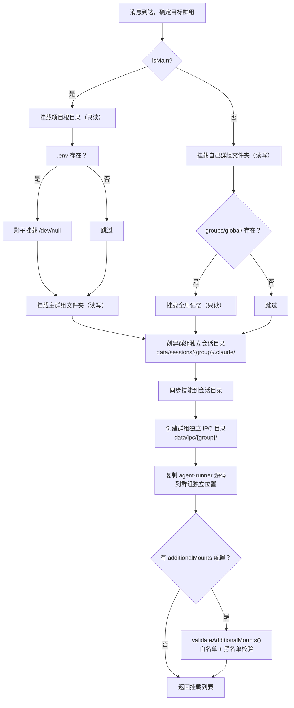
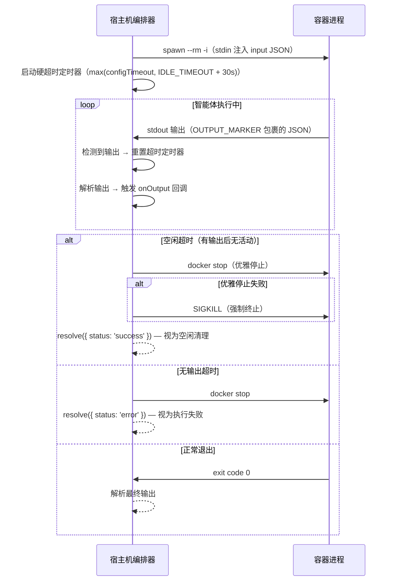
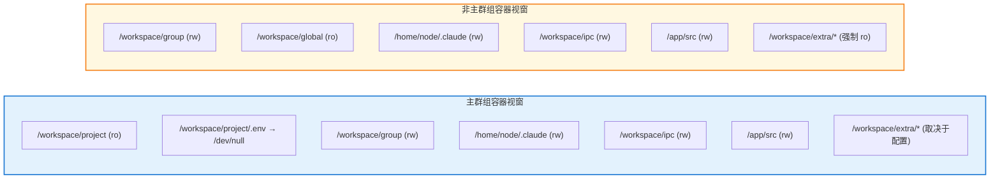

NanoClaw 将所有 AI 智能体（Agent）的执行限制在容器内部——这不仅是部署选择，更是系统安全模型的第一道防线。无论底层运行时是 Docker 还是 Apple Container，每一个群组的每一次请求都会在独立的、临时的、非特权的 Linux 环境中运行。容器只能看到宿主机上**显式挂载的目录**，进程以 `node` 用户（uid 1000）身份运行，且容器在任务完成后被自动销毁（`--rm`）。本文将从**文件系统沙箱的挂载拓扑**、**进程隔离的用户模型与生命周期**、**双运行时抽象层的差异**、以及**命名空间隔离（会话、IPC）** 四个维度，深入剖析 NanoClaw 的容器隔离机制。

Sources: [SECURITY.md](docs/SECURITY.md#L14-L23), [container-runtime.ts](src/container-runtime.ts#L1-L10)

## 容器隔离架构全景

在深入每个子系统之前，先建立整体认知。下图展示了宿主机与容器之间的边界关系：容器只能通过 `buildVolumeMounts()` 构建的显式挂载点访问宿主机的有限资源，而安全策略（mount-allowlist）存储在容器永远无法触及的外部位置。



Sources: [SECURITY.md](docs/SECURITY.md#L96-L123), [container-runner.ts](src/container-runner.ts#L57-L211)

## 文件系统沙箱：挂载拓扑

NanoClaw 的沙箱核心在于**最小权限挂载**——容器内的文件系统视窗完全由 `buildVolumeMounts()` 函数精确控制。主群组与非主群组拥有截然不同的挂载策略，从物理层面限制了每个群组能访问的宿主机资源。

### 主群组的挂载拓扑

主群组（`isMain: true`）作为管理通道，需要访问项目源码（用于调试和修改配置），但所有关键路径都施加了只读或影子挂载保护：

| 容器内路径 | 宿主机源 | 读写权限 | 用途 |
|---|---|---|---|
| `/workspace/project` | 项目根目录 | **只读** | 访问 CLAUDE.md、src/ 等 |
| `/workspace/project/.env` | `/dev/null` | **只读**（影子挂载） | 遮蔽真实 .env，防止泄露密钥 |
| `/workspace/group` | `groups/{group}/` | 读写 | 群组工作目录 |
| `/workspace/global` | `groups/global/` | 读写 | 全局记忆目录 |
| `/workspace/ipc` | `data/ipc/{group}/` | 读写 | IPC 通信目录 |
| `/home/node/.claude` | `data/sessions/{group}/.claude/` | 读写 | Claude 会话与设置 |
| `/app/src` | `data/sessions/{group}/agent-runner-src/` | 读写 | 可定制的 agent-runner 源码 |
| `/workspace/extra/{name}` | 白名单验证后的路径 | 取决于配置 | 额外挂载 |

**影子挂载（Shadow Mount）** 是一个精巧的设计：当 `.env` 文件存在于项目根目录时，系统将 `/dev/null` 挂载到容器的 `/workspace/project/.env`，使容器内的智能体读取到空内容而非真实密钥。密钥仅通过 stdin JSON 安全注入。在 Apple Container 运行时中，由于 VirtioFS 只支持目录挂载不支持文件级挂载，这一机制被替换为入口脚本中的 `mount --bind /dev/null` 操作。

Sources: [container-runner.ts](src/container-runner.ts#L65-L99), [container/Dockerfile](container/Dockerfile#L76-L86), [convert-to-apple-container/Dockerfile](.claude/skills/convert-to-apple-container/modify/container/Dockerfile#L56-L58)

### 非主群组的挂载拓扑

非主群组（`isMain: false`）受到更严格的约束——它们完全看不到项目根目录：

| 容器内路径 | 宿主机源 | 读写权限 | 用途 |
|---|---|---|---|
| `/workspace/group` | `groups/{group}/` | 读写 | 仅自己的群组工作目录 |
| `/workspace/global` | `groups/global/` | **只读** | 全局记忆（只读访问） |
| `/workspace/ipc` | `data/ipc/{group}/` | 读写 | 自己的 IPC 命名空间 |
| `/home/node/.claude` | `data/sessions/{group}/.claude/` | 读写 | 独立的 Claude 会话 |
| `/app/src` | `data/sessions/{group}/agent-runner-src/` | 读写 | 独立的 agent-runner 副本 |
| `/workspace/extra/{name}` | 白名单验证后 | **强制只读** | 额外挂载被强制只读 |

关键差异在于：非主群组没有 `/workspace/project` 挂载，无法访问项目源码；全局记忆目录被限制为只读；额外挂载在 `nonMainReadOnly: true`（默认值）配置下被强制设为只读。

Sources: [container-runner.ts](src/container-runner.ts#L94-L112), [mount-security.ts](src/mount-security.ts#L296-L299)

### 挂载构建的完整流程

下面的流程图展示了从消息到达、到容器挂载构建完成的完整决策路径：



Sources: [container-runner.ts](src/container-runner.ts#L57-L211)

## 进程隔离：用户模型与生命周期

### 非 root 用户执行

容器内部以 `node` 用户（uid 1000）运行。Dockerfile 中通过 `USER node` 指令切换，这是使用 Claude Code `--dangerously-skip-permissions` 模式的前提条件。同时，宿主机通过 `--user` 参数将容器进程映射到宿主机的实际用户 UID/GID，确保挂载文件的读写权限一致：

```typescript
// 仅当宿主机 UID 非 root(0) 且非 node(1000) 时才映射
const hostUid = process.getuid?.();
const hostGid = process.getgid?.();
if (hostUid != null && hostUid !== 0 && hostUid !== 1000) {
  args.push('--user', `${hostUid}:${hostGid}`);
  args.push('-e', 'HOME=/home/node');
}
```

这种 UID 映射策略避开了两个边界情况：root 用户（uid 0）不需要映射，而 node 用户（uid 1000）与容器内默认用户一致也无需映射。

Sources: [container/Dockerfile](container/Dockerfile#L59-L66), [container-runner.ts](src/container-runner.ts#L238-L243)

### 入口脚本的编译加固

容器的入口脚本（`entrypoint.sh`）在每次容器启动时执行以下流程：

```bash
#!/bin/bash
set -e
cd /app && npx tsc --outDir /tmp/dist 2>&1 >&2  # 重新编译 TypeScript
ln -s /app/node_modules /tmp/dist/node_modules     # 链接依赖
chmod -R a-w /tmp/dist                              # 设为只读！
cat > /tmp/input.json                               # 从 stdin 读取 JSON（含 secrets）
node /tmp/dist/index.js < /tmp/input.json           # 执行
```

`chmod -R a-w /tmp/dist` 是一个容易被忽视但至关重要的操作：它将编译后的 JavaScript 代码设为不可写，防止智能体在运行时篡改自己的执行逻辑。配合将 agent-runner 源码复制到每个群组的独立目录（`data/sessions/{group}/agent-runner-src/`），不同群组可以自定义各自的 agent-runner 行为，而互不影响。

Sources: [container/Dockerfile](container/Dockerfile#L54-L57), [container-runner.ts](src/container-runner.ts#L176-L198)

### 容器生命周期与超时机制

每个容器的生命周期由编排器严格管理。容器以 `--rm` 参数启动，退出时自动清理；命名规则 `nanoclaw-{safeName}-{timestamp}` 确保每次运行拥有唯一标识。超时策略采用双层设计：



默认超时配置为 30 分钟（`CONTAINER_TIMEOUT = 1800000`），但硬超时下限锁定为 `IDLE_TIMEOUT + 30s`（默认 33 分钟），确保空闲清理的优雅关闭哨兵有时间触发。每次容器产出有效输出，超时定时器都会被重置——这意味着长时间运行但持续产出结果的容器不会被误杀。

Sources: [container-runner.ts](src/container-runner.ts#L398-L479), [config.ts](src/config.ts#L42-L51)

### 孤儿容器清理

编排器启动时调用 `cleanupOrphans()` 扫描所有名称以 `nanoclaw-` 开头的运行中容器，逐一优雅停止。这是防御上一次非正常退出残留容器的安全网：

Sources: [container-runtime.ts](src/container-runtime.ts#L64-L87)

## 双运行时抽象层

NanoClaw 通过 `container-runtime.ts` 将运行时差异抽象为统一接口，使切换 Docker 和 Apple Container 只需修改一个文件。两者的核心差异如下：

| 维度 | Docker | Apple Container |
|---|---|---|
| 运行时二进制 | `docker` | `container` |
| 只读挂载参数 | `-v src:dst:ro` | `--mount type=bind,source=src,target=dst,readonly` |
| 健康检查 | `docker info` | `container system status` |
| 启动命令 | 无需额外启动 | `container system start` |
| 孤儿清理 | `docker ps --filter name=nanoclaw-` | `container ls --format json` + JSON 解析 |
| .env 影子挂载 | 文件级挂载 `/dev/null` | 入口脚本 `mount --bind /dev/null`（需 root） |
| 主容器用户映射 | `--user uid:gid` | 主容器传 `RUN_UID/RUN_GID`，入口脚本用 `setpriv` 降权 |
| 网络模型 | 原生桥接网络 | vmnet 桥接 + NAT（需手动配置） |
| 文件挂载粒度 | 文件和目录均可 | 仅目录（VirtioFS 限制） |

Apple Container 的主容器需要以 root 身份启动（因为 `mount --bind` 需要特权），然后通过入口脚本中的 `setpriv` 降权到宿主机用户。Docker 则直接通过 `--user` 参数在容器创建时完成用户映射。

Sources: [container-runtime.ts](src/container-runtime.ts#L1-L88), [convert-to-apple-container/container-runtime.ts](.claude/skills/convert-to-apple-container/modify/src/container-runtime.ts#L1-L86), [convert-to-apple-container/container-runner.ts](.claude/skills/convert-to-apple-container/modify/src/container-runner.ts#L210-L248), [APPLE-CONTAINER-NETWORKING.md](docs/APPLE-CONTAINER-NETWORKING.md#L1-L44)

## 命名空间隔离：会话与 IPC

### 群组目录路径解析与逃逸防护

所有群组路径的解析都经过 `group-folder.ts` 的严格校验。文件夹名必须匹配 `^[A-Za-z0-9][A-Za-z0-9_-]{0,63}$`，禁止包含 `/`、`\\`、`..`，且 `global` 为保留名称。解析后的路径还会通过 `ensureWithinBase()` 验证不会逃逸出基础目录：

```typescript
function ensureWithinBase(baseDir: string, resolvedPath: string): void {
  const rel = path.relative(baseDir, resolvedPath);
  if (rel.startsWith('..') || path.isAbsolute(rel)) {
    throw new Error(`Path escapes base directory: ${resolvedPath}`);
  }
}
```

Sources: [group-folder.ts](src/group-folder.ts#L1-L44)

### 会话命名空间隔离

每个群组拥有独立的 Claude 会话目录，挂载到容器内的 `/home/node/.claude`：

```
data/
└── sessions/
    ├── main-group/
    │   ├── .claude/          → 挂载为 /home/node/.claude
    │   │   ├── settings.json   （Claude Code 配置）
    │   │   └── skills/         （从 container/skills/ 同步）
    │   └── agent-runner-src/  → 挂载为 /app/src
    ├── dev-team/
    │   ├── .claude/          → 完全独立
    │   └── agent-runner-src/
    └── support-bot/
        ├── .claude/          → 完全独立
        └── agent-runner-src/
```

这种隔离意味着：一个群组的对话历史、Claude 设置、自定义技能、agent-runner 修改，对其他群组完全不可见。主群组可以读取项目代码，但非主群组连 `/workspace/project` 都不存在。

Sources: [container-runner.ts](src/container-runner.ts#L114-L162), [SECURITY.md](docs/SECURITY.md#L47-L53)

### IPC 命名空间隔离

每个群组拥有独立的 IPC 目录结构，挂载到容器内的 `/workspace/ipc`：

```
data/ipc/
├── main-group/           → 挂载为 /workspace/ipc（主群组容器内）
│   ├── messages/           （出站消息队列）
│   ├── tasks/              （任务操作队列）
│   ├── input/              （入站消息注入）
│   ├── current_tasks.json  （任务快照）
│   └── available_groups.json（可见群组列表）
├── dev-team/             → 挂载为 /workspace/ipc（非主群组容器内）
│   ├── messages/
│   ├── tasks/
│   ├── input/
│   └── current_tasks.json  （仅自己的任务）
└── errors/               （处理失败的 IPC 文件）
```

宿主机的 IPC 监听器（`startIpcWatcher()`）扫描每个群组的 IPC 目录，并**基于目录路径（而非文件内容）确定消息来源的身份**。这意味着一个群组的容器无法伪造另一个群组的身份——它只能写入自己挂载的 `/workspace/ipc` 目录。在授权层面，非主群组只能向自己所在的聊天发送消息，只有主群组拥有跨群组操作权限。

Sources: [container-runner.ts](src/container-runner.ts#L164-L174), [ipc.ts](src/ipc.ts#L36-L93), [container-runner.ts](src/container-runner.ts#L640-L664)

## 密钥注入：stdin 而非文件挂载

NanoClaw 的密钥管理遵循一个核心原则：**密钥永远不作为文件挂载到容器中**。整个流程如下：

1. **宿主机**从 `.env` 文件读取指定密钥（`CLAUDE_CODE_OAUTH_TOKEN`、`ANTHROPIC_API_KEY` 等），仅限白名单中的变量
2. 密钥被注入到 `ContainerInput` JSON 的 `secrets` 字段
3. JSON 通过 **stdin 管道** 传入容器进程
4. 容器入口脚本将 stdin 写入 `/tmp/input.json`
5. Agent Runner 读取后立即使用，不再持久化
6. 宿主机在写入后立即从 input 对象中 `delete input.secrets`，防止日志泄露

```typescript
// 通过 stdin 注入密钥（永远不写入磁盘或不作为文件挂载）
input.secrets = readSecrets();
container.stdin.write(JSON.stringify(input));
container.stdin.end();
// 从 input 中移除密钥以免出现在日志中
delete input.secrets;
```

Sources: [container-runner.ts](src/container-runner.ts#L312-L317), [container-runner.ts](src/container-runner.ts#L217-L224), [container/Dockerfile](container/Dockerfile#L54-L56)

## 隔离边界总结

下图展示了主群组与非主群组在容器内部的完整视窗对比——深色背景区域是容器可以访问的资源，白色区域是不可见的：



| 隔离维度 | 实现机制 | 防御目标 |
|---|---|---|
| 文件系统 | 精确的 `buildVolumeMounts()` 只挂载所需目录 | 限制攻击面为挂载点集合 |
| 进程 | `USER node`（uid 1000）+ `chmod -R a-w /tmp/dist` | 防止权限提升和代码篡改 |
| 网络命名空间 | 容器独立网络栈（Docker 桥接 / vmnet） | 进程级网络隔离 |
| 生命周期 | `--rm` + 超时强制终止 + 孤儿清理 | 防止容器逃逸和资源残留 |
| 会话命名空间 | 每群组独立 `data/sessions/{group}/` | 防止跨群组信息泄露 |
| IPC 命名空间 | 每群组独立 `data/ipc/{group}/` + 目录身份认证 | 防止跨群组权限越权 |
| 密钥隔离 | stdin 注入 + .env 影子挂载 + agent 环境变量清理 | 防止密钥泄露给子进程 |

NanoClaw 的安全哲学是：**不信任容器内的任何代码，而是通过物理隔离边界限制其能力**。容器智能体能做什么，完全由挂载了什么决定。

Sources: [SECURITY.md](docs/SECURITY.md#L1-L124)

---

**延伸阅读**：挂载安全策略的白名单校验与符号链接防护机制，详见 [挂载安全：外部白名单、符号链接防护与路径校验](22-gua-zai-an-quan-wai-bu-bai-ming-dan-fu-hao-lian-jie-fang-hu-yu-lu-jing-xiao-yan)；IPC 授权模型中主群组与非主群组的权限差异，详见 [IPC 授权模型：主群组与非主群组的权限差异](24-ipc-shou-quan-mo-xing-zhu-qun-zu-yu-fei-zhu-qun-zu-de-quan-xian-chai-yi)；容器运行器的卷挂载构建细节，详见 [容器运行器（src/container-runner.ts）：容器生命周期与卷挂载](13-rong-qi-yun-xing-qi-src-container-runner-ts-rong-qi-sheng-ming-zhou-qi-yu-juan-gua-zai)。