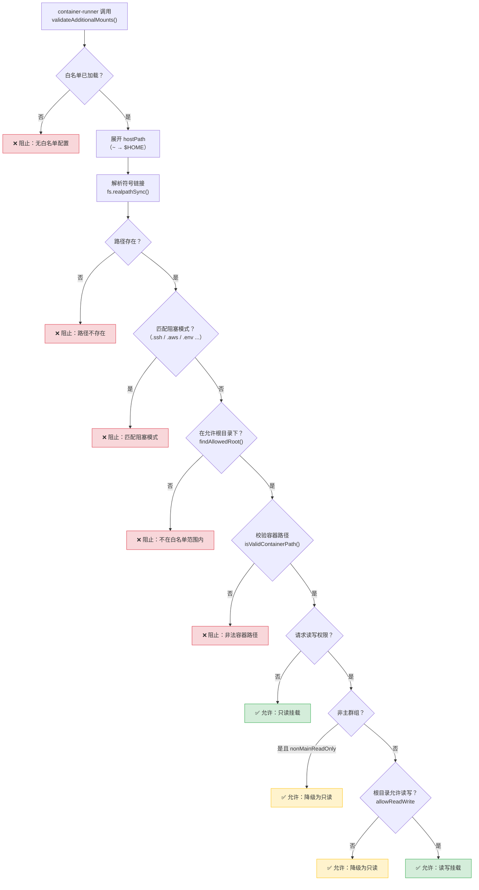

NanoClaw 的安全模型以容器隔离为第一道防线——代理在容器内执行，只能访问显式挂载的路径。但"哪些路径可以被挂载"本身是一个更高维度的安全问题：如果代理能通过组配置注入恶意挂载目标（如 `~/.ssh`、`.env`），容器隔离形同虚设。本文深入剖析 NanoClaw 的三层挂载防护机制：**外部白名单**（防篡改）、**符号链接解析**（防遍历）、**容器路径校验**（防逃逸），以及这些机制如何与容器运行器协同工作。

Sources: [SECURITY.md](docs/SECURITY.md#L24-L45), [mount-security.ts](src/mount-security.ts#L1-L8)

## 威胁模型：为什么需要挂载安全

NanoClaw 的群组配置（`RegisteredGroup.containerConfig.additionalMounts`）允许用户为特定群组声明额外的宿主机目录挂载。然而，这一能力在带来便利性的同时，引入了三类核心威胁：

| 威胁向量 | 攻击场景 | 后果 |
|----------|---------|------|
| **敏感文件泄露** | 挂载 `~/.ssh/id_rsa`、`.env` | 私钥、API Token 被代理读取 |
| **路径遍历** | 利用符号链接将 `~/projects` 指向 `/etc` | 绕过白名单访问任意路径 |
| **容器路径逃逸** | containerPath 设为 `../../etc/passwd` | 挂载点突破 `/workspace/extra/` 沙箱 |

这些威胁的根本原因在于：代理运行在容器内，而容器内的行为受宿主机挂载配置约束。如果配置本身可以被代理修改（例如白名单文件也在挂载范围内），则所有防护都会被绕过。因此，**白名单存储位置**是整个安全模型的基石。

Sources: [types.ts](src/types.ts#L1-L28), [SECURITY.md](docs/SECURITY.md#L96-L123)

## 外部白名单：防篡改的信任锚点

### 存储位置策略

白名单配置文件存储在 `~/.config/nanoclaw/mount-allowlist.json`，这是一个**刻意选在项目根目录之外**的位置。其设计意图极为明确：该路径永远不会被挂载到任何容器中，容器内的代理无法通过文件操作修改安全策略。

```typescript
// config.ts — 白名单路径位于 $HOME/.config/nanoclaw/，不在项目根目录内
export const MOUNT_ALLOWLIST_PATH = path.join(
  HOME_DIR, '.config', 'nanoclaw', 'mount-allowlist.json',
);
```

Sources: [config.ts](src/config.ts#L23-L29)

### 白名单数据结构

白名单由三个核心字段构成，定义在 `MountAllowlist` 接口中：

```typescript
interface MountAllowlist {
  allowedRoots: AllowedRoot[];     // 允许挂载的根目录列表
  blockedPatterns: string[];       // 禁止匹配的路径模式
  nonMainReadOnly: boolean;        // 非主群组是否强制只读
}

interface AllowedRoot {
  path: string;              // 路径（支持 ~ 展开）
  allowReadWrite: boolean;   // 是否允许读写挂载
  description?: string;      // 可选描述
}
```

一个实际的白名单配置示例如下：

```json
{
  "allowedRoots": [
    { "path": "~/projects", "allowReadWrite": true, "description": "Development projects" },
    { "path": "~/repos", "allowReadWrite": true, "description": "Git repositories" },
    { "path": "~/Documents/work", "allowReadWrite": false, "description": "Work documents (read-only)" }
  ],
  "blockedPatterns": ["password", "secret", "token"],
  "nonMainReadOnly": true
}
```

**`allowedRoots`** 定义了一个白名单边界：只有路径解析后的真实路径落在某个 `AllowedRoot.path` 之下时，挂载才被允许。**`blockedPatterns`** 是一个黑名单补充，即使路径在允许的根目录下，只要路径的任何组成部分匹配了阻塞模式（如包含 `password`、`.ssh`），挂载仍会被拒绝。**`nonMainReadOnly`** 是一道权限降级开关——当设为 `true` 时，所有非主群组的额外挂载一律强制只读，无论 `allowReadWrite` 如何配置。

Sources: [types.ts](src/types.ts#L8-L28), [mount-allowlist.json](config-examples/mount-allowlist.json#L1-L25)

### 白名单加载与缓存

白名单在进程生命周期内仅加载一次，结果缓存在内存中：

```typescript
let cachedAllowlist: MountAllowlist | null = null;
let allowlistLoadError: string | null = null;

export function loadMountAllowlist(): MountAllowlist | null {
  if (cachedAllowlist !== null) return cachedAllowlist;
  if (allowlistLoadError !== null) return null; // 失败后不重复尝试
  // ... 加载、解析、校验、缓存
}
```

这一设计有两层考量：其一，**避免每次挂载校验都触发磁盘 I/O**，在高频消息场景下保持性能；其二，**防止 TOCTOU（Time-of-Check-Time-of-Use）攻击**——如果白名单在运行时被动态重载，代理可能通过其他途径（如向宿主机写文件）修改白名单后在同一进程生命周期内生效。缓存策略确保白名单修改需要重启服务才能生效，增加了攻击难度。

加载时会进行结构校验（`allowedRoots` 必须为数组、`nonMainReadOnly` 必须为布尔值），并将用户自定义的 `blockedPatterns` 与内置默认阻塞模式合并去重。

Sources: [mount-security.ts](src/mount-security.ts#L22-L119)

### 默认阻塞模式

系统内置了一组**不可覆盖的阻塞模式**，覆盖了常见的敏感文件路径：

```
.ssh, .gnupg, .gpg, .aws, .azure, .gcloud, .kube, .docker,
credentials, .env, .netrc, .npmrc, .pypirc,
id_rsa, id_ed25519, private_key, .secret
```

这些模式覆盖了 SSH 密钥、云服务凭证、包管理器配置等敏感文件。即使管理员在白名单中允许了 `~/` 根目录，任何路径组件中包含 `.ssh` 的挂载请求仍会被拦截。合并逻辑使用 `Set` 去重，确保用户自定义模式不会重复：

```typescript
const mergedBlockedPatterns = [
  ...new Set([...DEFAULT_BLOCKED_PATTERNS, ...allowlist.blockedPatterns]),
];
```

Sources: [mount-security.ts](src/mount-security.ts#L29-L47), [mount-security.ts](src/mount-security.ts#L91-L95)

## 符号链接防护：路径解析的三重验证

符号链接是挂载安全中最容易被忽视的攻击面。考虑以下场景：白名单允许 `~/projects`，攻击者在 `~/projects/link` 创建一个指向 `~/.ssh` 的符号链接。如果校验时不解析符号链接，`~/projects/link` 会通过白名单检查，但实际挂载的将是 `~/.ssh` 的内容。

NanoClaw 通过 `getRealPath` 函数在验证前解析所有符号链接：

```typescript
function getRealPath(p: string): string | null {
  try {
    return fs.realpathSync(p);  // 递归解析所有符号链接
  } catch {
    return null;                // 路径不存在则返回 null
  }
}
```

验证流程中的关键步骤如下——注意 `realPath` 在每一步中都替代了原始路径：

1. **展开波浪号**：`expandPath()` 将 `~/projects` 转换为 `/home/user/projects`
2. **解析符号链接**：`getRealPath()` 获取真实路径（如 `/home/user/projects` → `/data/user-projects`，如果 `~/projects` 是符号链接）
3. **阻塞模式匹配**：在真实路径上执行匹配
4. **白名单根目录匹配**：同样在真实路径上与解析后的 `AllowedRoot.path` 比较

```typescript
const expandedPath = expandPath(mount.hostPath);      // 步骤 1
const realPath = getRealPath(expandedPath);             // 步骤 2

// 步骤 3：在真实路径上检查阻塞模式
const blockedMatch = matchesBlockedPattern(realPath, allowlist.blockedPatterns);

// 步骤 4：在真实路径上检查白名单
const allowedRoot = findAllowedRoot(realPath, allowlist.allowedRoots);
```

`findAllowedRoot` 内部同样对 `AllowedRoot.path` 执行符号链接解析，然后使用 `path.relative()` 判断挂载路径是否在允许根目录之下：

```typescript
function findAllowedRoot(realPath: string, allowedRoots: AllowedRoot[]): AllowedRoot | null {
  for (const root of allowedRoots) {
    const expandedRoot = expandPath(root.path);
    const realRoot = getRealPath(expandedRoot);  // 白名单根也解析符号链接
    if (realRoot === null) continue;
    const relative = path.relative(realRoot, realPath);
    if (!relative.startsWith('..') && !path.isAbsolute(relative)) {
      return root;  // 路径在白名单根目录之下
    }
  }
  return null;
}
```

Sources: [mount-security.ts](src/mount-security.ts#L122-L197), [mount-security.ts](src/mount-security.ts#L258-L291)

## 容器路径校验：防止挂载点逃逸

除了宿主机路径安全外，NanoClaw 还校验容器内的挂载目标路径。所有额外挂载都被限制在 `/workspace/extra/` 命名空间下。`isValidContainerPath` 函数执行三项检查：

```typescript
function isValidContainerPath(containerPath: string): boolean {
  if (containerPath.includes('..')) return false;      // 防止路径遍历
  if (containerPath.startsWith('/')) return false;     // 禁止绝对路径
  if (!containerPath || containerPath.trim() === '') return false;  // 禁止空路径
  return true;
}
```

- **禁止 `..`**：阻止 `../../etc/passwd` 等路径遍历攻击，确保挂载点不会逃逸出 `/workspace/extra/`
- **禁止绝对路径**：强制所有挂载目标相对于 `/workspace/extra/` 前缀，由 `validateAdditionalMounts` 统一拼接
- **禁止空路径**：防止因缺失 `containerPath` 而直接挂载到 `/workspace/extra/` 本身

通过校验后，容器路径被固定拼接：

```typescript
validatedMounts.push({
  hostPath: result.realHostPath!,
  containerPath: `/workspace/extra/${result.resolvedContainerPath}`,
  readonly: result.effectiveReadonly!,
});
```

如果用户未指定 `containerPath`，则默认使用 `hostPath` 的 `basename`：

```typescript
const containerPath = mount.containerPath || path.basename(mount.hostPath);
```

Sources: [mount-security.ts](src/mount-security.ts#L200-L257), [mount-security.ts](src/mount-security.ts#L349-L359)

## 完整校验流程

以下流程图展示了一个额外挂载请求从进入校验到最终被容器运行器消费的完整路径：



Sources: [mount-security.ts](src/mount-security.ts#L221-L329), [container-runner.ts](src/container-runner.ts#L200-L211)

## 读写权限的三级降级机制

挂载的读写权限由三个层级依次决定，形成从宽松到严格的瀑布式降级：

| 优先级 | 条件 | 结果 | 说明 |
|--------|------|------|------|
| 1 | 未请求读写（`readonly !== false`） | 只读 | 默认安全；仅声明 `readonly: false` 才进入降级判断 |
| 2 | 非主群组 + `nonMainReadOnly = true` | 强制只读 | 群组级策略，管理员一刀切保护 |
| 3 | `allowReadWrite = false` | 强制只读 | 根目录级策略，即使主群组也只能只读 |
| — | 全部通过 | 读写 | 两个条件均满足才授予写权限 |

```typescript
let effectiveReadonly = true; // 默认只读
if (requestedReadWrite) {
  if (!isMain && allowlist.nonMainReadOnly) {
    effectiveReadonly = true;   // 层级 2：非主群组降级
  } else if (!allowedRoot.allowReadWrite) {
    effectiveReadonly = true;   // 层级 3：根目录不允许写
  } else {
    effectiveReadonly = false;  // 全部通过：允许读写
  }
}
```

Sources: [mount-security.ts](src/mount-security.ts#L293-L320)

## 容器运行器中的挂载编排

`container-runner.ts` 中的 `buildVolumeMounts` 函数是挂载安全的最终执行点。它将挂载分为**系统挂载**（框架内置、不可配置）和**额外挂载**（用户配置、需校验）两类：

### 系统挂载（始终存在）

| 挂载目标 | 容器路径 | 读写 | 说明 |
|----------|---------|------|------|
| 项目根目录（仅主群组） | `/workspace/project` | 只读 | 代理可读源码但不能修改 |
| `/dev/null`（.env 影子挂载） | `/workspace/project/.env` | 只读 | 阻止代理读取宿主机 .env |
| 群组文件夹 | `/workspace/group` | 读写 | 代理的工作目录 |
| 全局记忆目录（非主群组） | `/workspace/global` | 只读 | 跨群组共享的 CLAUDE.md |
| 群组会话目录 | `/home/node/.claude` | 读写 | Claude Code 会话状态 |
| 群组 IPC 目录 | `/workspace/ipc` | 读写 | 进程间通信 |
| 群组 agent-runner 副本 | `/app/src` | 读写 | 允许代理自定义行为 |

其中，**`.env` 影子挂载**是一个精巧的安全设计：主群组的代理需要访问项目源码（因此挂载项目根目录），但 `.env` 文件中包含敏感凭证（WhatsApp Token、API Key 等）。通过将 `/dev/null` 挂载到 `/workspace/project/.env`，代理看到的是一个空文件而非真实的凭证。真实的 Claude 凭证通过 `stdin` 管道传递给容器，避免写入磁盘。

Sources: [container-runner.ts](src/container-runner.ts#L57-L211), [container-runner.ts](src/container-runner.ts#L217-L224)

### 额外挂载（经白名单校验）

```typescript
if (group.containerConfig?.additionalMounts) {
  const validatedMounts = validateAdditionalMounts(
    group.containerConfig.additionalMounts,
    group.name,
    isMain,
  );
  mounts.push(...validatedMounts);
}
```

只有通过完整校验链的挂载才会被加入最终的 `mounts` 数组。被拒绝的挂载会以 `warn` 级别记录日志，包含群组名、请求路径和拒绝原因，便于运维排查。

Sources: [container-runner.ts](src/container-runner.ts#L200-L211), [mount-security.ts](src/mount-security.ts#L336-L385)

## 安装阶段的白名单配置

白名单通过 setup 流程中的 `mounts` 步骤写入，支持三种输入模式：

```bash
# 模式 1：写入空白白名单（全部阻止）
npx tsx setup/index.ts --step mounts --empty

# 模式 2：通过命令行参数传入 JSON
npx tsx setup/index.ts --step mounts --json '{"allowedRoots":[...]}'

# 模式 3：通过 stdin 管道传入
cat my-allowlist.json | npx tsx setup/index.ts --step mounts
```

无论哪种模式，JSON 都会在进程内通过 `JSON.parse()` 解析（而非通过 shell 管道），避免 shell 注入风险。验证步骤（`setup/verify.ts`）会检查白名单文件是否存在，并在验证报告中输出状态。

Sources: [mounts.ts](setup/mounts.ts#L26-L115), [verify.ts](setup/verify.ts#L158-L166)

## 安全边界总览

以下架构图展示了挂载安全在整个系统中的位置——它位于**宿主机可信区域**内，作为容器挂载请求的最后一道关卡：

```
┌─────────────────────────────────────────────────────────────────┐
│                    HOST (TRUSTED ZONE)                           │
│                                                                  │
│  ┌──────────────────┐    ┌─────────────────────────────────┐    │
│  │  RegisteredGroup  │    │  ~/.config/nanoclaw/             │    │
│  │  containerConfig  │    │    mount-allowlist.json  ◄───────┼────┼── 不挂载到容器
│  │  additionalMounts │    │  (外部白名单，不可被代理修改)      │    │
│  └────────┬─────────┘    └─────────────────────────────────┘    │
│           │                        │                              │
│           ▼                        ▼                              │
│  ┌──────────────────────────────────────────────────────────┐   │
│  │               mount-security.ts (校验引擎)                 │   │
│  │  1. 加载外部白名单 ──► 缓存                               │   │
│  │  2. expandPath() ──► getRealPath() ──► 解析符号链接       │   │
│  │  3. matchesBlockedPattern() ──► 黑名单过滤                │   │
│  │  4. findAllowedRoot() ──► 白名单边界检查                  │   │
│  │  5. isValidContainerPath() ──► 容器路径沙箱               │   │
│  │  6. 三级读写降级 ──► effectiveReadonly                     │   │
│  └──────────────────────────┬───────────────────────────────┘   │
│                             │ 通过校验的挂载列表                   │
│                             ▼                                    │
│  ┌──────────────────────────────────────────────────────────┐   │
│  │  container-runner.ts                                      │   │
│  │  buildVolumeMounts() = 系统挂载 + 额外挂载                  │   │
│  │  buildContainerArgs() = docker run -v ... :ro / -v ...     │   │
│  └──────────────────────────┬───────────────────────────────┘   │
│                             │                                    │
└─────────────────────────────┼────────────────────────────────────┘
                              ▼
┌─────────────────────────────────────────────────────────────────┐
│                  CONTAINER (SANDBOXED)                           │
│  /workspace/project  (ro, 仅主群组)                               │
│  /workspace/project/.env → /dev/null (影子挂载)                   │
│  /workspace/group  (rw)                                          │
│  /workspace/global  (ro, 非主群组)                                │
│  /workspace/extra/{name}  (ro/rw, 经白名单校验)                   │
│  /workspace/ipc  (rw)                                            │
│  /home/node/.claude  (rw)                                        │
└─────────────────────────────────────────────────────────────────┘
```

Sources: [SECURITY.md](docs/SECURITY.md#L96-L123), [container-runner.ts](src/container-runner.ts#L57-L211)

## 延伸阅读

- **[容器隔离：文件系统沙箱与进程隔离](21-rong-qi-ge-chi-wen-jian-xi-tong-sha-xiang-yu-jin-cheng-ge-chi)**：理解容器层面的隔离如何与挂载安全互补
- **[发送者白名单与消息过滤](23-fa-song-zhe-bai-ming-dan-yu-xiao-xi-guo-lu-src-sender-allowlist-ts)**：另一层白名单机制，控制谁可以触发代理
- **[IPC 授权模型：主群组与非主群组的权限差异](24-ipc-shou-quan-mo-xing-zhu-qun-zu-yu-fei-zhu-qun-zu-de-quan-xian-chai-yi)**：理解 `isMain` 标志如何影响整个权限体系
- **[挂载白名单与服务启动](8-gua-zai-bai-ming-dan-yu-fu-wu-qi-dong)**：安装阶段的实操步骤