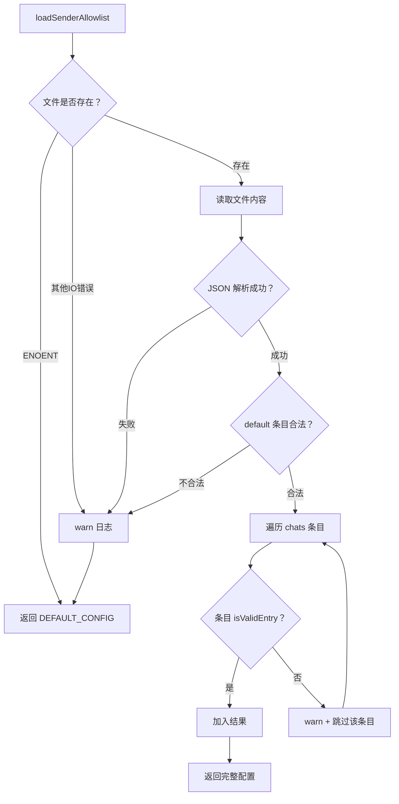
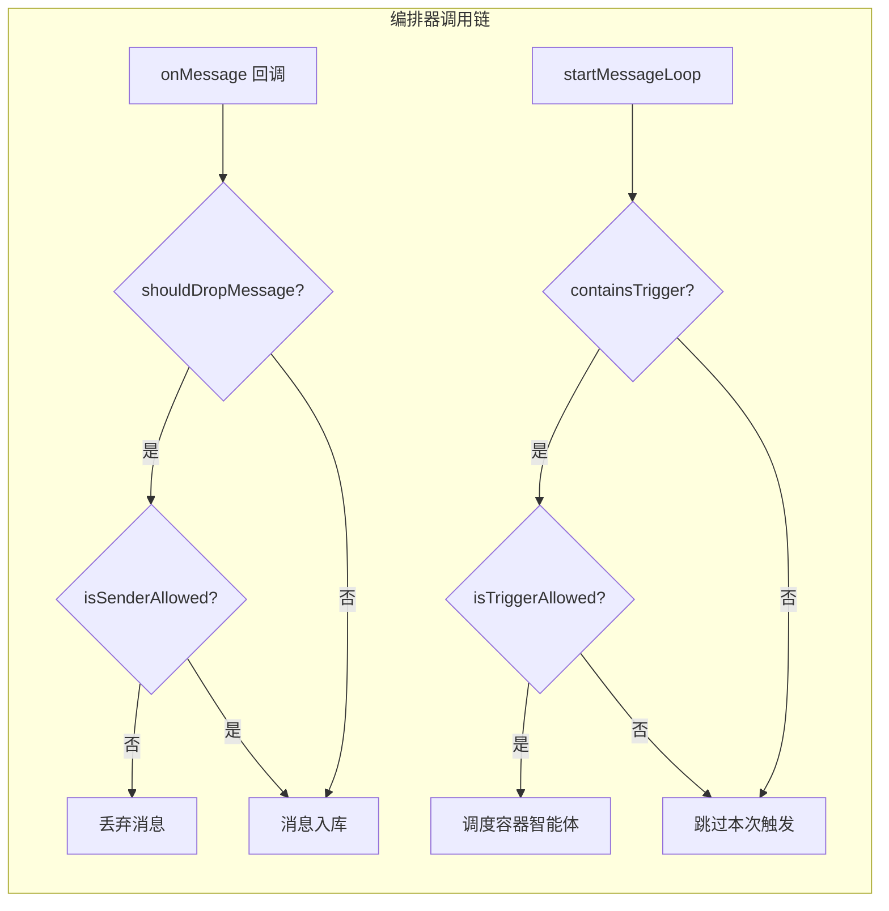

发送者白名单模块是 NanoClaw 安全模型中面向**消息来源身份验证**的一层。它通过一个外部 JSON 配置文件，决定哪些用户可以在哪些群组中触发智能体响应，以及未授权的消息是否应该被静默丢弃。该模块与编排器中的两大关键流程深度集成：**消息入站回调**（`onMessage`）负责 drop 模式的早期过滤，**消息循环**（`startMessageLoop` / `processQueuedMessages`）负责 trigger 模式的权限校验。这种双层过滤设计确保了未授权消息既不会消耗存储资源，也不会触发容器化的智能体运行。

Sources: [sender-allowlist.ts](src/sender-allowlist.ts#L1-L129), [index.ts](src/index.ts#L46-L51)

## 配置结构与数据模型

白名单的核心数据结构由两个 TypeScript 接口定义。`ChatAllowlistEntry` 描述单个聊天的访问规则：`allow` 字段可以是通配符 `'*'`（允许所有人）或字符串数组（仅允许列表中的发送者 ID）；`mode` 字段决定该聊天处于 `trigger` 还是 `drop` 模式。`SenderAllowlistConfig` 是顶层配置，包含一个 `default` 默认规则、一个以聊天 JID 为键的 `chats` 覆盖映射，以及一个 `logDenied` 布尔值控制是否记录被拒绝的消息。

```typescript
export interface ChatAllowlistEntry {
  allow: '*' | string[];       // 通配符或发送者 ID 列表
  mode: 'trigger' | 'drop';    // 过滤模式
}

export interface SenderAllowlistConfig {
  default: ChatAllowlistEntry;                    // 默认规则
  chats: Record<string, ChatAllowlistEntry>;      // 按聊天 JID 覆盖
  logDenied: boolean;                             // 是否记录拒绝事件
}
```

配置文件的默认路径为 `~/.config/nanoclaw/sender-allowlist.json`，与挂载安全白名单（`mount-allowlist.json`）同目录，存放在项目根目录之外，**不会被挂载到容器内部**，这是一种刻意的设计选择——将安全策略与容器运行时隔离。

Sources: [sender-allowlist.ts](src/sender-allowlist.ts#L6-L21), [config.ts](src/config.ts#L30-L35)

## 配置加载与防御性校验

`loadSenderAllowlist` 函数是整个模块的入口点，它实现了一套**多层防御性的加载策略**，在文件不存在、JSON 解析失败、schema 不合法等多种异常场景下均能安全降级到全开放默认配置（`allow: '*', mode: 'trigger'`）。



校验逻辑由 `isValidEntry` 类型守卫函数承担。它要求 `allow` 字段必须是字符串 `'*'` 或纯字符串数组（拒绝 `[123, null, true]` 这类非法值），且 `mode` 必须是 `'trigger'` 或 `'drop'`。对 `chats` 映射中的每个条目逐一校验，合法的保留，非法的跳过并输出警告日志——**不会因为某一条目损坏而丢弃整个配置文件**。`logDenied` 字段使用宽松判断（`obj.logDenied !== false`），仅在显式设为 `false` 时关闭拒绝日志，否则默认开启。

Sources: [sender-allowlist.ts](src/sender-allowlist.ts#L23-L89)

## 两种过滤模式的语义差异

白名单的 `mode` 字段定义了两种截然不同的过滤策略，它们在消息流中的拦截时机和行为各不相同：

| 维度 | `trigger` 模式 | `drop` 模式 |
|------|---------------|-------------|
| **拦截时机** | 消息循环判断是否需要触发智能体时 | 入站 `onMessage` 回调中，消息入库前 |
| **行为** | 未授权的触发词被忽略，非触发消息正常入库 | 未授权消息被直接丢弃，不入库 |
| **适用场景** | 允许所有人聊天记录作为上下文，但仅特定用户可触发智能体 | 完全屏蔽特定用户的所有消息 |
| **对上下文的影响** | 未授权用户的历史消息会作为上下文发送给智能体 | 未授权用户的消息对智能体完全不可见 |

这种设计使得管理员可以根据群组的敏感程度灵活选择策略：公开讨论群组使用 `trigger` 模式保持对话开放但限制触发权限，而私密群组使用 `drop` 模式彻底屏蔽无关人员。

Sources: [sender-allowlist.ts](src/sender-allowlist.ts#L98-L128), [index.ts](src/index.ts#L484-L498)

## 编排器中的集成点

白名单在编排器（`src/index.ts`）中有**三个集成点**，覆盖了消息从入站到触发智能体的完整生命周期：

**集成点 1：入站消息 Drop 过滤（`onMessage` 回调）。** 当新消息到达时，编排器首先检查 `msg.is_from_me` 和 `msg.is_bot_message`——来自自身或机器人本身的消息始终放行。对于其他消息，加载白名单配置，检查目标聊天是否处于 `drop` 模式且发送者不在白名单中。若两者同时满足，消息被静默丢弃（`return`），不会调用 `storeMessage` 入库。这一层过滤发生在消息存储之前，是最早的拦截点。

Sources: [index.ts](src/index.ts#L482-L501)

**集成点 2：主消息循环的触发校验（`startMessageLoop`）。** 对于非主群组（`isMainGroup === false`）且未禁用触发要求（`requiresTrigger !== false`）的群组，编排器在待处理消息中搜索包含触发词（`TRIGGER_PATTERN`）的消息。但触发词的出现并不足以触发智能体——发送者还必须通过 `isTriggerAllowed` 检查。来自自身（`m.is_from_me`）的消息始终允许触发。

Sources: [index.ts](src/index.ts#L385-L402)

**集成点 3：排程消息处理的触发校验（`processQueuedMessages`）。** 当群组因并发限制而排队时，排程处理函数会重新加载白名单配置并执行相同的触发词 + 发送者权限双重校验。这意味着白名单配置可以在运行时动态修改——因为每次判断都通过 `loadSenderAllowlist()` 重新从磁盘读取——而无需重启服务。

Sources: [index.ts](src/index.ts#L155-L173)

## 查询 API 详解

模块导出三个查询函数，它们的职责清晰分离：

**`isSenderAllowed(chatJid, sender, cfg)`** — 纯粹的身份检查。通过 `getEntry` 获取该聊天的配置条目（优先使用 `chats[jid]`，回退到 `default`），若 `allow` 为 `'*'` 返回 `true`，否则检查 `sender` 是否在允许列表中。

**`shouldDropMessage(chatJid, cfg)`** — 模式检查。仅判断该聊天是否处于 `drop` 模式，与发送者身份无关。编排器将此函数与 `isSenderAllowed` 组合使用，实现"是 drop 模式且发送者不在白名单中"的双重条件判断。

**`isTriggerAllowed(chatJid, sender, cfg)`** — 带日志的触发权限检查。内部调用 `isSenderAllowed`，在拒绝时若 `cfg.logDenied` 为 `true` 则输出 debug 级别日志，记录被拒绝的 `chatJid` 和 `sender`，便于运维排查。



Sources: [sender-allowlist.ts](src/sender-allowlist.ts#L91-L128)

## 配置文件示例

以下是 `~/.config/nanoclaw/sender-allowlist.json` 的一个典型配置示例，展示了默认规则与聊天级覆盖的搭配：

```json
{
  "default": { "allow": "*", "mode": "trigger" },
  "chats": {
    "private-group@s.whatsapp.net": {
      "allow": ["alice@s.whatsapp.net", "bob@s.whatsapp.net"],
      "mode": "drop"
    },
    "semi-public@g.us": {
      "allow": ["moderator@s.whatsapp.net"],
      "mode": "trigger"
    }
  },
  "logDenied": true
}
```

在此配置下：大部分群组允许所有人发消息并触发智能体；`private-group` 仅允许 Alice 和 Bob 的消息入库（其余人的消息在入站时即被丢弃）；`semi-public` 允许所有人发消息作为上下文，但只有 `moderator` 的触发词能真正唤醒智能体。

Sources: [sender-allowlist.ts](src/sender-allowlist.ts#L17-L21)

## 运行时动态性与容错设计

一个值得注意的设计决策是 `loadSenderAllowlist` 在每次需要时都被调用（在三个集成点中各调用一次），而非在启动时加载一次后缓存。这意味着修改配置文件后**无需重启服务**即可生效——下一次消息到达或下一次消息循环迭代就会读取到新的配置。代价是每条消息会产生一次文件读取和 JSON 解析的开销，但对于 NanoClaw 的消息频率来说完全可以忽略。

容错方面，模块遵循**宁可开放也不拒绝**的原则。任何配置错误（文件缺失、JSON 语法错误、schema 不匹配）都会导致回退到 `DEFAULT_CONFIG`——`allow: '*'`, `mode: 'trigger'`，即完全开放。这是有意为之的安全权衡：在白名单配置出错时，系统选择继续服务而非锁死所有用户。管理员应通过查看 `warn` 级别日志来发现配置问题。

Sources: [sender-allowlist.ts](src/sender-allowlist.ts#L33-L48), [sender-allowlist.ts](src/sender-allowlist.ts#L60-L66)

## 延伸阅读

- 白名单路径配置与安全隔离策略详见 [挂载安全：外部白名单、符号链接防护与路径校验](22-gua-zai-an-quan-wai-bu-bai-ming-dan-fu-hao-lian-jie-fang-hu-yu-lu-jing-xiao-yan)
- 主群组与非主群组在触发机制和权限上的完整差异参见 [IPC 授权模型：主群组与非主群组的权限差异](24-ipc-shou-quan-mo-xing-zhu-qun-zu-yu-fei-zhu-qun-zu-de-quan-xian-chai-yi)
- 消息从渠道到智能体的完整流转链路参见 [消息流转全链路：从渠道到智能体响应](10-xiao-xi-liu-zhuan-quan-lian-lu-cong-qu-dao-dao-zhi-neng-ti-xiang-ying)
- 白名单在消息循环中的具体调用上下文参见 [编排器（src/index.ts）：状态管理、消息循环与智能体调度](12-bian-pai-qi-src-index-ts-zhuang-tai-guan-li-xiao-xi-xun-huan-yu-zhi-neng-ti-diao-du)