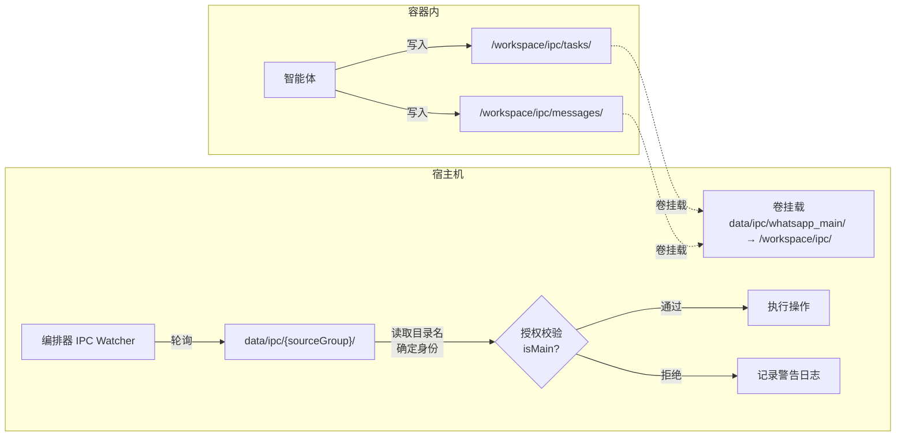

NanoClaw 的 IPC（进程间通信）系统是编排器与容器化智能体之间的唯一通信桥梁。由于智能体运行在具有自主能力的 AI 模型内部，它可能尝试执行超出预期范围的操作——例如向其他群组发送消息、修改其他群组的定时任务、甚至注册新群组。为了防止这种**跨群组权限提升**（cross-group privilege escalation），NanoClaw 实现了一套严格的**基于群组身份的授权模型**，其核心是 **主群组（Main Group）** 与 **非主群组（Non-main Group）** 的权限二分法。

Sources: [ipc.ts](src/ipc.ts#L1-L25), [types.ts](src/types.ts#L35-L43)

## 身份确立：目录即身份

在深入权限差异之前，必须先理解一个关键的安全设计：**IPC 目录名本身就是群组的身份凭证**。每个群组的容器内智能体通过 `/workspace/ipc` 目录写入 IPC 文件，而宿主机上该目录实际映射到 `data/ipc/{groupFolder}/`。这意味着编排器在轮询 IPC 文件时，能够通过**读取哪个目录下的文件**来确信请求来源的群组身份——这是无法被容器内智能体伪造的。



编排器在 `startIpcWatcher` 中扫描 `data/ipc/` 下的所有子目录，每个子目录名（`sourceGroup`）对应一个已注册群组的 `folder` 字段。随后，编排器从 `registeredGroups` 中查找该 `folder` 对应的 `isMain` 属性，构建一个 `folderIsMain` 映射表，供后续每个 IPC 操作的授权校验使用。

Sources: [ipc.ts](src/ipc.ts#L36-L62), [container-runner.ts](src/container-runner.ts#L164-L174)

## 主群组的定义与注册

主群组是在注册时通过 `--is-main` 参数指定的。在数据库中，它以 `is_main = 1` 存储于 `registered_groups` 表，在运行时映射为 `RegisteredGroup.isMain = true`。一个系统通常只有一个主群组，它是管理者的控制通道，拥有**不受限制的全局权限**。主群组的典型特征是 `trigger` 设为 `always`（无需触发词即可响应），且 `requiresTrigger` 默认为 `false`。

Sources: [setup/register.ts](setup/register.ts#L60-L61), [types.ts](src/types.ts#L42)

## 权限矩阵：主群组 vs 非主群组

下表汇总了每种 IPC 操作类型在不同群组身份下的授权行为。授权逻辑中的关键判断条件是 `isMain || (targetFolder === sourceGroup)`——即主群组始终通过，非主群组仅允许操作自身资源。

| IPC 操作 | 主群组 (`isMain=true`) | 非主群组 (`isMain=false`) | 授权核心代码 |
|---|---|---|---|
| **发送消息** (`message`) | 可发送至任意已注册群组 | 仅可发送至自身群组 (`targetGroup.folder === sourceGroup`) | `isMain \|\| (targetGroup && targetGroup.folder === sourceGroup)` |
| **创建任务** (`schedule_task`) | 可为任意已注册群组创建任务 | 仅可为自己的群组创建任务 (`targetFolder === sourceGroup`) | `!isMain && targetFolder !== sourceGroup → block` |
| **暂停任务** (`pause_task`) | 可暂停任意群组的任务 | 仅可暂停自身群组的任务 (`task.group_folder === sourceGroup`) | `isMain \|\| task.group_folder === sourceGroup` |
| **恢复任务** (`resume_task`) | 可恢复任意群组的任务 | 仅可恢复自身群组的任务 | `isMain \|\| task.group_folder === sourceGroup` |
| **取消任务** (`cancel_task`) | 可取消任意群组的任务 | 仅可取消自身群组的任务 | `isMain \|\| task.group_folder === sourceGroup` |
| **更新任务** (`update_task`) | 可更新任意群组的任务 | 仅可更新自身群组的任务 | `isMain \|\| task.group_folder === sourceGroup` |
| **刷新群组** (`refresh_groups`) | ✅ 可触发全局群组元数据同步 | ❌ 完全禁止 | `if (isMain) { ... } else { warn }` |
| **注册群组** (`register_group`) | ✅ 可注册新群组 | ❌ 完全禁止 | `if (!isMain) { warn; break }` |

Sources: [ipc.ts](src/ipc.ts#L76-L93), [ipc.ts](src/ipc.ts#L181-L450)

## 授权流程详解

### 消息发送的授权链路

消息发送是最基础的 IPC 操作。智能体通过 MCP 工具 `send_message` 写入一个 JSON 文件到 `/workspace/ipc/messages/` 目录，编排器在轮询时读取该文件并校验 `data.chatJid` 对应的目标群组是否允许被当前来源群组访问：

```typescript
// 消息授权核心逻辑
const targetGroup = registeredGroups[data.chatJid];
if (isMain || (targetGroup && targetGroup.folder === sourceGroup)) {
  await deps.sendMessage(data.chatJid, data.text);
} else {
  logger.warn({ chatJid: data.chatJid, sourceGroup },
    'Unauthorized IPC message attempt blocked');
}
```

这意味着非主群组的智能体即使写入了一个指向其他群组 JID 的消息文件，该消息也会被静默丢弃并记录警告日志。值得注意的是，主群组甚至可以向**未注册的 JID** 发送消息（因为 `isMain` 条件为 `true` 时直接跳过 `targetGroup` 检查）。

Sources: [ipc.ts](src/ipc.ts#L76-L93), [ipc-auth.test.ts](src/ipc-auth.test.ts#L388-L435)

### 任务操作的授权链路

任务操作（创建、暂停、恢复、取消、更新）共享一个类似的授权模式，但根据操作类型略有差异。**创建任务** (`schedule_task`) 的授权在 `targetFolder`（目标群组的 folder）与 `sourceGroup`（来源群组的 folder）之间进行比对：主群组可以为任何已注册群组创建任务，非主群组只能为自身创建任务。**管理型操作**（暂停、恢复、取消、更新）则在数据库中查找任务记录，比对任务的 `group_folder` 字段与来源群组：

```typescript
// 任务暂停/恢复/取消的统一授权模式
const task = getTaskById(data.taskId);
if (task && (isMain || task.group_folder === sourceGroup)) {
  updateTask(data.taskId, { status: 'paused' }); // 或 delete、active 等
}
```

这种设计确保了一个关键安全属性：**即使非主群组的智能体猜到了另一个群组的任务 ID，它也无法操作该任务**，因为数据库层面的 `group_folder` 校验会阻止越权操作。

Sources: [ipc.ts](src/ipc.ts#L182-L328), [ipc-auth.test.ts](src/ipc-auth.test.ts#L70-L145)

### 管理操作的独占权限

`refresh_groups` 和 `register_group` 是仅限主群组使用的管理操作。`refresh_groups` 触发消息平台的群组元数据同步（例如 WhatsApp 的 `groupFetchAllParticipating`），并将最新的可用群组列表写入主群组的 IPC 快照文件。`register_group` 允许主群组的智能体动态注册新的群组，使其成为系统可响应的对话目标。

`register_group` 还包含额外的**纵深防御**（defense in depth）措施。即使通过了 `isMain` 检查，系统还会调用 `isValidGroupFolder()` 对请求中的 `folder` 字段进行校验，拒绝包含路径遍历字符（如 `../../outside`）、路径分隔符（`/`、`\`）或保留名（如 `global`）的文件夹名。此外，**智能体无法通过 IPC 将新注册的群组设为 `isMain`**——`register_group` 处理逻辑中硬编码构造的 `RegisteredGroup` 对象从不包含 `isMain: true`，这意味着新注册的群组永远是非主群组。

Sources: [ipc.ts](src/ipc.ts#L394-L450), [group-folder.ts](src/group-folder.ts#L5-L16), [ipc-auth.test.ts](src/ipc-auth.test.ts#L330-L367)

## 信息可见性：快照的权限过滤

除了操作授权外，主群组与非主群组在**信息可见性**上也存在差异。编排器在每次启动容器智能体之前，会向其 IPC 目录写入两类快照文件：

| 快照文件 | 主群组可见范围 | 非主群组可见范围 |
|---|---|---|
| `current_tasks.json` | 所有群组的全部任务 | 仅自身 `groupFolder` 对应的任务 |
| `available_groups.json` | 所有可用群组及其 JID | 空列表 `[]`（无法看到其他群组） |

```typescript
// 任务快照过滤逻辑
const filteredTasks = isMain ? tasks : tasks.filter(t => t.groupFolder === groupFolder);

// 群组快照过滤逻辑
const visibleGroups = isMain ? groups : [];
```

这意味着非主群组的智能体甚至**无法获知系统中存在哪些其他群组**，从根本上限制了它发起越权攻击的信息基础。

Sources: [container-runner.ts](src/container-runner.ts#L640-L700), [ipc-mcp-stdio.ts](container/agent-runner/src/ipc-mcp-stdio.ts#L155-L190)

## 文件系统挂载的权限差异

授权差异还延伸到容器文件系统层面。在 `buildVolumeMounts` 函数中，主群组与非主群组获得了不同的卷挂载配置：

| 挂载目标 | 主群组 | 非主群组 | 安全意图 |
|---|---|---|---|
| 项目根目录 (`/workspace/project`) | ✅ 只读挂载 | ❌ 不可见 | 主群组需要了解项目结构以执行管理任务 |
| `.env` 文件 | 被 `/dev/null` 遮蔽 | 不适用 | 防止智能体读取宿主机上的密钥文件 |
| 全局记忆 (`/workspace/global`) | ✅ 只读挂载 | ✅ 只读挂载 | 共享的全局指令，所有群组可读但不可写 |
| 群组目录 (`/workspace/group`) | ✅ 读写挂载 | ✅ 读写挂载 | 每个群组的私有工作空间 |
| 额外挂载（`additionalMounts`） | 按白名单配置可能读写 | 受 `nonMainReadOnly` 强制为只读 | 非主群组无法通过挂载修改宿主机文件 |

其中 `nonMainReadOnly` 是 `MountAllowlist` 配置中的一个安全开关：当设为 `true` 时，即使某个挂载点在白名单中配置了 `allowReadWrite`，非主群组也会被强制降级为只读挂载。

Sources: [container-runner.ts](src/container-runner.ts#L57-L112), [mount-security.ts](src/mount-security.ts#L292-L320), [types.ts](src/types.ts#L12-L19)

## 触发词豁免：消息处理的权限差异

授权差异不仅体现在 IPC 操作上，也体现在**入站消息的处理流程**中。在编排器的消息循环中，主群组 (`isMain === true`) 跳过触发词检测，对所有消息无条件响应；而非主群组必须检测到消息中包含触发词（如 `@Andy`）且发送者在白名单中，才会触发智能体调用：

```typescript
// 触发词检测的权限豁免
if (!isMainGroup && group.requiresTrigger !== false) {
  const hasTrigger = missedMessages.some(m =>
    TRIGGER_PATTERN.test(m.content.trim()) &&
    (m.is_from_me || isTriggerAllowed(chatJid, m.sender, allowlistCfg))
  );
  if (!hasTrigger) return true; // 跳过，不调用智能体
}
```

Sources: [index.ts](src/index.ts#L153-L173)

## 安全设计的纵深防御策略

整个 IPC 授权模型体现了多层安全设计理念：

1. **身份层**：IPC 目录名作为不可伪造的群组身份（容器内智能体无法改变卷挂载映射）
2. **授权层**：每个 IPC 操作类型都有独立的权限校验逻辑，主群组拥有全局通行权
3. **信息层**：非主群组的快照数据被过滤，限制其信息获取能力
4. **文件系统层**：卷挂载配置按群组身份差异化，`nonMainReadOnly` 提供额外的安全降级
5. **纵深防御层**：即使主群组注册新群组，新群组也无法获得 `isMain` 标志；`isValidGroupFolder` 阻止路径注入

Sources: [ipc.ts](src/ipc.ts#L394-L450), [group-folder.ts](src/group-folder.ts#L8-L16), [container-runner.ts](src/container-runner.ts#L57-L211)

## 测试覆盖

IPC 授权模型拥有详尽的测试覆盖（`src/ipc-auth.test.ts`，约 679 行），对每种操作类型的主群组/非主群组行为进行了全面的边界测试。测试覆盖的关键场景包括：主群组为其他群组创建任务、非主群组操作自身任务、非主群组越权操作被拒绝、非主群组无法注册新群组、主群组尝试注册不安全的文件夹名被拒绝等。

Sources: [ipc-auth.test.ts](src/ipc-auth.test.ts#L1-L679)

## 延伸阅读

- [IPC 通信（src/ipc.ts）：基于文件的进程间通信与权限校验](15-ipc-tong-xin-src-ipc-ts-ji-yu-wen-jian-de-jin-cheng-jian-tong-xin-yu-quan-xian-xiao-yan) — IPC 通信机制的完整技术实现
- [挂载安全：外部白名单、符号链接防护与路径校验](22-gua-zai-an-quan-wai-bu-bai-ming-dan-fu-hao-lian-jie-fang-hu-yu-lu-jing-xiao-yan) — 文件系统挂载的安全校验详情
- [容器隔离：文件系统沙箱与进程隔离](21-rong-qi-ge-chi-wen-jian-xi-tong-sha-xiang-yu-jin-cheng-ge-chi) — 容器层面的隔离机制
- [任务调度器（src/task-scheduler.ts）：Cron、间隔与一次性任务](18-ren-wu-diao-du-qi-src-task-scheduler-ts-cron-jian-ge-yu-ci-xing-ren-wu) — 任务的生命周期管理