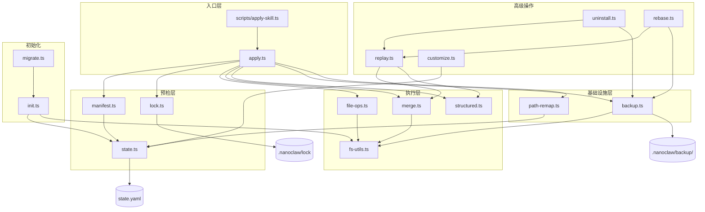
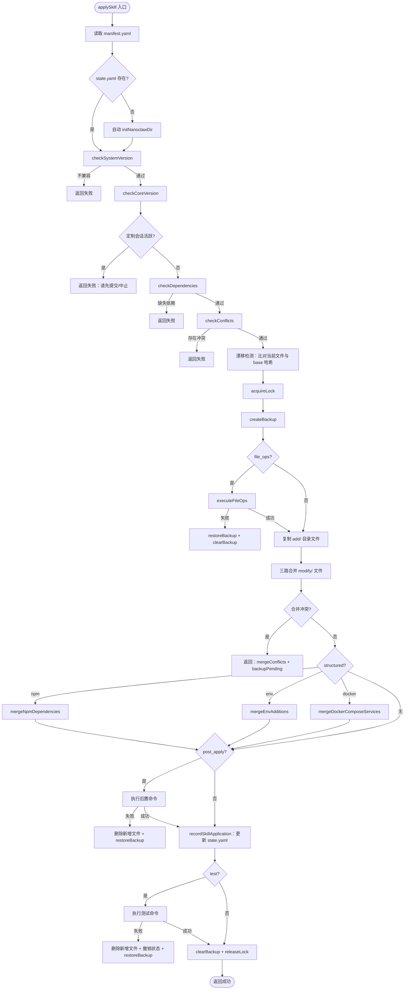

技能引擎是 NanoClaw 的确定性包管理系统——一套以文件系统为基底、以三路合并为核心策略的模块化扩展引擎。它解决的核心问题是：如何在不破坏用户自定义修改的前提下，将离散的「技能包」有序地叠加到核心代码库上，并在卸载、变基或冲突场景下提供完整的安全网。整个引擎由 16 个模块组成，职责从初始化、清单解析、冲突预检，到文件操作、结构化合并、锁竞争、备份回滚、状态持久化，直到最终的卸载与重放，形成一条完整的声明式生命周期管理链路。

Sources: [index.ts](skills-engine/index.ts#L1-L68), [types.ts](skills-engine/types.ts#L1-L96)

## 架构总览：模块关系与数据流

在深入各子系统之前，先建立对技能引擎整体模块依赖关系的认知。下图展示了核心模块之间的调用关系与数据流向，箭头方向表示「调用方→被调用方」：



整个引擎的目录组织遵循清晰的分层原则。`.nanoclaw/` 目录是技能引擎的工作空间根，内部结构如下：

| 目录/文件 | 用途 | 创建时机 |
|---|---|---|
| `.nanoclaw/state.yaml` | 技能系统状态：已应用技能列表、自定义修改、路径重映射、变基记录 | `initNanoclawDir()` 或首次 `applySkill()` |
| `.nanoclaw/base/` | 核心代码的干净快照，作为三路合并的基准版本 | `initNanoclawDir()` |
| `.nanoclaw/backup/` | 操作前文件备份，用于异常时回滚 | `applySkill()` / `uninstallSkill()` / `rebase()` |
| `.nanoclaw/lock` | 互斥锁文件（JSON 格式，含 PID 和时间戳） | `acquireLock()` |
| `.nanoclaw/custom/` | 自定义会话记录和补丁文件 | `startCustomize()` / `commitCustomize()` |

Sources: [constants.ts](skills-engine/constants.ts#L1-L17), [init.ts](skills-engine/init.ts#L27-L74)

## 技能清单：声明式契约

每个技能通过 `manifest.yaml` 向引擎声明其行为契约。清单不仅是一份元数据描述，更是引擎执行预检、合并策略选择和回滚决策的唯一依据。

```yaml
# .claude/skills/add-telegram/manifest.yaml 示例
skill: telegram
version: 1.0.0
description: "Telegram Bot API integration via Grammy"
core_version: 0.1.0
adds:
  - src/channels/telegram.ts
  - src/channels/telegram.test.ts
modifies:
  - src/channels/index.ts
structured:
  npm_dependencies:
    grammy: "^1.39.3"
  env_additions:
    - TELEGRAM_BOT_TOKEN
conflicts: []
depends: []
test: "npx vitest run src/channels/telegram.test.ts"
```

清单中各字段的语义和验证规则如下：

| 字段 | 必填 | 含义 | 验证规则 |
|---|---|---|---|
| `skill` | ✅ | 技能唯一标识符 | 用于冲突检测、依赖查找和状态记录 |
| `version` | ✅ | 技能版本（语义化版本） | 应用时记录到 `AppliedSkill.version` |
| `core_version` | ✅ | 目标核心版本 | 与 `state.yaml` 中的 `core_version` 比对，过高则发出警告 |
| `adds` | ✅ | 新增文件列表（可以为空数组） | 路径必须相对、不含 `..`、不绝对 |
| `modifies` | ✅ | 修改文件列表（可以为空数组） | 同上；文件需存在于技能包的 `modify/` 目录 |
| `structured` | ❌ | 结构化操作声明 | 包含 `npm_dependencies`、`env_additions`、`docker_compose_services` |
| `conflicts` | ❌ | 冲突技能列表 | 默认为空；应用时检查目标技能是否已应用 |
| `depends` | ❌ | 前置依赖技能列表 | 默认为空；应用时检查依赖技能是否已应用 |
| `file_ops` | ❌ | 文件级操作（rename/delete/move） | 在复制文件之前执行 |
| `test` | ❌ | 验证测试命令 | 应用成功后执行；失败则回滚整个应用 |
| `post_apply` | ❌ | 应用后执行命令 | 按序执行；失败则回滚 |
| `min_skills_system_version` | ❌ | 最低引擎版本要求 | 与 `SKILLS_SCHEMA_VERSION` 比对，过高则拒绝应用 |

`readManifest()` 函数执行严格的字段验证：检查必填字段是否存在，确保路径不逃逸项目根目录（禁止 `..` 和绝对路径），并为可选字段填充默认值。这是一个「fail-fast」设计——任何不符合契约的清单都会在应用前被拦截。

Sources: [manifest.ts](skills-engine/manifest.ts#L10-L49), [.claude/skills/add-telegram/manifest.yaml](.claude/skills/add-telegram/manifest.yaml#L1-L18)

## 应用流程：从预检到状态提交

`applySkill()` 是技能引擎的主入口函数，实现了一个严格有序的「预检→锁定→备份→执行→验证→提交」流水线。以下流程图展示了完整的决策路径和回滚触发点：



**预检阶段**包含四道防线：引擎版本兼容性检查（`checkSystemVersion`）、核心版本兼容性检查（`checkCoreVersion`，仅警告不阻断）、定制会话活跃检查（防止并发修改）、依赖与冲突检查。这些检查全部通过后，引擎才会进入文件系统修改阶段。

Sources: [apply.ts](skills-engine/apply.ts#L37-L122)

**漂移检测**是预检阶段的一个重要补充。对于 `manifest.modifies` 中列出的每个文件，引擎将当前工作树版本与 `.nanoclaw/base/` 中的快照版本进行 SHA-256 哈希比对。如果发现不一致（即用户或其他技能已修改了这些文件），引擎会记录漂移信息并输出提示，但不会阻止应用——三路合并机制将自动处理这种情况。

Sources: [apply.ts](skills-engine/apply.ts#L100-L119)

## 三路合并：基于 git merge-file 的冲突处理

技能引擎的核心合并策略是 **三路合并（three-way merge）**，底层依赖 `git merge-file` 命令。三个输入分别为：

| 角色 | 路径来源 | 含义 |
|---|---|---|
| **当前版本（ours）** | 项目根目录中的工作文件 | 用户当前状态，可能包含其他技能的修改 |
| **基准版本（base/ancestor）** | `.nanoclaw/base/` 快照 | 核心代码的干净状态 |
| **技能版本（theirs）** | 技能包 `modify/` 目录 | 技能期望应用的变更 |

合并逻辑的关键实现细节：`git merge-file` 会原地修改第一个参数（当前版本），因此引擎先创建临时文件副本，在副本上执行合并，成功后再写回工作树。如果合并产生冲突（`git merge-file` 返回正整数退出码，表示冲突数量），冲突标记会直接写入工作文件，引擎返回 `backupPending: true` 状态，等待用户手动解决后调用 `clearBackup()` 确认或 `restoreBackup()` 回滚。

首次应用时，如果 `.nanoclaw/base/` 中没有对应文件的快照，引擎会将当前工作文件复制为基准——这是「首次应用即建立基线」的策略。

Sources: [apply.ts](skills-engine/apply.ts#L182-L244), [merge.ts](skills-engine/merge.ts#L20-L39)

## 结构化合并：package.json、.env 与 Docker Compose

除了通用文本文件的三路合并，技能引擎还提供了三种**结构化合并**能力，专门处理具有语义格式的配置文件。这些合并不依赖 `git merge-file`，而是直接解析文件格式、进行语义感知的合并操作。

**NPM 依赖合并**（`mergeNpmDependencies`）是最复杂的结构化操作。当多个技能声明对同一包的不同版本需求时，引擎会通过 `areRangesCompatible()` 函数进行兼容性判断：

| 场景 | 规则 | 结果 |
|---|---|---|
| 完全相同的版本号 | 直接接受 | 兼容 |
| 同为 `^` 前缀，主版本号相同 | 取较高版本 | 兼容 |
| 同为 `~` 前缀，主版本.次版本相同 | 取较高补丁版本 | 兼容 |
| 前缀不匹配或主版本不同 | 不兼容 | 抛出错误，阻止应用 |

合并完成后，依赖项会按字母顺序排列以保证输出确定性。同时还会检查 `devDependencies` 避免重复声明。

**环境变量合并**（`mergeEnvAdditions`）采用去重追加策略：解析 `.env.example` 中已有的变量名集合，仅追加不存在的新变量，并在追加前插入 `# Added by skill` 注释标记。

**Docker Compose 服务合并**（`mergeDockerComposeServices`）在添加新服务前会进行端口冲突检测：遍历所有现有服务收集已占用的主机端口，与待添加服务的端口做碰撞检测，冲突则抛出错误。

Sources: [structured.ts](skills-engine/structured.ts#L27-L194), [apply.ts](skills-engine/apply.ts#L247-L272)

## 文件操作：安全沙箱内的 rename/delete/move

技能可以通过 `manifest.file_ops` 声明三种文件级操作：`rename`（重命名）、`delete`（删除）和 `move`（移动）。这些操作在文件复制之前执行，遵循架构设计中的「先整理目录结构，再填充内容」原则。

安全是文件操作模块的首要设计考量。每个操作路径都经过 `safePath()` 函数的三重校验：解析相对路径确保不逃逸项目根目录、通过 `resolveRealPathWithSymlinkAwareAnchor()` 检测符号链接逃逸、拒绝指向项目根本身的路径。这种「符号链接感知锚点」机制会在路径中查找最近的已存在路径，如果该路径是符号链接则解析其真实目标，确保不会通过符号链接将操作重定向到项目外部。

每类操作都有明确的错误处理策略：`rename` 和 `move` 要求源文件存在且目标不存在；`delete` 对不存在的文件仅发出警告而不视为错误。任何操作失败都会立即中止整个操作序列，触发应用流程的备份回滚。

Sources: [file-ops.ts](skills-engine/file-ops.ts#L46-L191)

## 状态管理：state.yaml 的原子持久化

`state.yaml` 是技能引擎的单一事实来源（single source of truth），存储在 `.nanoclaw/state.yaml` 中。其完整类型结构如下：

```typescript
interface SkillState {
  skills_system_version: string;     // 引擎 schema 版本
  core_version: string;              // 核心代码版本（来自 package.json）
  applied_skills: AppliedSkill[];    // 已应用技能列表（按应用顺序）
  custom_modifications?: CustomModification[];  // 用户自定义修改记录
  path_remap?: Record<string, string>;          // 路径重映射表
  rebased_at?: string;               // 最后一次变基时间
}
```

其中 `AppliedSkill` 记录了每个已应用技能的完整指纹：

```typescript
interface AppliedSkill {
  name: string;                              // 技能标识符
  version: string;                           // 技能版本
  applied_at: string;                        // ISO 8601 时间戳
  file_hashes: Record<string, string>;       // 文件路径 → SHA-256 哈希
  structured_outcomes?: Record<string, unknown>;  // 结构化操作记录
  custom_patch?: string;                     // 自定义补丁文件路径
  custom_patch_description?: string;         // 补丁描述
}
```

状态写入采用**原子写入**策略：先写入临时文件（`state.yaml.tmp`），然后通过 `fs.renameSync()` 原子重命名。这确保了即使进程在写入过程中崩溃，也不会产生损坏的半写文件。`writeState()` 还通过 `yaml` 库的 `sortMapEntries: true` 选项保证 YAML 键的排序确定性，使得状态文件对版本控制友好。

版本向前兼容性也有保护：`readState()` 会检查 `state.yaml` 中的 `skills_system_version` 是否高于当前引擎版本，如果高于则抛出错误，提示用户升级引擎——这是一种「拒绝未来状态」的防御策略。

Sources: [state.ts](skills-engine/state.ts#L18-L45), [types.ts](skills-engine/types.ts#L24-L41)

## 并发控制：基于文件的互斥锁

技能引擎通过 `.nanoclaw/lock` 文件实现进程间互斥。锁文件采用 JSON 格式，包含持有者 PID 和获取时间戳。

锁获取策略（`acquireLock()`）采用「先尝试原子创建，失败则检测陈旧」的两阶段模式：首先使用 `fs.writeFileSync` 的 `wx` 标志（排他创建）尝试原子写入；如果文件已存在，则解析锁内容检查两个条件——锁是否超过 5 分钟（陈旧超时）、持有进程是否仍然存活（通过 `process.kill(pid, 0)` 探测）。只有当锁被判定为陈旧或持有进程已死亡时，才会覆盖旧锁文件。

锁释放（`releaseLock()`）同样包含 PID 校验：只有锁文件中记录的 PID 与当前进程 PID 匹配时才会删除锁文件，防止误释放其他进程的锁。`applySkill()` 在 `finally` 块中调用释放函数，确保异常路径也能正确释放。

Sources: [lock.ts](skills-engine/lock.ts#L30-L94)

## 备份与回滚：Tombstone 机制

备份模块（`backup.ts`）提供操作前的完整文件快照能力。`createBackup()` 接收一组绝对路径，将每个存在的文件复制到 `.nanoclaw/backup/` 对应位置；对于不存在的文件，则写入一个 `.tombstone` 标记文件。

**Tombstone 机制**是回滚逻辑的关键：当 `restoreBackup()` 遇到 tombstone 文件时，它会删除项目中的对应文件——这正确处理了「技能新增了文件，回滚时需要删除」的场景。没有 tombstone，回滚就无法区分「文件被覆盖」和「文件是新增的」。

备份生命周期严格绑定到操作流程：`createBackup()` 在文件修改前调用，`clearBackup()` 在操作成功后调用。如果操作失败，`restoreBackup()` 将所有文件恢复到备份状态，随后 `clearBackup()` 清理备份目录。在合并冲突场景下，`backupPending: true` 标记表示备份被保留，等待用户手动解决冲突后决定是确认还是回滚。

Sources: [backup.ts](skills-engine/backup.ts#L12-L65)

## 路径重映射：应对核心文件重命名

当 NanoClaw 核心版本更新导致文件路径变更时，已应用技能的 `manifest.yaml` 仍然引用旧路径。路径重映射表（`path_remap`）存储在 `state.yaml` 中，记录 `旧路径 → 新路径` 的映射关系。

`resolvePathRemap()` 在技能应用和重放的每个文件路径解析环节被调用。它同时尝试精确匹配和经过安全规范化后的匹配，确保映射能正确生效。如果映射目标本身不安全（逃逸项目根），引擎会静默忽略映射，保持原始路径——这是「fail-closed」安全策略的体现。

`loadPathRemap()` 在加载时即对所有映射条目执行 `sanitizeRemapEntries()` 校验，通过符号链接感知锚点检测逃逸尝试，不合法的条目会被静默丢弃（`mode: 'drop'`），而 `recordPathRemap()` 在记录新映射时则使用严格模式（`mode: 'throw'`），遇到不合法映射直接抛出错误。

Sources: [path-remap.ts](skills-engine/path-remap.ts#L93-L125)

## 定制会话：追踪用户自定义修改

定制会话（Customize Session）机制允许用户在技能应用后手动修改文件，并将这些修改以补丁形式持久化记录。整个流程遵循「开始→修改→提交/中止」的事务模式：

1. **`startCustomize(description)`**：记录当前所有已应用技能的文件哈希快照到 `.nanoclaw/custom/pending.yaml`，同时锁定技能应用（`isCustomizeActive()` 检查阻止新的技能应用）。
2. 用户自由修改文件。
3. **`commitCustomize()`**：比对当前文件哈希与快照，找出变更文件。对每个变更文件，使用 `diff -ruN` 生成与 `.nanoclaw/base/` 的统一差异。所有差异合并为一个补丁文件（`.nanoclaw/custom/NNN-description.patch`），并通过 `recordCustomModification()` 记录到状态中。
4. **`abortCustomize()`**：删除 pending 文件，放弃本次会话。

补丁文件使用三位数字序号命名（如 `001-add-custom-logging.patch`），确保重放时的确定性排序。

Sources: [customize.ts](skills-engine/customize.ts#L28-L152)

## 重放机制：确定性的技能重放

重放（Replay）是技能引擎的「可重现构建」基石。`replaySkills()` 函数从干净的 base 快照出发，按原始顺序重新应用一组技能，确保文件状态与逐步应用的结果一致。它被 `uninstallSkill()` 和 `rebase()` 共同依赖。

重放流程的关键步骤：
1. 收集所有待重放技能涉及的文件集合
2. 将这些文件全部重置为 base 快照版本（或删除不在 base 中的新增文件）
3. 按顺序对每个技能执行：file_ops → 复制 add/ 文件 → 三路合并 modify/ 文件
4. 收集所有技能的结构化操作，批量应用（NPM 依赖、环境变量、Docker 服务）
5. 遇到合并冲突时立即停止——后续技能不能基于冲突标记继续合并

`findSkillDir()` 函数扫描 `.claude/skills/` 目录，通过读取每个子目录的 `manifest.yaml` 来匹配技能名称，而非依赖目录名——这使得技能目录名可以自由组织。

Sources: [replay.ts](skills-engine/replay.ts#L34-L269)

## 卸载流程：重放排除策略

卸载（`uninstallSkill()`）采用「重放排除」策略：不是逆向应用技能（这在多技能叠加时极其复杂），而是将目标技能从已应用列表中移除，然后从干净 base 重新重放剩余所有技能。这保证了卸载后状态的确定性。

卸载流程的完整步骤：
1. **阻断检查**：如果已执行过 rebase（`state.rebased_at` 非空），拒绝卸载——因为 rebase 后技能变更已融入 base，无法单独剥离
2. **技能存在性验证**
3. **自定义补丁警告**：如果目标技能关联了自定义补丁，返回警告要求二次确认
4. **锁定并备份所有被任何技能触碰过的文件**
5. **将被卸载技能独占的文件恢复为 base 版本或删除**
6. **重放剩余技能**（调用 `replaySkills()`）
7. **重新应用独立自定义修改**（使用 `git apply --3way`）
8. **运行剩余技能的测试命令**，任何失败都触发回滚
9. **更新 state.yaml**：移除目标技能，刷新所有剩余技能的文件哈希

Sources: [uninstall.ts](skills-engine/uninstall.ts#L13-L231)

## 初始化与迁移

`initNanoclawDir()` 负责创建 `.nanoclaw/` 工作空间并建立初始状态。它执行以下操作：

1. 创建 `.nanoclaw/backup/` 目录
2. 清空并重建 `.nanoclaw/base/` 目录，将 `BASE_INCLUDES` 中声明的路径（`src/`、`package.json`、`.env.example`、`container/`）按过滤规则（排除 `node_modules`、`.git`、`dist` 等）复制为快照
3. 从 `package.json` 读取核心版本号
4. 写入初始 `state.yaml`（`skills_system_version: '0.1.0'`，空的 `applied_skills`）
5. 在 Git 仓库中启用 `rerere.enabled`（重用冲突解决方案）

`migrateExisting()` 在初始化基础上增加了**差异捕获**：将当前工作树的 `src/` 目录与 base 快照做 `diff -ruN` 对比，将差异保存为 `.nanoclaw/custom/migration.patch`，并记录为自定义修改。这使得从零开始迁移的项目能保留已有的自定义代码。

Sources: [init.ts](skills-engine/init.ts#L27-L101), [migrate.ts](skills-engine/migrate.ts#L14-L70)

## 引擎完整公共 API 速查

下表汇总了技能引擎通过 `index.ts` 导出的全部公共函数和类型：

| 导出名称 | 来源模块 | 用途 |
|---|---|---|
| `applySkill(skillDir)` | [apply.ts](skills-engine/apply.ts) | 应用一个技能包 |
| `uninstallSkill(skillName)` | [uninstall.ts](skills-engine/uninstall.ts) | 卸载指定技能 |
| `rebase(newBasePath?)` | [rebase.ts](skills-engine/rebase.ts) | 变基到新核心版本或扁平化 base |
| `startCustomize(desc)` / `commitCustomize()` / `abortCustomize()` / `isCustomizeActive()` | [customize.ts](skills-engine/customize.ts) | 定制会话管理 |
| `readManifest(skillDir)` | [manifest.ts](skills-engine/manifest.ts) | 解析并验证技能清单 |
| `checkConflicts` / `checkCoreVersion` / `checkDependencies` / `checkSystemVersion` | [manifest.ts](skills-engine/manifest.ts) | 预检工具函数 |
| `createBackup` / `restoreBackup` / `clearBackup` | [backup.ts](skills-engine/backup.ts) | 备份生命周期管理 |
| `acquireLock` / `releaseLock` / `isLocked` | [lock.ts](skills-engine/lock.ts) | 互斥锁管理 |
| `readState` / `writeState` / `recordSkillApplication` / `getAppliedSkills` / `recordCustomModification` / `getCustomModifications` / `computeFileHash` / `compareSemver` | [state.ts](skills-engine/state.ts) | 状态读写与工具函数 |
| `loadPathRemap` / `recordPathRemap` / `resolvePathRemap` | [path-remap.ts](skills-engine/path-remap.ts) | 路径重映射 |
| `executeFileOps(ops, projectRoot)` | [file-ops.ts](skills-engine/file-ops.ts) | 执行文件操作序列 |
| `mergeFile(current, base, skill)` / `isGitRepo()` | [merge.ts](skills-engine/merge.ts) | 三路合并执行 |
| `mergeNpmDependencies` / `mergeEnvAdditions` / `mergeDockerComposeServices` / `areRangesCompatible` / `runNpmInstall` | [structured.ts](skills-engine/structured.ts) | 结构化合并操作 |
| `findSkillDir` / `replaySkills` | [replay.ts](skills-engine/replay.ts) | 技能目录查找与重放 |
| `initNanoclawDir()` | [init.ts](skills-engine/init.ts) | 初始化 `.nanoclaw/` 工作空间 |
| `initSkillsSystem` / `migrateExisting` | [migrate.ts](skills-engine/migrate.ts) | 系统初始化与迁移 |

Sources: [index.ts](skills-engine/index.ts#L1-L68)

## 延伸阅读

- 要了解如何编写符合清单规范的技能包以及目录结构要求，参见 [技能贡献规范：如何编写 SKILL.md 与技能目录结构](26-ji-neng-gong-xian-gui-fan-ru-he-bian-xie-skill-md-yu-ji-neng-mu-lu-jie-gou)
- 要深入理解变基时的三路合并策略和上游更新处理，参见 [技能重放与变基（rebase）：处理上游更新的三路合并策略](27-ji-neng-zhong-fang-yu-bian-ji-rebase-chu-li-shang-you-geng-xin-de-san-lu-he-bing-ce-lue)