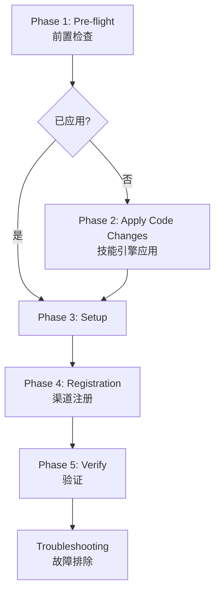
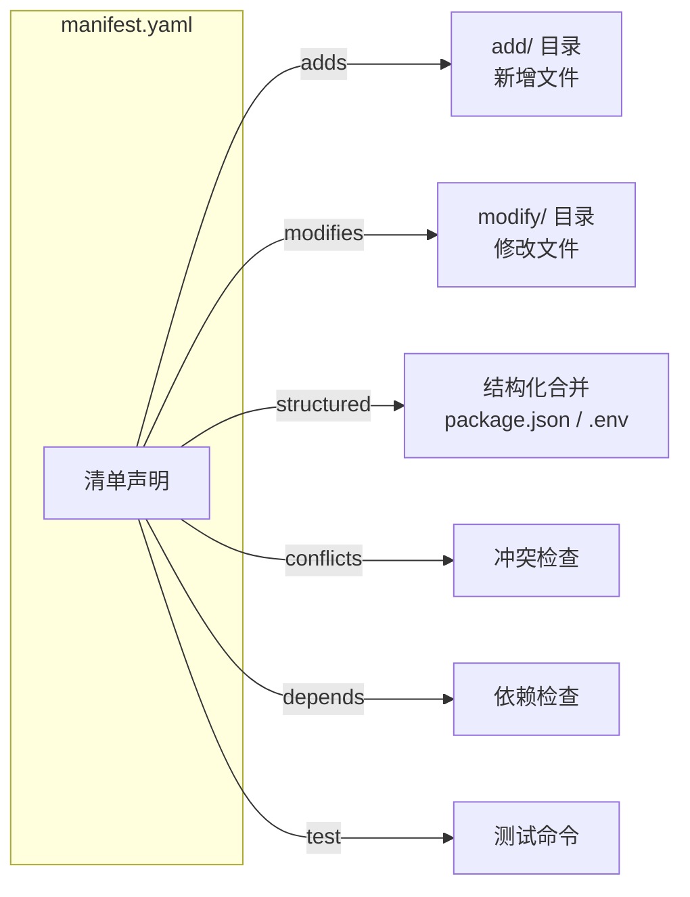
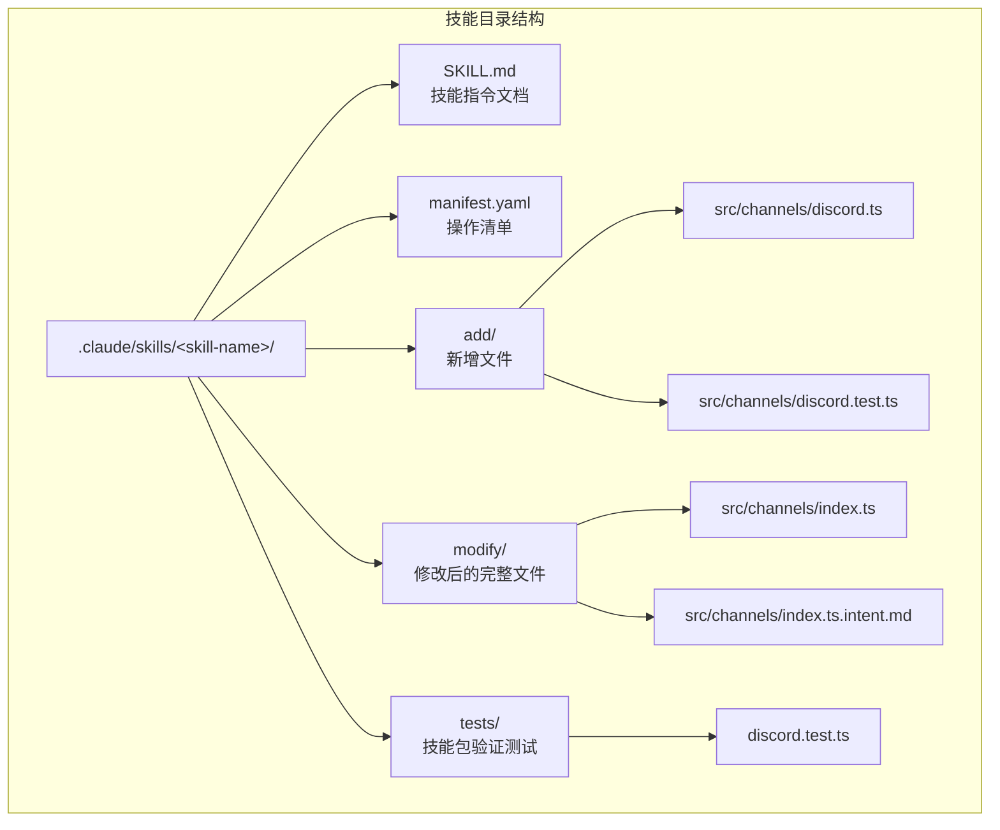
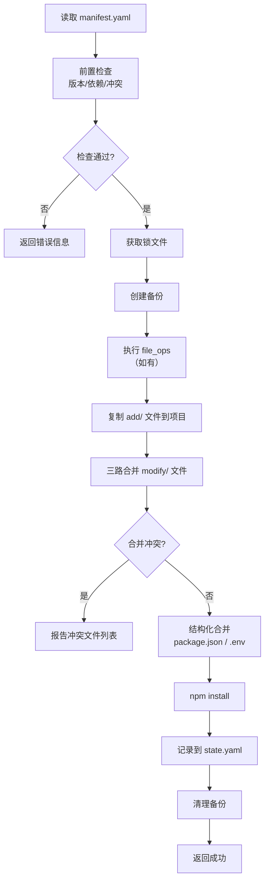
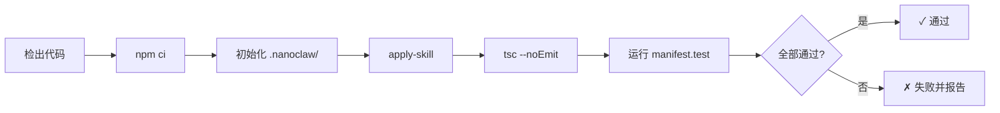

NanoClaw 采用**技能（Skill）**作为功能扩展的唯一定义单元。一个技能本质上是一组自包含的指令和资源，告诉 Claude Code 如何对用户的 NanoClaw 安装进行确定性变换。本页面向中级开发者，系统讲解如何编写一个符合规范的技能——从 SKILL.md 文档到 manifest.yaml 清单、目录布局、测试要求以及 CI 验证流程。

Sources: [CONTRIBUTING.md](CONTRIBUTING.md#L1-L24)

## 技能的两种形态

在动手编写之前，必须理解 NanoClaw 仓库中存在两种技能形态，它们在复杂度和结构上有本质区别。

| 维度 | **纯指令型技能** | **引擎驱动型技能** |
|------|-----------------|-------------------|
| 核心组成 | 仅 `SKILL.md` | `SKILL.md` + `manifest.yaml` + `add/` + `modify/` + `tests/` |
| 代码变换方式 | Claude 按指令动态修改 | skills-engine 自动复制和三路合并 |
| 典型场景 | 安装向导、调试指南、定制化指导 | 新增渠道、修改源码文件、添加依赖 |
| CI 验证 | 无自动化验证（policy-check 仍生效） | apply → typecheck → test 三阶段验证 |
| 代表范例 | `setup`、`debug`、`customize` | `add-discord`、`add-telegram`、`convert-to-apple-container` |

**判断标准**：如果你的技能需要对源码做确定性、可重复、可冲突检测的修改，就应当采用引擎驱动型。如果只是交互式引导用户完成操作，纯指令型即可。

Sources: [.claude/skills/setup/SKILL.md](.claude/skills/setup/SKILL.md#L1-L10), [.claude/skills/add-discord/SKILL.md](.claude/skills/add-discord/SKILL.md#L19-L44)

## SKILL.md 编写规范

**SKILL.md** 是每个技能的入口文件，也是 Claude Code 读取和执行的核心文档。它决定了 Claude 的行为边界和执行步骤。

### Frontmatter（YAML 头部）

部分技能在 SKILL.md 顶部使用 YAML frontmatter 来声明元信息，格式为三条横线包围的 YAML 块：

```yaml
---
name: add-telegram
description: Add Telegram as a channel. Can replace WhatsApp entirely or run alongside it. Also configurable as a control-only channel (triggers actions) or passive channel (receives notifications only).
---
```

| 字段 | 是否必须 | 用途 |
|------|---------|------|
| `name` | 推荐 | 技能名称标识符，用于 Claude 匹配和调用 |
| `description` | 推荐 | 触发描述，包含触发关键词，帮助 Claude 判断何时激活 |

并非所有技能都有 frontmatter。纯指令型技能（如 `add-discord`）直接以 Markdown 标题开头。frontmatter 的核心价值是为 Claude 提供**触发词匹配**信息——当用户说出 "setup"、"install"、"configure nanoclaw" 等关键词时，Claude 会匹配到对应的 `description` 并激活技能。

Sources: [.claude/skills/setup/SKILL.md](.claude/skills/setup/SKILL.md#L1-L4), [.claude/skills/customize/SKILL.md](.claude/skills/customize/SKILL.md#L1-L4)

### 正文结构：分阶段模式

优秀的 SKILL.md 正文通常遵循**阶段式编排**，每个阶段有明确的前置条件、执行步骤和验证条件。以 `add-telegram` 和 `add-discord` 为例，典型的阶段结构如下：



**Phase 1（Pre-flight）**：检查 `.nanoclaw/state.yaml` 中是否已记录该技能。如果已存在，跳过代码修改阶段直接进入配置。这保证了技能的**幂等性**。

**Phase 2（Apply Code Changes）**：仅引擎驱动型技能有此阶段。通过调用 `npx tsx scripts/apply-skill.ts <skill-dir>` 执行确定性代码变换。

**Phase 3（Setup）**：收集用户凭证、配置环境变量（写入 `.env`）、构建并重启服务。这是**唯一需要暂停等待用户输入**的阶段。

**Phase 4（Registration）**：将渠道 JID 注册到数据库。分为主渠道（`isMain: true`，响应所有消息）和非主渠道（`requiresTrigger: true`，仅响应触发词）。

**Phase 5（Verify）**：指导用户发送测试消息并检查日志。

**Troubleshooting**：列出常见问题及修复步骤。

Sources: [.claude/skills/add-telegram/SKILL.md](.claude/skills/add-telegram/SKILL.md#L1-L200), [.claude/skills/add-discord/SKILL.md](.claude/skills/add-discord/SKILL.md#L5-L190)

### 关键编写原则

1. **使用 `AskUserQuestion` 收集用户输入**：所有需要用户交互的环节必须通过此机制，而非直接在聊天中提问。
2. **修复而非转嫁**：当遇到问题时（如依赖缺失），技能应主动修复，而不是告诉用户去修复，除非确实需要用户手动操作（如粘贴 API 密钥）。
3. **幂等设计**：技能必须可以安全地重复执行。Phase 1 的前置检查是实现幂等性的关键。
4. **验证优先**：每个阶段完成后都应运行 `npm test && npm run build` 验证代码完整性。

Sources: [.claude/skills/setup/SKILL.md](.claude/skills/setup/SKILL.md#L8-L12)

## manifest.yaml 清单文件

对于引擎驱动型技能，`manifest.yaml` 是**必需的元数据文件**，描述了技能对源码的所有操作意图。技能引擎根据此清单执行文件的复制、合并和结构化变更。



### 完整字段说明

| 字段 | 类型 | 必须性 | 说明 |
|------|------|--------|------|
| `skill` | string | **必需** | 技能的唯一标识符，如 `discord`、`telegram` |
| `version` | string | **必需** | 技能语义版本号，如 `1.0.0` |
| `description` | string | **必需** | 一行功能描述 |
| `core_version` | string | **必需** | 目标 NanoClaw 核心版本，用于兼容性检查 |
| `adds` | string[] | **必需** | 要新增的文件路径列表（相对于项目根） |
| `modifies` | string[] | **必需** | 要修改的已有文件路径列表 |
| `structured` | object | 可选 | 结构化合并配置 |
| `structured.npm_dependencies` | Record<string, string> | 可选 | 要注入 `package.json` 的依赖，如 `grammy: "^1.39.3"` |
| `structured.env_additions` | string[] | 可选 | 要追加到 `.env.example` 的变量名 |
| `structured.docker_compose_services` | Record<string, unknown> | 可选 | 要合并到 `docker-compose.yml` 的服务定义 |
| `file_ops` | FileOperation[] | 可选 | 文件操作序列（rename/delete/move） |
| `conflicts` | string[] | **必需** | 声明与哪些技能冲突（可为空数组） |
| `depends` | string[] | **必需** | 声明前置依赖的技能名（可为空数组） |
| `test` | string | 可选 | 测试命令，如 `"npx vitest run src/channels/discord.test.ts"` |
| `author` | string | 可选 | 作者信息 |
| `license` | string | 可选 | 许可证 |
| `min_skills_system_version` | string | 可选 | 最低技能引擎版本要求 |
| `post_apply` | string[] | 可选 | 应用后要执行的命令 |

Sources: [skills-engine/types.ts](skills-engine/types.ts#L1-L22), [skills-engine/manifest.ts](skills-engine/manifest.ts#L19-L31)

### 实际 manifest 示例对照

以下对比三个典型技能的 manifest 配置，展示不同复杂度下的字段组合：

```yaml
# add-discord — 简单渠道集成
skill: discord
version: 1.0.0
description: "Discord Bot integration via discord.js"
core_version: 0.1.0
adds:
  - src/channels/discord.ts
  - src/channels/discord.test.ts
modifies:
  - src/channels/index.ts
structured:
  npm_dependencies:
    discord.js: "^14.18.0"
  env_additions:
    - DISCORD_BOT_TOKEN
conflicts: []
depends: []
test: "npx vitest run src/channels/discord.test.ts"
```

```yaml
# add-image-vision — 跨多个模块修改
skill: add-image-vision
version: 1.1.0
description: "Add image vision to NanoClaw agents via WhatsApp image attachments"
core_version: 1.2.8
adds:
  - src/image.ts
  - src/image.test.ts
modifies:
  - src/channels/whatsapp.ts
  - src/channels/whatsapp.test.ts
  - src/container-runner.ts
  - src/index.ts
  - container/agent-runner/src/index.ts
structured:
  npm_dependencies:
    sharp: "^0.34.5"
  env_additions: []
conflicts: []
depends: []
```

```yaml
# convert-to-apple-container — 纯修改型（无新增文件）
skill: convert-to-apple-container
version: 1.1.0
description: "Switch container runtime from Docker to Apple Container (macOS)"
core_version: 0.1.0
adds: []                           # 无新增文件
modifies:
  - src/container-runtime.ts
  - src/container-runtime.test.ts
  - src/container-runner.ts
  - container/build.sh
  - container/Dockerfile
structured: {}
conflicts: []
depends: []
test: "npx vitest run src/container-runtime.test.ts"
```

Sources: [.claude/skills/add-discord/manifest.yaml](.claude/skills/add-discord/manifest.yaml#L1-L18), [.claude/skills/add-image-vision/manifest.yaml](.claude/skills/add-image-vision/manifest.yaml#L1-L21), [.claude/skills/convert-to-apple-container/manifest.yaml](.claude/skills/convert-to-apple-container/manifest.yaml#L1-L16)

### 清单验证规则

技能引擎在读取 manifest 时会执行严格的验证，以下约束条件**绝不可违反**：

1. **必需字段检查**：`skill`、`version`、`core_version`、`adds`、`modifies` 缺一不可。
2. **路径安全**：所有路径必须相对且不含 `..`，禁止使用绝对路径——这是防止路径穿越攻击的核心防护。
3. **版本兼容性**：`core_version` 与当前 `.nanoclaw/state.yaml` 中的 `core_version` 进行比较，如果技能目标版本高于当前版本，会产生兼容性警告。
4. **依赖检查**：`depends` 中列出的技能名必须在已应用技能列表中存在。
5. **冲突检查**：`conflicts` 中列出的技能名不得在已应用技能列表中存在。

Sources: [skills-engine/manifest.ts](skills-engine/manifest.ts#L38-L48), [skills-engine/manifest.ts](skills-engine/manifest.ts#L96-L104)

## 技能目录结构详解

引擎驱动型技能的目录布局遵循严格的约定，每个子目录有明确的职责划分。



### `add/` 目录——新增文件

`add/` 目录包含技能要**新创建**的源码文件。目录结构镜像项目根目录。例如，要新增 `src/channels/discord.ts`，文件放在 `add/src/channels/discord.ts`。

应用过程中，技能引擎会将 `add/` 下的文件逐一复制到项目根目录的对应路径。关键行为：
- 如果目标文件已存在，引擎会覆盖它（但会先创建备份）
- 路径会经过 **path remap** 处理——如果项目文件被重命名过，引擎会自动解析到正确的位置

Sources: [skills-engine/apply.ts](skills-engine/apply.ts#L163-L179)

### `modify/` 目录——修改文件与意图文件

`modify/` 目录包含技能要**修改**的现有文件的完整替换版本，以及与之配套的 `.intent.md` 意图说明文件。

**修改文件**（如 `modify/src/channels/index.ts`）不是差异补丁，而是该文件在技能应用后的**完整内容**。引擎使用 `git merge-file` 执行三路合并：以 `.nanoclaw/base/` 中的快照为基准（ours），以 `modify/` 中的版本为 theirs，以项目当前的文件为 worktree。

**意图文件**（`.intent.md`）是同名文件的 Markdown 说明，描述：

```markdown
# Intent: Add Discord channel import

Add `import './discord.js';` to the channel barrel file so the Discord
module self-registers with the channel registry on startup.

This is an append-only change — existing import lines for other channels
must be preserved.
```

意图文件的最佳实践包含以下结构化段落：

| 段落 | 内容 |
|------|------|
| **What changed** | 简明陈述变更内容 |
| **Why** | 变更原因（技术约束、架构决策等） |
| **Key sections** | 逐条列出修改的关键代码段 |
| **Invariants / Must-keep** | 合并时**绝对不可丢失**的现有代码特征 |

意图文件在合并冲突发生时尤为重要——它指导手动解决者理解变更的边界和约束。

Sources: [.claude/skills/add-discord/modify/src/channels/index.ts.intent.md](.claude/skills/add-discord/modify/src/channels/index.ts.intent.md#L1-L8), [.claude/skills/convert-to-apple-container/modify/container/Dockerfile.intent.md](.claude/skills/convert-to-apple-container/modify/container/Dockerfile.intent.md#L1-L32)

### `tests/` 目录——技能包验证测试

每个引擎驱动型技能应在 `tests/` 目录中提供**技能包完整性测试**，验证清单声明与实际文件的一致性：

```typescript
describe('discord skill package', () => {
  const skillDir = path.resolve(__dirname, '..');

  it('has a valid manifest', () => {
    const manifestPath = path.join(skillDir, 'manifest.yaml');
    expect(fs.existsSync(manifestPath)).toBe(true);
    const content = fs.readFileSync(manifestPath, 'utf-8');
    expect(content).toContain('skill: discord');
  });

  it('has all files declared in adds', () => {
    const channelFile = path.join(skillDir, 'add', 'src', 'channels', 'discord.ts');
    expect(fs.existsSync(channelFile)).toBe(true);
  });

  it('has intent files for modified files', () => {
    expect(
      fs.existsSync(path.join(skillDir, 'modify', 'src', 'channels', 'index.ts.intent.md')),
    ).toBe(true);
  });
});
```

这个测试**不测试业务逻辑**——它的职责是确认技能包自洽：清单里声明的文件都存在，intent 文件齐全。

Sources: [.claude/skills/add-discord/tests/discord.test.ts](.claude/skills/add-discord/tests/discord.test.ts#L1-L69)

## 技能应用流程：从清单到代码

当用户调用 `npx tsx scripts/apply-skill.ts .claude/skills/add-discord` 时，技能引擎执行以下确定性的应用流程：



**三路合并**是引擎最关键的操作。它调用 `git merge-file <current> <base> <skill>`，其中 `<base>` 是初始化时快照的原始文件（存放在 `.nanoclaw/base/`），`<current>` 是用户当前版本，`<skill>` 是 `modify/` 目录中的版本。这使得技能能优雅地处理用户已有的自定义修改。

Sources: [skills-engine/apply.ts](skills-engine/apply.ts#L37-L120), [skills-engine/merge.ts](skills-engine/merge.ts#L20-L39)

## 从零编写一个引擎驱动型技能

以下以"添加一个新消息渠道"为场景，展示完整的技能创建步骤。

### 步骤 1：创建目录骨架

```bash
mkdir -p .claude/skills/add-mychannel/add/src/channels
mkdir -p .claude/skills/add-mychannel/modify/src/channels
mkdir -p .claude/skills/add-mychannel/tests
```

### 步骤 2：编写 manifest.yaml

```yaml
skill: mychannel
version: 1.0.0
description: "MyChannel integration via mychannel-sdk"
core_version: 0.1.0
adds:
  - src/channels/mychannel.ts
  - src/channels/mychannel.test.ts
modifies:
  - src/channels/index.ts
structured:
  npm_dependencies:
    mychannel-sdk: "^2.0.0"
  env_additions:
    - MYCHANNEL_API_KEY
conflicts: []
depends: []
test: "npx vitest run src/channels/mychannel.test.ts"
```

### 步骤 3：编写 add/ 文件

在 `add/src/channels/mychannel.ts` 中创建渠道实现。必须实现 `Channel` 接口并通过 `registerChannel` 自注册：

```typescript
import { registerChannel } from './registry.js';
import { Channel, OnInboundMessage, OnChatMetadata, RegisteredGroup } from '../types.js';

export class MyChannel implements Channel {
  name = 'mychannel';
  // ... 实现 connect() 和 sendMessage()
}

registerChannel('mychannel', (opts) => new MyChannel(opts));
```

在 `add/src/channels/mychannel.test.ts` 中编写单元测试。

Sources: [.claude/skills/add-discord/add/src/channels/discord.ts](.claude/skills/add-discord/add/src/channels/discord.ts#L1-L30)

### 步骤 4：编写 modify/ 文件与 intent

`modify/src/channels/index.ts` 应包含渠道导入行：

```typescript
// Channel self-registration barrel file.
// Each import triggers the channel module's registerChannel() call.

// mychannel
import './mychannel.js';
```

注意：这里的文件是**该文件在应用后的完整内容**，而非 diff。

同时创建 `modify/src/channels/index.ts.intent.md`：

```markdown
# Intent: Add MyChannel import

Add `import './mychannel.js';` to the channel barrel file.

This is an append-only change — all existing import lines must be preserved.
```

Sources: [.claude/skills/add-discord/modify/src/channels/index.ts](.claude/skills/add-discord/modify/src/channels/index.ts#L1-L14)

### 步骤 5：编写技能包测试

在 `tests/mychannel.test.ts` 中验证清单与文件的一致性（参见上文 `tests/` 目录章节的示例）。

### 步骤 6：编写 SKILL.md

按照前文"分阶段模式"编写完整的 SKILL.md，包含 Pre-flight、Apply、Setup、Registration、Verify、Troubleshooting 六个阶段。

### 步骤 7：本地验证

```bash
# 初始化技能系统
npx tsx scripts/apply-skill.ts --init

# 应用技能
npx tsx scripts/apply-skill.ts .claude/skills/add-mychannel

# 验证
npx tsc --noEmit
npx vitest run src/channels/mychannel.test.ts
npx vitest run .claude/skills/add-mychannel/tests/mychannel.test.ts
```

Sources: [scripts/apply-skill.ts](scripts/apply-skill.ts#L1-L25)

## CI 验证流程与 PR 策略

NanoClaw 对技能 PR 设有两层 CI 防线。

### 第一层：Policy Check（策略门控）

**核心规则**：添加新技能的 PR **不得同时修改源码文件**。这是一项硬性策略。

CI 会检查 PR 中是否同时包含 `.claude/skills/` 下新增文件和 `src/`、`container/`、`package.json` 下的变更。如果两者同时出现，PR 会被自动拒绝并添加注释，要求拆分为独立 PR。

| 变更类型 | 允许的 PR 类型 |
|---------|---------------|
| 新增/修改 `.claude/skills/` | 纯技能 PR ✓ |
| 修改 `src/`、`container/` 等 | 纯源码 PR ✓ |
| 同时包含上述两者 | **拒绝** ✗ |

### 第二层：Validate Skills（技能验证）

对于包含技能变更的 PR，CI 会对每个变更的技能执行独立的验证矩阵：



每个技能在**隔离环境中**独立验证：先重置工作树，再初始化，再应用。这意味着即使多个技能在同一个 PR 中变更，它们之间不会互相干扰。

Sources: [.github/workflows/skill-pr.yml](.github/workflows/skill-pr.yml#L1-L152)

### 漂移检测

当 `main` 分支上的源码文件发生变更时，`skill-drift.yml` 工作流会检测所有技能是否仍然可以干净地应用。如果某个技能的 `modify/` 文件与更新后的源码产生冲突（漂移），CI 会尝试通过三路合并自动修复，并创建一个修复 PR。

Sources: [.github/workflows/skill-drift.yml](.github/workflows/skill-drift.yml#L1-L103)

## 清单速查与常见陷阱

### 常见错误与修复

| 错误 | 原因 | 修复 |
|------|------|------|
| `Manifest not found` | 缺少 `manifest.yaml` | 在技能根目录创建清单文件 |
| `Manifest missing required field: adds` | 清单中缺少必需字段 | 补全 `skill`、`version`、`core_version`、`adds`、`modifies` |
| `Invalid path in manifest` | 路径包含 `..` 或为绝对路径 | 使用相对于项目根的路径 |
| `Missing dependencies: xxx` | `depends` 中声明的技能尚未应用 | 先应用依赖技能，或从 `depends` 中移除 |
| `Conflicting skills: xxx` | `conflicts` 中声明的技能已应用 | 先卸载冲突技能，或从 `conflicts` 中移除 |
| `A customize session is active` | 自定义会话未完成 | 先执行 `commitCustomize()` 或 `abortCustomize()` |
| `Skill modified file not found` | `modify/` 目录下缺少 manifest 中声明的文件 | 确认 `modify/` 路径与 `modifies` 声明一致 |
| `Dependency conflict: xxx` | 多个技能要求不兼容的 npm 依赖版本 | 协调版本范围或使用兼容前缀（`^`、`~`） |

Sources: [skills-engine/manifest.ts](skills-engine/manifest.ts#L14-L48), [skills-engine/structured.ts](skills-engine/structured.ts#L65-L108)

### 新增渠道的完整检查清单

编写一个新渠道技能时，请逐项确认：

- [ ] `manifest.yaml` 中 `adds` 包含渠道实现文件和测试文件
- [ ] `manifest.yaml` 中 `modifies` 包含 `src/channels/index.ts`
- [ ] `add/src/channels/<name>.ts` 实现 `Channel` 接口并调用 `registerChannel()`
- [ ] `add/src/channels/<name>.test.ts` 包含充分的单元测试
- [ ] `modify/src/channels/index.ts` 包含 `import './<name>.js'` 行
- [ ] `modify/src/channels/index.ts.intent.md` 声明变更为 append-only
- [ ] `structured.npm_dependencies` 列出所需的第三方包
- [ ] `structured.env_additions` 列出所需的环境变量名
- [ ] `SKILL.md` 包含 Pre-flight、Apply、Setup、Registration、Verify、Troubleshooting 六阶段
- [ ] `tests/<name>.test.ts` 验证清单与文件一致性
- [ ] 本地通过 `apply-skill` → `tsc --noEmit` → `test` 全流程

## 延伸阅读

- 了解技能引擎如何执行三路合并和冲突检测：[技能引擎（skills-engine）：应用、合并、冲突检测与状态管理](25-ji-neng-yin-qing-skills-engine-ying-yong-he-bing-chong-tu-jian-ce-yu-zhuang-tai-guan-li)
- 处理上游代码更新导致的技能漂移：[技能重放与变基（rebase）：处理上游更新的三路合并策略](27-ji-neng-zhong-fang-yu-bian-ji-rebase-chu-li-shang-you-geng-xin-de-san-lu-he-bing-ce-lue)
- 定制化修改触发词、行为调整等实践：[定制化实践：修改触发词、行为调整与目录挂载](32-ding-zhi-hua-shi-jian-xiu-gai-hong-fa-ci-xing-wei-tiao-zheng-yu-mu-lu-gua-zai)