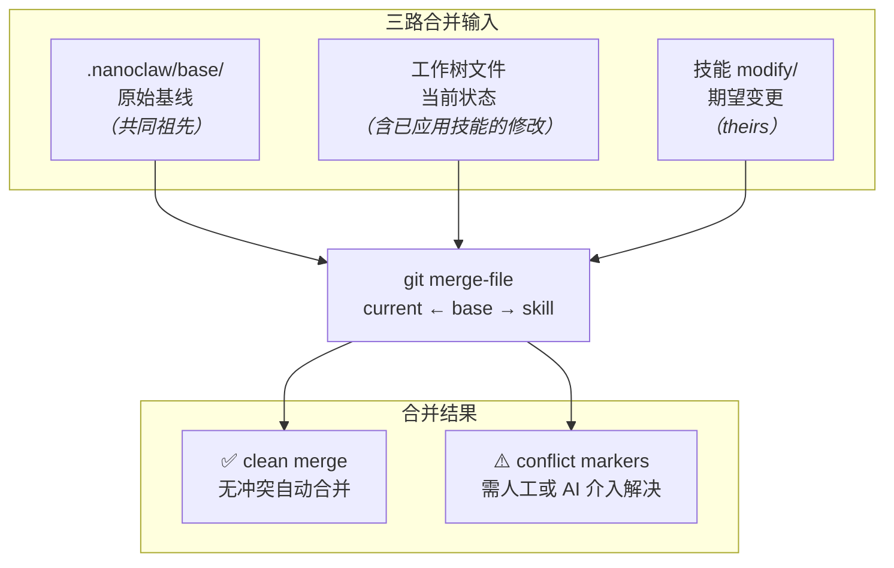
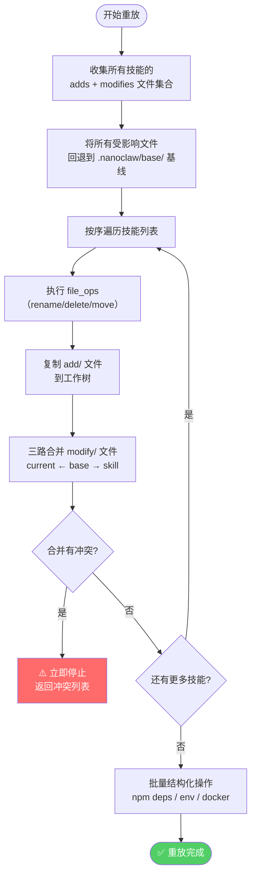
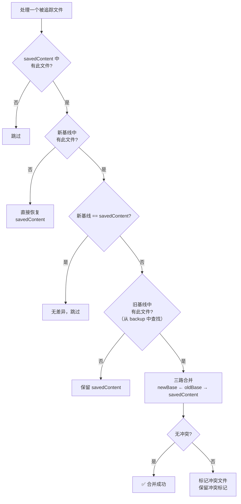
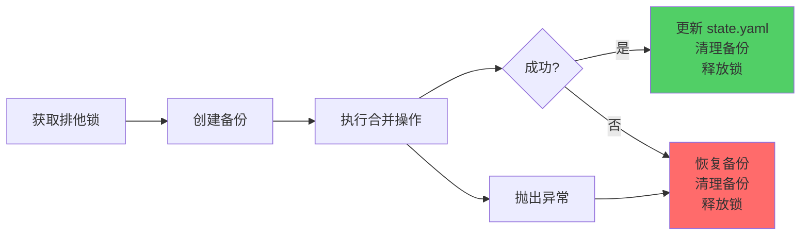

NanoClaw 的技能系统在本质上是**声明式补丁引擎**——每个技能通过 `add/` 和 `modify/` 目录向项目注入文件变更，而引擎负责将这些变更安全地合入用户的工作树。当上游核心更新、技能需要卸载、或历史层积过多时，系统必须在不丢失用户定制的前提下重建文件状态。**重放（replay）** 和**变基（rebase）** 正是解决这一问题的两个互补操作：前者从干净基线重新应用技能序列，后者在引入新基线时通过三路合并保留既有修改。两者共享同一个底层原语——`git merge-file` 驱动的三路合并（three-way merge），但在使用场景、数据流和安全语义上存在根本差异。

Sources: [rebase.ts](skills-engine/rebase.ts#L1-L13), [replay.ts](skills-engine/replay.ts#L1-L17), [merge.ts](skills-engine/merge.ts#L1-L39)

## 三层文件模型：base、技能包、工作树

理解 replay 与 rebase 的前提是掌握 NanoClaw 的**三层文件架构**。所有受追踪的文件在逻辑上存在于三个位置：

| 层级 | 物理路径 | 语义角色 |
|------|---------|---------|
| **基线层** | `.nanoclaw/base/` | 核心代码的干净快照，作为三路合并的 `ours` 基准 |
| **技能层** | `.claude/skills/<name>/modify/` | 技能声明的变更意图，作为三路合并的 `theirs` |
| **工作树** | 项目根目录（如 `src/`） | 实际运行文件，是 base + 所有技能合并后的结果 |

这三层模型直接映射到 `git merge-file` 的三个参数：`mergeFile(currentPath, basePath, skillPath)`——其中 `currentPath` 是工作树中的当前文件（将被就地修改），`basePath` 是原始基线，`skillPath` 是技能期望的变更版本。`git merge-file` 在三者之间执行标准的三路差异分析，自动合并不冲突的修改，并在冲突区域插入标准冲突标记（`<<<<<<<` / `=======` / `>>>>>>>`）。

Sources: [merge.ts](skills-engine/merge.ts#L20-L39), [apply.ts](skills-engine/apply.ts#L213-L231), [constants.ts](skills-engine/constants.ts#L1-L17)

下面的 Mermaid 图展示了三路合并的输入输出关系：



## 重放：从干净基线重建技能层叠

重放操作的核心思想是**重置再应用**——先将所有受技能影响的文件回退到基线状态，然后按原始顺序逐个重新应用每个技能。这一机制主要服务于两个场景：**技能卸载**（从序列中剔除某个技能后重放其余技能）和**基线刷新后的状态重建**。

Sources: [replay.ts](skills-engine/replay.ts#L63-L108)

### 重放流程的四个阶段

重放过程分为四个严格有序的阶段，每个阶段都有明确的失败语义：

**阶段一：收集受影响文件集合**。遍历所有待重放技能的 manifest，将 `adds` 和 `modifies` 列表中的路径归并到一个统一的 `Set<string>` 中。如果任何一个技能的目录缺失，流程立即终止并返回错误——后续技能的重放依赖完整的技能包。

Sources: [replay.ts](skills-engine/replay.ts#L74-L92)

**阶段二：回退至基线**。对每个受影响的文件，检查 `.nanoclaw/base/` 中是否存在对应副本。若存在，则用基线副本覆盖工作树中的文件（`copyFileSync`）；若不存在且工作树中有该文件（说明是技能添加的纯新增文件），则直接删除。这一步确保后续合并的起点是干净的。

Sources: [replay.ts](skills-engine/replay.ts#L94-L108)

**阶段三：按序重放技能**。每个技能依次经历三个子步骤：

1. 执行 `file_ops`（重命名、删除、移动等文件操作）
2. 将 `add/` 目录中的新文件复制到工作树
3. 对 `modifies` 列表中的每个文件执行三路合并：`mergeFile(tmpCurrent, basePath, skillPath)`

**关键设计决策**：当某个技能产生合并冲突时，重放**立即停止**（`break`），不再处理后续技能。原因是冲突标记会留在文件中，如果继续合并，后续技能的 `git merge-file` 会与冲突标记产生不可预测的交互。这一 "fail-fast" 策略确保了状态的确定性。

Sources: [replay.ts](skills-engine/replay.ts#L117-L203)

**阶段四：批量结构化操作**。仅在所有技能合并无冲突后执行，包括 npm 依赖合并、`.env.example` 变量追加、docker-compose 服务合并，以及最终的 `npm install`。这些操作被延迟到最后统一执行，避免了多次写 `package.json` 和多次 `npm install` 的开销。

Sources: [replay.ts](skills-engine/replay.ts#L244-L267)



## 变基：处理上游核心更新

变基比重放更为复杂，因为它需要同时处理两个维度的问题：**引入新的上游基线**和**保留已有的技能/用户修改**。NanoClaw 的 rebase 实现支持两种模式——无参变基（flatten）和带新基线变基（three-way merge）。

Sources: [rebase.ts](skills-engine/rebase.ts#L50-L257)

### 无参变基（Flatten）：将技能修改烘焙进基线

当 `rebase()` 不传入 `newBasePath` 参数时，操作执行的是**扁平化**：将工作树的当前状态（包含所有技能修改和用户自定义修改）直接复制到 `.nanoclaw/base/` 目录。这是一种**不可逆的简化操作**——执行后，技能的修改不再是可独立追踪的补丁，而是成为基线的一部分。

具体行为：

| 方面 | 扁平化前 | 扁平化后 |
|------|---------|---------|
| `.nanoclaw/base/` 内容 | 纯净的核心代码 | 包含所有技能修改的代码 |
| `state.yaml` 中 `custom_modifications` | 保留 | **清除** |
| `state.yaml` 中 `applied_skills` | 保留 | 保留（仅作记录） |
| `state.yaml` 中 `rebased_at` | 无 | **设置当前时间戳** |
| 技能卸载能力 | ✅ 可逐个卸载 | ❌ **不可单独卸载** |
| `file_hashes` | 原始哈希 | **重新计算** |

扁平化后，`uninstallSkill()` 会检测到 `state.rebased_at` 存在并拒绝操作，因为技能修改已经烘焙进基线，无法再单独剥离。

Sources: [rebase.ts](skills-engine/rebase.ts#L206-L248), [uninstall.ts](skills-engine/uninstall.ts#L20-L27)

### 带新基线变基：三路合并保留技能修改

这是 rebase 的核心场景——当 NanoClaw 上游发布新版本时，用户需要将新核心代码合入自己的项目，同时保留已安装技能的修改。算法流程如下：

**1. 快照当前工作树**。遍历所有被追踪文件（`collectTrackedFiles`），将工作树中每个文件的内容读入 `savedContent` 映射表。这些内容代表了「用户的当前真实状态」。

Sources: [rebase.ts](skills-engine/rebase.ts#L127-L133)

**2. 替换基线并覆盖工作树**。将 `.nanoclaw/base/` 清空后用新基线填充，同时将新基线内容直接复制到项目根目录（覆盖工作树）。此时工作树只包含新核心代码，所有技能修改暂时丢失。

Sources: [rebase.ts](skills-engine/rebase.ts#L135-L145)

**3. 逐文件三路合并**。对每个被追踪的文件，执行以下判断逻辑：



注意三路合并的参数顺序：`mergeFile(currentPath, oldBasePath, tmpSaved)`——`currentPath`（此时已是新基线内容）作为 `ours`，`oldBasePath`（从备份中恢复的旧基线）作为共同祖先，`tmpSaved`（用户修改后的内容）作为 `theirs`。这与技能应用时的参数顺序（`current ← base → skill`）不同，因为 rebase 中「变更方」是用户的修改，而非技能包。

Sources: [rebase.ts](skills-engine/rebase.ts#L147-L193)

**4. 冲突处理与安全网**。如果任何文件产生合并冲突，rebase 返回 `{ success: false, backupPending: true }`，工作树中保留冲突标记，备份目录不清理。用户（或 Claude Code）可以手动解决冲突后调用 `clearBackup()` 确认，或调用 `restoreBackup()` + `clearBackup()` 完全回滚。

Sources: [rebase.ts](skills-engine/rebase.ts#L195-L205)

### 统一的补丁归档

无论哪种 rebase 模式，系统都会在执行合并之前生成一份**统一差异补丁**（combined patch），记录从旧基线到当前工作树的所有差异。这个补丁保存在 `.nanoclaw/combined.patch` 中，作为变更的完整归档记录。生成方式是对每个被追踪文件执行 `diff -ruN`，将结果拼接成一个完整的 unified diff 文件。

Sources: [rebase.ts](skills-engine/rebase.ts#L87-L121)

## 安全机制：备份、锁与原子操作

Replay 和 rebase 都涉及对工作树的破坏性操作（覆盖文件、删除文件），因此安全机制是系统设计的核心组成部分。

### 备份机制

备份系统采用**全量文件复制 + 墓碑文件**的策略。`createBackup()` 对每个需要保护的文件执行 `copyFileSync`；对于尚不存在的文件（如技能即将新增的文件），写入一个 `.tombstone` 空文件标记。恢复时，墓碑文件触发对对应项目文件的删除操作。备份目录位于 `.nanoclaw/backup/`，与项目目录结构完全镜像。

Sources: [backup.ts](skills-engine/backup.ts#L12-L65)

### 进程锁

`acquireLock()` 使用 `fs.writeFileSync` 的 `{ flag: 'wx' }` 原子创建模式实现排他锁。锁文件 `.nanoclaw/lock` 包含 PID 和时间戳。如果锁文件已存在，系统检查持有进程是否存活以及锁是否超时（5 分钟），仅在确认锁为陈旧状态时才覆盖。锁的释放通过 PID 校验确保只有持有者才能解锁。

Sources: [lock.ts](skills-engine/lock.ts#L30-L74)

### 操作流程中的安全保障

两个操作都遵循相同的**备份-执行-提交/回滚**模式：



在 rebase 中，异常通过 `try/catch/finally` 保证即使发生未预期错误，备份也会被恢复（`restoreBackup()` 在 catch 块中调用），锁也一定会被释放（`releaseLock()` 在 finally 块中调用）。`state.yaml` 的写入使用**先写临时文件再原子重命名**的策略，防止崩溃导致的状态文件损坏。

Sources: [rebase.ts](skills-engine/rebase.ts#L62-L256), [state.ts](skills-engine/state.ts#L37-L45)

## Replay 与 Rebase 的对比分析

| 维度 | Replay（重放） | Rebase（变基） |
|------|---------------|---------------|
| **触发场景** | 技能卸载后重建、基线刷新后重建 | 上游核心更新、历史简化 |
| **起点** | 从 `.nanoclaw/base/` 干净基线开始 | 从新基线或当前工作树状态开始 |
| **技能包依赖** | ✅ 必须所有技能包在 `.claude/skills/` 中可用 | ❌ 不依赖技能包，直接操作文件 |
| **合并方向** | current ← base → skill（技能意图 vs 基线） | newBase ← oldBase → saved（用户修改 vs 旧基线） |
| **冲突策略** | 遇冲突立即停止，不处理后续技能 | 逐文件合并，收集全部冲突后统一报告 |
| **对 state.yaml 的影响** | 由调用方（如 uninstall）负责更新 | 直接更新：设置 `rebased_at`、重算 `file_hashes`、清除 `custom_modifications` |
| **可逆性** | 通过备份完全可逆 | flatten 模式不可逆；new-base 模式通过备份可逆 |
| **结构化操作** | 延迟批量执行（npm/env/docker） | 不涉及（假设新基线已包含正确的结构化配置） |

Sources: [replay.ts](skills-engine/replay.ts#L63-L270), [rebase.ts](skills-engine/rebase.ts#L50-L257)

## CLI 入口与使用方式

Rebase 通过脚本入口暴露给用户，而 replay 作为内部 API 被其他操作（如 uninstall）调用：

```typescript
// 变基入口 — scripts/rebase.ts
const newBasePath = process.argv[2]; // 可选：新基线路径
const result = await rebase(newBasePath);
```

不带参数执行 `npx tsx scripts/rebase.ts` 触发扁平化变基；传入新核心目录路径则触发三路合并变基。返回的 `RebaseResult` 包含成功状态、冲突文件列表、补丁路径以及 `backupPending` 标志，供调用方决定后续处理。

Sources: [scripts/rebase.ts](scripts/rebase.ts#L1-L22), [types.ts](skills-engine/types.ts#L87-L95)

## 设计权衡与已知限制

**不可逆的扁平化**：无参 rebase 的 flatten 操作一旦执行，就无法再单独卸载某个技能。这是有意为之的设计——扁平化适用于「项目已经稳定，不再需要灵活管理单个技能」的场景。如果用户后悔，唯一的恢复方式是从 Git 历史中回退（前提是 rebase 前有 commit）。

**重放的技能包依赖**：replay 要求所有待重放技能的包文件（`add/` 和 `modify/` 目录）在 `.claude/skills/` 中可用。如果某个技能的包被手动删除，replay 将失败并恢复备份。这意味着用户不应随意清理 `.claude/skills/` 目录。

**冲突后的半手动解决**：当三路合并产生冲突时，系统将冲突标记留在文件中，但不会自动解决。用户需要手动编辑文件或借助 Claude Code 的 AI 能力来解决冲突。这一设计选择避免了错误自动解决导致的数据丢失风险。

**基线追踪范围**：`.nanoclaw/base/` 仅追踪 `BASE_INCLUDES` 中列出的路径（`src/`、`package.json`、`.env.example`、`container/`）。项目根目录下的其他文件不在基线管理范围内。

Sources: [constants.ts](skills-engine/constants.ts#L9-L17), [uninstall.ts](skills-engine/uninstall.ts#L20-L27), [replay.ts](skills-engine/replay.ts#L74-L92)

---

### 延伸阅读

- 要理解 replay 和 rebase 依赖的初始技能应用流程，参见 [技能引擎（skills-engine）：应用、合并、冲突检测与状态管理](25-ji-neng-yin-qing-skills-engine-ying-yong-he-bing-chong-tu-jian-ce-yu-zhuang-tai-guan-li)
- 要了解技能包本身的目录结构和编写规范，参见 [技能贡献规范：如何编写 SKILL.md 与技能目录结构](26-ji-neng-gong-xian-gui-fan-ru-he-bian-xie-skill-md-yu-ji-neng-mu-lu-jie-gou)
- 要深入理解 `state.yaml` 的完整字段语义，参见 [SQLite 数据库 Schema：消息、群组、会话、任务与路由状态](28-sqlite-shu-ju-ku-schema-xiao-xi-qun-zu-hui-hua-ren-wu-yu-lu-you-zhuang-tai)