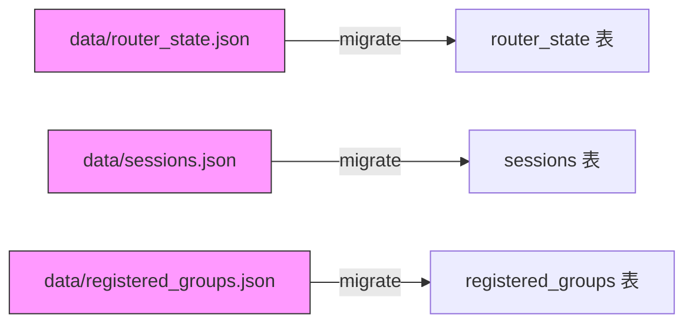

NanoClaw 使用 **SQLite** 作为唯一的持久化存储引擎，通过 [better-sqlite3](https://github.com/WiseLibs/better-sqlite3) 同步驱动在 `store/messages.db` 中管理全部运行时状态。数据库层（`src/db.ts`）是整个系统的**事实真相来源**（source of truth），涵盖会话消息、群组注册、定时任务、路由水位和会话标识五大核心数据域。本文将从 Schema 定义出发，逐表分析字段语义、索引策略、外键约束，以及代码中对应的 TypeScript 类型映射与查询接口设计。

Sources: [db.ts](src/db.ts#L1-L15), [config.ts](src/config.ts#L36-L38)

## 整体 ER 关系

数据库共包含 **7 张表**，围绕 `chats`（会话）和 `registered_groups`（注册群组）两个核心实体展开，通过 `chat_jid` 和 `group_folder` 两条外键纽带紧密关联。下面的 ER 图展示了完整的表间关系：

```mermaid
erDiagram
    chats {
        TEXT jid PK
        TEXT name
        TEXT last_message_time
        TEXT channel
        INTEGER is_group
    }

    messages {
        TEXT id PK
        TEXT chat_jid PK FK
        TEXT sender
        TEXT sender_name
        TEXT content
        TEXT timestamp
        INTEGER is_from_me
        INTEGER is_bot_message
    }

    registered_groups {
        TEXT jid PK
        TEXT name
        TEXT folder UK
        TEXT trigger_pattern
        TEXT added_at
        TEXT container_config
        INTEGER requires_trigger
        INTEGER is_main
    }

    sessions {
        TEXT group_folder PK
        TEXT session_id
    }

    scheduled_tasks {
        TEXT id PK
        TEXT group_folder
        TEXT chat_jid
        TEXT prompt
        TEXT schedule_type
        TEXT schedule_value
        TEXT context_mode
        TEXT next_run
        TEXT last_run
        TEXT last_result
        TEXT status
        TEXT created_at
    }

    task_run_logs {
        INTEGER id PK
        TEXT task_id FK
        TEXT run_at
        INTEGER duration_ms
        TEXT status
        TEXT result
        TEXT error
    }

    router_state {
        TEXT key PK
        TEXT value
    }

    chats ||--o{ messages : "chat_jid"
    scheduled_tasks ||--o{ task_run_logs : "task_id"
    registered_groups ||--o{ sessions : "group_folder = folder"
    registered_groups ||--o{ scheduled_tasks : "group_folder = folder"
```

> **阅读提示**：`registered_groups.folder` 与 `sessions.group_folder` / `scheduled_tasks.group_folder` 之间存在**逻辑外键**（未声明 SQL 外键约束），用于将群组配置与对应的会话状态和定时任务关联。

Sources: [db.ts](src/db.ts#L17-L85)

## 表结构详解

### `chats` — 会话元数据

`chats` 表存储所有已知会话（群聊 + 私聊）的**轻量元数据**，不含消息内容。其设计意图是支持**群组发现**——即使某个会话尚未注册为活跃群组，系统也会记录其存在，以便用户后续通过命令注册。

| 字段 | 类型 | 约束 | 说明 |
|------|------|------|------|
| `jid` | `TEXT` | `PRIMARY KEY` | 会话的唯一标识符（JID），格式因渠道而异 |
| `name` | `TEXT` | — | 会话显示名称，未提供时回退到 `jid` |
| `last_message_time` | `TEXT` | — | 最近一条消息的 ISO 8601 时间戳，用于排序和水位追踪 |
| `channel` | `TEXT` | — | 所属渠道标识（`whatsapp` / `discord` / `telegram`） |
| `is_group` | `INTEGER` | `DEFAULT 0` | 是否为群聊（0 = 私聊，1 = 群聊） |

**渠道 JID 格式约定**：

| 渠道 | 群聊 JID 示例 | 私聊 JID 示例 |
|------|---------------|---------------|
| WhatsApp | `group_id@g.us` | `phone@s.whatsapp.net` |
| Discord | `dc:guild:channel` | — |
| Telegram | `tg:chat_id` | — |

`channel` 和 `is_group` 是后续通过迁移添加的列，系统在迁移时会根据 JID 后缀自动回填：

```
@g.us          → whatsapp, is_group = 1
@s.whatsapp.net → whatsapp, is_group = 0
dc:            → discord,  is_group = 1
tg:            → telegram, is_group = 1
```

**特殊行**：`jid = '__group_sync__'` 用于记录群组元数据同步时间戳，复用 `last_message_time` 字段。这是一个"伪会话"记录，不属于任何真实会话。

Sources: [db.ts](src/db.ts#L19-L25), [db.ts](src/db.ts#L122-L141), [db.ts](src/db.ts#L241-L257)

### `messages` — 消息内容

`messages` 表存储注册群组中的**完整消息内容**，是智能体获取上下文的核心数据源。设计上采用**复合主键** `(id, chat_jid)`，支持同一消息 ID 在不同会话中独立存在。

| 字段 | 类型 | 约束 | 说明 |
|------|------|------|------|
| `id` | `TEXT` | `PRIMARY KEY (复合)` | 消息唯一 ID（渠道原生 ID） |
| `chat_jid` | `TEXT` | `PRIMARY KEY (复合), FK → chats.jid` | 所属会话的 JID |
| `sender` | `TEXT` | — | 发送者标识（JID 或用户 ID） |
| `sender_name` | `TEXT` | — | 发送者显示名称 |
| `content` | `TEXT` | — | 消息正文，空内容在查询时被过滤 |
| `timestamp` | `TEXT` | `INDEX` | ISO 8601 时间戳，建有索引加速范围查询 |
| `is_from_me` | `INTEGER` | — | 是否为用户自己发出的消息（1 = 是） |
| `is_bot_message` | `INTEGER` | `DEFAULT 0` | 是否为智能体回复消息，查询时过滤排除 |

**索引策略**：

```sql
CREATE INDEX idx_timestamp ON messages(timestamp);
```

该索引支撑所有基于时间范围的查询（`getMessagesSince`、`getNewMessages`），这些查询使用 `timestamp > ?` 作为核心过滤条件。

**Bot 消息过滤**采用**双重防护**机制：
1. `is_bot_message = 0` 标志位过滤——过滤迁移后的新消息
2. `content NOT LIKE 'BotName:%'` 前缀回退——过滤迁移前的历史消息

Sources: [db.ts](src/db.ts#L26-L38), [db.ts](src/db.ts#L96-L107), [db.ts](src/db.ts#L305-L364)

### `registered_groups` — 注册群组

`registered_groups` 表记录已被激活的群组配置，是**消息路由**的核心判断依据。只有在此表中注册的群组，系统才会处理其消息并启动容器智能体。

| 字段 | 类型 | 约束 | 说明 |
|------|------|------|------|
| `jid` | `TEXT` | `PRIMARY KEY` | 群组的 JID |
| `name` | `TEXT` | `NOT NULL` | 群组显示名称 |
| `folder` | `TEXT` | `NOT NULL, UNIQUE` | 群组在 `groups/` 目录下的文件夹名 |
| `trigger_pattern` | `TEXT` | `NOT NULL` | 触发词正则模式（如 `@Andy`） |
| `added_at` | `TEXT` | `NOT NULL` | 注册时间 ISO 8601 |
| `container_config` | `TEXT` | — | JSON 序列化的 `ContainerConfig`（挂载、超时等） |
| `requires_trigger` | `INTEGER` | `DEFAULT 1` | 是否需要触发词才响应（私聊可设为 0） |
| `is_main` | `INTEGER` | `DEFAULT 0` | 是否为主控群组（拥有提权权限） |

**TypeScript 类型映射**：数据库中的 `INTEGER` 布尔字段在读取时被转换为 TypeScript 的 `boolean | undefined`，例如 `requires_trigger` 在数据库中为 `0/1/NULL`，在代码中映射为 `boolean | undefined`。`container_config` 以 JSON 字符串存储，读取时通过 `JSON.parse()` 反序列化为 `ContainerConfig` 对象。

Sources: [db.ts](src/db.ts#L76-L84), [db.ts](src/db.ts#L540-L598), [types.ts](src/types.ts#L35-L43)

### `scheduled_tasks` — 定时任务

`scheduled_tasks` 表存储用户创建的定时任务定义，支持三种调度模式。该表是[任务调度器](18-ren-wu-diao-du-qi-src-task-scheduler-ts-cron-jian-ge-yu-ci-xing-ren-wu)的持久化后端。

| 字段 | 类型 | 约束 | 说明 |
|------|------|------|------|
| `id` | `TEXT` | `PRIMARY KEY` | 任务唯一 ID（UUID） |
| `group_folder` | `TEXT` | `NOT NULL` | 关联群组的文件夹名 |
| `chat_jid` | `TEXT` | `NOT NULL` | 关联会话的 JID（结果发送目标） |
| `prompt` | `TEXT` | `NOT NULL` | 任务执行提示词 |
| `schedule_type` | `TEXT` | `NOT NULL` | 调度类型：`cron` / `interval` / `once` |
| `schedule_value` | `TEXT` | `NOT NULL` | 调度值：cron 表达式 / 毫秒数 / ISO 时间戳 |
| `context_mode` | `TEXT` | `DEFAULT 'isolated'` | 上下文模式：`isolated`（独立） / `group`（群组上下文） |
| `next_run` | `TEXT` | — | 下次执行时间（ISO 8601），`NULL` 表示已结束 |
| `last_run` | `TEXT` | — | 上次执行时间 |
| `last_result` | `TEXT` | — | 上次执行结果摘要 |
| `status` | `TEXT` | `DEFAULT 'active'` | 任务状态：`active` / `paused` / `completed` |
| `created_at` | `TEXT` | `NOT NULL` | 创建时间 |

**索引策略**：

```sql
CREATE INDEX idx_next_run ON scheduled_tasks(next_run);
CREATE INDEX idx_status ON scheduled_tasks(status);
```

`idx_next_run` 加速 `getDueTasks()` 中的 `WHERE next_run <= ?` 查询；`idx_status` 加速按状态过滤活跃任务。两个索引共同支撑调度器每分钟轮询的高效执行。

**状态流转**：`once` 类型任务在执行完毕后 `next_run` 设为 `NULL`，`updateTaskAfterRun` 自动将其状态推进为 `completed`。`cron` 和 `interval` 类型任务则通过 `computeNextRun()` 计算下次执行时间，保持 `active` 状态。

Sources: [db.ts](src/db.ts#L40-L54), [db.ts](src/db.ts#L455-L481), [task-scheduler.ts](src/task-scheduler.ts#L31-L63)

### `task_run_logs` — 任务执行日志

`task_run_logs` 表记录每次定时任务的执行历史，提供可审计的运行追踪。

| 字段 | 类型 | 约束 | 说明 |
|------|------|------|------|
| `id` | `INTEGER` | `PRIMARY KEY AUTOINCREMENT` | 日志自增 ID |
| `task_id` | `TEXT` | `NOT NULL, FK → scheduled_tasks.id` | 关联任务 ID |
| `run_at` | `TEXT` | `NOT NULL` | 执行时间 ISO 8601 |
| `duration_ms` | `INTEGER` | `NOT NULL` | 执行耗时（毫秒） |
| `status` | `TEXT` | `NOT NULL` | 执行结果：`success` / `error` |
| `result` | `TEXT` | — | 成功时的结果文本 |
| `error` | `TEXT` | — | 失败时的错误信息 |

**级联删除**：删除任务时，`deleteTask()` 先手动删除关联的 `task_run_logs` 记录，再删除任务本身，以满足外键约束：

```typescript
db.prepare('DELETE FROM task_run_logs WHERE task_id = ?').run(id);
db.prepare('DELETE FROM scheduled_tasks WHERE id = ?').run(id);
```

Sources: [db.ts](src/db.ts#L56-L66), [db.ts](src/db.ts#L449-L453), [db.ts](src/db.ts#L483-L497)

### `router_state` — 路由状态水位

`router_state` 是一个简单的**键值对**表，用于存储消息路由的**水位标记**（watermark），即上次处理消息的时间戳。

| 字段 | 类型 | 约束 | 说明 |
|------|------|------|------|
| `key` | `TEXT` | `PRIMARY KEY` | 状态键名 |
| `value` | `TEXT` | `NOT NULL` | 状态值（JSON 字符串或纯文本） |

**已知键名**：

| Key | Value 格式 | 说明 |
|-----|-----------|------|
| `last_timestamp` | ISO 8601 字符串 | 全局最后处理消息的时间戳 |
| `last_agent_timestamp` | JSON: `{"folder": "timestamp"}` | 每个群组智能体最后响应的时间戳映射 |

Sources: [db.ts](src/db.ts#L68-L71), [db.ts](src/db.ts#L499-L512)

### `sessions` — 会话标识

`sessions` 表维护每个群组文件夹对应的 **Claude Agent SDK 会话 ID**，实现跨容器调用的会话持久化与上下文恢复。

| 字段 | 类型 | 约束 | 说明 |
|------|------|------|------|
| `group_folder` | `TEXT` | `PRIMARY KEY` | 群组文件夹名 |
| `session_id` | `TEXT` | `NOT NULL` | Claude Agent SDK 的 session ID |

该表以 `group_folder`（而非 JID）为主键，因为同一个群组可能通过不同渠道接入，但共享同一个智能体会话上下文。

Sources: [db.ts](src/db.ts#L73-L75), [db.ts](src/db.ts#L514-L538)

## 迁移策略：从 JSON 到 SQLite

`migrateJsonState()` 函数在数据库初始化时自动执行**一次性 JSON → SQLite 迁移**。该迁移将旧版本中存储在 `data/` 目录下的三个 JSON 文件导入对应的数据库表：



迁移采用**乐观策略**：读取 JSON 文件后立即将其重命名为 `.migrated` 后缀，确保只迁移一次。若迁移过程中某个群组的 `folder` 未通过 `isValidGroupFolder()` 校验，该条目会被跳过并记录警告日志，不会阻断整体迁移流程。

Sources: [db.ts](src/db.ts#L637-L697)

## Schema 演进：ALTER TABLE 迁移模式

NanoClaw 采用**渐进式列添加**的迁移模式，而非版本化迁移脚本。`createSchema()` 在创建基础表之后，通过一系列 `try/catch` 包裹的 `ALTER TABLE ADD COLUMN` 语句来添加新列：

| 迁移 | 目标表 | 新增列 | 回填逻辑 |
|------|--------|--------|----------|
| 1 | `scheduled_tasks` | `context_mode TEXT DEFAULT 'isolated'` | 无需回填（默认值即可） |
| 2 | `messages` | `is_bot_message INTEGER DEFAULT 0` | 标记 `content LIKE 'AssistantName:%'` 的行 |
| 3 | `registered_groups` | `is_main INTEGER DEFAULT 0` | 设置 `folder = 'main'` 的行 `is_main = 1` |
| 4 | `chats` | `channel TEXT, is_group INTEGER DEFAULT 0` | 根据 JID 后缀推断渠道和群聊标识 |

这种模式的核心思想是：**每列添加都是幂等的**。如果列已存在，`ALTER TABLE` 会抛出异常并被静默捕获，不会影响后续逻辑。回填操作也设计为可安全重复执行。

Sources: [db.ts](src/db.ts#L87-L141)

## 查询接口设计

数据库层对外暴露**函数式 API**，每个表对应一组 CRUD 操作函数。以下是按功能域分类的完整接口清单：

### 消息与会话查询

| 函数 | 参数 | 返回值 | 说明 |
|------|------|--------|------|
| `storeChatMetadata(jid, timestamp, name?, channel?, isGroup?)` | 会话 JID、时间戳、可选元数据 | `void` | Upsert 会话元数据，保留更新的时间戳 |
| `updateChatName(jid, name)` | 会话 JID、名称 | `void` | 更新会话显示名称 |
| `getAllChats()` | — | `ChatInfo[]` | 返回所有会话，按最近活跃排序 |
| `storeMessage(msg)` | `NewMessage` | `void` | 存储完整消息 |
| `getMessagesSince(chatJid, since, botPrefix, limit?)` | 单会话查询 | `NewMessage[]` | 获取指定会话在时间戳之后的非 Bot 消息 |
| `getNewMessages(jids, lastTimestamp, botPrefix, limit?)` | 多会话查询 | `{messages, newTimestamp}` | 跨会话获取新消息，更新水位 |

**查询性能优化**：`getMessagesSince` 和 `getNewMessages` 均使用**子查询 + 外层排序**模式——内层按 `timestamp DESC` 取最近的 N 条记录，外层按 `timestamp ASC` 重排为时间顺序。这避免了在大数据集上进行全表排序：

```sql
SELECT * FROM (
  SELECT ... FROM messages
  WHERE timestamp > ? AND chat_jid IN (...)
    AND is_bot_message = 0 AND content NOT LIKE ?
  ORDER BY timestamp DESC
  LIMIT 200
) ORDER BY timestamp
```

Sources: [db.ts](src/db.ts#L165-L364)

### 任务 CRUD

| 函数 | 说明 |
|------|------|
| `createTask(task)` | 创建新任务 |
| `getTaskById(id)` | 按 ID 查询单个任务 |
| `getTasksForGroup(groupFolder)` | 查询群组下的所有任务 |
| `getAllTasks()` | 查询所有任务 |
| `updateTask(id, updates)` | 部分更新任务字段（动态构建 SET 子句） |
| `deleteTask(id)` | 删除任务及其关联日志 |
| `getDueTasks()` | 查询所有到期待执行的任务 |
| `updateTaskAfterRun(id, nextRun, lastResult)` | 执行后更新：推进 `next_run`、`last_run`、`last_result`，`once` 类型自动标记 `completed` |
| `logTaskRun(log)` | 记录一次执行日志 |

Sources: [db.ts](src/db.ts#L366-L497)

### 状态与配置访问器

| 函数 | 说明 |
|------|------|
| `getRouterState(key)` / `setRouterState(key, value)` | 路由水位的键值存取 |
| `getSession(groupFolder)` / `setSession(groupFolder, sessionId)` | 会话 ID 的存取 |
| `getAllSessions()` | 获取所有群组的会话 ID 映射 |
| `getRegisteredGroup(jid)` / `setRegisteredGroup(jid, group)` | 注册群组的存取（含 JSON 序列化/反序列化） |
| `getAllRegisteredGroups()` | 获取所有注册群组映射 |

Sources: [db.ts](src/db.ts#L499-L635)

## TypeScript 类型映射

数据库层通过 `src/types.ts` 定义了与 Schema 对应的 TypeScript 接口。关键的映射关系如下：

| SQL 表 | TypeScript 接口 | 特殊映射 |
|--------|----------------|----------|
| `messages` | `NewMessage` | `is_from_me?: boolean` → `INTEGER` |
| `registered_groups` | `RegisteredGroup` | `containerConfig?: ContainerConfig` → `TEXT (JSON)` |
| `scheduled_tasks` | `ScheduledTask` | `schedule_type: 'cron' \| 'interval' \| 'once'` |
| `task_run_logs` | `TaskRunLog` | `status: 'success' \| 'error'` |

`RegisteredGroup` 的 `isMain` 字段在数据库中以 `INTEGER (0/1)` 存储，在读取时通过 `row.is_main === 1 ? true : undefined` 转换为语义化的三态值（`true` / `undefined`），而非简单的布尔值——`undefined` 表示"非主群组"，`true` 表示"是主群组"。

Sources: [types.ts](src/types.ts#L35-L78), [db.ts](src/db.ts#L567-L579)

## 设计哲学总结

NanoClaw 的数据库层体现了几个核心设计决策：

**单文件、单进程**：SQLite 的嵌入式特性完美匹配 NanoClaw 的单进程编排器架构——无需额外的数据库服务进程，`better-sqlite3` 的同步 API 也消除了异步回调复杂度。

**幂等迁移**：所有 Schema 变更通过 `try/catch ALTER TABLE` 实现，确保在任何版本起点上都能安全启动。回填操作同样设计为可重复执行。

**Upsert 优先**：`storeChatMetadata`、`storeMessage`、`setRegisteredGroup` 等写入操作均使用 `INSERT OR REPLACE` / `ON CONFLICT DO UPDATE` 语义，天然支持消息重放和状态覆盖，无需额外的存在性检查。

**逻辑外键 vs 物理外键**：仅 `messages.chat_jid` 和 `task_run_logs.task_id` 声明了 SQL 外键约束。`registered_groups.folder` 与 `sessions.group_folder`、`scheduled_tasks.group_folder` 之间的关联通过应用层逻辑维护，不设物理外键——这是为了支持灵活的文件夹命名和迁移场景。

Sources: [db.ts](src/db.ts#L144-L159), [db.ts](src/db.ts#L263-L276)

## 延伸阅读

- [数据库层（src/db.ts）：SQLite Schema、迁移与查询接口](17-shu-ju-ku-ceng-src-db-ts-sqlite-schema-qian-yi-yu-cha-xun-jie-kou) — 同一模块的实现视角分析
- [任务调度器（src/task-scheduler.ts）：Cron、间隔与一次性任务](18-ren-wu-diao-du-qi-src-task-scheduler-ts-cron-jian-ge-yu-ci-xing-ren-wu) — `scheduled_tasks` 表的消费端
- [会话管理：Session 持久化与上下文恢复](30-hui-hua-guan-li-session-chi-jiu-hua-yu-shang-xia-wen-hui-fu) — `sessions` 表在容器间的作用机制
- [消息路由（src/router.ts）：消息格式化与出站分发](16-xiao-xi-lu-you-src-router-ts-xiao-xi-ge-shi-hua-yu-chu-zhan-fen-fa) — `router_state` 表水位标记的使用场景