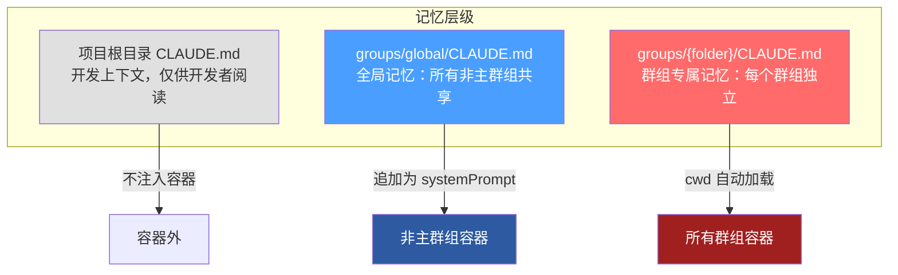
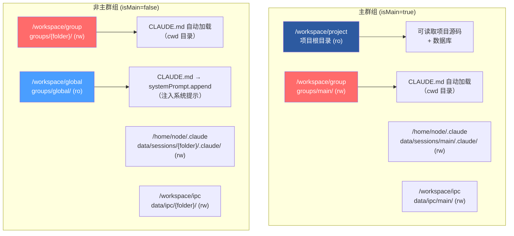
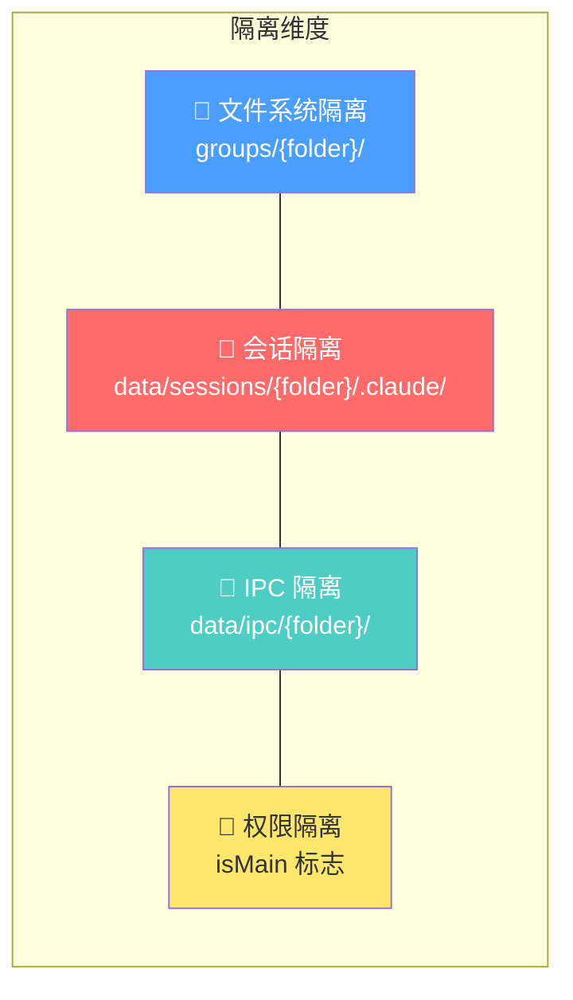
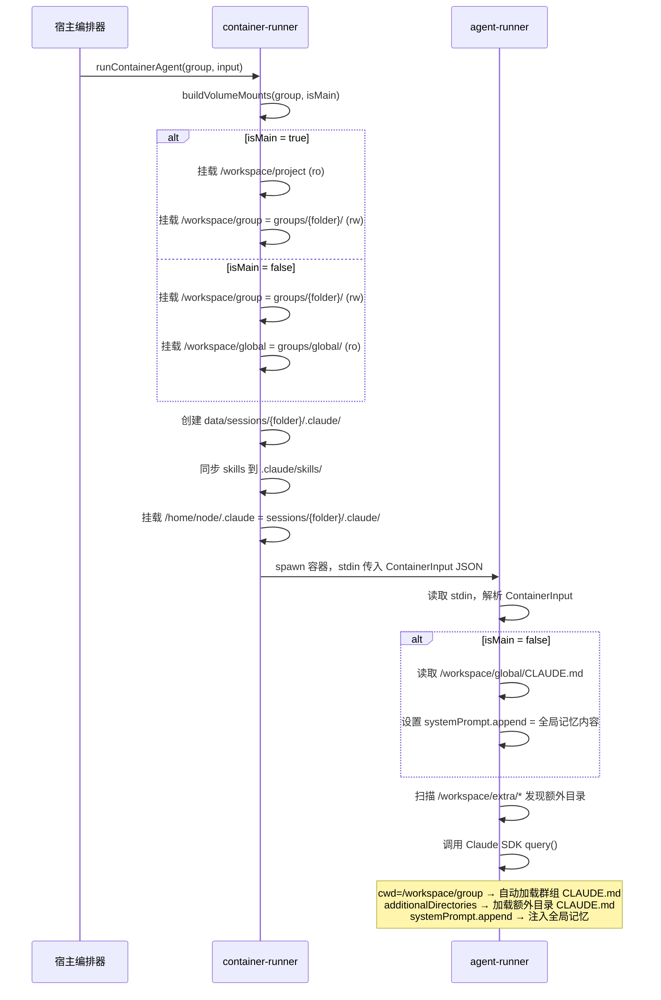

NanoClaw 的记忆系统基于 **CLAUDE.md 层级文件**实现，通过容器卷挂载机制为每个群组（group）构建独立的记忆上下文。该系统的核心设计目标是：在保持全局知识共享的同时，确保各群组的会话、文件和 IPC 通信完全隔离，使得同一个 Claude 实例能够同时服务于多个不同场景（家庭群、工作群、个人私聊），彼此互不干扰、互不可见。

Sources: [CLAUDE.md](CLAUDE.md#L21-L22), [src/config.ts](src/config.ts#L37-L38)

## CLAUDE.md 三层层级结构

NanoClaw 的 CLAUDE.md 文件分布在三个不同层级，每一层承担不同的职责，按优先级从低到高排列如下：



| 层级 | 文件路径 | 加载方式 | 可见范围 | 用途 |
|------|---------|---------|---------|------|
| **项目根** | `CLAUDE.md` | 不挂载进容器 | 仅宿主进程 | 开发者参考，描述项目架构与关键文件 |
| **全局记忆** | `groups/global/CLAUDE.md` | 以 `systemPrompt.append` 注入 | 所有非主群组 | 助手人设、通用能力说明、格式规范 |
| **群组记忆** | `groups/{folder}/CLAUDE.md` | 作为 `cwd` 被 SDK 自动发现 | 仅所属群组 | 群组专属指令、本地文件索引、上下文偏好 |

项目根目录的 `CLAUDE.md` 是面向人类开发者的参考文档，记录了项目架构、关键文件路径和技能列表。它**不会**被挂载进容器，因此智能体无法看到这份文件。

Sources: [CLAUDE.md](CLAUDE.md#L1-L22), [groups/global/CLAUDE.md](groups/global/CLAUDE.md#L1-L59), [groups/main/CLAUDE.md](groups/main/CLAUDE.md#L1-L55)

## 容器挂载机制与记忆加载路径

容器启动时，`buildVolumeMounts()` 函数根据群组类型（主群组 vs 非主群组）构建不同的卷挂载方案。这是记忆隔离的物理基础——不同群组的容器看到完全不同的文件系统视图。



**关键差异点**：主群组获得整个项目根目录的只读挂载（`/workspace/project`），使其可以读取源码、查询数据库、管理其他群组的注册信息。而非主群组**只能**看到自己的群组文件夹和全局记忆目录，无法访问项目源码或其他群组的数据。

Sources: [src/container-runner.ts](src/container-runner.ts#L57-L112)

### 全局记忆的注入方式

全局 CLAUDE.md 的加载遵循一条精确的代码路径。在容器内的 agent-runner 中，系统会检测是否为非主群组，如果是，则读取 `/workspace/global/CLAUDE.md` 并将其内容追加到 Claude Code SDK 的系统提示中：

```typescript
// container/agent-runner/src/index.ts
const globalClaudeMdPath = '/workspace/global/CLAUDE.md';
let globalClaudeMd: string | undefined;
if (!containerInput.isMain && fs.existsSync(globalClaudeMdPath)) {
  globalClaudeMd = fs.readFileSync(globalClaudeMdPath, 'utf-8');
}
// ...
systemPrompt: globalClaudeMd
  ? { type: 'preset', preset: 'claude_code', append: globalClaudeMd }
  : undefined,
```

这意味着全局 CLAUDE.md 的内容被**合并到** Claude Code 的预设系统提示之后，而不是替换它。这种 `{ type: 'preset', append: content }` 的模式确保智能体同时拥有 Claude Code 的基础能力和全局记忆中定义的个性化行为。而对于主群组，`globalClaudeMd` 为 `undefined`，`systemPrompt` 参数完全不设置——主群组通过直接读取 `groups/global/CLAUDE.md` 文件（因为它能访问项目根目录下的所有文件）来管理全局记忆，而不是被动接收。

Sources: [container/agent-runner/src/index.ts](container/agent-runner/src/index.ts#L394-L426)

### 额外挂载目录的 CLAUDE.md 发现

除了全局和群组两层，容器还支持通过 `containerConfig.additionalMounts` 挂载额外的项目目录。这些目录被放置在 `/workspace/extra/` 下，并通过 Claude Code SDK 的 `additionalDirectories` 参数传入，SDK 会**自动扫描**这些目录中的 CLAUDE.md 文件并加载：

```typescript
// 自动发现 /workspace/extra/* 下的所有子目录
const extraDirs: string[] = [];
const extraBase = '/workspace/extra';
if (fs.existsSync(extraBase)) {
  for (const entry of fs.readdirSync(extraBase)) {
    const fullPath = path.join(extraBase, entry);
    if (fs.statSync(fullPath).isDirectory()) {
      extraDirs.push(fullPath);
    }
  }
}
// 传入 SDK，自动加载其中的 CLAUDE.md
additionalDirectories: extraDirs.length > 0 ? extraDirs : undefined,
```

此外，每组的 `.claude/settings.json` 中设置了环境变量 `CLAUDE_CODE_ADDITIONAL_DIRECTORIES_CLAUDE_MD=1`，显式启用从额外挂载目录加载 CLAUDE.md 的功能。

Sources: [container/agent-runner/src/index.ts](container/agent-runner/src/index.ts#L401-L415), [src/container-runner.ts](src/container-runner.ts#L131-L136)

## 群组隔离的四重保障

NanoClaw 的隔离模型不仅限于记忆文件，而是贯穿于文件系统、会话存储、IPC 通信和权限模型四个维度，形成**纵深防御**架构：



### 文件系统隔离

每个群组的持久化文件存放在独立的 `groups/{folder}/` 目录中。`folder` 名称必须通过 `isValidGroupFolder()` 的严格校验：只允许字母、数字、连字符和下划线，长度 1-64 字符，且 `global` 是保留名称不可使用。路径解析函数 `resolveGroupFolderPath()` 还会额外检查解析后的路径是否在 `GROUPS_DIR` 基准目录内，防止路径穿越攻击。

群组文件夹的命名遵循 `{channel}_{group-name}` 的约定（如 `whatsapp_family-chat`、`telegram_dev-team`），确保跨渠道的群组不会产生命名冲突。

Sources: [src/group-folder.ts](src/group-folder.ts#L1-L44)

### 会话隔离

每个群组拥有独立的 Claude Code 会话目录 `data/sessions/{folder}/.claude/`。该目录在容器启动时自动创建，包含 `settings.json`（SDK 配置）、`skills/`（技能文件同步）以及 Claude Code 自身的会话数据。容器内该目录被挂载到 `/home/node/.claude`，使 Claude Code SDK 将其视为用户的 `.claude` 配置目录。

这意味着不同群组的**对话历史、工具偏好、会话状态**完全独立——群组 A 的对话不会出现在群组 B 的上下文中。

Sources: [src/container-runner.ts](src/container-runner.ts#L114-L162)

### IPC 命名空间隔离

每个群组的进程间通信文件存放在 `data/ipc/{folder}/` 下的独立目录结构中：

```
data/ipc/{folder}/
├── messages/    # 出站消息（发送到聊天）
├── tasks/       # 任务请求（调度、注册等）
└── input/       # 入站消息（追加对话、关闭信号）
```

宿主进程的 IPC watcher 遍历所有群组的 IPC 目录，但**通过目录名确定消息来源身份**，并基于 `isMain` 标志执行授权检查。非主群组只能为自己的 JID 发送消息，主群组则可以向任何已注册群组发送消息。

Sources: [src/ipc.ts](src/ipc.ts#L36-L154)

### 权限模型：主群组 vs 非主群组

`RegisteredGroup` 类型中的 `isMain` 字段是整个权限体系的核心开关。它决定了：

| 能力 | 主群组 (isMain=true) | 非主群组 (isMain=false) |
|------|---------------------|------------------------|
| 读取项目源码 | ✅ `/workspace/project` (ro) | ❌ |
| 管理群组注册 | ✅ 可注册/移除任意群组 | ❌ |
| 跨群组发送消息 | ✅ 可向任何 JID 发送 | ❌ 仅限自身 JID |
| 跨群组调度任务 | ✅ 可为任何群组创建任务 | ❌ 仅限自身 |
| 读写全局记忆 | ✅ 直接文件操作 | 只读（systemPrompt） |
| 查看可用群组列表 | ✅ `available_groups.json` | ❌ 空列表 |
| 全局 CLAUDE.md 加载 | ❌ 不注入 systemPrompt | ✅ 追加到系统提示 |
| 触发词要求 | 无需触发词 | 默认需要 `@助手名` |

这种**非对称权限设计**是有意为之：主群组是管理控制台，需要全局视野和管理能力；非主群组是受约束的执行环境，只能操作自己的数据和记忆。

Sources: [src/types.ts](src/types.ts#L35-L43), [src/container-runner.ts](src/container-runner.ts#L65-L112), [src/ipc.ts](src/ipc.ts#L78-L93)

## 记忆初始化：群组注册流程

当一个新群组被注册时（通过主群组的 `register_group` MCP 工具或 `setup/register.ts`），系统执行以下操作：

1. **写入数据库**：将群组元数据（JID、名称、文件夹、触发词等）写入 SQLite 的 `registered_groups` 表
2. **创建文件夹**：在 `groups/{folder}/` 下创建目录和 `logs/` 子目录
3. **名称替换**：如果助手名称不是默认的 "Andy"，则自动替换 `groups/global/CLAUDE.md` 和 `groups/{folder}/CLAUDE.md` 中的名称占位符

注册后，该群组的 CLAUDE.md 文件为空或仅包含从模板生成的基础内容。群组的实际记忆内容会在后续对话中由智能体自行积累——智能体可以读写 `/workspace/group/` 下的任意文件，并将重要信息持久化为 Markdown 文件。

Sources: [setup/register.ts](setup/register.ts#L72-L202)

## 对话归档与记忆持久化

容器内的 agent-runner 注册了一个 `PreCompact` 钩子，在 Claude Code SDK 压缩对话历史之前触发。该钩子将完整的对话记录归档到 `/workspace/group/conversations/` 目录，以 `{date}-{summary}.md` 格式保存。每个归档文件包含对话的 Markdown 格式摘要，可供智能体在后续会话中搜索和回溯。

这一机制确保了即使 Claude Code 的上下文窗口被压缩，重要的对话信息仍然以可搜索的文件形式保留在群组的记忆空间中。智能体的 `CLAUDE.md` 中也包含相应指引，提示其利用 `conversations/` 目录检索历史上下文。

Sources: [container/agent-runner/src/index.ts](container/agent-runner/src/index.ts#L146-L186), [groups/global/CLAUDE.md](groups/global/CLAUDE.md#L41-L48)

## `global` 保留名称的安全语义

`global` 作为保留的文件夹名称，在 `group-folder.ts` 中被明确排除在合法群组名之外。这一设计确保 `groups/global/` 目录始终只服务于全局记忆功能，不会被任何群组注册抢占。

对于非主群组而言，`groups/global/` 被挂载为**只读**卷（`/workspace/global`），这意味着非主群组的智能体只能读取全局记忆，不能修改它。只有主群组——通过挂载项目根目录获得的文件系统访问权限——才能修改 `groups/global/CLAUDE.md`。这形成了一个**单向知识传播**模型：全局记忆由管理员通过主群组维护，所有非主群组被动接收。

Sources: [src/group-folder.ts](src/group-folder.ts#L6-L14), [src/container-runner.ts](src/container-runner.ts#L103-L111)

## 完整的记忆加载时序



Sources: [src/container-runner.ts](src/container-runner.ts#L57-L211), [container/agent-runner/src/index.ts](container/agent-runner/src/index.ts#L394-L457)

## 相关页面

- [SQLite 数据库 Schema：消息、群组、会话、任务与路由状态](28-sqlite-shu-ju-ku-schema-xiao-xi-qun-zu-hui-hua-ren-wu-yu-lu-you-zhuang-tai) — 了解 `registered_groups` 表如何存储群组元数据
- [会话管理：Session 持久化与上下文恢复](30-hui-hua-guan-li-session-chi-jiu-hua-yu-shang-xia-wen-hui-fu) — Session ID 如何在容器重启间保持连续性
- [IPC 通信（src/ipc.ts）：基于文件的进程间通信与权限校验](15-ipc-tong-xin-src-ipc-ts-ji-yu-wen-jian-de-jin-cheng-jian-tong-xin-yu-quan-xian-xiao-yan) — IPC 命名空间隔离的完整细节
- [IPC 授权模型：主群组与非主群组的权限差异](24-ipc-shou-quan-mo-xing-zhu-qun-zu-yu-fei-zhu-qun-zu-de-quan-xian-chai-yi) — `isMain` 标志如何控制跨群组操作
- [定制化实践：修改触发词、行为调整与目录挂载](32-ding-zhi-hua-shi-jian-xiu-gai-hong-fa-ci-xing-wei-tiao-zheng-yu-mu-lu-gua-zai) — 如何通过 CLAUDE.md 和额外挂载定制助手行为