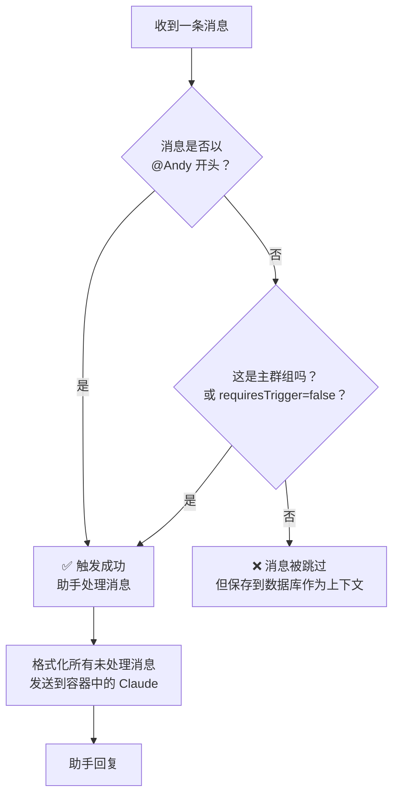
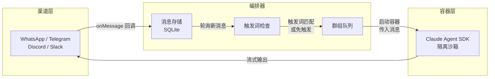

本文将带您了解 NanoClaw 中与助手对话的核心机制：**触发词**如何唤醒助手、**群组**如何组织不同对话上下文，以及日常使用的**基本模式**。理解这三个概念后，您就能在 WhatsApp、Telegram、Discord 等任何已安装的消息渠道中自如地与 Claude 交互。

Sources: [CLAUDE.md](CLAUDE.md#L1-L8), [README_zh.md](README_zh.md#L64-L79)

## 触发词：如何唤醒助手

**触发词**（Trigger Word）是您在消息开头用来激活助手的标记，默认格式为 `@Andy`。它的作用类似于群聊中的 @提及——只有以触发词开头的消息才会被助手接收和处理。

Sources: [config.ts](src/config.ts#L11-L64)

### 触发词的匹配规则

触发词的匹配由 `TRIGGER_PATTERN` 正则表达式实现，核心规则如下：



| 规则 | 说明 | 示例 |
|------|------|------|
| **必须在开头** | 触发词必须位于消息的第一个词 | `@Andy 帮我查一下天气` ✅ |
| **大小写不敏感** | 任何大小写组合都能匹配 | `@andy`、`@ANDY`、`@Andy` 均 ✅ |
| **词边界匹配** | 触发词后必须跟空格或标点 | `@Andy's thing` ✅，`@Andyextra` ❌ |
| **前导空白可接受** | 消息首尾空白会被 trim 后再匹配 | `"  @Andy hello  "` ✅ |

助手名称由环境变量 `ASSISTANT_NAME` 控制（默认为 `Andy`）。如果您在安装时指定了不同的名称（例如 `Bob`），触发词就会自动变为 `@Bob`。

Sources: [config.ts](src/config.ts#L11-L64), [formatting.test.ts](src/formatting.test.ts#L126-L162)

### 为什么要用触发词？

在群聊中，成员间的对话可能频繁而琐碎。触发词机制确保助手只在**被需要时**才响应，避免对每条日常消息都做出反应。未被触发词激活的消息并非被丢弃——它们仍然被保存到数据库中，作为后续对话的**上下文背景**。当有人在群组中发出触发词时，助手会看到从上次回复以来的**所有消息**，从而理解完整的对话脉络。

Sources: [index.ts](src/index.ts#L388-L413)

## 群组：隔离的对话上下文

**群组**（Group）是 NanoClaw 组织对话的核心单元。每个群组对应一个独立的文件目录和记忆系统，助手在不同群组中拥有**完全隔离的上下文**。

Sources: [types.ts](src/types.ts#L35-L43)

### 群组的类型

NanoClaw 中存在三种群组类型，它们的权限和触发行为各不相同：

| 类型 | 触发词要求 | 权限级别 | 典型场景 |
|------|-----------|---------|---------|
| **主群组**（Main Group） | ❌ 不需要 | 最高——可管理其他群组和任务 | 您的 self-chat（自己给自己发消息） |
| **免触发群组**（requiresTrigger=false） | ❌ 不需要 | 标准——仅访问本群组上下文 | 1对1 私聊、个人频道 |
| **普通群组**（默认） | ✅ 需要 `@Andy` | 标准——仅访问本群组上下文 | 工作群、家庭群等多人聊天 |

Sources: [types.ts](src/types.ts#L35-L43), [formatting.test.ts](src/formatting.test.ts#L206-L256)

### 主群组：您的控制中心

主群组是安装时创建的第一个群组，通常对应您在 WhatsApp 等平台上的"自己聊天"频道。它的特殊之处在于：

- **无需触发词**：每条消息都会被处理，无需 `@Andy` 前缀
- **管理权限**：可以注册/移除其他群组、查看所有群组的计划任务
- **项目访问**：以只读方式挂载整个项目目录，可以查看数据库和所有群组配置

Sources: [groups/main/CLAUDE.md](groups/main/CLAUDE.md#L1-L15), [db.ts](src/db.ts#L109-L120)

### 群组的目录结构

每个注册的群组在 `groups/` 目录下拥有独立的文件夹，包含记忆文件和日志：

```
groups/
├── global/              ← 全局记忆（所有群组共享）
│   └── CLAUDE.md
├── main/                ← 主群组
│   └── CLAUDE.md
├── whatsapp_family/     ← WhatsApp 群组示例
│   └── CLAUDE.md        ← 该群组的专属记忆
└── telegram_dev-team/   ← Telegram 群组示例
    └── CLAUDE.md
```

文件夹命名遵循 `渠道_群组名` 的惯例，例如 `whatsapp_family-chat`、`telegram_dev-team`。`global` 是保留名，用于存放跨群组的全局记忆。

Sources: [group-folder.ts](src/group-folder.ts#L5-L36), [get_dir_structure](groups)

### 群组注册过程

群组注册通过 `setup/register` 步骤完成，需要以下参数：

| 参数 | 说明 | 示例 |
|------|------|------|
| `--jid` | 群组的唯一标识符 | `120363336@g.us` |
| `--name` | 群组显示名称 | `家庭聊天` |
| `--trigger` | 触发词 | `@Andy` |
| `--folder` | 群组文件夹名称 | `whatsapp_family` |
| `--channel` | 所属渠道 | `whatsapp` / `telegram` |
| `--no-trigger-required` | 免触发词模式 | （无参数值，出现即为 true） |
| `--is-main` | 标记为主群组 | （无参数值，出现即为 true） |

注册后，系统会在数据库的 `registered_groups` 表中创建记录，并自动创建对应的 `groups/<folder>/` 目录。

Sources: [register.ts](setup/register.ts#L17-L70)

## 消息流转：从发送到回复

当您在消息应用中发送一条消息时，NanoClaw 内部经历以下步骤：



1. **渠道接收**：WhatsApp/Telegram 等渠道将消息通过回调传递给编排器
2. **消息存储**：消息被写入 SQLite 数据库，关联到对应的群组 JID
3. **触发词检查**：轮询循环定期检查新消息，验证触发词条件
4. **队列调度**：通过 `GroupQueue` 控制并发，每个群组同时只运行一个容器
5. **容器处理**：消息被格式化为 XML 结构，传入隔离容器中的 Claude Agent SDK
6. **流式回复**：助手的回复实时流式发送回对应渠道

Sources: [index.ts](src/index.ts#L341-L439), [router.ts](src/router.ts#L13-L25), [group-queue.ts](src/group-queue.ts#L30-L88)

## 基本用法示例

了解了核心机制后，以下是一些典型的使用场景。

### 在普通群组中使用触发词

在家庭群或工作群中，以 `@Andy`（或您自定义的助手名）开头来唤醒助手：

```
@Andy 每周一到周五早上9点，给我发一份销售渠道的概览
```

```
@Andy 帮我总结一下今天群里的讨论要点
```

即使群成员之间的普通对话不含触发词，这些消息仍被保留为上下文。当触发词出现时，助手能看到完整的对话历史。

Sources: [README_zh.md](README_zh.md#L66-L72)

### 在主群组中直接对话

主群组（通常是您的 self-chat）中无需触发词，直接输入即可：

```
列出所有群组的计划任务
```

```
暂停周一简报任务
```

```
加入"家庭聊天"群组
```

Sources: [README_zh.md](README_zh.md#L74-L79)

### 助手的内部思考

助手有时会在回复中使用 `<internal>` 标签包裹内部推理过程。这些内容**不会**发送到消息渠道，仅记录在日志中。例如，助手可能先快速通过 `send_message` 发送关键信息，然后将总结包裹在 `<internal>` 中以避免重复发送。

Sources: [router.ts](src/router.ts#L27-L35), [groups/global/CLAUDE.md](groups/global/CLAUDE.md#L21-L36)

## 发送者控制：谁能触发助手

NanoClaw 通过**发送者白名单**（Sender Allowlist）控制哪些人可以触发助手。配置文件位于 `~/.config/nanoclaw/sender-allowlist.json`。

两种过滤模式：

| 模式 | 行为 | 适用场景 |
|------|------|---------|
| **trigger**（默认） | 所有人消息都被存储，但只有白名单内的人能触发助手 | 开放群组——所有人可见助手回复 |
| **drop** | 非白名单发送者的消息直接丢弃，不存储 | 封闭群组——仅特定人员可交互 |

默认配置为 `allow: "*"`（允许所有人触发）。如果您需要在特定群组限制触发权限，可以在 `chats` 字段中为每个群组单独配置。您自己发出的消息（`is_from_me`）始终绕过白名单检查。

Sources: [sender-allowlist.ts](src/sender-allowlist.ts#L1-L128)

## 消息格式说明

助手在容器内接收的消息被格式化为 XML 结构，包含发送者、时间和时区信息：

```xml
<context timezone="Asia/Shanghai" />
<messages>
  <message sender="Alice" time="Jan 15, 2025, 3:30 PM">今天天气真好</message>
  <message sender="Bob" time="Jan 15, 2025, 3:32 PM">@Andy 明天会下雨吗？</message>
</messages>
```

而助手的回复会自动剥离 `<internal>` 标签，仅将面向用户的内容发送到消息渠道。助手使用 WhatsApp/Telegram 兼容的格式（单星号加粗、下划线斜体等），而非 Markdown。

Sources: [router.ts](src/router.ts#L13-L25), [groups/global/CLAUDE.md](groups/global/CLAUDE.md#L52-L62)

## 接下来

现在您已了解触发词、群组和基本用法，可以继续以下阅读路线：

- 如果您准备动手安装，请参阅 [环境检测与依赖安装（setup 步骤 1-2）](4-huan-jing-jian-ce-yu-yi-lai-an-zhuang-setup-bu-zou-1-2) 开始配置您的系统
- 如果您想深入理解消息的完整流转路径，请参阅 [消息流转全链路：从渠道到智能体响应](10-xiao-xi-liu-zhuan-quan-lian-lu-cong-qu-dao-dao-zhi-neng-ti-xiang-ying)
- 如果您想了解群组的排队和并发控制机制，请参阅 [群组队列（src/group-queue.ts）：并发控制与任务排队机制](14-qun-zu-dui-lie-src-group-queue-ts-bing-fa-kong-zhi-yu-ren-wu-pai-dui-ji-zhi)