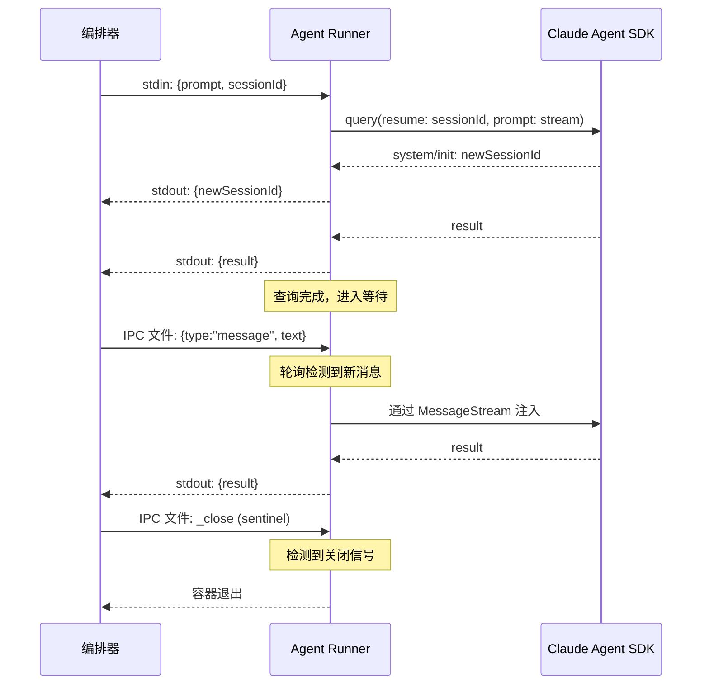

NanoClaw 的会话管理是其智能体持续对话能力的核心基础设施。它解决了容器化架构下的一项关键挑战：**如何在短暂的容器生命周期中维持跨越多次交互的对话上下文**。本文将深入解析 Session 的存储模型、生命周期管理、上下文恢复机制，以及计划任务的上下文隔离策略。

## 核心设计原则

NanoClaw 的会话系统建立在三个原则之上：**数据库持久化**（Session ID 始终写入 SQLite 以跨重启存活）、**文件系统锚定**（Claude SDK 的会话文件存储在按群组隔离的宿主机目录中，以卷挂载方式提供给容器），以及 **流式双向同步**（容器内的 Session 状态变更通过 stdout 标记实时回传给编排器）。

这三层设计构成了一条完整的状态闭环：编排器从数据库读取 Session ID → 通过 stdin 注入容器 → SDK 在容器内创建/恢复会话 → 新的 Session ID 通过 stdout 回传 → 编排器写回数据库。

Sources: [index.ts](src/index.ts#L60-L83), [container-runner.ts](src/container-runner.ts#L33-L49), [db.ts](src/db.ts#L72-L75)

## Session 存储架构

Session 的持久化分布在两个维度上：**关系型存储**（SQLite 的 `sessions` 表）记录每个群组对应的当前 Session ID；**文件系统存储**（`data/sessions/{group_folder}/.claude/`）保存 Claude SDK 管理的完整对话历史。

```mermaid
graph TB
    subgraph 编排器进程
        DB[(SQLite sessions 表<br/>group_folder → session_id)]
        MEM[内存 sessions 字典<br/>运行时缓存]
    end

    subgraph 容器 A - 群组 main
        SDK_A[Claude Agent SDK]
        SF_A[/home/node/.claude/<br/>会话文件]
    end

    subgraph 容器 B - 群组 project-x
        SDK_B[Claude Agent SDK]
        SF_B[/home/node/.claude/<br/>会话文件]
    end

    subgraph 宿主机文件系统
        DIR_A[data/sessions/main/.claude/]
        DIR_B[data/sessions/project-x/.claude/]
    end

    DB -->|加载状态| MEM
    MEM -->|stdin: sessionId| SDK_A
    MEM -->|stdin: sessionId| SDK_B
    SDK_A -->|stdout: newSessionId| MEM
    SDK_B -->|stdout: newSessionId| MEM
    MEM -->|setSession 写回| DB

    DIR_A -.->|卷挂载| SF_A
    DIR_B -.->|卷挂载| SF_B
```

`sessions` 表结构极为简洁，以 `group_folder` 为主键，`session_id` 为值：

| 字段 | 类型 | 说明 |
|------|------|------|
| `group_folder` | TEXT (PK) | 群组的文件夹标识（如 `main`、`project-x`） |
| `session_id` | TEXT NOT NULL | Claude Agent SDK 分配的会话 UUID |

这种一对一映射确保每个群组始终拥有唯一的活动会话。`INSERT OR REPLACE` 语义保证更新操作的原子性——无论群组是否已有会话记录，均可安全写入。

Sources: [db.ts](src/db.ts#L514-L538), [db.ts](src/db.ts#L72-L75)

## 会话生命周期：从创建到恢复

### 状态加载：启动恢复

编排器进程启动时，`loadState()` 函数从 SQLite 加载所有持久化状态到内存，其中 `sessions = getAllSessions()` 将数据库中的全部会话映射读入一个 `Record<string, string>` 字典。这个字典在后续的每次容器调度中被引用，为容器提供正确的 Session ID。

Sources: [index.ts](src/index.ts#L68-L83)

### 首次创建：新会话的诞生

当某个群组首次收到消息时，内存中不存在对应的 Session ID（值为 `undefined`）。编排器在调用 `runAgent()` 时将其作为 `ContainerInput.sessionId` 传入，容器内的 agent-runner 将此 `undefined` 传递给 Claude Agent SDK 的 `query()` 函数的 `resume` 参数。SDK 在收到 `undefined` 的 `resume` 值后创建全新会话，并在 `system/init` 消息中返回 `session_id`。Agent-runner 将此 ID 写入 stdout 的 `newSessionId` 字段，编排器捕获后立即执行 `setSession(group.folder, output.newSessionId)` 持久化到数据库。

Sources: [index.ts](src/index.ts#L260-L339), [container/agent-runner/src/index.ts](container/agent-runner/src/index.ts#L417-L486)

### 上下文恢复：从断点续接

当群组已有活动会话时，恢复流程涉及两个关键参数：`sessionId`（定位到哪个会话）和 `resumeAt`（从会话中的哪条消息继续）。`resumeAt` 存储的是最后一条 assistant 消息的 UUID，SDK 使用它来确定会话恢复的精确位置。Agent-runner 在查询循环中维护此值：

```
while (true) {
    runQuery(prompt, sessionId, ..., resumeAt)
    → 更新 sessionId 和 resumeAt
    → 等待 IPC 消息或 _close 信号
}
```

每次查询完成后，`lastAssistantUuid` 成为下一轮查询的 `resumeAt`，确保上下文的无缝衔接。

Sources: [container/agent-runner/src/index.ts](container/agent-runner/src/index.ts#L538-L574)

### 流式 Session 更新

Session ID 的更新不是在容器退出时才发生，而是在容器运行期间**实时流式传递**的。编排器在 `runAgent()` 中包装了 `onOutput` 回调：

```typescript
const wrappedOnOutput = async (output: ContainerOutput) => {
    if (output.newSessionId) {
        sessions[group.folder] = output.newSessionId;
        setSession(group.folder, output.newSessionId);
    }
    await onOutput(output);
};
```

这意味着即使容器因为超时或错误异常退出，在此之前发出的 Session ID 已经安全存储在数据库中，下次调度时可直接使用。

Sources: [index.ts](src/index.ts#L295-L303), [container-runner.ts](src/container-runner.ts#L343-L373)

## 容器内查询循环与会话续接

Agent-runner 在容器内运行一个**持久查询循环**，这是会话连续性的关键机制。它不是单次请求-响应模式，而是通过 IPC 管道持续接收后续消息，将其注入到同一个会话中。



这个循环中，`MessageStream` 类扮演了关键角色：它是一个 **push 风格的 AsyncIterable**，保持查询的 `isSingleUserTurn=false`，允许 Agent Teams 的子代理完成全部工作后才返回结果。当 IPC 轮询发现新消息时，`stream.push(text)` 将其注入流中；当 `_close` 哨兵文件出现时，`stream.end()` 终结迭代。

Sources: [container/agent-runner/src/index.ts](container/agent-runner/src/index.ts#L66-L96), [container/agent-runner/src/index.ts](container/agent-runner/src/index.ts#L357-L491)

## IPC 管道与活跃容器复用

当容器处于活跃状态（正在运行且未退出）时，NanoClaw 不会为同群组的新消息创建新容器，而是通过 **IPC 文件管道**将消息直接注入正在运行的容器。这是会话连续性的物理基础。

`GroupQueue.sendMessage()` 将消息以 JSON 文件形式写入 `data/ipc/{group_folder}/input/` 目录，使用原子写入（先写 `.tmp` 再 `rename`）确保一致性。容器内的 agent-runner 以 500ms 间隔轮询 `/workspace/ipc/input/` 目录，读取并删除已处理的 JSON 文件，将文本推入 `MessageStream`。

| 组件 | 路径 | 职责 |
|------|------|------|
| 编排器写入 | `data/ipc/{group}/input/{ts}-{rand}.json` | 投递后续消息 |
| 关闭哨兵 | `data/ipc/{group}/input/_close` | 通知容器终止 |
| 容器内读取 | `/workspace/ipc/input/` | agent-runner 轮询消费 |
| 会话文件 | `data/sessions/{group}/.claude/` | Claude SDK 会话存储 |

当编排器检测到群组有活跃容器时（`state.active === true`），直接调用 `queue.sendMessage()` 而非 `queue.enqueueMessageCheck()`，从而跳过新容器的创建开销。

Sources: [group-queue.ts](src/group-queue.ts#L156-L194), [container/agent-runner/src/index.ts](container/agent-runner/src/index.ts#L297-L349), [container-runner.ts](src/container-runner.ts#L114-L174)

## 会话目录的隔离与挂载

每个群组的 Claude SDK 会话文件存储在宿主机的隔离目录中：`data/sessions/{group_folder}/.claude/`。这些目录以可读写卷的形式挂载到容器内的 `/home/node/.claude`。这种按群组隔离的设计确保不同群组的会话文件不会互相干扰。

容器启动时，`buildVolumeMounts()` 还会在每个群组的 `.claude/` 目录中初始化 `settings.json`，包含以下关键配置：

| 配置项 | 值 | 作用 |
|--------|-----|------|
| `CLAUDE_CODE_EXPERIMENTAL_AGENT_TEAMS` | `1` | 启用 Agent Teams 子代理编排 |
| `CLAUDE_CODE_ADDITIONAL_DIRECTORIES_CLAUDE_MD` | `1` | 从额外挂载目录加载 CLAUDE.md |
| `CLAUDE_CODE_DISABLE_AUTO_MEMORY` | `0` | 启用自动记忆（跨会话偏好持久化） |

同时，`container/skills/` 目录中的技能文件会被同步到每个群组的 `.claude/skills/` 子目录中，确保容器内的 SDK 可以使用所有已安装的技能。

Sources: [container-runner.ts](src/container-runner.ts#L114-L198)

## 计划任务的上下文模式

计划任务（Scheduled Tasks）引入了 `context_mode` 概念，允许任务选择是否继承群组的对话上下文。这通过 `ScheduledTask` 类型中的 `context_mode` 字段控制，取值为 `group` 或 `isolated`。

```mermaid
graph LR
    subgraph context_mode = group
        A[读取 sessions dict] --> B[sessionId = sessions[group_folder]]
        B --> C[容器复用群组会话]
        C --> D[可访问对话历史与记忆]
    end

    subgraph context_mode = isolated
        E[sessionId = undefined] --> F[创建全新会话]
        F --> G[无历史上下文]
        G --> H["提示词需包含所有必要信息"]
    end
```

在 `task-scheduler.ts` 的 `runTask()` 函数中，这一逻辑体现为一行简洁的条件赋值：

```typescript
const sessionId = task.context_mode === 'group'
    ? sessions[task.group_folder]
    : undefined;
```

`group` 模式适用于需要引用之前对话内容的任务（如"提醒我们之前讨论的事项"），`isolated` 模式适用于自包含任务（如"每天早上检查天气"）。任务创建时的工具描述中提供了详细的选择指南。

Sources: [task-scheduler.ts](src/task-scheduler.ts#L149-L155), [types.ts](src/types.ts#L56-L69), [container/agent-runner/src/ipc-mcp-stdio.ts](container/agent-runner/src/ipc-mcp-stdio.ts#L66-L93)

## 对话归档：PreCompact 钩子

Claude Agent SDK 在对话上下文过长时会自动进行压缩（compaction）。在压缩发生之前，agent-runner 注册的 `PreCompact` 钩子会将完整对话转录归档到 `/workspace/group/conversations/` 目录。归档文件以日期和会话摘要命名（如 `2025-01-15-database-migration-plan.md`），格式为 Markdown，包含时间戳、完整对话文本（单条消息截断至 2000 字符）。

钩子通过 SDK 的 `hooks.PreCompact` 接口注册，从 SDK 提供的 `transcript_path` 读取 JSONL 格式的转录文件，解析其中的 `user` 和 `assistant` 消息，并从 `sessions-index.json` 中提取会话摘要作为标题。

Sources: [container/agent-runner/src/index.ts](container/agent-runner/src/index.ts#L146-L186), [container/agent-runner/src/index.ts](container/agent-runner/src/index.ts#L256-L284)

## 空闲超时与会话终止

容器不会无限期运行。当容器完成一次查询后进入空闲状态，编排器启动一个由 `IDLE_TIMEOUT`（默认 30 分钟）控制的定时器。如果在超时前没有新的结果输出或 IPC 消息，编排器向容器写入 `_close` 哨兵文件，agent-runner 检测到后退出查询循环，容器随之终止。

但 Session ID 已经在此前的流式输出中持久化到数据库。下次该群组收到新消息时，编排器会用已保存的 Session ID 启动新容器，SDK 通过 `resume` 参数恢复完整对话上下文——包括记忆（CLAUDE.md 层级）和对话历史。

定时器的重置逻辑仅在**实际结果输出**时触发（`result` 不为 `null` 的标记），而非每次 stdout 数据到达时重置，这防止了 SDK 的调试日志无限延长容器寿命。

Sources: [config.ts](src/config.ts#L51), [index.ts](src/index.ts#L190-L200), [container-runner.ts](src/container-runner.ts#L399-L428)

## 完整数据流总结

下表展示了 Session ID 在一次完整的消息处理周期中的流转路径：

| 阶段 | 位置 | 操作 | 涉及文件 |
|------|------|------|----------|
| 1. 状态加载 | 编排器启动 | `getAllSessions()` → `sessions` 字典 | [db.ts](src/db.ts#L529-L538) |
| 2. Session 读取 | `runAgent()` | `sessions[group.folder]` → `ContainerInput.sessionId` | [index.ts](src/index.ts#L267) |
| 3. 容器启动 | `runContainerAgent()` | `ContainerInput` 通过 stdin 传入容器 | [container-runner.ts](src/container-runner.ts#L312-L314) |
| 4. SDK 恢复/创建 | `runQuery()` | `query(resume: sessionId, resumeSessionAt)` | [container/agent-runner/src/index.ts](container/agent-runner/src/index.ts#L417-L457) |
| 5. Session 回传 | agent-runner → stdout | `system/init` 消息 → `newSessionId` | [container/agent-runner/src/index.ts](container/agent-runner/src/index.ts#L466-L469) |
| 6. Session 持久化 | 编排器 `onOutput` | `setSession(folder, newSessionId)` → SQLite | [index.ts](src/index.ts#L296-L302) |
| 7. 容器终止 | 空闲超时或 `_close` | 容器退出，Session ID 已安全存储 | [group-queue.ts](src/group-queue.ts#L183-L194) |

---

**下一步阅读**：理解会话如何被存储后，推荐阅读 [SQLite 数据库 Schema：消息、群组、会话、任务与路由状态](28-sqlite-shu-ju-ku-schema-xiao-xi-qun-zu-hui-hua-ren-wu-yu-lu-you-zhuang-tai) 了解底层数据模型的全貌，或阅读 [记忆系统：CLAUDE.md 层级结构与全局/群组隔离](29-ji-yi-xi-tong-claude-md-ceng-ji-jie-gou-yu-quan-ju-qun-zu-ge-chi) 探索跨会话的记忆持久化机制。