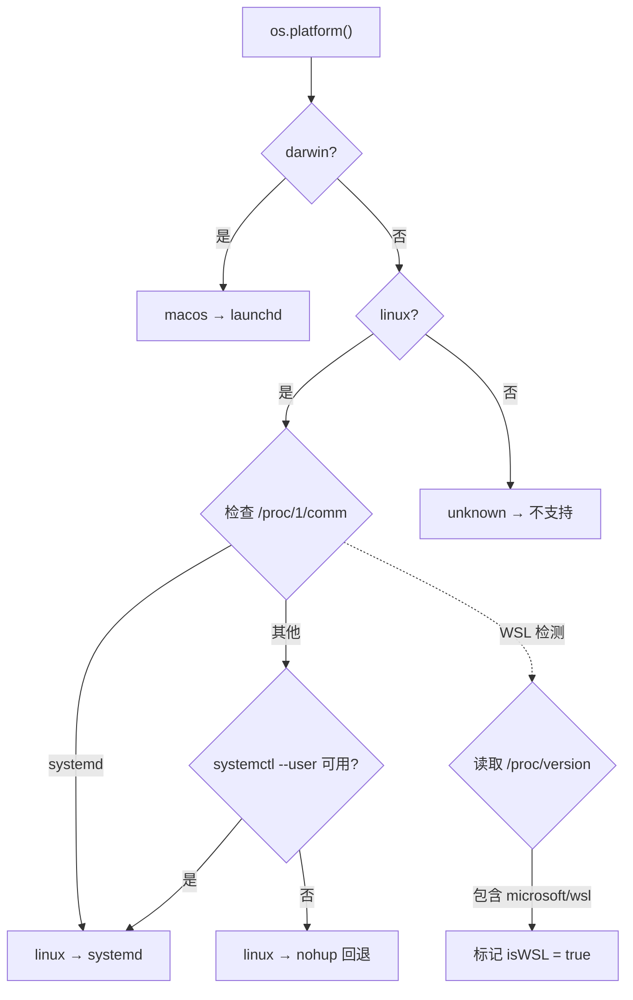
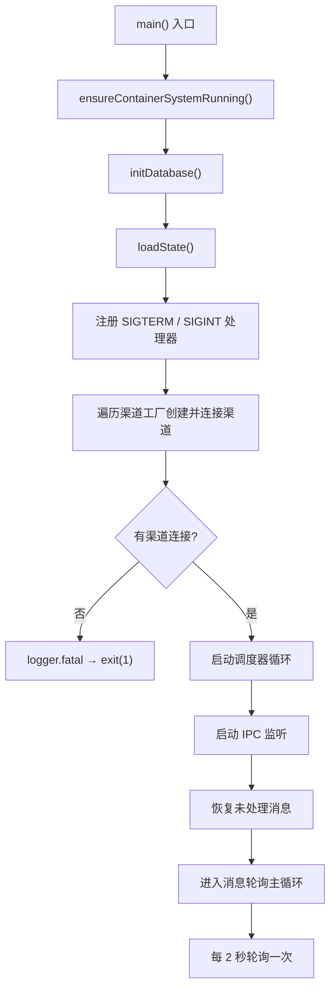
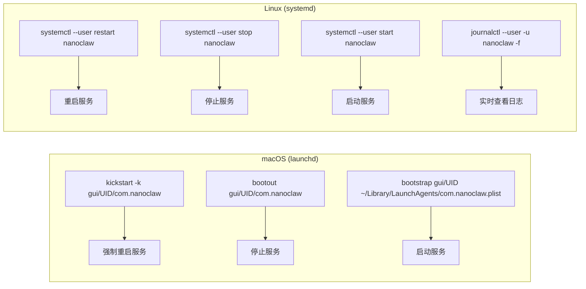

NanoClaw 作为长驻后台服务运行，需要系统级服务管理器保障其自动启动、崩溃重启和日志持久化。本文详细解析项目如何在 **macOS（launchd）**、**Linux（systemd）** 以及 **WSL（nohup 回退）** 三种环境下自动生成并加载服务配置，并提供完整的日志排查工作流。

Sources: [setup/service.ts](setup/service.ts#L1-L6), [setup/platform.ts](setup/platform.ts#L1-L9)

## 平台检测：服务管理器决策的基础

服务配置的第一步是平台识别。NanoClaw 的 `setup/platform.ts` 模块通过 `os.platform()` 判断操作系统，然后推导出可用的服务管理器类型。整个检测链如下：



核心检测函数有三层逻辑：**`getPlatform()`** 返回 `'macos'`、`'linux'` 或 `'unknown'`；**`hasSystemd()`** 通过读取 `/proc/1/comm` 判断 PID 1 是否为 `systemd`；**`getServiceManager()`** 综合上述结果返回 `'launchd'`、`'systemd'` 或 `'none'`。此外，**`isWSL()`** 通过扫描 `/proc/version` 中的 `microsoft` 或 `wsl` 标记来识别 WSL 环境，**`isRoot()`** 通过 `process.getuid() === 0` 判断是否以 root 运行。这些检测结果共同决定了服务配置的生成路径。

Sources: [setup/platform.ts](setup/platform.ts#L11-L99)

## 服务配置生成：三种路径

`setup/service.ts` 的 `run()` 函数是服务安装的入口。它在执行 TypeScript 构建后，根据平台分支到三个不同的配置生成函数。下表对比了三种服务管理策略的核心差异：

| 特性 | launchd（macOS） | systemd（Linux） | nohup 回退（WSL） |
|---|---|---|---|
| **配置文件** | `.plist` (XML) | `.service` (INI) | `.sh` (Shell 脚本) |
| **安装位置** | `~/Library/LaunchAgents/` | 用户: `~/.config/systemd/user/` 或 系统: `/etc/systemd/system/` | `<项目根>/start-nanoclaw.sh` |
| **自动启动** | `RunAtLoad: true` | `systemctl enable` | 需手动执行 |
| **崩溃重启** | `KeepAlive: true` | `Restart=always` + `RestartSec=5` | 无 |
| **日志输出** | `StandardOutPath` / `StandardErrorPath` | `StandardOutput` / `StandardError` (append 模式) | `nohup ... >>` 重定向 |
| **进程管理** | `launchctl` | `systemctl` | PID 文件 (`nanoclaw.pid`) |

Sources: [setup/service.ts](setup/service.ts#L23-L69), [setup/service.ts](setup/service.ts#L147-L161)

### launchd 配置（macOS）

在 macOS 上，NanoClaw 生成一个标准的 launchd plist 文件安装到 `~/Library/LaunchAgents/com.nanoclaw.plist`。项目模板仓库中的 [launchd/com.nanoclaw.plist](launchd/com.nanoclaw.plist) 使用 `{{PLACEHOLDER}}` 占位符，而实际安装时由 `setupLaunchd()` 函数动态替换为真实路径：

```xml
<!-- 关键配置片段（由 setup/service.ts 动态生成） -->
<key>ProgramArguments</key>
<array>
    <string>/usr/local/bin/node</string>       <!-- nodePath -->
    <string>/path/to/nanoclaw/dist/index.js</string>  <!-- projectRoot -->
</array>
<key>RunAtLoad</key><true/>          <!-- 登录时自动启动 -->
<key>KeepAlive</key><true/>          <!-- 崩溃后自动重启 -->
```

关键配置项解读：**`ProgramArguments`** 直接调用 `node dist/index.js`，绕过 npm 包装以减少进程层级；**`KeepAlive: true`** 确保进程无论以何种退出码结束都会被 launchd 自动重启；**`WorkingDirectory`** 设为项目根目录，确保相对路径（如 `store/`、`groups/`）正确解析；**`PATH`** 环境变量显式包含 `~/.local/bin`、`/usr/local/bin` 等路径，因为 launchd 不会继承 shell 的 PATH。

生成 plist 后，函数执行 `launchctl load` 加载服务，并通过 `launchctl list | grep com.nanoclaw` 验证服务已加载。

Sources: [setup/service.ts](setup/service.ts#L71-L145), [launchd/com.nanoclaw.plist](launchd/com.nanoclaw.plist#L1-L33)

### systemd 配置（Linux）

在 Linux 上，配置策略取决于运行身份。**非 root 用户**使用用户级 systemd（`systemctl --user`），unit 文件安装到 `~/.config/systemd/user/nanoclaw.service`，以 `default.target` 为启动目标；**root 用户**使用系统级 systemd，unit 文件安装到 `/etc/systemd/system/nanoclaw.service`，以 `multi-user.target` 为启动目标：

```ini
[Unit]
Description=NanoClaw Personal Assistant
After=network.target

[Service]
Type=simple
ExecStart=/usr/bin/node /path/to/nanoclaw/dist/index.js
WorkingDirectory=/path/to/nanoclaw
Restart=always
RestartSec=5
Environment=HOME=/home/user
Environment=PATH=/usr/local/bin:/usr/bin:/bin:/home/user/.local/bin
StandardOutput=append:/path/to/nanoclaw/logs/nanoclaw.log
StandardError=append:/path/to/nanoclaw/logs/nanoclaw.error.log

[Install]
WantedBy=default.target   <!-- 用户级；系统级为 multi-user.target -->
```

systemd 配置有几个值得关注的细节：**`Restart=always`** + **`RestartSec=5`** 确保崩溃后 5 秒自动重启，避免紧密重启循环消耗资源；**`StandardOutput=append:...`** 使用追加模式而非覆盖，防止重启时丢失旧日志；**`After=network.target`** 确保网络就绪后再启动，这对需要连接 WhatsApp/Telegram 等远程服务的 NanoClaw 至关重要。

Sources: [setup/service.ts](setup/service.ts#L204-L306)

### Docker 组成员过期检测

这是一个容易忽视的 Linux 特有问题。当用户在当前会话中被添加到 `docker` 组后，终端中可以正常使用 Docker，但用户级 systemd 会话仍持有登录时的旧组列表。`checkDockerGroupStale()` 通过在 systemd 会话上下文中执行 `systemd-run --user --pipe --wait docker info` 来验证 Docker 是否在服务上下文中可用，并在检测到不一致时发出警告。

Sources: [setup/service.ts](setup/service.ts#L186-L202)

### nohup 回退（WSL / 无 systemd 环境）

WSL 默认不以 systemd 作为 PID 1，因此 NanoClaw 提供了 nohup 包装脚本作为回退方案。脚本生成到 `<项目根>/start-nanoclaw.sh`，包含进程管理逻辑：

```bash
#!/bin/bash
# start-nanoclaw.sh — Start NanoClaw without systemd
set -euo pipefail
cd "/path/to/nanoclaw"
# 停止已有实例
if [ -f "/path/to/nanoclaw/nanoclaw.pid" ]; then
  OLD_PID=$(cat "/path/to/nanoclaw/nanoclaw.pid" 2>/dev/null || echo "")
  if [ -n "$OLD_PID" ] && kill -0 "$OLD_PID" 2>/dev/null; then
    kill "$OLD_PID" 2>/dev/null || true
    sleep 2
  fi
fi
nohup /usr/bin/node "/path/to/nanoclaw/dist/index.js" \
  >> "/path/to/nanoclaw/logs/nanoclaw.log" \
  2>> "/path/to/nanoclaw/logs/nanoclaw.error.log" &
echo $! > "/path/to/nanoclaw/nanoclaw.pid"
```

nohup 方案的限制在于：没有自动重启能力（进程崩溃后需要手动重新执行脚本），也没有开机自启动（需要用户自行配置 cron `@reboot` 或其他机制）。但在 `setupLinux()` 中有一个关键保护——即使 Linux 平台检测到 systemd 类型，仍会尝试执行 `systemctl --user daemon-reload` 来验证用户级 systemd 会话是否真的可用，失败时自动回退到 nohup 方案。

Sources: [setup/service.ts](setup/service.ts#L308-L362)

## 孤儿进程清理

在启动新服务实例之前，`setupSystemd()` 会调用 `killOrphanedProcesses()` 清理残留的 NanoClaw 进程。这是必要的防护措施：如果两个实例同时运行并连接到同一个消息渠道（如 WhatsApp），会导致连接冲突和消息丢失。该函数通过 `pkill -f '<projectRoot>/dist/index\.js'` 匹配并终止所有关联进程。

Sources: [setup/service.ts](setup/service.ts#L166-L175)

## 日志体系

NanoClaw 的日志系统由两个层面组成：**应用层日志**使用 pino 结构化日志库，**服务层日志**由服务管理器负责捕获。

### 应用层日志

[src/logger.ts](src/logger.ts) 配置了 pino 日志器，默认级别为 `info`，可通过 `LOG_LEVEL` 环境变量调整。pino-pretty 插件提供彩色格式化输出。此外，`uncaughtException` 和 `unhandledRejection` 全局处理器确保未捕获的异常也会被记录并携带时间戳，这对后台服务排查崩溃原因至关重要：

```typescript
export const logger = pino({
  level: process.env.LOG_LEVEL || 'info',
  transport: { target: 'pino-pretty', options: { colorize: true } },
});
```

### 日志文件布局

服务管理器将 stdout 和 stderr 分别重定向到两个文件，日志目录位于项目根目录的 `logs/` 下：

| 文件 | 内容 | 重定向方式 |
|---|---|---|
| `logs/nanoclaw.log` | 标准输出（pino info 级别及以上） | launchd: `StandardOutPath`；systemd: `StandardOutput=append:...`；nohup: `>>` |
| `logs/nanoclaw.error.log` | 标准错误（未捕获异常、pino error/fatal） | launchd: `StandardErrorPath`；systemd: `StandardError=append:...`；nohup: `2>>` |
| `logs/setup.log` | 安装引导过程日志 | 由 `setup.sh` 写入 |

Sources: [src/logger.ts](src/logger.ts#L1-L17), [setup/service.ts](setup/service.ts#L52)

## 服务启动与生命周期

NanoClaw 主进程 [src/index.ts](src/index.ts) 的启动流程如下：



**优雅关闭**是服务管理的关键环节。主进程注册了 `SIGTERM` 和 `SIGINT` 信号处理器，在收到关闭信号时依次执行：等待群组队列完成当前任务（最多 10 秒超时）、断开所有渠道连接、然后退出。这确保了消息不会在处理中途被截断。launchd 的 `KeepAlive` 和 systemd 的 `Restart=always` 会在进程退出后自动重启，形成完整的崩溃恢复闭环。

Sources: [src/index.ts](src/index.ts#L465-L575), [src/index.ts](src/index.ts#L471-L479)

## 服务状态验证

`setup/verify.ts` 提供了跨平台的服务状态检查。对 launchd，它解析 `launchctl list` 的输出判断服务是否有活跃 PID；对 systemd，通过 `systemctl is-active` 判断运行状态；对 nohup 回退，读取 `nanoclaw.pid` 文件并通过 `process.kill(pid, 0)`（信号 0 不发送信号，仅检查进程是否存在）验证进程存活。验证结果以结构化状态块输出，包含服务类型、路径、加载状态等字段。

Sources: [setup/verify.ts](setup/verify.ts#L25-L82)

## 日志排查实战

### 快速状态检查

以下命令适用于 macOS（launchd）环境，Linux 用户请将 `launchctl` 替换为对应的 `systemctl` 命令：

```bash
# 1. 服务是否在运行？
launchctl list | grep nanoclaw
# 期望输出: PID  0  com.nanoclaw
#   PID 为数字 = 正在运行
#   "-" = 已加载但未运行
#   非零退出码 = 崩溃

# 2. 实时查看日志
tail -f logs/nanoclaw.log

# 3. 查看最近的错误和警告
grep -E 'ERROR|WARN' logs/nanoclaw.log | tail -20

# 4. 检查渠道连接状态
grep -E 'Connected to WhatsApp|Connection closed|connection.*close' logs/nanoclaw.log | tail -5

# 5. 检查群组是否已加载
grep 'groupCount' logs/nanoclaw.log | tail -3
```

### 常见服务管理操作



| 场景 | macOS 命令 | Linux 命令 |
|---|---|---|
| **重启服务** | `launchctl kickstart -k gui/$(id -u)/com.nanoclaw` | `systemctl --user restart nanoclaw` |
| **停止服务** | `launchctl bootout gui/$(id -u)/com.nanoclaw` | `systemctl --user stop nanoclaw` |
| **启动服务** | `launchctl bootstrap gui/$(id -u) ~/Library/LaunchAgents/com.nanoclaw.plist` | `systemctl --user start nanoclaw` |
| **查看状态** | `launchctl list | grep nanoclaw` | `systemctl --user status nanoclaw` |
| **实时日志** | `tail -f logs/nanoclaw.log` | `tail -f logs/nanoclaw.log` 或 `journalctl --user -u nanoclaw -f` |
| **代码更新后重启** | `npm run build && launchctl kickstart -k gui/$(id -u)/com.nanoclaw` | `npm run build && systemctl --user restart nanoclaw` |

### 智能体无响应排查

当消息渠道已连接但智能体不回复时，按以下顺序排查：

```bash
# 1. 消息是否被接收？
grep 'New messages' logs/nanoclaw.log | tail -10

# 2. 消息是否触发了容器创建？
grep -E 'Processing messages|Spawning container' logs/nanoclaw.log | tail -10

# 3. 消息是否被管道发送到活跃容器？
grep -E 'Piped messages|sendMessage' logs/nanoclaw.log | tail -10

# 4. 并发限制是否达到上限？
grep -E 'concurrency limit' logs/nanoclaw.log | tail -10

# 5. 容器是否超时？
grep -E 'Container timeout|timed out' logs/nanoclaw.log | tail -10

# 6. 检查 lastAgentTimestamp 游标是否过期
grep 'lastAgentTimestamp' logs/nanoclaw.log | tail -5
```

Sources: [docs/DEBUG_CHECKLIST.md](docs/DEBUG_CHECKLIST.md#L14-L35), [docs/DEBUG_CHECKLIST.md](docs/DEBUG_CHECKLIST.md#L126-L144)

## 服务管理命令速查

以下表格汇总了日常运维中最常用的命令组合：

| 目的 | 命令 | 适用环境 |
|---|---|---|
| 修改代码后重启 | `npm run build && launchctl kickstart -k gui/$(id -u)/com.nanoclaw` | macOS |
| 修改代码后重启 | `npm run build && systemctl --user restart nanoclaw` | Linux |
| 调整日志级别 | `export LOG_LEVEL=debug` 后重启服务 | 通用 |
| 查看完整错误日志 | `cat logs/nanoclaw.error.log` | 通用 |
| 查看容器日志 | `ls -lt groups/*/logs/container-*.log \| head -5` | 通用 |
| 清理孤立容器 | `container ls -a --format '{{.Names}} {{.Status}}' \| grep nanoclaw` | macOS (Apple Container) |

Sources: [docs/DEBUG_CHECKLIST.md](docs/DEBUG_CHECKLIST.md#L14-L35)

## 延伸阅读

- [整体架构：单进程编排器与容器化智能体](9-zheng-ti-jia-gou-dan-jin-cheng-bian-pai-qi-yu-rong-qi-hua-zhi-neng-ti) — 理解主进程的架构角色
- [编排器（src/index.ts）：状态管理、消息循环与智能体调度](12-bian-pai-qi-src-index-ts-zhuang-tai-guan-li-xiao-xi-xun-huan-yu-zhi-neng-ti-diao-du) — 深入了解主进程启动流程
- [容器运行器（src/container-runner.ts）：容器生命周期与卷挂载](13-rong-qi-yun-xing-qi-src-container-runner-ts-rong-qi-sheng-ming-zhou-qi-yu-juan-gua-zai) — 理解容器超时和重启对服务的影响
- [定制化实践：修改触发词、行为调整与目录挂载](32-ding-zhi-hua-shi-jian-xiu-gai-hong-fa-ci-xing-wei-tiao-zheng-yu-mu-lu-gua-zai) — 通过环境变量定制服务行为