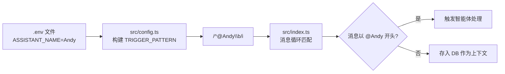
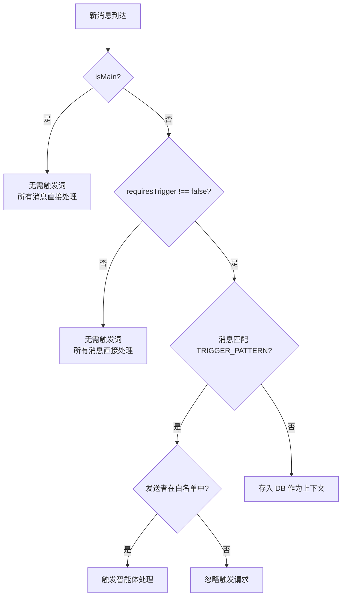
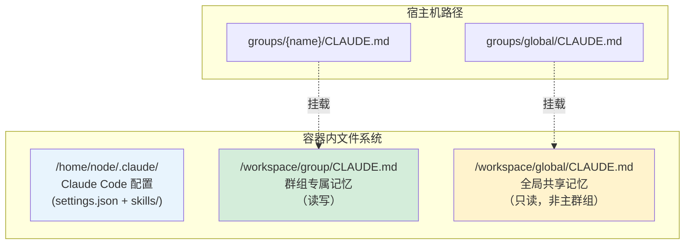
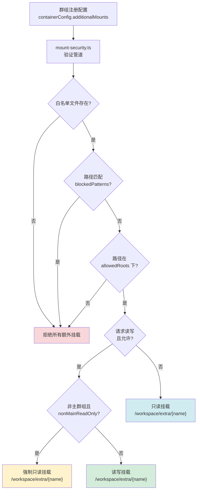
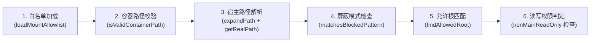
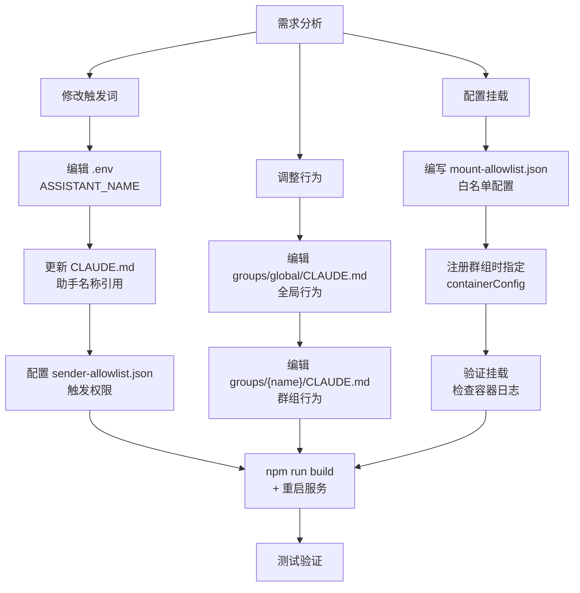

NanoClaw 的设计理念是"开箱即用但高度可定制"。本章聚焦三个最常见的定制化场景：如何修改助手的触发词（如将 `@Andy` 改为 `@ Jarvis`），如何通过 CLAUDE.md 层级系统调整助手的行为与人设，以及如何将宿主机目录安全地挂载到容器中以扩展助手的工作空间。这三者分别对应了 NanoClaw 的**入口控制层**、**行为语义层**和**资源访问层**，构成了从"默认安装"迈向"深度定制"的完整路径。

Sources: [src/config.ts](src/config.ts#L1-L70), [src/types.ts](src/types.ts#L1-L43)

## 触发词系统：从名称到匹配模式

触发词是用户与 NanoClaw 助手交互的入口。在群聊场景中，并非所有消息都需要助手响应——只有以 `@助手名` 开头的消息才会触发智能体处理。理解触发词的完整链路，是进行定制化的第一步。

### 触发词的构建与解析

触发词的生成遵循一个清晰的配置链路：`.env` 文件中的 `ASSISTANT_NAME` 环境变量 → `src/config.ts` 中构建正则表达式 → `src/index.ts` 消息循环中进行匹配检测。



`src/config.ts` 中的关键逻辑非常直接——它读取 `.env` 中的 `ASSISTANT_NAME`，对其进行正则转义后构建一个大小写不敏感的匹配模式 `^@{name}\b`：

```typescript
// 默认值为 'Andy'
export const ASSISTANT_NAME =
  process.env.ASSISTANT_NAME || envConfig.ASSISTANT_NAME || 'Andy';

// 转义特殊字符后构建正则
export const TRIGGER_PATTERN = new RegExp(
  `^@${escapeRegex(ASSISTANT_NAME)}\\b`,
  'i',
);
```

这意味着触发词模式严格匹配 `@` + 助手名 + 词边界。`@Andy` 能匹配 `@Andy 帮我查天气`，但不会误触发于 `@AndySmith 你好`。

Sources: [src/config.ts](src/config.ts#L9-L64)

### 修改触发词：操作步骤

将助手名称从默认的 `Andy` 改为自定义名称（如 `Jarvis`），只需修改项目根目录下的 `.env` 文件：

| 步骤 | 操作 | 文件 |
|------|------|------|
| 1 | 在 `.env` 中设置 `ASSISTANT_NAME="Jarvis"` | `.env` |
| 2 | 重启 NanoClaw 服务 | launchctl / systemctl |

修改后的效果对比：

| 配置项 | 修改前 | 修改后 |
|--------|--------|--------|
| 环境变量 | `ASSISTANT_NAME=Andy` | `ASSISTANT_NAME=Jarvis` |
| 触发模式 | `/^@Andy\b/i` | `/^@Jarvis\b/i` |
| 触发示例 | `@Andy 今天天气怎样` | `@Jarvis 今天天气怎样` |
| 日志输出 | `NanoClaw running (trigger: @Andy)` | `NanoClaw running (trigger: @Jarvis)` |

**注意事项**：修改 `ASSISTANT_NAME` 后，助手的名称也会传递给容器内的 agent-runner（通过 `assistantName` 字段），用于对话存档时标注发送者名称。setup 流程中的 `register` 步骤还会自动更新所有 CLAUDE.md 文件中的 `# Andy` 标题和 `You are Andy` 文本。

Sources: [src/config.ts](src/config.ts#L11-L64), [setup/register.ts](setup/register.ts#L143-L187), [src/index.ts](src/index.ts#L348)

### 触发词的分层控制

NanoClaw 并非所有群组都强制要求触发词。通过 `RegisteredGroup` 中的 `isMain` 和 `requiresTrigger` 两个布尔标志，实现了三层触发策略：



| 群组类型 | isMain | requiresTrigger | 触发要求 |
|----------|--------|-----------------|----------|
| 主控群组 | `true` | — | 无需触发词，所有消息自动处理 |
| 一对一/个人聊天 | `false` | `false` | 无需触发词，适合私人对话 |
| 普通群组（默认） | `false` | `true` | 必须以 `@助手名` 开头触发 |

Sources: [src/index.ts](src/index.ts#L153-L173), [src/types.ts](src/types.ts#L35-L43)

### 发送者白名单：精细化的触发控制

即使消息包含了正确的触发词，NanoClaw 还可以通过**发送者白名单**（sender-allowlist）进一步限制哪些人有权触发助手。白名单配置存储在宿主机的 `~/.config/nanoclaw/sender-allowlist.json`，不会被挂载到容器内部，因此智能体无法篡改。

```json
{
  "default": { "allow": "*", "mode": "trigger" },
  "chats": {
    "120363xxx@g.us": {
      "allow": ["sender-id-1", "sender-id-2"],
      "mode": "trigger"
    },
    "120363yyy@g.us": {
      "allow": "*",
      "mode": "drop"
    }
  },
  "logDenied": true
}
```

白名单提供两种操作模式，对应不同的安全策略：

| 模式 | 行为 | 适用场景 |
|------|------|----------|
| `trigger` | 所有人的消息都存入数据库作为上下文，但只有白名单中的发送者可以用 `@助手名` 触发响应 | 大多数群组——保留对话上下文但限制控制权 |
| `drop` | 非白名单发送者的消息**直接丢弃**，不存储也不处理 | 封闭群组——完全不记录不信任用户的消息 |

**默认行为**：如果配置文件不存在或格式无效，系统采用**开放策略**（`allow: "*", mode: "trigger"`），即所有人都可以触发助手。`is_from_me` 标志的消息（助手自身发送的消息）会绕过白名单检查。

Sources: [src/sender-allowlist.ts](src/sender-allowlist.ts#L1-L129), [src/config.ts](src/config.ts#L30-L35)

## 行为调整：CLAUDE.md 层级系统

如果说触发词决定了"助手何时响应"，那么 CLAUDE.md 层级系统则决定了"助手如何思考和行动"。NanoClaw 利用 Claude Code 的 CLAUDE.md 机制，通过文件挂载构建了一个**分层记忆系统**，在不同层级注入不同的行为指令。

### 记忆层级架构

NanoClaw 的 CLAUDE.md 系统分为三个层级，每个层级对应容器内不同的挂载路径和可见性：



| 层级 | 宿主机路径 | 容器路径 | 访问权限 | 作用域 |
|------|-----------|----------|----------|--------|
| 全局记忆 | `groups/global/CLAUDE.md` | `/workspace/global/CLAUDE.md` | 非主群组只读；主群组可写 | 所有群组共享的行为基准 |
| 群组记忆 | `groups/{name}/CLAUDE.md` | `/workspace/group/CLAUDE.md` | 读写 | 特定群组的专属行为 |
| Claude Code 配置 | `data/sessions/{name}/.claude/` | `/home/node/.claude/` | 读写 | Agent 会话配置（SDK 特性开关、技能） |

容器启动时，`src/container-runner.ts` 中的 `buildVolumeMounts` 函数为每个群组构建独立的卷挂载方案。主群组额外获得项目根目录的只读访问（`/workspace/project`）和全局记忆的读写访问；非主群组只能看到自己的群组目录和全局目录的只读副本。

Sources: [src/container-runner.ts](src/container-runner.ts#L57-L211), [groups/global/CLAUDE.md](groups/global/CLAUDE.md#L1-L59)

### 调整助手人设与响应风格

助手的"人格"完全由 CLAUDE.md 的内容决定。以默认的全局记忆为例，`groups/global/CLAUDE.md` 定义了助手的基本行为框架：

```markdown
# Andy

You are Andy, a personal assistant. You help with tasks, answer questions,
and can schedule reminders.
```

要定制助手的人设，你只需要修改对应层级的 CLAUDE.md 文件。以下是几个典型场景：

**场景一：修改助手名称与角色定位**

修改 `groups/global/CLAUDE.md`，将所有群组的助手身份统一调整：

| 修改前 | 修改后 |
|--------|--------|
| `# Andy` | `# Jarvis` |
| `You are Andy, a personal assistant.` | `You are Jarvis, a technical engineering assistant specialized in DevOps.` |

**场景二：为特定群组定制行为**

在 `groups/{group-name}/CLAUDE.md` 中添加群组专属指令。例如，为一个家庭群组创建温和的对话风格：

```markdown
# Andy

You are Andy, a friendly family assistant.

## Communication Style
- Use casual, warm language
- Keep responses concise (under 3 sentences unless asked for detail)
- Always greet family members by name when possible
- Use emoji sparingly but warmly
```

**场景三：修改消息格式规范**

全局 CLAUDE.md 中已经包含了格式约束（不使用 Markdown，使用 WhatsApp/Telegram 兼容格式）。如果需要为特定渠道调整格式，在对应群组的 CLAUDE.md 中覆盖：

```markdown
## Message Formatting (Discord Override)
- USE full markdown formatting (## headings, **bold**, [links](url))
- Discord supports rich text, so use it
- Code blocks should specify language for syntax highlighting
```

Sources: [groups/global/CLAUDE.md](groups/global/CLAUDE.md#L1-L59), [groups/main/CLAUDE.md](groups/main/CLAUDE.md#L1-L60)

### 群组注册时的自动行为配置

当通过 setup 的 `register` 步骤注册新群组时，系统会自动处理助手名称的同步。如果传入的 `--assistant-name` 与默认值 `Andy` 不同，register 脚本会：

1. 更新 `groups/global/CLAUDE.md` 中的 `# Andy` 标题和 `You are Andy` 文本
2. 更新 `groups/{folder}/CLAUDE.md` 中的同名引用
3. 在 `.env` 文件中写入 `ASSISTANT_NAME="新名称"`

这个自动化流程确保了触发词（运行时匹配）和助手人设（CLAUDE.md 中的自称）保持一致。

Sources: [setup/register.ts](setup/register.ts#L143-L187)

### Agent 会话级别的配置注入

除了 CLAUDE.md 层级，NanoClaw 还在每个群组的 `.claude/settings.json` 中注入 SDK 级别的特性开关：

```json
{
  "env": {
    "CLAUDE_CODE_EXPERIMENTAL_AGENT_TEAMS": "1",
    "CLAUDE_CODE_ADDITIONAL_DIRECTORIES_CLAUDE_MD": "1",
    "CLAUDE_CODE_DISABLE_AUTO_MEMORY": "0"
  }
}
```

| 环境变量 | 作用 | 默认值 |
|----------|------|--------|
| `CLAUDE_CODE_EXPERIMENTAL_AGENT_TEAMS` | 启用 Agent Teams（子智能体编排） | `"1"` (启用) |
| `CLAUDE_CODE_ADDITIONAL_DIRECTORIES_CLAUDE_MD` | 从额外挂载的目录加载 CLAUDE.md | `"1"` (启用) |
| `CLAUDE_CODE_DISABLE_AUTO_MEMORY` | 是否禁用 Claude Code 的自动记忆功能 | `"0"` (不禁用) |

这些设置存储在 `data/sessions/{group-folder}/.claude/settings.json`，并在每次容器启动时通过卷挂载注入到 `/home/node/.claude/`。此外，`container/skills/` 目录下的技能文件（如 `agent-browser`）会被同步复制到每个群组的技能目录中，确保所有群组都能使用浏览器自动化等通用技能。

Sources: [src/container-runner.ts](src/container-runner.ts#L114-L162)

## 目录挂载：安全地扩展助手工作空间

目录挂载是 NanoClaw 定制化中最强大但也最敏感的部分。通过将宿主机的目录挂载到容器内，助手可以访问和操作真实的项目代码、文档库或其他工作文件。然而，这同时也带来了安全风险——NanoClaw 通过一个**三层安全防线**来确保挂载操作的安全性。

### 挂载安全架构总览



Sources: [src/mount-security.ts](src/mount-security.ts#L1-L385)

### 挂载白名单配置

挂载白名单是整个安全体系的核心，存储在宿主机 `~/.config/nanoclaw/mount-allowlist.json`，**绝对不会被挂载到容器内部**，因此容器内的智能体无法读取或篡改它。

白名单的 JSON Schema 结构如下：

```json
{
  "allowedRoots": [
    {
      "path": "~/projects",
      "allowReadWrite": true,
      "description": "开发项目目录"
    }
  ],
  "blockedPatterns": ["password", "secret", "token"],
  "nonMainReadOnly": true
}
```

| 字段 | 类型 | 说明 |
|------|------|------|
| `allowedRoots` | 数组 | 允许挂载的根目录列表，只有在此列表下的路径才能被挂载 |
| `allowedRoots[].path` | 字符串 | 根目录路径，支持 `~` 展开为家目录 |
| `allowedRoots[].allowReadWrite` | 布尔 | 该根目录下是否允许读写挂载 |
| `allowedRoots[].description` | 字符串 | 可选的描述信息，用于日志和文档 |
| `blockedPatterns` | 字符串数组 | 额外的路径屏蔽模式（在系统默认屏蔽列表之上叠加） |
| `nonMainReadOnly` | 布尔 | 为 `true` 时，非主群组的所有额外挂载强制为只读 |

**系统内置的默认屏蔽列表**涵盖所有敏感路径，与用户自定义的 `blockedPatterns` 合并（去重）后生效：

| 类别 | 屏蔽路径模式 |
|------|-------------|
| SSH 密钥 | `.ssh`, `id_rsa`, `id_ed25519`, `private_key` |
| GPG 密钥 | `.gnupg`, `.gpg` |
| 云凭证 | `.aws`, `.azure`, `.gcloud`, `.kube`, `.docker` |
| 通用敏感文件 | `credentials`, `.env`, `.netrc`, `.npmrc`, `.pypirc`, `.secret` |

Sources: [src/mount-security.ts](src/mount-security.ts#L29-L47), [config-examples/mount-allowlist.json](config-examples/mount-allowlist.json#L1-L25), [src/types.ts](src/types.ts#L1-L28)

### 为群组配置额外挂载

额外挂载的配置存储在 SQLite 数据库的 `registered_groups` 表中，通过 `container_config` 字段以 JSON 格式保存。在注册群组时或之后，都可以通过 `containerConfig.additionalMounts` 指定需要挂载的目录：

```json
{
  "name": "Dev Team",
  "folder": "telegram_dev-team",
  "trigger": "@Andy",
  "containerConfig": {
    "additionalMounts": [
      {
        "hostPath": "~/projects/webapp",
        "containerPath": "webapp",
        "readonly": false
      },
      {
        "hostPath": "~/Documents/api-specs",
        "containerPath": "specs",
        "readonly": true
      }
    ]
  }
}
```

每个挂载项的字段含义：

| 字段 | 必填 | 说明 |
|------|------|------|
| `hostPath` | 是 | 宿主机路径，支持 `~` 展开。必须实际存在 |
| `containerPath` | 否 | 容器内路径（相对于 `/workspace/extra/`），默认取 `hostPath` 的 basename |
| `readonly` | 否 | 是否只读，默认 `true` |

挂载后的容器内路径规则为 `/workspace/extra/{containerPath}`。上例中，`~/projects/webapp` 将出现在容器的 `/workspace/extra/webapp`。

Sources: [src/types.ts](src/types.ts#L1-L5), [src/container-runner.ts](src/container-runner.ts#L200-L211)

### 挂载验证流程详解

当容器启动时，`src/container-runner.ts` 调用 `buildVolumeMounts` 构建挂载列表，其中额外挂载通过 `validateAdditionalMounts` 进行逐项验证。验证管道包含五个阶段：



**阶段一：白名单加载**。系统从 `~/.config/nanoclaw/mount-allowlist.json` 读取白名单，解析并验证其 JSON 结构，合并默认屏蔽列表。白名单在进程生命周期内只加载一次并缓存。

**阶段二：容器路径校验**。检查 `containerPath` 不包含 `..`（防路径穿越）、不以 `/` 开头（必须相对路径）、非空。

**阶段三：宿主路径解析**。展开 `~` 为家目录，然后通过 `fs.realpathSync` 解析符号链接获取真实路径。如果路径不存在，直接拒绝。

**阶段四：屏蔽模式检查**。将真实路径拆分为路径组件，逐一检查是否匹配任何屏蔽模式。匹配逻辑不仅检查路径组件，还检查完整路径是否包含屏蔽字符串。

**阶段五：允许根匹配**。检查真实路径是否在某个 `allowedRoot` 的目录树内。使用 `path.relative` 判断：如果相对路径不以 `..` 开头且不是绝对路径，则路径在根目录下。

**阶段六：读写权限判定**。最终的读写权限取三个条件的最严格值：

| 条件 | 结果 |
|------|------|
| 挂载请求 `readonly: false` | 请求读写 |
| `allowedRoot.allowReadWrite: false` | 强制只读 |
| `nonMainReadOnly: true` 且群组非主群组 | 强制只读 |

Sources: [src/mount-security.ts](src/mount-security.ts#L233-L385), [src/container-runner.ts](src/container-runner.ts#L57-L211)

### 通过 setup 工具配置白名单

NanoClaw 的 setup 流程提供了 `mounts` 步骤（`setup/mounts.ts`），支持三种方式写入白名单配置：

| 方式 | 命令 | 说明 |
|------|------|------|
| 空白名单 | `--empty` | 创建空的白名单，阻止所有额外挂载 |
| JSON 参数 | `--json '{...}'` | 直接传入 JSON 字符串 |
| 标准输入 | 管道输入 | 从 stdin 读取 JSON 内容 |

示例——创建包含两个允许根目录的白名单：

```bash
# 通过 JSON 参数
npx tsx setup/mounts.ts --json '{
  "allowedRoots": [
    {"path": "~/projects", "allowReadWrite": true, "description": "开发项目"},
    {"path": "~/Documents/work", "allowReadWrite": false, "description": "工作文档（只读）"}
  ],
  "blockedPatterns": ["password", "secret", "token"],
  "nonMainReadOnly": true
}'

# 通过管道
cat config-examples/mount-allowlist.json | npx tsx setup/mounts.ts
```

Sources: [setup/mounts.ts](setup/mounts.ts#L1-L115), [config-examples/mount-allowlist.json](config-examples/mount-allowlist.json#L1-L25)

## 定制化完整工作流

将三个维度的定制化组合在一起，以下是典型的完整定制流程：



### 常见定制场景速查表

| 场景 | 修改文件 | 关键配置项 |
|------|----------|-----------|
| 改名 | `.env`, `groups/*/CLAUDE.md` | `ASSISTANT_NAME` |
| 改风格 | `groups/global/CLAUDE.md` | Communication Style 段落 |
| 群组专属行为 | `groups/{name}/CLAUDE.md` | 任意行为指令 |
| 限制触发者 | `~/.config/nanoclaw/sender-allowlist.json` | `chats.{jid}.allow` |
| 允许目录挂载 | `~/.config/nanoclaw/mount-allowlist.json` | `allowedRoots` |
| 群组挂载目录 | 数据库 `registered_groups.container_config` | `additionalMounts` |
| 禁用群组触发词 | 数据库 `registered_groups.requires_trigger` | 设为 `0` |
| 使用第三方模型 | `.env` | `ANTHROPIC_BASE_URL` |

### 安全注意事项

进行定制化操作时，请牢记以下安全原则：

1. **白名单文件必须在容器外**。`~/.config/nanoclaw/mount-allowlist.json` 和 `sender-allowlist.json` 都存储在项目根目录之外，不会出现在任何容器的卷挂载中。切勿将它们符号链接到项目目录内。

2. **符号链接会被解析**。`mount-security.ts` 使用 `fs.realpathSync` 解析符号链接后再进行路径校验，因此无法通过创建符号链接绕过 `allowedRoots` 限制。

3. **`.env` 文件在容器内被遮蔽**。主群组的容器挂载中，`/workspace/project/.env` 被 `/dev/null` 遮蔽，确保智能体无法读取宿主机的密钥配置。

4. **非主群组的挂载默认只读**。`nonMainReadOnly: true` 确保即使配置了 `readonly: false`，非主群组也只能以只读方式访问额外挂载的目录。

Sources: [src/mount-security.ts](src/mount-security.ts#L139-L145), [src/container-runner.ts](src/container-runner.ts#L77-L86), [src/mount-security.ts](src/mount-security.ts#L293-L319)

## 延伸阅读

- 要了解触发词在完整消息流转中的位置，参阅 [消息流转全链路：从渠道到智能体响应](10-xiao-xi-liu-zhuan-quan-lian-lu-cong-qu-dao-dao-zhi-neng-ti-xiang-ying)
- 深入理解挂载安全机制，参阅 [挂载安全：外部白名单、符号链接防护与路径校验](22-gua-zai-an-quan-wai-bu-bai-ming-dan-fu-hao-lian-jie-fang-hu-yu-lu-jing-xiao-yan)
- 了解发送者白名单的完整实现，参阅 [发送者白名单与消息过滤](23-fa-song-zhe-bai-ming-dan-yu-xiao-xi-guo-lv-src-sender-allowlist-ts)
- 关于 CLAUDE.md 记忆系统的层级设计，参阅 [记忆系统：CLAUDE.md 层级结构与全局/群组隔离](29-ji-yi-xi-tong-claude-md-ceng-ji-jie-gou-yu-quan-ju-qun-zu-ge-chi)
- 如果需要接入第三方或开源模型，参阅 [使用第三方与开源模型：API 兼容端点配置](33-shi-yong-di-san-fang-yu-kai-yuan-mo-xing-api-jian-rong-duan-dian-pei-zhi)