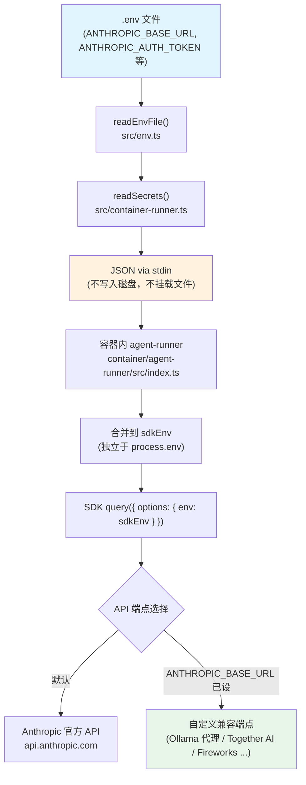
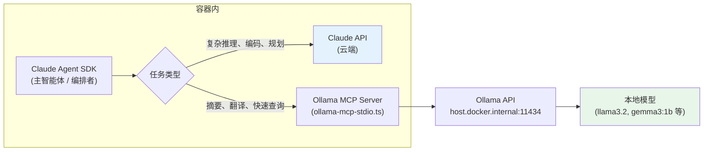
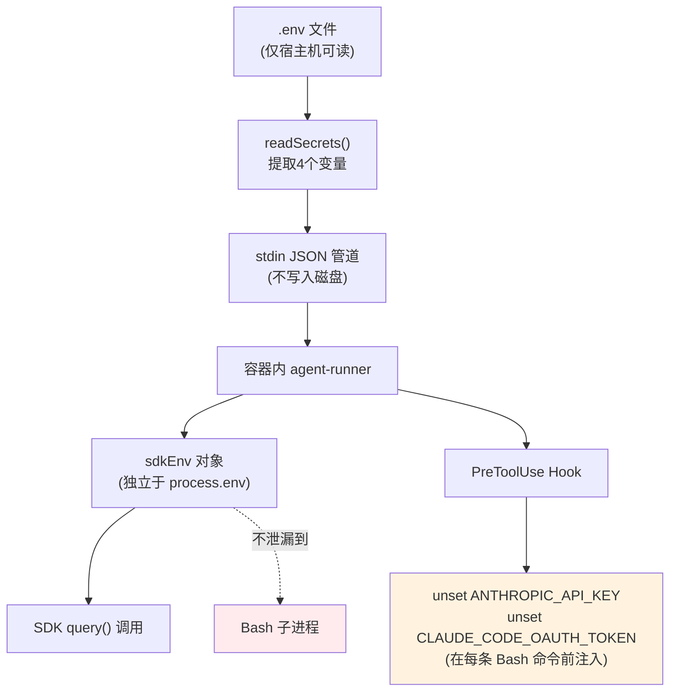

NanoClaw 默认使用 Claude 模型作为其智能体的推理引擎，但架构上提供了两条清晰的路径来集成第三方或开源模型。第一种路径是 **API 端点重定向**——通过环境变量将 Claude Agent SDK 的 API 调用完全转发到一个兼容端点，从而用任意模型替代 Claude；第二种路径是 **Ollama MCP 工具集成**——保留 Claude 作为编排者，同时通过 MCP 服务器将本地 Ollama 模型暴露为可供调用的工具，用于摘要、翻译等低成本/低延迟任务。两种模式可以独立使用，也可以同时叠加。本文将逐一剖析两条路径的底层原理、配置方法与安全考量。

Sources: [README.md](README.md#L161-L175), [README_zh.md](README_zh.md#L158-L172)

## 架构概览：密钥如何从 .env 流向容器内的 SDK

在深入配置细节之前，必须先理解 NanoClaw 的**密钥传播机制**——这是第三方模型端点配置之所以可行的技术根基。整个流程可以用下面的 Mermaid 图表示：



这个设计的核心原则是：**密钥绝不以文件形式挂载到容器中**。编排器（`container-runner.ts`）从 `.env` 读取密钥，通过 stdin 管道以 JSON 传递给容器，容器内的 agent-runner 将其合并到 `sdkEnv` 对象——这个对象仅传递给 Claude Agent SDK 的 `query()` 调用，绝不会泄漏到 Bash 子进程环境中（通过 `PreToolUse` hook 中的 `unset` 前缀实现）。正是这种安全的 stdin 管道设计，使得 `ANTHROPIC_BASE_URL` 和 `ANTHROPIC_AUTH_TOKEN` 能够被安全地注入到 SDK 运行时，从而实现 API 端点的透明替换。

Sources: [src/container-runner.ts](src/container-runner.ts#L217-L224), [container/agent-runner/src/index.ts](container/agent-runner/src/index.ts#L511-L516), [src/env.ts](src/env.ts#L11-L42), [container/agent-runner/src/index.ts](container/agent-runner/src/index.ts#L191-L209)

## 路径一：API 端点重定向——完全替代 Claude

### 工作原理

Claude Agent SDK 的 `query()` 函数接受一个 `env` 选项（类型为 `Dict<string>`），它决定了 CLI 子进程使用的环境变量。当 `sdkEnv` 中包含 `ANTHROPIC_BASE_URL` 时，SDK 内部的 API 调用会自动指向该 URL，而非默认的 `api.anthropic.com`。同时，`ANTHROPIC_AUTH_TOKEN` 将作为认证令牌随请求发送。

关键代码链路如下：`container-runner.ts` 的 `readSecrets()` 函数读取四个密钥变量：

| 环境变量 | 用途 | 是否必须 |
|----------|------|----------|
| `CLAUDE_CODE_OAUTH_TOKEN` | Claude 订阅 OAuth 令牌 | 二选一（与 API Key） |
| `ANTHROPIC_API_KEY` | Anthropic API 密钥（按量计费） | 二选一（与 OAuth） |
| `ANTHROPIC_BASE_URL` | 自定义 API 端点 URL | 仅在使用第三方模型时需要 |
| `ANTHROPIC_AUTH_TOKEN` | 自定义端点的认证令牌 | 仅在端点需要认证时 |

Sources: [src/container-runner.ts](src/container-runner.ts#L217-L224)

### 配置步骤

在项目根目录的 `.env` 文件中添加以下内容：

```bash
# 第三方模型端点（必须兼容 Anthropic Messages API 格式）
ANTHROPIC_BASE_URL=https://your-api-endpoint.com/v1
ANTHROPIC_AUTH_TOKEN=your-token-here
```

如果你的端点使用 `x-api-key` 头而非 Bearer token，也可以直接设置 `ANTHROPIC_API_KEY`：

```bash
ANTHROPIC_BASE_URL=https://your-api-endpoint.com/v1
ANTHROPIC_API_KEY=your-api-key-here
```

配置完成后，重启服务使变更生效：

```bash
# macOS
launchctl kickstart -k gui/$(id -u)/com.nanoclaw

# Linux
systemctl --user restart nanoclaw
```

Sources: [README_zh.md](README_zh.md#L158-L172), [docs/SPEC.md](docs/SPEC.md#L385-L398)

### 兼容性要求

`ANTHROPIC_BASE_URL` 指向的端点必须兼容 **Anthropic Messages API 格式**。这是因为 Claude Agent SDK 的内部循环（`EZ()` 递归生成器）通过 `mW1` 流式函数调用 Anthropic Messages API，并期望返回的响应包含标准的 `tool_use` 块、`stop_reason` 字段和流式事件格式。如果第三方端点的响应格式不兼容，SDK 将无法正确解析工具调用、上下文管理或停止条件，导致智能体行为异常。

具体来说，兼容端点需要支持：
- **Messages API 的请求/响应结构**：包括 `messages` 数组、`system` 字段、`max_tokens` 等
- **工具调用协议**：`tool_use` 和 `tool_result` 内容块的交互模式
- **流式响应**：SSE 事件流中的 `content_block_delta`、`message_stop` 等事件类型

Sources: [docs/SDK_DEEP_DIVE.md](docs/SDK_DEEP_DIVE.md#L39-L57), [docs/SDK_DEEP_DIVE.md](docs/SDK_DEEP_DIVE.md#L265-L297)

### 常见第三方端点

| 平台 | 说明 | 端点 URL 示例 |
|------|------|---------------|
| [Together AI](https://together.ai) | 托管开源模型的推理平台 | `https://api.together.ai/v1` |
| [Fireworks](https://fireworks.ai) | 高性能开源模型推理 | `https://api.fireworks.ai/v1` |
| [Ollama + API 代理](https://ollama.ai) | 本地运行模型，配合 OpenAI 兼容代理 | `http://localhost:4000/v1` |
| 自建部署 | 兼容 Anthropic API 的自定义服务 | 自定义 URL |

> **注意：** 通过 Ollama 直接使用 API 端点重定向模式需要一个额外的 API 代理层（如 [litellm](https://github.com/BerriAI/litellm)）来将 Anthropic 格式转换为 Ollama 原生格式。如果你只想让 Claude 调用 Ollama 模型辅助完成任务，推荐使用路径二（Ollama MCP 工具集成），它不需要 API 代理。

Sources: [README_zh.md](README_zh.md#L167-L172)

## 路径二：Ollama MCP 工具集成——Claude + 本地模型混合

### 工作原理

与路径一完全替换 Claude 不同，Ollama MCP 工具集成采用**协作模式**：Claude 仍然是主智能体（编排者），但获得两个额外的 MCP 工具——`ollama_list_models` 和 `ollama_generate`——可以在需要时调用本地 Ollama 模型。这种模式特别适合以下场景：

- **降低成本**：将摘要、翻译、分类等简单任务卸载到本地免费模型
- **降低延迟**：本地模型无需网络往返
- **隐私敏感**：部分数据处理可以完全不离开本地机器



Sources: [.claude/skills/add-ollama-tool/SKILL.md](.claude/skills/add-ollama-tool/SKILL.md#L1-L8)

### 技术架构：MCP 服务器与工具注册

Ollama 集成通过一个基于 stdio 的 MCP（Model Context Protocol）服务器实现。该服务器（`ollama-mcp-stdio.ts`）在容器内以 Node.js 子进程形式运行，通过 stdin/stdout JSON-RPC 与 Claude Agent SDK 通信。它暴露两个工具：

| 工具名称 | 功能 | 参数 |
|----------|------|------|
| `ollama_list_models` | 列出本地已安装的 Ollama 模型 | 无 |
| `ollama_generate` | 向指定模型发送提示并获取响应 | `model`（模型名）、`prompt`（提示文本）、`system`（可选系统提示） |

当技能被应用后，`index.ts` 中的 `query()` 配置会发生以下变更：

```typescript
// allowedTools 数组新增：
'mcp__ollama__*'

// mcpServers 对象新增：
ollama: {
  command: 'node',
  args: [path.join(path.dirname(mcpServerPath), 'ollama-mcp-stdio.js')],
},
```

这样 Claude 就能识别 `mcp__ollama__ollama_list_models` 和 `mcp__ollama__ollama_generate` 两个工具，并在合适时主动调用它们。

Sources: [.claude/skills/add-ollama-tool/add/container/agent-runner/src/ollama-mcp-stdio.ts](.claude/skills/add-ollama-tool/add/container/agent-runner/src/ollama-mcp-stdio.ts#L1-L148), [.claude/skills/add-ollama-tool/modify/container/agent-runner/src/index.ts](.claude/skills/add-ollama-tool/modify/container/agent-runner/src/index.ts#L427-L456)

### 安装与配置

Ollama 工具集成通过 `/add-ollama-tool` 技能完成安装。在 Claude Code 中执行：

```
/add-ollama-tool
```

**前置条件：**
1. Ollama 已安装并运行（安装地址：<https://ollama.com/download>）
2. 至少安装了一个模型，推荐选择：

| 模型 | 大小 | 适用场景 |
|------|------|----------|
| `gemma3:1b` | ~1 GB | 快速简单任务 |
| `llama3.2` | ~2 GB | 通用任务 |
| `qwen3-coder:30b` | ~18 GB | 代码相关任务 |

```bash
# 安装模型示例
ollama pull gemma3:1b
ollama pull llama3.2
```

**自定义 Ollama 地址（可选）：**

默认连接地址为 `http://host.docker.internal:11434`（Docker Desktop 环境下容器访问宿主机的标准地址），自动回退到 `localhost`。如果 Ollama 运行在其他地址，在 `.env` 中配置：

```bash
OLLAMA_HOST=http://your-ollama-host:11434
```

安装完成后需要重建容器镜像并重启服务：

```bash
./container/build.sh
# macOS
launchctl kickstart -k gui/$(id -u)/com.nanoclaw
# Linux
systemctl --user restart nanoclaw
```

Sources: [.claude/skills/add-ollama-tool/SKILL.md](.claude/skills/add-ollama-tool/SKILL.md#L14-L104), [.claude/skills/add-ollama-tool/manifest.yaml](.claude/skills/add-ollama-tool/manifest.yaml#L1-L18)

### 网络连通性：容器到宿主机的 Ollama

一个常见的陷阱是容器网络隔离导致无法访问宿主机上的 Ollama 服务。Ollama MCP 服务器内置了双重回退机制：

```typescript
// ollama-mcp-stdio.ts 中的连接逻辑
const OLLAMA_HOST = process.env.OLLAMA_HOST || 'http://host.docker.internal:11434';

async function ollamaFetch(path: string, options?: RequestInit): Promise<Response> {
  try {
    return await fetch(`${OLLAMA_HOST}${path}`, options);
  } catch (err) {
    // 如果 host.docker.internal 失败，回退到 localhost
    if (OLLAMA_HOST.includes('host.docker.internal')) {
      const fallbackUrl = url.replace('host.docker.internal', 'localhost');
      return await fetch(fallbackUrl, options);
    }
    throw err;
  }
}
```

| 容器运行时 | 默认连接方式 | 注意事项 |
|-----------|-------------|---------|
| Docker Desktop (macOS) | `host.docker.internal` | 开箱即用 |
| Docker (Linux) | `host.docker.internal` | 需要添加 `--add-host=host.docker.internal:host-gateway` |
| Apple Container (macOS) | `host.docker.internal` | 需要测试兼容性 |

验证连通性的快速方法：

```bash
# 从容器内测试 Ollama 是否可达
docker run --rm curlimages/curl curl -s http://host.docker.internal:11434/api/tags
```

Sources: [.claude/skills/add-ollama-tool/add/container/agent-runner/src/ollama-mcp-stdio.ts](.claude/skills/add-ollama-tool/add/container/agent-runner/src/ollama-mcp-stdio.ts#L14-L43)

## 安全模型：密钥隔离与进程环境净化

使用第三方模型端点时，理解 NanoClaw 的安全边界尤为重要。整个密钥传播链路遵循**最小暴露原则**：



**关键安全机制：**

1. **`.env` 文件对容器不可见**：对于主群组（main group），编排器会将 `/workspace/project/.env` 挂载为 `/dev/null`，确保容器内的智能体无法读取宿主机的 `.env` 文件。

2. **密钥仅通过 stdin 传递**：`readSecrets()` 读取的四个变量通过 JSON 写入容器的 stdin 管道，绝不以文件形式存在于容器的文件系统中。

3. **`sdkEnv` 与 `process.env` 隔离**：agent-runner 将密钥合并到独立的 `sdkEnv` 对象中，仅传递给 SDK 的 `query()` 调用。容器内的 `process.env` 不包含任何密钥。

4. **Bash 命令自动净化**：`PreToolUse` hook 在每条 Bash 命令前注入 `unset ANTHROPIC_API_KEY CLAUDE_CODE_OAUTH_TOKEN`，确保即使 SDK 将密钥泄漏到环境中，Bash 子进程也无法访问它们。

Sources: [container/agent-runner/src/index.ts](container/agent-runner/src/index.ts#L188-L209), [container/agent-runner/src/index.ts](container/agent-runner/src/index.ts#L511-L516), [src/container-runner.ts](src/container-runner.ts#L77-L86), [docs/SECURITY.md](docs/SECURITY.md#L78-L83)

## 两种路径的对比与选择指南

| 维度 | 路径一：API 端点重定向 | 路径二：Ollama MCP 工具 |
|------|----------------------|------------------------|
| **Claude 的角色** | 完全被替代 | 保持为编排者 |
| **模型质量** | 取决于第三方模型能力 | Claude（复杂任务）+ 本地模型（简单任务） |
| **工具调用支持** | 要求端点完全兼容 Anthropic 工具协议 | 仅 Claude 需要支持（本地模型通过 MCP 工具包装） |
| **成本** | 取决于第三方定价 | Claude 成本 + 本地免费推理 |
| **网络要求** | 第三方端点必须可达 | Ollama 在本地运行，无需外网 |
| **隐私** | 数据发送到第三方端点 | 敏感数据可完全本地处理 |
| **配置复杂度** | 低（2 个环境变量） | 中（需安装技能、确保网络连通） |
| **适合场景** | 想要完全使用非 Claude 模型 | 想在保留 Claude 的同时降低成本/延迟 |

**推荐决策流程：**

- 如果你**不想使用 Claude**，而是想用其他模型驱动整个智能体 → 选择**路径一**
- 如果你**想保留 Claude 的推理能力**，同时用本地模型处理简单任务以降低成本 → 选择**路径二**
- 如果你**两者都想用**（例如用 Ollama 做快速过滤，再用第三方云端模型做深度推理） → 可以**同时使用两条路径**

## 故障排查

### 路径一常见问题

| 问题 | 可能原因 | 解决方法 |
|------|---------|---------|
| 容器启动后立即退出 | 端点 URL 格式错误或不可达 | 检查 `ANTHROPIC_BASE_URL` 是否包含完整路径（如 `/v1`） |
| 认证失败 | 令牌/密钥不匹配 | 确认 `ANTHROPIC_AUTH_TOKEN` 或 `ANTHROPIC_API_KEY` 是否正确 |
| 智能体行为异常 | 端点不兼容 Anthropic API | 检查端点是否支持 Messages API 格式和工具调用 |
| 变更不生效 | 服务未重启 | 执行 `launchctl kickstart` 或 `systemctl restart` |

### 路径二常见问题

| 问题 | 可能原因 | 解决方法 |
|------|---------|---------|
| Agent 说 "Ollama is not installed" | 智能体尝试在容器内运行 `ollama` CLI | 检查 MCP 配置是否正确注册（`mcpServers.ollama`） |
| "Failed to connect to Ollama" | 容器无法访问宿主机 Ollama | 用 `docker run --rm curlimages/curl curl -s http://host.docker.internal:11434/api/tags` 验证连通性 |
| Agent 不使用 Ollama 工具 | 智能体不知道工具存在 | 在消息中明确指示："使用 ollama_generate 工具和 gemma3:1b 模型来回答：..." |
| 日志中无 Ollama 相关输出 | 技能未正确应用 | 检查 `.nanoclaw/state.yaml` 中是否有 `ollama` 条目 |

### 查看日志

```bash
# 实时查看编排器日志
tail -f logs/nanoclaw.log

# 过滤 Ollama 相关日志
tail -f logs/nanoclaw.log | grep -i ollama

# 查看容器运行日志
ls -lt groups/<group-name>/logs/
```

Sources: [.claude/skills/add-ollama-tool/SKILL.md](.claude/skills/add-ollama-tool/SKILL.md#L135-L153)

## 进一步阅读

- [Claude 认证配置（OAuth Token / API Key）](6-claude-ren-zheng-pei-zhi-oauth-token-api-key) — 了解标准认证配置的完整细节
- [容器运行器（src/container-runner.ts）：容器生命周期与卷挂载](13-rong-qi-yun-xing-qi-src-container-runner-ts-rong-qi-sheng-ming-zhou-qi-yu-juan-gua-zai) — 深入理解容器运行器如何传递密钥和管理挂载
- [容器隔离：文件系统沙箱与进程隔离](21-rong-qi-ge-chi-wen-jian-xi-tong-sha-xiang-yu-jin-cheng-ge-chi) — 理解容器安全模型
- [技能引擎（skills-engine）：应用、合并、冲突检测与状态管理](25-ji-neng-yin-qing-skills-engine-ying-yong-he-bing-chong-tu-jian-ce-yu-zhuang-tai-guan-li) — 了解技能应用机制
- [技能贡献规范：如何编写 SKILL.md 与技能目录结构](26-ji-neng-gong-xian-gui-fan-ru-he-bian-xie-skill-md-yu-ji-neng-mu-lu-jie-gou) — 学习如何编写自定义模型集成技能