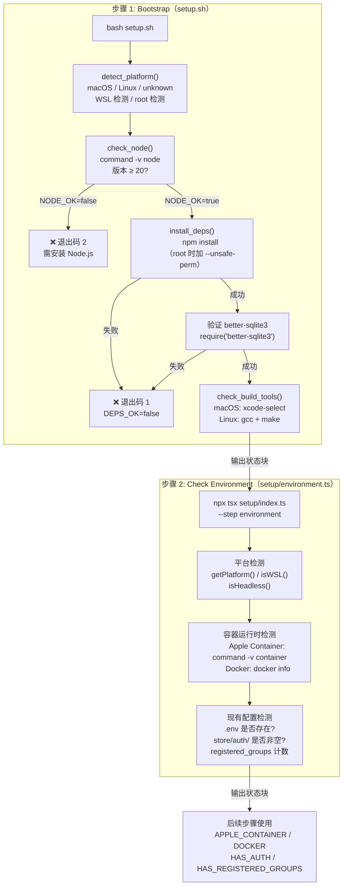

NanoClaw 的安装流程由两个初始步骤驱动：**Bootstrap（引导）** 和 **Check Environment（环境检测）**。引导步骤是一个 Bash 脚本（`setup.sh`），它在 Node.js 尚未就绪的极端情况下也能运行，负责检测操作系统、确认 Node.js ≥ 20 可用、执行 `npm install` 并验证原生模块（better-sqlite3）加载正常。环境检测步骤则由 TypeScript 驱动，检测容器运行时（Docker / Apple Container）、现有配置（`.env` 文件、认证凭据、已注册群组）等上下文信息，为后续步骤提供决策依据。这两个步骤共同建立了整个系统运行的**最小依赖基线**。

Sources: [setup.sh](setup.sh#L1-L162), [setup/environment.ts](setup/environment.ts#L1-L94), [.claude/skills/setup/SKILL.md](.claude/skills/setup/SKILL.md#L14-L33)

## 整体流程：两步检测如何衔接

下面的流程图展示了从 Bootstrap 到 Environment Check 的完整执行路径，包括每个步骤内部的检测项、失败分支以及状态输出格式。



两个步骤都通过 `emitStatus()` 输出结构化的文本块到标准输出，格式为 `=== NANOCLAW SETUP: <STEP_NAME> ===` 包裹的键值对。上层的 SKILL.md 驱动的 LLM 助手解析这些状态块来决定下一步操作。

Sources: [setup.sh](setup.sh#L119-L161), [setup/environment.ts](setup/environment.ts#L69-L93), [setup/status.ts](setup/status.ts#L1-L17)

## 步骤 1：Bootstrap 引导脚本

`setup.sh` 是整个安装流程中**唯一的 Bash 脚本**，这种设计是有意为之：在 Node.js 尚未安装或版本过低的环境中，TypeScript 代码无法执行，因此需要一个不依赖任何运行时的 Shell 入口。脚本采用 `set -euo pipefail` 严格模式，任何未捕获的错误都会立即终止执行。

### 1.1 平台检测

平台检测通过 `uname -s` 系统调用完成，将结果映射为三个枚举值 `macos`、`linux`、`unknown`。对于 Linux 系统，额外读取 `/proc/version` 来判断是否运行在 WSL（Windows Subsystem for Linux）环境中，检测标志为字符串中是否包含 `microsoft` 或 `wsl`。同时通过 `id -u` 判断当前用户是否为 root，因为 root 用户在后续 `npm install` 时需要附加 `--unsafe-perm` 标志来编译原生模块。

| 检测项 | 实现方式 | 可能的值 |
|--------|---------|---------|
| 操作系统 | `uname -s` | `macos`, `linux`, `unknown` |
| WSL 环境 | `grep -i 'microsoft\|wsl' /proc/version` | `true`, `false` |
| root 权限 | `id -u` 是否为 0 | `true`, `false` |

Sources: [setup.sh](setup.sh#L15-L39)

### 1.2 Node.js 版本校验

Node.js 检测的核心逻辑是确认主版本号 **≥ 20**（与 `.nvmrc` 指定的 Node 22 一致，`package.json` 的 `engines.node` 也声明 `>=20`）。检测流程先通过 `command -v node` 确认 Node 在 PATH 中可用，然后提取版本号的主版本部分进行数值比较。版本号提取使用 `node --version | sed 's/^v//'` 后再 `cut -d. -f1` 得到主版本号。

Sources: [setup.sh](setup.sh#L43-L60), [.nvmrc](.nvmrc#L1), [package.json](package.json#L39-L41)

**失败处理路径**：当 `NODE_OK=false` 时，脚本以退出码 2 退出。此时 LLM 助手会询问用户是否自动安装 Node.js：

- **macOS**：优先使用 Homebrew（`brew install node@22`），若 brew 不可用则通过 nvm 安装
- **Linux**：使用 NodeSource 仓库（`curl -fsSL https://deb.nodesource.com/setup_22.x | sudo -E bash -`）或 nvm

安装完成后需要重新运行 `bash setup.sh`。

Sources: [.claude/skills/setup/SKILL.md](.claude/skills/setup/SKILL.md#L17-L21)

### 1.3 npm install 与原生模块验证

依赖安装阶段执行 `npm install`，如果检测到 root 用户则自动添加 `--unsafe-perm` 标志。这个标志是必要的，因为 npm 默认在 root 环境下会降级权限来运行构建脚本，但 better-sqlite3 等原生模块的编译可能需要完整的权限。安装成功后，脚本通过 `node -e "require('better-sqlite3')"` 原地验证原生模块是否能正确加载——这是一个关键的"冒烟测试"，确保 C++ 编译产物与当前 Node ABI 版本匹配。

Sources: [setup.sh](setup.sh#L64-L99)

**依赖安装失败的排查路径**：

| 状态 | 含义 | 排查建议 |
|------|------|---------|
| `DEPS_OK=false` | npm install 失败 | 删除 `node_modules` 和 `package-lock.json` 后重试 |
| `NATIVE_OK=false` | better-sqlite3 无法加载 | 安装构建工具后重试 |

Sources: [.claude/skills/setup/SKILL.md](.claude/skills/setup/SKILL.md#L22-L23)

### 1.4 构建工具检测

最后一步检测系统是否具备编译原生模块所需的构建工具链。macOS 检测 `xcode-select -p` 是否返回有效路径（即 Xcode Command Line Tools 是否安装），Linux 则检测 `gcc` 和 `make` 是否同时可用。构建工具的状态会包含在输出中但不会导致脚本失败——它是一个信息性指标，为后续的原生模块编译失败提供诊断线索。

Sources: [setup.sh](setup.sh#L101-L117)

### 1.5 状态输出格式

Bootstrap 脚本最终输出如下格式的结构化状态块：

```
=== NANOCLAW SETUP: BOOTSTRAP ===
PLATFORM: macos
IS_WSL: false
IS_ROOT: false
NODE_VERSION: 22.x.x
NODE_OK: true
NODE_PATH: /usr/local/bin/node
DEPS_OK: true
NATIVE_OK: true
HAS_BUILD_TOOLS: true
STATUS: success
LOG: logs/setup.log
=== END ===
```

`STATUS` 字段是综合判定结果，可能的值为 `success`（全部通过）、`node_missing`（Node 不可用或版本过低）、`deps_failed`（npm install 失败）或 `native_failed`（原生模块加载失败）。所有详细日志写入 `logs/setup.log`。

Sources: [setup.sh](setup.sh#L128-L154)

## 步骤 2：环境检测

Bootstrap 成功后，系统通过 `npx tsx setup/index.ts --step environment` 执行第二步。此步骤使用 TypeScript 实现，由 [setup/index.ts](setup/index.ts#L8-L19) 中的 `STEPS` 注册表动态加载。它复用了 [setup/platform.ts](setup/platform.ts#L1-L133) 中的一组跨平台检测工具函数，这些函数也供后续的 container、service 等步骤共用。

### 2.1 平台检测工具函数

[setup/platform.ts](setup/platform.ts) 导出了一组类型化的检测函数，构成了整个 setup 流程的平台抽象层：

| 函数 | 返回类型 | 说明 |
|------|---------|------|
| `getPlatform()` | `'macos' \| 'linux' \| 'unknown'` | 基于 `os.platform()` 的操作系统检测 |
| `isWSL()` | `boolean` | 读取 `/proc/version` 检测 WSL 环境 |
| `isRoot()` | `boolean` | `process.getuid() === 0` |
| `isHeadless()` | `boolean` | Linux 下检测 `DISPLAY` 和 `WAYLAND_DISPLAY` 环境变量 |
| `hasSystemd()` | `boolean` | 读取 `/proc/1/comm` 判断 PID 1 是否为 systemd |
| `getServiceManager()` | `'launchd' \| 'systemd' \| 'none'` | 平台 → 服务管理器映射 |
| `commandExists(name)` | `boolean` | `command -v <name>` 封装 |
| `getNodeVersion()` | `string \| null` | 去除 `v` 前缀的版本号 |
| `getNodeMajorVersion()` | `number \| null` | 主版本号数值 |
| `openBrowser(url)` | `boolean` | 跨平台打开浏览器（macOS: `open`, Linux: `xdg-open`） |

其中 `commandExists()` 是容器运行时检测的基石——它通过 `execSync('command -v ${name}', { stdio: 'ignore' })` 静默检测命令是否存在，将 shell 返回码转换为布尔值。`isHeadless()` 的逻辑值得注意：macOS 被认为"永远不是 headless"（即使 SSH 会话也能通过 `open` 命令唤起浏览器），而 Linux 则需要检查 X11（`DISPLAY`）或 Wayland（`WAYLAND_DISPLAY`）显示服务器是否可用。

Sources: [setup/platform.ts](setup/platform.ts#L8-L132)

### 2.2 容器运行时检测

环境检测步骤使用 `commandExists` 分别探测两种容器运行时：

- **Apple Container**：仅执行二进制存在性检测（`commandExists('container')`），结果为 `installed` 或 `not_found`
- **Docker**：存在性检测后额外执行 `docker info`，区分三种状态——`running`（守护进程正常响应）、`installed_not_running`（命令存在但守护进程未启动）、`not_found`（未安装）

这种分级检测的设计原因是：Docker Desktop 作为 GUI 应用，用户可能已安装但未启动，需要给出"请启动 Docker"的提示，而 Apple Container 目前不存在这种"已安装但未运行"的中间状态。

Sources: [setup/environment.ts](setup/environment.ts#L24-L39)

### 2.3 现有配置检测

环境检测步骤还探测三个配置维度，帮助后续步骤判断是新安装还是重新配置：

| 检测项 | 实现方式 | 用途 |
|--------|---------|------|
| `.env` 是否存在 | `fs.existsSync('.env')` | 判断是否需要配置认证凭据 |
| `store/auth/` 非空 | `fs.readdirSync(authDir).length > 0` | 判断 WhatsApp 是否已认证 |
| 已注册群组 > 0 | 先检查 `data/registered_groups.json`，再查询 SQLite `store/messages.db` | 判断是否已有群组配置 |

已注册群组的检测采用了**双路径策略**：先检查旧的 JSON 文件（`data/registered_groups.json`，迁移前的格式），若不存在则直接用 `better-sqlite3` 打开 SQLite 数据库执行 `SELECT COUNT(*) FROM registered_groups`。这种设计避免了依赖外部 `sqlite3` CLI 工具，将数据库查询内联到 Node.js 进程中完成。

Sources: [setup/environment.ts](setup/environment.ts#L42-L67)

### 2.4 状态输出与后续决策

环境检测步骤的输出为后续步骤提供所有决策所需的状态：

```
=== NANOCLAW SETUP: CHECK_ENVIRONMENT ===
PLATFORM: macos
IS_WSL: false
IS_HEADLESS: false
APPLE_CONTAINER: installed
DOCKER: running
HAS_ENV: true
HAS_AUTH: true
HAS_REGISTERED_GROUPS: true
STATUS: success
LOG: logs/setup.log
=== END ===
```

SKILL.md 中定义了以下决策逻辑：

- `APPLE_CONTAINER` 和 `DOCKER` 的值直接驱动**步骤 3**（容器运行时选择）。Linux 只能用 Docker；macOS 两者都有则询问用户偏好；macOS 没有 Apple Container 则默认 Docker
- `HAS_AUTH=true` 表示 WhatsApp 已配置，步骤 5（渠道安装）可跳过 WhatsApp 重新认证
- `HAS_REGISTERED_GROUPS=true` 表示已有群组，可选择保留现有配置或重新配置

Sources: [setup/environment.ts](setup/environment.ts#L82-L93), [.claude/skills/setup/SKILL.md](.claude/skills/setup/SKILL.md#L27-L33)

## 入口点架构：步骤注册与调度

整个 setup 流程的入口 [setup/index.ts](setup/index.ts) 采用了一个简洁的**步骤注册表模式**。所有步骤以函数形式注册在 `STEPS` 对象中，键名为步骤名，值为一个返回模块 Promise 的懒加载函数。这种 `() => import('./xxx.js')` 的模式实现了按需加载——只有实际执行的步骤才会被加载和解析，避免了环境检测步骤加载容器构建逻辑等不必要的依赖。

Sources: [setup/index.ts](setup/index.ts#L8-L19)

步骤的调度通过命令行参数 `--step <name>` 指定，剩余参数透传给步骤的 `run()` 函数。错误处理统一在入口层完成：任何步骤抛出的异常都会被捕获、记录到 pino 日志、通过 `emitStatus` 输出 `STATUS: failed` 状态块，然后以退出码 1 终止。

Sources: [setup/index.ts](setup/index.ts#L21-L58)

## 测试覆盖

环境检测和平台检测模块都有配套的单元测试。测试使用 Vitest 框架，关注点包括：

- **平台函数的幂等性**：所有检测函数在任何平台上都不应抛出异常，返回值类型必须正确
- **数据库查询的正确性**：使用内存 SQLite（`:memory:`）验证空表返回 0、插入后返回正确计数
- **凭据检测的正则匹配**：验证 `CLAUDE_CODE_OAUTH_TOKEN` 和 `ANTHROPIC_API_KEY` 的模式匹配
- **Node 版本约束**：确认 `getNodeMajorVersion()` 返回值 ≥ 20

Sources: [setup/environment.test.ts](setup/environment.test.ts#L1-L121), [setup/platform.test.ts](setup/platform.test.ts#L1-L121)

## 故障排查速查表

| 症状 | 可能原因 | 排查命令 | 修复方法 |
|------|---------|---------|---------|
| `STATUS: node_missing` | Node.js 未安装或版本 < 20 | `node --version` | 安装 Node 22（见步骤 1.2） |
| `STATUS: deps_failed` | npm install 失败 | `cat logs/setup.log` | 删除 `node_modules` 和 `package-lock.json` 后重跑 `setup.sh` |
| `STATUS: native_failed` | better-sqlite3 编译失败 | `cat logs/setup.log` | macOS: `xcode-select --install`；Linux: `sudo apt install build-essential` |
| `DOCKER: installed_not_running` | Docker 未启动 | `docker info` | macOS: `open -a Docker`；Linux: `sudo systemctl start docker` |
| `APPLE_CONTAINER: not_found` (macOS) | Apple Container 未安装 | `command -v container` | 安装 Apple Container 或使用 Docker |

Sources: [setup.sh](setup.sh#L128-L161), [.claude/skills/setup/SKILL.md](.claude/skills/setup/SKILL.md#L163-L173)

## 下一步

环境检测完成后，系统已掌握运行时、凭据和现有配置的全貌。接下来将进入步骤 3——根据检测结果选择并构建容器运行时：

- **[容器运行时选择与构建（Docker / Apple Container）](5-rong-qi-yun-xing-shi-xuan-ze-yu-gou-jian-docker-apple-container)**：详解如何根据 `APPLE_CONTAINER` 和 `DOCKER` 状态值决定运行时、执行容器镜像构建与冒烟测试

如果你希望了解环境检测之前的安装前置知识，可以回顾：

- **[项目概述：NanoClaw 是什么以及为什么需要它](1-xiang-mu-gai-shu-nanoclaw-shi-shi-yao-yi-ji-wei-shi-yao-xu-yao-ta)**：理解项目的核心架构理念和设计动机
- **[快速安装与首次运行指南](2-kuai-su-an-zhuang-yu-shou-ci-yun-xing-zhi-nan)**：端到端的安装全流程概览