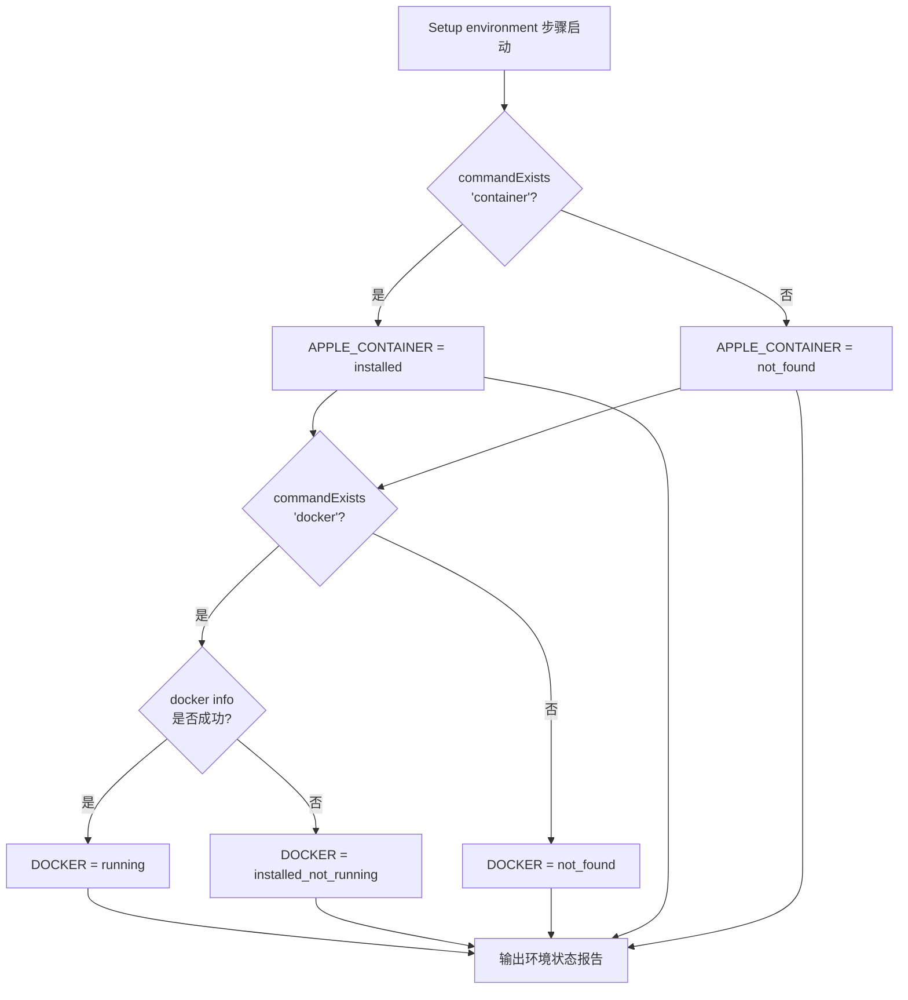
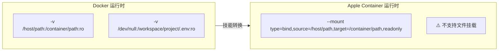
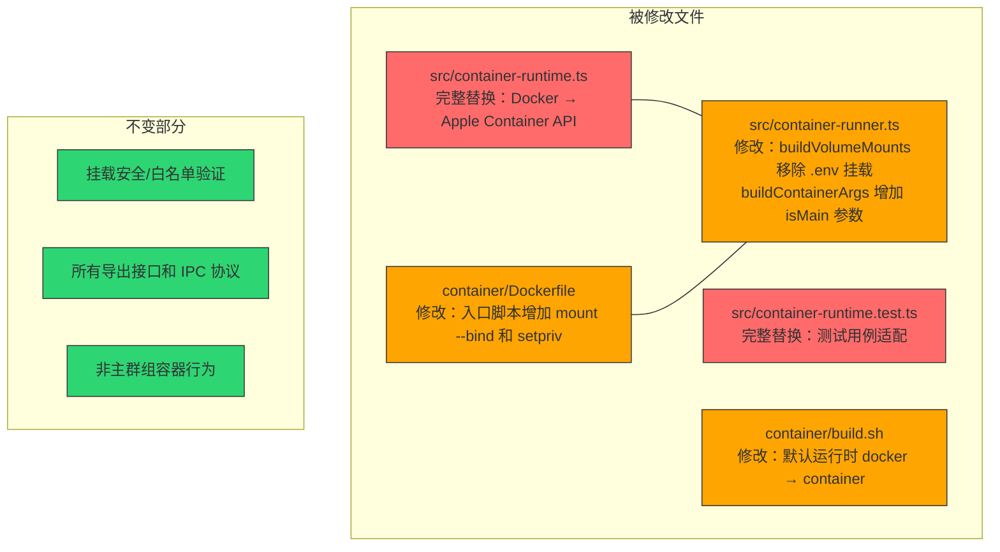

NanoClaw 的核心安全承诺是**容器隔离**——所有 Claude 智能体都在独立的 Linux 容器中执行，而非宿主进程。容器运行时是这一承诺的技术基石。本文档将带你理解 NanoClaw 如何抽象两种容器运行时（Docker 和 Apple Container）、如何通过 Setup 流程完成构建与验证，以及两者在挂载语法、权限模型和网络配置上的关键差异。本文内容聚焦于**运行时选择决策与镜像构建**环节，不涉及容器内的智能体执行逻辑或 IPC 通信细节。

Sources: [container-runtime.ts](src/container-runtime.ts#L1-L88), [SECURITY.md](docs/SECURITY.md#L14-L23)

---

## 运行时抽象层：单文件隔离策略

NanoClaw 将所有容器运行时相关逻辑集中在 [src/container-runtime.ts](src/container-runtime.ts) 一个文件中。该文件导出五个接口，形成完整的运行时抽象层：

| 导出接口 | 职责 | Docker 默认实现 | Apple Container 实现 |
|----------|------|----------------|---------------------|
| `CONTAINER_RUNTIME_BIN` | 运行时二进制名称 | `'docker'` | `'container'` |
| `readonlyMountArgs(host, container)` | 只读挂载参数 | `['-v', 'host:container:ro']` | `['--mount', 'type=bind,source=...,target=...,readonly']` |
| `stopContainer(name)` | 停止容器命令 | `docker stop <name>` | `container stop <name>` |
| `ensureContainerRuntimeRunning()` | 确保运行时在线 | `docker info` 检查 | `container system status` 检查，失败则自动 `container system start` |
| `cleanupOrphans()` | 清理残留容器 | `docker ps --filter name=nanoclaw-` 文本解析 | `container ls --format json` JSON 解析 |

这种设计使得**切换运行时只需替换一个文件**，上层调用者（如 [container-runner.ts](src/container-runner.ts)）完全无感知。

Sources: [container-runtime.ts](src/container-runtime.ts#L1-L88), [container-runtime.ts.intent.md](.claude/skills/convert-to-apple-container/modify/src/container-runtime.ts.intent.md#L1-L33)

### 设计决策：为什么 Docker 是默认运行时

NanoClaw 默认选择 Docker 出于以下考量：Docker 是跨平台标准，在 macOS（通过 Docker Desktop）、Linux 和 WSL2 上均可运行，且拥有成熟的文件挂载语义（支持文件级和目录级挂载）。Apple Container 是 macOS 专属的替代方案，仅当用户明确选择时才通过技能系统切换。

Sources: [REQUIREMENTS.md](docs/REQUIREMENTS.md#L57-L59)

---

## 环境检测：Setup 步骤如何发现可用运行时

在构建镜像之前，Setup 流程的 `environment` 步骤会自动探测宿主环境中的容器运行时状态。[setup/environment.ts](setup/environment.ts) 执行以下检测逻辑：



检测结果以结构化状态报告输出，包含 `APPLE_CONTAINER` 和 `DOCKER` 两个字段。值得注意的是，检测逻辑**不做选择决策**——它只报告事实。真正的运行时选择发生在后续的 `container` 步骤中，由用户通过 `--runtime` 参数显式指定。

Sources: [setup/environment.ts](setup/environment.ts#L24-L40)

---

## 构建流程详解：从参数验证到镜像测试

[setup/container.ts](setup/container.ts) 是 Setup 流程的 `container` 步骤，负责验证运行时、构建镜像并执行冒烟测试。其核心流程如下：

```mermaid
flowchart TD
    A[container 步骤启动<br/>--runtime docker|apple-container] --> B{runtime 参数<br/>是否存在?}
    B -- 否 --> C[❌ exit 4<br/>missing_runtime_flag]
    B -- 是 --> D{runtime 是否为<br/>apple-container?}
    D -- 是 --> E{commandExists 'container'?}
    E -- 否 --> F[❌ exit 2<br/>runtime_not_available]
    E -- 是 --> G[构建阶段]
    D -- 否 --> H{runtime 是否为 docker?}
    H -- 是 --> I{commandExists 'docker'?}
    I -- 否 --> F
    I -- 是 --> J{docker info<br/>是否成功?}
    J -- 否 --> F
    J -- 是 --> G
    H -- 否 --> K[❌ exit 4<br/>unknown_runtime]
    G --> L{构建成功?}
    L -- 是 --> M{测试: echo PipeTo run<br/>--entrypoint /bin/echo<br/>输出 'Container OK'?}
    M -- 包含 'Container OK' --> N[✅ SETUP_CONTAINER<br/>STATUS: success]
    M -- 不包含 --> O[❌ STATUS: failed]
    L -- 否 --> O
```

关键实现细节：构建命令根据运行时类型动态生成——Docker 使用 `docker build`，Apple Container 使用 `container build`。构建工作目录固定为 `container/` 子目录。测试用例通过 `--entrypoint /bin/echo` 覆盖入口点，注入一个空 JSON `{}`，验证容器能够启动并正确输出。

Sources: [setup/container.ts](setup/container.ts#L23-L144)

### build.sh：手动构建的快捷入口

除了 Setup 流程，用户也可以直接运行 [container/build.sh](container/build.sh) 手动构建镜像。该脚本支持通过环境变量 `CONTAINER_RUNTIME` 覆盖默认运行时：

```bash
# 使用默认运行时构建（Docker 或已转换后的 container）
./container/build.sh

# 显式指定运行时
CONTAINER_RUNTIME=docker ./container/build.sh
CONTAINER_RUNTIME=container ./container/build.sh
```

构建完成后，脚本会输出测试命令，用户可以直接复制执行以验证镜像功能。

Sources: [container/build.sh](container/build.sh#L1-L24)

---

## 镜像构建分析：Dockerfile 结构与分层

容器镜像 [container/Dockerfile](container/Dockerfile) 基于 `node:22-slim`，构建一个包含 Chromium 浏览器自动化能力的 Claude Agent 运行环境。其分层结构设计如下：

| 构建阶段 | 内容 | 缓存策略 |
|----------|------|----------|
| 系统依赖层 | Chromium + 字体 + 图形库 + curl/git | 变更频率极低，缓存命中率高 |
| 全局工具层 | `npm install -g agent-browser @anthropic-ai/claude-code` | 工具版本更新时才变 |
| 应用依赖层 | `COPY package*.json` → `npm install` | 仅当依赖变化时重建 |
| 源码编译层 | `COPY agent-runner/` → `npm run build` | 每次代码变更触发 |
| 运行时准备 | 创建 workspace 目录 + 入口脚本 + 权限设置 | 稳定不变 |

**入口脚本（entrypoint.sh）** 的设计尤为精妙：它先编译 TypeScript 到 `/tmp/dist`（临时目录），然后通过符号链接连接 `node_modules`，再将编译产物设为只读（`chmod -R a-w /tmp/dist`），最后从 stdin 读取 JSON 输入传给 Node.js。这确保了智能体无法修改自身的运行时代码。

Sources: [container/Dockerfile](container/Dockerfile#L1-L70)

---

## Docker 与 Apple Container：关键差异对比

当用户通过 `convert-to-apple-container` 技能切换到 Apple Container 后，以下五个文件会被替换。理解这些差异对于故障排查至关重要：

### 挂载语法差异

这是最显著的区别。Docker 使用 `-v` 标志支持**文件级和目录级**挂载，而 Apple Container 基于 VirtioFS，**仅支持目录级挂载**。



这一限制直接影响了 `.env` 文件的安全遮蔽策略：Docker 可以直接将 `/dev/null` 挂载到容器的 `.env` 路径上来阻止智能体读取宿主密钥；Apple Container 则必须在容器内部通过 `mount --bind /dev/null /workspace/project/.env` 实现相同效果。

Sources: [container-runtime.ts](src/container-runtime.ts#L13-L18), [container-runtime.ts (Apple)](.claude/skills/convert-to-apple-container/modify/src/container-runtime.ts#L13-L15), [Dockerfile.intent.md](.claude/skills/convert-to-apple-container/modify/container/Dockerfile.intent.md#L1-L32)

### 权限模型差异

主群组容器的用户身份处理方式完全不同：

| 维度 | Docker | Apple Container |
|------|--------|-----------------|
| 容器启动用户 | `--user hostUid:hostGid` 直接指定 | 以 root 启动，传递 `RUN_UID`/`RUN_GID` 环境变量 |
| .env 遮蔽 | 宿主侧通过 `/dev/null` 文件挂载 | 容器内通过 `mount --bind` 实现 |
| 权限降级 | 不需要（直接以目标用户运行） | 通过 `setpriv --reuid --regid --clear-groups` 降级 |
| 非主群组 | 行为一致：`--user` 标志 | 行为一致：`--user` 标志 |

Apple Container 的路径更复杂（root → mount --bind → chown → setpriv → node），但这是 VirtioFS 不支持文件挂载的必然结果。

Sources: [container-runner.ts](src/container-runner.ts#L226-L256), [container-runner.ts (Apple)](.claude/skills/convert-to-apple-container/modify/src/container-runner.ts#L210-L248)

### 网络配置差异

Docker 开箱即用——容器自动获得完整的网络访问能力。Apple Container 则需要**手动配置宿主网络转发**。根据 [APPLE-CONTAINER-NETWORKING.md](docs/APPLE-CONTAINER-NETWORKING.md) 的说明，需要执行两个 `sudo` 命令：

```bash
# 1. 启用 IP 转发
sudo sysctl -w net.inet.ip.forwarding=1

# 2. 配置 NAT 规则（将 en0 替换为你的活跃网络接口）
echo "nat on en0 from 192.168.64.0/24 to any -> (en0)" | sudo pfctl -ef -
```

此外，由于 NAT 仅处理 IPv4，容器内的 Node.js 需要通过 `NODE_OPTIONS=--dns-result-order=ipv4first` 强制优先解析 IPv4，否则 DNS 返回的 AAAA 记录会导致连接失败。

Sources: [APPLE-CONTAINER-NETWORKING.md](docs/APPLE-CONTAINER-NETWORKING.md#L1-L91)

---

## 运行时切换：convert-to-apple-container 技能详解

运行时切换通过技能系统（Skills Engine）以确定性代码替换完成，而非运行时参数切换。[.claude/skills/convert-to-apple-container](.claude/skills/convert-to-apple-container) 技能的 [manifest.yaml](.claude/skills/convert-to-apple-container/manifest.yaml) 声明了它修改的五个文件：



技能应用的核心保证是**所有导出接口保持不变**——`CONTAINER_RUNTIME_BIN`、`readonlyMountArgs`、`stopContainer`、`ensureContainerRuntimeRunning`、`cleanupOrphans` 的签名和行为语义完全一致。这意味着 [src/container-runner.ts](src/container-runner.ts) 的上层逻辑（容器生命周期管理、输出流解析、超时处理等）无需任何调整。

每个被修改的文件都配有 `.intent.md` 文件（如 [container-runtime.ts.intent.md](.claude/skills/convert-to-apple-container/modify/src/container-runtime.ts.intent.md)），记录了变更原因、关键修改段和不可变约束。当技能应用遇到合并冲突时，这些意图文件是解决冲突的依据。

Sources: [manifest.yaml](.claude/skills/convert-to-apple-container/manifest.yaml#L1-L16), [SKILL.md](.claude/skills/convert-to-apple-container/SKILL.md#L1-L184)

---

## 故障排查指南

| 症状 | 可能原因 | 排查命令 | 解决方案 |
|------|----------|----------|----------|
| Setup 报 `runtime_not_available` | Docker 未安装或未启动 | `docker info` | 安装 Docker Desktop 或启动 Docker 服务 |
| 构建失败 `apt-get` 错误 | 网络不通（Apple Container 常见） | `container run --rm --entrypoint curl nanoclaw-agent:latest -s4 https://example.com` | 配置 NAT 转发规则 |
| 容器超时无输出 | 运行时未正常启动 | `docker info` 或 `container system status` | 重启运行时服务 |
| 残留容器占用资源 | 上一轮异常退出未清理 | `docker ps --filter name=nanoclaw-` | NanoClaw 启动时自动调用 `cleanupOrphans()` |
| Apple Container 网络超时 | IPv6 DNS 解析优先 | 检查 `NODE_OPTIONS` 环境变量 | 确保 `--dns-result-order=ipv4first` 已设置 |
| Apple Container 构建缓存问题 | 缓存损坏 | — | `container builder stop && container builder rm && container builder start` 后重新构建 |

Sources: [container-runtime.ts](src/container-runtime.ts#L26-L61), [APPLE-CONTAINER-NETWORKING.md](docs/APPLE-CONTAINER-NETWORKING.md#L62-L69)

---

## 下一步

- 了解容器运行时选定后，下一步是 **[Claude 认证配置（OAuth Token / API Key）](6-claude-ren-zheng-pei-zhi-oauth-token-api-key)**，为容器内的 Claude Agent SDK 配置认证凭据。
- 如果需要深入理解容器运行时的挂载卷构建逻辑和生命周期管理，参阅 **[容器运行器（src/container-runner.ts）：容器生命周期与卷挂载](13-rong-qi-yun-xing-qi-src-container-runner-ts-rong-qi-sheng-ming-zhou-qi-yu-juan-gua-zai)**。
- 关于容器隔离的完整安全模型，参阅 **[容器隔离：文件系统沙箱与进程隔离](21-rong-qi-ge-chi-wen-jian-xi-tong-sha-xiang-yu-jin-cheng-ge-chi)**。