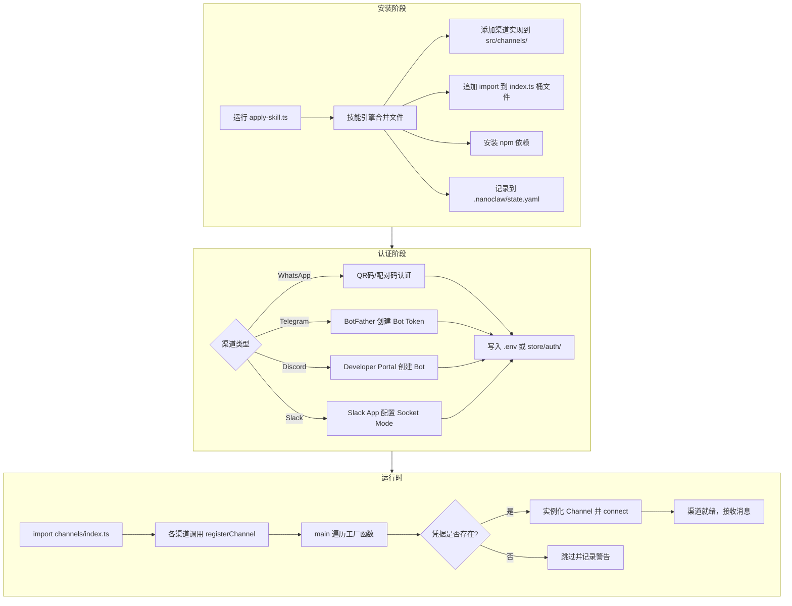
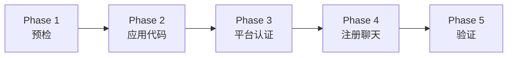

NanoClaw 的消息渠道采用**技能引擎**驱动的安装模式：每个消息平台以独立的 skill 包形式存在，通过确定性的文件合并机制注入核心代码树，而非硬编码在主分支中。这意味着你的项目只包含实际使用的渠道代码和依赖——WhatsApp 需要 `@whiskeysockets/baileys`，Telegram 需要 `grammy`，它们不会在未安装时成为你的负担。所有渠道共享统一的 `Channel` 接口（`connect`、`sendMessage`、`isConnected`、`ownsJid`、`disconnect`）和自注册工厂模式，编排器在启动时通过检查 `.env` 中的凭据或磁盘上的认证文件自动激活已配置的渠道。

Sources: [registry.ts](src/channels/registry.ts#L1-L29), [types.ts](src/types.ts#L82-L108), [index.ts](src/channels/index.ts#L1-L13)

## 渠道架构总览：统一接口与自注册工厂

在深入各渠道的具体安装步骤之前，理解 NanoClaw 的渠道抽象层至关重要。整个系统围绕三个核心机制构建：

1. **`Channel` 接口**（定义在 `src/types.ts`）：每个渠道必须实现 `name`、`connect()`、`sendMessage()`、`isConnected()`、`ownsJid()`、`disconnect()` 等方法，以及可选的 `setTyping()` 和 `syncGroups()`。
2. **注册表工厂模式**（定义在 `src/channels/registry.ts`）：`registerChannel(name, factory)` 将工厂函数注册到全局 Map 中，工厂函数接收 `ChannelOpts` 回调并返回 `Channel` 实例或 `null`（当凭据缺失时返回 `null`）。
3. **桶文件副作用导入**（定义在 `src/channels/index.ts`）：每个渠道模块的尾部调用 `registerChannel()`，通过 `index.ts` 中的 `import` 语句在应用启动时触发自注册。

编排器的 `main()` 函数遍历所有已注册的渠道工厂，逐一调用并检查返回值——返回 `null` 的渠道（即缺少凭据）被优雅地跳过，日志中会输出警告信息。只有成功实例化的渠道才会被加入运行时渠道列表并调用 `connect()`。

Sources: [types.ts](src/types.ts#L82-L108), [registry.ts](src/channels/registry.ts#L14-L28), [index.ts](src/index.ts#L511-L531)

下面的 Mermaid 图展示了渠道从安装到运行的完整生命周期：



## 四渠道安装对比

以下是四个主要渠道在安装、认证、依赖和运行要求上的全面对比：

| 维度 | WhatsApp | Telegram | Discord | Slack |
|------|----------|----------|---------|-------|
| **技能路径** | `.claude/skills/add-whatsapp` | `.claude/skills/add-telegram` | `.claude/skills/add-discord` | `.claude/skills/add-slack` |
| **npm 依赖** | `@whiskeysockets/baileys`, `qrcode`, `qrcode-terminal` | `grammy` | `discord.js` | `@slack/bolt` |
| **认证方式** | QR码扫描 / 配对码（写入 `store/auth/creds.json`） | Bot Token（`.env` 中的 `TELEGRAM_BOT_TOKEN`） | Bot Token（`.env` 中的 `DISCORD_BOT_TOKEN`） | Bot Token + App Token（`.env` 中的 `SLACK_BOT_TOKEN` + `SLACK_APP_TOKEN`） |
| **连接协议** | WebSocket（Baileys 多设备协议） | Long Polling（Grammy Bot API） | Gateway WebSocket（discord.js） | Socket Mode（@slack/bolt，无需公网 URL） |
| **凭据检测** | `store/auth/creds.json` 文件存在 | `TELEGRAM_BOT_TOKEN` 非空 | `DISCORD_BOT_TOKEN` 非空 | `SLACK_BOT_TOKEN` 与 `SLACK_APP_TOKEN` 均非空 |
| **JID 前缀** | `NUMBER@s.whatsapp.net`（私聊）/ `ID@g.us`（群组） | `tg:CHAT_ID` | `dc:CHANNEL_ID` | `slack:CHANNEL_ID` |
| **需要公网 IP** | 否 | 否 | 否 | 否（Socket Mode） |

Sources: [add-whatsapp/manifest.yaml](.claude/skills/add-whatsapp/manifest.yaml#L1-L24), [add-telegram/manifest.yaml](.claude/skills/add-telegram/manifest.yaml#L1-L18), [add-discord/manifest.yaml](.claude/skills/add-discord/manifest.yaml#L1-L18), [add-slack/manifest.yaml](.claude/skills/add-slack/manifest.yaml#L1-L19)

## 通用安装流程：五个阶段

所有渠道的安装都遵循统一的五阶段流程，各渠道仅在认证细节和凭据获取方式上有所差异：



**Phase 1：预检** — 检查 `.nanoclaw/state.yaml` 判断该渠道是否已被应用。如果已存在，直接跳到 Phase 3（Setup）或 Phase 5（Verify）。对于 WhatsApp，还会检测运行环境是否为无头模式（headless），从而决定认证方式的推荐顺序。

**Phase 2：应用代码变更** — 执行 `npx tsx scripts/apply-skill.ts .claude/skills/add-<channel>`，技能引擎会确定性地：将渠道实现文件（`src/channels/<channel>.ts`）和测试文件写入项目、在桶文件 `src/channels/index.ts` 中追加 import 语句、安装对应的 npm 依赖、更新 `.env.example`、并在 `.nanoclaw/state.yaml` 中记录应用状态。应用完成后运行 `npm test` 和 `npm run build` 确保一切正常。

**Phase 3：平台认证** — 获取并配置各平台所需的凭据（详见下文各渠道独立章节）。

**Phase 4：注册聊天** — 将具体的聊天 ID（JID）注册到 SQLite 数据库，关联触发词、群组文件夹和是否为主聊天等属性。

**Phase 5：验证** — 在注册的聊天中发送测试消息，确认端到端连通性。

Sources: [add-telegram/SKILL.md](.claude/skills/add-telegram/SKILL.md#L1-L62), [add-discord/SKILL.md](.claude/skills/add-discord/SKILL.md#L1-L56), [add-whatsapp/SKILL.md](.claude/skills/add-whatsapp/SKILL.md#L1-L77), [add-slack/SKILL.md](.claude/skills/add-slack/SKILL.md#L1-L57)

## WhatsApp 安装与认证

WhatsApp 是 NanoClaw 中认证流程最为复杂的渠道，因为它不使用 Bot Token，而是通过 Baileys 库模拟 WhatsApp Web 协议，需要将你的设备作为"已关联设备"链接到 WhatsApp 账户。

### 环境检测与认证方式选择

系统会自动检测运行环境是否为无头模式（没有 `$DISPLAY` 且非 `$WAYLAND_DISPLAY` 且非 macOS）。基于检测结果，推荐不同的认证方式：

| 环境 | 推荐方式 | 备选方式 |
|------|----------|----------|
| macOS / 桌面 Linux / WSL | **QR码浏览器**（打开浏览器窗口显示大号 QR 码） | 配对码、QR码终端 |
| 无头服务器（无图形界面） | **配对码**（在手机上输入数字代码） | QR码终端 |

### 三种认证方式详解

**QR码浏览器模式**（`--method qr-browser`）：执行 `npx tsx setup/index.ts --step whatsapp-auth -- --method qr-browser` 后，系统会在浏览器中打开一个包含 QR 码的 HTML 页面，页面每 3 秒自动刷新以获取最新的 QR 码，并显示倒计时（60 秒有效期）。你需要在手机 WhatsApp 中依次进入 **设置 → 已关联设备 → 关联设备** 并扫描 QR 码。认证成功后页面会显示绿色的 ✓ 图标。

**QR码终端模式**（`--method qr-terminal`）：在终端中直接渲染 QR 码字符画。适合 SSH 远程连接但终端窗口足够大的场景。

**配对码模式**（`--method pairing-code --phone <号码>`）：无需摄像头。系统生成一个 8 位数字配对码，你需要立即在手机 WhatsApp 的 **设置 → 已关联设备 → 关联设备 → 改用手机号码关联** 中输入。配对码约 60 秒过期，系统会通过轮询 `store/pairing-code.txt` 文件来获取代码并展示给你。

认证完成后，凭据保存在 `store/auth/creds.json`。此文件的存在即标志着 WhatsApp 渠道的"已认证"状态——系统不需要在 `.env` 中配置任何 Token。

Sources: [add-whatsapp/SKILL.md](.claude/skills/add-whatsapp/SKILL.md#L79-L158), [whatsapp-auth.ts](.claude/skills/add-whatsapp/add/setup/whatsapp-auth.ts#L1-L145)

### WhatsApp JID 格式与注册

WhatsApp 使用两种 JID 格式，取决于聊天类型：

- **私聊 / 自聊**：`<手机号>@s.whatsapp.net`（例如 `8613812345678@s.whatsapp.net`）
- **群组**：`<群组ID>@g.us`（例如 `1234567890-1234567890@g.us`）

对于"自聊"模式（使用 WhatsApp 的"给自己发消息"功能），JID 可以从 `store/auth/creds.json` 中的 `me.id` 字段提取。对于群组，需要先运行 `npx tsx setup/index.ts --step groups` 同步群组元数据，然后通过 `--list` 参数查看可用的 `JID|GroupName` 对。

注册命令示例：

```bash
# 注册主聊天（自聊，无需触发词）
npx tsx setup/index.ts --step register \
  --jid "8613812345678@s.whatsapp.net" \
  --name "个人助手" \
  --trigger "@Andy" \
  --folder "whatsapp_main" \
  --channel whatsapp \
  --is-main \
  --no-trigger-required

# 注册额外群组（需要触发词）
npx tsx setup/index.ts --step register \
  --jid "1234567890-1234567890@g.us" \
  --name "开发团队" \
  --trigger "@Andy" \
  --folder "whatsapp_dev_team" \
  --channel whatsapp
```

Sources: [add-whatsapp/SKILL.md](.claude/skills/add-whatsapp/SKILL.md#L196-L238), [register.ts](setup/register.ts#L72-L133)

## Telegram 安装与认证

Telegram 的认证相对简洁：通过 BotFather 创建 Bot 并获取 Token，将其写入 `.env` 即可。

### 创建 Bot 并获取 Token

1. 在 Telegram 中搜索 `@BotFather` 并发送 `/newbot`
2. 按提示输入 Bot 名称（如 "Andy Assistant"）和用户名（必须以 "bot" 结尾，如 "andy_ai_bot"）
3. 复制返回的 Bot Token（格式：`123456:ABC-DEF1234ghIkl-zyx57W2v1u123ew11`）

### 关键配置：关闭群组隐私模式

Telegram Bot 默认启用了**群组隐私模式**（Group Privacy），这意味着 Bot 在群组中只能看到 `/commands` 和直接 `@提及` 它的消息。如果你希望 Bot 响应群组中的所有消息，**必须**关闭此功能：

1. 向 `@BotFather` 发送 `/mybots` 并选择你的 Bot
2. 进入 **Bot Settings → Group Privacy → Turn off**
3. 如果 Bot 已在群组中，**需要移除后重新添加**才能生效

### 环境配置

将 Token 写入 `.env` 并同步到容器环境：

```bash
# 添加到 .env
echo "TELEGRAM_BOT_TOKEN=<your-token>" >> .env

# 同步到容器环境（容器从 data/env/env 读取，不直接读取 .env）
mkdir -p data/env && cp .env data/env/env
```

### Telegram JID 格式与注册

Telegram 的 JID 格式为 `tg:<chat_id>`，其中 chat_id 可以是正数（私聊）或负数（超级群组）。Bot 提供了 `/chatid` 命令来获取当前聊天的 ID——在目标聊天中发送 `/chatid`，Bot 会回复格式化的 JID（如 `tg:123456789` 或 `tg:-1001234567890`）。

Sources: [add-telegram/SKILL.md](.claude/skills/add-telegram/SKILL.md#L64-L129)

## Discord 安装与认证

Discord 渠道通过 discord.js 的 Gateway WebSocket 连接，需要一个配置了正确 Intent 权限的 Bot。

### 创建 Discord Bot

1. 前往 [Discord Developer Portal](https://discord.com/developers/applications)
2. 点击 **New Application** 创建应用（如 "Andy Assistant"）
3. 进入左侧 **Bot** 标签页，点击 **Reset Token** 生成 Bot Token（**仅显示一次，立即复制**）
4. 在 **Privileged Gateway Intents** 下启用：
   - **Message Content Intent**（必需——Bot 需要读取消息文本）
   - **Server Members Intent**（可选——用于获取成员显示名）
5. 进入 **OAuth2 → URL Generator**：
   - Scopes 勾选 `bot`
   - Bot Permissions 勾选 `Send Messages`、`Read Message History`、`View Channels`
   - 复制生成的邀请 URL 并在浏览器中打开，将 Bot 邀请到你的服务器

### ⚠️ Message Content Intent 是硬性要求

如果未启用此 Intent，Bot 可以连接到 Discord Gateway 但**无法读取消息内容**，所有消息都会被静默丢弃。这是一个常见的安装错误——如果你在日志中看到 Bot 成功连接但从不响应消息，首先检查此 Intent 是否启用。

### Discord JID 格式与注册

Discord 的 JID 格式为 `dc:<channel_id>`。获取 Channel ID 的步骤：

1. 在 Discord 中进入 **用户设置 → 高级 → 启用开发者模式**
2. 右键点击目标文本频道 → **Copy Channel ID**
3. 使用该 ID 注册（如 `dc:1234567890123456`）

Sources: [add-discord/SKILL.md](.claude/skills/add-discord/SKILL.md#L58-L148)

## Slack 安装与认证

Slack 是唯一需要**两个 Token** 的渠道，且使用 Socket Mode（无需公网 IP 即可运行）。

### 创建 Slack App 的完整步骤

Slack 的配置最为繁琐，涉及多个配置页面的精确设置。详细步骤参考项目内的 [SLACK_SETUP.md](.claude/skills/add-slack/SLACK_SETUP.md) 文件，以下是核心要点：

**Step 1：创建应用** — 在 [api.slack.com/apps](https://api.slack.com/apps) 创建新应用。

**Step 2：启用 Socket Mode** — 这一步会生成 **App-Level Token**（前缀 `xapp-`），它是 Bolt 框架建立 WebSocket 连接所必需的。Socket Mode 让 Bot 可以从本地机器直接连接 Slack，无需暴露公网端口或配置反向代理。

**Step 3：订阅 Bot 事件** — 添加三个事件：

| 事件 | 作用 |
|------|------|
| `message.channels` | 接收公开频道消息 |
| `message.groups` | 接收私有频道消息 |
| `message.im` | 接收直接消息 |

**Step 4：配置 OAuth 权限** — 添加以下 Bot Token Scopes：

| Scope | 用途 |
|-------|------|
| `chat:write` | 发送消息 |
| `channels:history` | 读取公开频道消息 |
| `groups:history` | 读取私有频道消息 |
| `im:history` | 读取直接消息 |
| `channels:read` | 列出频道（元数据同步） |
| `groups:read` | 列出私有频道（元数据同步） |
| `users:read` | 查询用户显示名 |

**Step 5：安装到工作区** — 安装后获得 **Bot User OAuth Token**（前缀 `xoxb-`）。

### Token 参考

| Token | 前缀 | 来源页面 |
|-------|------|----------|
| Bot User OAuth Token | `xoxb-` | OAuth & Permissions → Bot User OAuth Token |
| App-Level Token | `xapp-` | Basic Information → App-Level Tokens（或 Socket Mode 设置页） |

### Slack 已知限制

- **线程被展平**：线程中的回复会作为普通频道消息传递给智能体，智能体无法感知线程上下文，回复总是发送到频道主线程而非回到原线程
- **无输入指示器**：Slack Bot API 不暴露 typing indicator 端点，`setTyping()` 方法为空操作
- **消息分割粗糙**：超过 4000 字符的消息在固定边界处分割，可能截断单词或句子
- **不支持文件/图片**：Bot 仅处理文本内容，文件上传和富文本块不会转发给智能体

Sources: [add-slack/SKILL.md](.claude/skills/add-slack/SKILL.md#L59-L99), [SLACK_SETUP.md](.claude/skills/add-slack/SLACK_SETUP.md#L1-L150)

## 环境同步与自动激活机制

所有渠道共享一个关键的自动激活机制：**渠道的启用完全由凭据的存在性决定**。

- WhatsApp：`store/auth/creds.json` 文件存在即激活
- Telegram：`.env` 中 `TELEGRAM_BOT_TOKEN` 非空即激活
- Discord：`.env` 中 `DISCORD_BOT_TOKEN` 非空即激活
- Slack：`.env` 中 `SLACK_BOT_TOKEN` 和 `SLACK_APP_TOKEN` 均非空即激活

这意味着你可以在 `.env` 中配置多个渠道的凭据，系统会并行激活所有已配置的渠道——一个 NanoClaw 实例可以同时连接 WhatsApp、Telegram、Discord 和 Slack。每个渠道在注册表中的工厂函数会自行检查凭据，凭据缺失时返回 `null`，编排器优雅跳过。

**重要**：容器运行时从 `data/env/env` 文件读取环境变量，**不直接读取 `.env`**。因此每次修改 `.env` 后，必须执行同步命令：

```bash
mkdir -p data/env && cp .env data/env/env
```

验证步骤（`setup/verify.ts`）会自动检测所有已配置渠道的凭据状态，并输出详细的诊断信息，包括每个渠道的认证状态。

Sources: [index.ts](src/index.ts#L512-L531), [verify.ts](setup/verify.ts#L99-L140)

## 注册聊天：群组与触发词配置

无论使用哪个渠道，安装认证完成后都需要**注册具体的聊天**。注册过程将聊天 ID、触发词和群组文件夹关联写入 SQLite 数据库（`store/messages.db` 的 `registered_groups` 表）。注册决定了 NanoClaw 如何处理来自该聊天的消息：

| 注册属性 | 说明 |
|----------|------|
| `jid` | 聊天的唯一标识符，前缀标识渠道类型 |
| `name` | 聊天的显示名称 |
| `folder` | 群组数据文件夹（位于 `groups/` 目录下） |
| `trigger` | 触发词模式（如 `@Andy`） |
| `requiresTrigger` | 非主聊天是否需要触发词才响应（默认 `true`） |
| `isMain` | 是否为主聊天（主聊天无需触发词即可响应） |

**主聊天**（`isMain: true`）接收所有消息并自动响应；**非主聊天**（`isMain: false` 或未设置）仅在消息包含触发词时才响应。这种设计让你可以在一个"主"频道中自由对话，同时在多个"辅助"频道中通过 `@提及` 触发响应。

Sources: [register.ts](setup/register.ts#L1-L133), [types.ts](src/types.ts#L35-L43)

## 构建与服务重启

渠道安装和认证完成后，需要构建项目并重启服务：

```bash
# 构建项目
npm run build

# 重启服务（macOS - launchd）
launchctl kickstart -k gui/$(id -u)/com.nanoclaw

# 重启服务（Linux - systemd）
systemctl --user restart nanoclaw
```

重启后，编排器的 `main()` 函数会重新加载渠道注册表、检测凭据并连接所有已配置的渠道。你可以通过日志确认渠道是否成功启动：

```bash
tail -f logs/nanoclaw.log
```

成功的日志输出应包含类似 `Channel connected: telegram` 的信息。如果看到 `Channel installed but credentials missing — skipping` 的警告，说明某个已安装渠道的凭据未正确配置——请检查 `.env` 文件并重新同步。

Sources: [add-telegram/SKILL.md](.claude/skills/add-telegram/SKILL.md#L111-L116), [add-whatsapp/SKILL.md](.claude/skills/add-whatsapp/SKILL.md#L242-L259), [index.ts](src/index.ts#L517-L531)

## 故障排查指南

| 症状 | 可能原因 | 排查步骤 |
|------|----------|----------|
| WhatsApp QR 码过期 | QR 码 60 秒有效期 | 删除 `store/auth/` 重新运行认证 |
| WhatsApp 配对码失败 | 码已过期或手机号格式错误 | 确保号码含国际区号但无 `+`，60 秒内输入 |
| WhatsApp "conflict" 断连 | 多个实例使用相同凭据 | `pkill -f "node dist/index.js"` 后重启 |
| Telegram Bot 群组中不响应 | 群组隐私模式未关闭 | BotFather → `/mybots` → Group Privacy → Turn off |
| Discord Bot 连接但不读消息 | Message Content Intent 未启用 | Developer Portal → Bot → 启用 Message Content Intent |
| Slack "missing_scope" 错误 | OAuth 权限不足 | 添加缺失 Scope → **重新安装应用** → 更新 Token |
| 所有渠道：Bot 不响应 | 注册缺失或服务未运行 | 检查 SQLite 注册 + 确认服务运行 + 检查日志 |
| 所有渠道：凭据已配但未激活 | `.env` 未同步到容器 | `mkdir -p data/env && cp .env data/env/env` |

通用诊断命令：

```bash
# 检查已注册的群组
sqlite3 store/messages.db "SELECT jid, name, requires_trigger, is_main FROM registered_groups"

# 检查已配置的渠道凭据
grep -E '(TELEGRAM_BOT_TOKEN|DISCORD_BOT_TOKEN|SLACK_BOT_TOKEN|SLACK_APP_TOKEN)' .env

# 检查 WhatsApp 认证
ls -la store/auth/creds.json

# 检查服务状态（macOS）
launchctl list | grep nanoclaw

# 实时查看日志
tail -f logs/nanoclaw.log
```

Sources: [add-whatsapp/SKILL.md](.claude/skills/add-whatsapp/SKILL.md#L277-L322), [add-telegram/SKILL.md](.claude/skills/add-telegram/SKILL.md#L177-L198), [add-discord/SKILL.md](.claude/skills/add-discord/SKILL.md#L168-L197), [add-slack/SKILL.md](.claude/skills/add-slack/SKILL.md#L161-L198)

## 下一步

渠道安装认证完成后，你需要配置挂载白名单并启动服务。继续阅读 [挂载白名单与服务启动](8-gua-zai-bai-ming-dan-yu-fu-wu-qi-dong) 完成最后的系统初始化。如需深入理解渠道注册表的自注册工厂模式和 `Channel` 接口设计，可参考 [渠道注册表：自注册工厂模式与渠道接口设计](11-qu-dao-zhu-ce-biao-zi-zhu-ce-gong-han-mo-shi-yu-qu-dao-jie-kou-she-ji)。