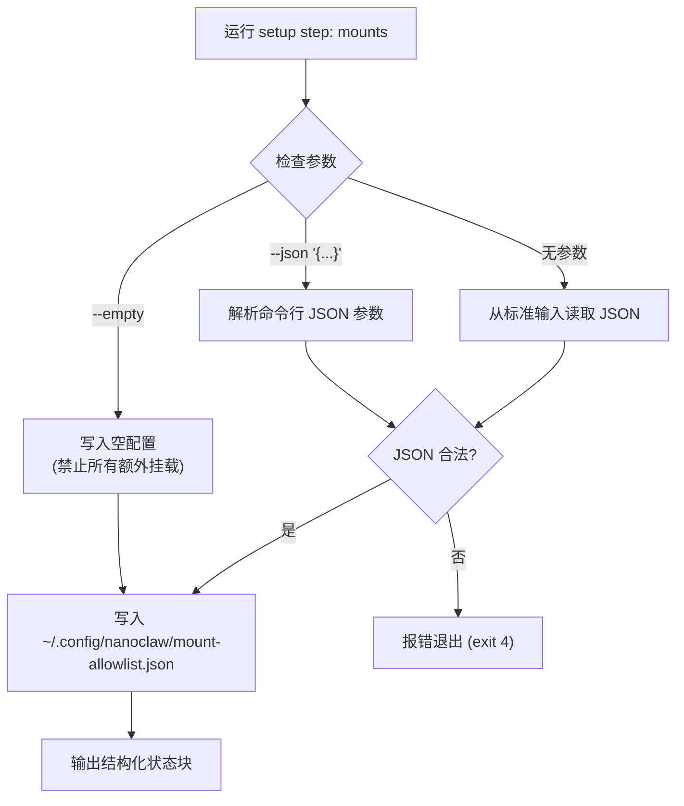

安装流程的最后两个关键步骤——配置**挂载白名单**和**注册系统服务**——共同决定了 NanoClaw 容器化智能体能访问哪些主机目录，以及 NanoClaw 编排器如何以守护进程的方式稳定运行。理解这两个步骤的设计意图，有助于你根据自己的开发环境做出恰当的安全与运维决策。

## 整体流程概览

这两个步骤在安装序列中的位置如下。它们是 setup 流程的最后两个步骤，之后由 verify 步骤进行端到端验证：


在 setup CLI 中，它们分别对应 `mounts` 和 `service` 两个步骤，由 `setup/index.ts` 作为统一入口按需调度：

Sources: [index.ts](setup/index.ts#L1-L19)

## 挂载白名单：为什么需要它

NanoClaw 的智能体运行在容器内部，默认只能访问自己的工作目录 `/workspace/group`。如果你希望智能体能够读取或操作主机上的项目文件（例如读取代码仓库、编辑文档），就需要通过**挂载白名单**显式声明允许哪些主机目录被挂载进容器。

这个设计的核心安全原则是：**白名单文件本身绝不会被挂载进容器**。它存储在 `~/.config/nanoclaw/mount-allowlist.json`，位于项目根目录之外，容器内的智能体无法读取或篡改它。这意味着即使智能体获得了容器内的特权，也无法通过修改白名单来提升自己的文件系统访问权限。

Sources: [mount-security.ts](src/mount-security.ts#L1-L8), [config.ts](src/config.ts#L23-L29)

### 白名单文件结构

白名单是一个 JSON 文件，包含三个顶层字段：

| 字段 | 类型 | 说明 |
|------|------|------|
| `allowedRoots` | `AllowedRoot[]` | 允许挂载的根目录列表，只有位于这些根目录下的路径才能被挂载 |
| `blockedPatterns` | `string[]` | 路径匹配黑名单，任何路径组件包含这些字符串的路径都会被拒绝 |
| `nonMainReadOnly` | `boolean` | 若为 `true`，非主群组的挂载一律强制为只读，无论请求是否要求读写 |

每个 `AllowedRoot` 项的结构如下：

| 字段 | 类型 | 说明 |
|------|------|------|
| `path` | `string` | 允许的根目录路径，支持 `~` 表示 home 目录（如 `~/projects`） |
| `allowReadWrite` | `boolean` | 该根目录下是否允许读写挂载（`false` 则强制只读） |
| `description` | `string?` | 可选的描述文本，仅用于文档目的 |

Sources: [types.ts](src/types.ts#L1-L28)

以下是一个完整的白名单配置示例，展示了三种典型的使用场景：

```json
{
  "allowedRoots": [
    {
      "path": "~/projects",
      "allowReadWrite": true,
      "description": "开发项目目录（允许读写）"
    },
    {
      "path": "~/repos",
      "allowReadWrite": true,
      "description": "Git 仓库目录"
    },
    {
      "path": "~/Documents/work",
      "allowReadWrite": false,
      "description": "工作文档（仅允许只读挂载）"
    }
  ],
  "blockedPatterns": [
    "password",
    "secret",
    "token"
  ],
  "nonMainReadOnly": true
}
```

这个示例的含义是：容器可以挂载 `~/projects` 和 `~/repos` 下的目录（支持读写），也可以只读挂载 `~/Documents/work` 下的目录。非主群组则无论配置如何都只能只读挂载。此外，路径中包含 `password`、`secret` 或 `token` 的目录将被无条件拒绝。

Sources: [mount-allowlist.json](config-examples/mount-allowlist.json#L1-L25)

### 内置的黑名单模式

除了用户自定义的 `blockedPatterns`，系统内置了一组不可覆盖的安全敏感路径模式，两者会在加载时合并去重。内置模式覆盖了常见的凭据和密钥文件位置：

| 类别 | 内置模式 |
|------|----------|
| SSH 密钥 | `.ssh`, `id_rsa`, `id_ed25519`, `private_key` |
| GPG 密钥 | `.gnupg`, `.gpg` |
| 云服务凭据 | `.aws`, `.azure`, `.gcloud`, `.kube`, `.docker` |
| 通用凭据文件 | `credentials`, `.env`, `.netrc`, `.npmrc`, `.pypirc`, `.secret` |

即使 `allowedRoots` 包含了 `~`（整个 home 目录），路径 `/home/user/.ssh` 也会因为匹配内置模式 `.ssh` 而被拒绝挂载。

Sources: [mount-security.ts](src/mount-security.ts#L28-L47)

### 配置步骤的执行方式

挂载白名单的配置通过 setup CLI 的 `mounts` 步骤完成，支持三种输入方式：



**创建空白名单**（最安全的起点，所有额外挂载被禁止）：

```bash
npx tsx setup/index.ts --step mounts -- --empty
```

**通过命令行传入 JSON**（适合脚本化部署）：

```bash
npx tsx setup/index.ts --step mounts -- --json '{"allowedRoots":[{"path":"~/projects","allowReadWrite":true}],"blockedPatterns":[],"nonMainReadOnly":true}'
```

**通过标准输入传入**（适合从文件重定向）：

```bash
cat my-mount-config.json | npx tsx setup/index.ts --step mounts
```

注意：setup 步骤会在内部对 JSON 进行 `JSON.parse` 校验。如果格式无效，步骤会以 exit code 4 退出并输出结构化错误状态。

Sources: [mounts.ts](setup/mounts.ts#L1-L115)

### 运行时挂载校验流程

当编排器启动一个容器时，`container-runner.ts` 会调用 `validateAdditionalMounts()` 对每个请求的挂载进行多层校验。完整的校验链如下：

```mermaid
flowchart TD
    A["接收挂载请求<br/>(hostPath, containerPath, readonly)"] --> B{白名单文件存在?}
    B -->|否| REJECT1["❌ 拒绝：无白名单配置"]
    B -->|是| C["加载并缓存白名单"]
    C --> D{容器路径合法?<br/>不含 .. / 非绝对 / 非空}
    D -->|否| REJECT2["❌ 拒绝：无效容器路径"]
    D -->|是| E["展开 ~ 并解析真实路径<br/>(跟随符号链接)"]
    E --> F{主机路径存在?}
    F -->|否| REJECT3["❌ 拒绝：路径不存在"]
    F -->|是| G{匹配黑名单模式?<br/>(内置 + 用户自定义)"]
    G -->|是| REJECT4["❌ 拒绝：匹配敏感路径模式"]
    G -->|否| H{位于允许的根目录下?}
    H -->|否| REJECT5["❌ 拒绝：不在任何允许的根目录下"]
    H -->|是| I{确定最终权限}
    
    I --> J{请求读写?}
    J -->|否| RO1["✅ 只读挂载"]
    J -->|是| K{非主群组 且<br/>nonMainReadOnly=true?}
    K -->|是| RO2["✅ 强制只读"]
    K -->|否| L{根目录允许读写?<br/>allowReadWrite=true?}
    L -->|否| RO3["✅ 强制只读"]
    L -->|是| RW["✅ 读写挂载"]
```

关键的设计细节包括：白名单在进程生命周期内仅加载一次并缓存在内存中，不会每次校验都读取磁盘；路径解析时会通过 `fs.realpathSync` 跟随符号链接以防止通过符号链接绕过限制；通过校验的挂载会被映射到容器内的 `/workspace/extra/{containerPath}` 路径下。

Sources: [mount-security.ts](src/mount-security.ts#L54-L119), [mount-security.ts](src/mount-security.ts#L200-L329), [container-runner.ts](src/container-runner.ts#L200-L211)

### 读写权限的三层决策

挂载的读写权限由三层规则逐级判定，优先级从高到低：

| 优先级 | 规则 | 说明 |
|--------|------|------|
| 1（最高） | `nonMainReadOnly` 全局开关 | 若为 `true`，所有非主群组的挂载强制只读 |
| 2 | `AllowedRoot.allowReadWrite` | 根目录级别的读写开关，限制该根下的所有挂载 |
| 3（最低） | 挂载请求本身的 `readonly` 字段 | 默认为 `true`（只读），仅在上述两层都放行时才生效 |

例如，一个非主群组请求读写挂载 `~/projects/my-app`，即使 `~/projects` 的 `allowReadWrite` 为 `true`，只要 `nonMainReadOnly` 为 `true`，最终仍然只得到只读挂载。

Sources: [mount-security.ts](src/mount-security.ts#L292-L320)

## 服务启动：让 NanoClaw 作为守护进程运行

配置好挂载白名单后，下一步是将 NanoClaw 注册为系统服务，使其开机自启、崩溃自动重启。setup CLI 的 `service` 步骤会自动检测你的平台和服务管理器，生成对应的配置文件并尝试加载服务。

### 平台检测与服务管理器选择

服务启动步骤首先执行 TypeScript 构建（`npm run build`），然后根据平台分发到不同的配置逻辑：

```mermaid
flowchart TD
    Start["setup step: service"] --> Build["执行 npm run build"]
    Build --> BuildOK{构建成功?}
    BuildOK -->|否| Fail["报错退出 (exit 1)"]
    BuildOK -->|是| Platform{检测操作系统}
    
    Platform -->|macOS| Launchd["生成 launchd plist<br/>~/Library/LaunchAgents/com.nanoclaw.plist"]
    Platform -->|Linux| Linux["进一步检测"]
    
    Linux --> Systemd{systemd 可用?<br/>(PID 1 是 systemd? user session 可达?)}
    Systemd -->|是| Root{以 root 运行?}
    Root -->|是| SysSystemd["系统级 systemd unit<br/>/etc/systemd/system/nanoclaw.service"]
    Root -->|否| UserSystemd["用户级 systemd unit<br/>~/.config/systemd/user/nanoclaw.service"]
    
    Systemd -->|否| Nohup["nohup 回退方案<br/>生成 start-nanoclaw.sh 脚本"]
```

Sources: [service.ts](setup/service.ts#L23-L69), [platform.ts](setup/platform.ts#L91-L99)

### macOS：launchd 配置

在 macOS 上，服务步骤会在 `~/Library/LaunchAgents/` 目录下生成 `com.nanoclaw.plist` 文件，包含以下关键配置：

| 配置项 | 值 | 说明 |
|--------|----|------|
| `Label` | `com.nanoclaw` | 服务唯一标识 |
| `ProgramArguments` | `[node路径, dist/index.js]` | 启动命令 |
| `RunAtLoad` | `true` | 用户登录后自动启动 |
| `KeepAlive` | `true` | 崩溃后自动重启 |
| `StandardOutPath` | `{项目目录}/logs/nanoclaw.log` | 标准输出日志 |
| `StandardErrorPath` | `{项目目录}/logs/nanoclaw.error.log` | 错误日志 |

生成 plist 后，步骤会尝试执行 `launchctl load` 加载服务，并验证 `launchctl list` 输出中是否包含 `com.nanoclaw` 条目。如果 load 失败（例如服务已经加载过），会记录警告但不会中断流程。

Sources: [service.ts](setup/service.ts#L71-L145)

### Linux：systemd 配置

Linux 上的配置根据运行身份和 systemd 可用性分为三种情况：

**用户级 systemd（非 root，systemd 可用）**：配置文件写入 `~/.config/systemd/user/nanoclaw.service`，使用 `systemctl --user` 管理。这是最常见的桌面 Linux 场景。

**系统级 systemd（root）**：配置文件写入 `/etc/systemd/system/nanoclaw.service`，使用系统级 `systemctl` 管理。适用于服务器部署。

**nohup 回退（WSL 或无 systemd）**：当 systemd 不可用时（例如 WSL 环境未启用 systemd），生成一个 `start-nanoclaw.sh` 脚本，使用 `nohup` 在后台运行，并将 PID 写入 `nanoclaw.pid` 文件。

systemd unit 的关键配置如下：

```ini
[Unit]
Description=NanoClaw Personal Assistant
After=network.target

[Service]
Type=simple
ExecStart={node路径} {项目目录}/dist/index.js
Restart=always
RestartSec=5

[Install]
WantedBy=default.target   # 用户级 / multi-user.target（root）
```

`Restart=always` 和 `RestartSec=5` 确保服务在异常退出后 5 秒自动重启，提供基本的进程弹性。

Sources: [service.ts](setup/service.ts#L147-L306)

### Docker 组成员过期的检测

在用户级 systemd 场景下，service 步骤会额外检测一个常见陷阱：**Docker 组成员过期**。如果在当前登录会话期间将用户加入了 `docker` 组，终端中 `docker info` 可以正常执行，但 systemd 用户会话仍然使用登录时的组列表，导致 Docker 命令在服务上下文中失败。检测逻辑通过对比 shell 和 systemd 会话中 `docker info` 的执行结果来判断是否存在此问题，并在状态输出中标记 `DOCKER_GROUP_STALE: true`。

解决方法是重新登录（注销再登录），使 systemd 用户会话获取更新后的组成员身份。

Sources: [service.ts](setup/service.ts#L186-L201), [service.ts](setup/service.ts#L258-L263)

### 孤儿进程清理

在启动新服务之前，步骤会先清理可能残留的旧 NanoClaw 进程。这通过 `pkill -f` 匹配 `{项目目录}/dist/index.js` 来实现，防止新旧实例同时运行导致渠道连接冲突（例如两个 WhatsApp 实例尝试使用相同的认证凭据）。

Sources: [service.ts](setup/service.ts#L166-L175), [service.ts](setup/service.ts#L265-L266)

## 服务管理常用命令

服务配置完成后，你可能需要手动管理服务状态。以下是根据不同平台的管理命令速查表：

| 操作 | macOS (launchd) | Linux (systemd 用户级) | Linux (nohup) |
|------|-----------------|----------------------|---------------|
| 查看状态 | `launchctl list \| grep nanoclaw` | `systemctl --user status nanoclaw` | `cat nanoclaw.pid && kill -0 $(cat nanoclaw.pid)` |
| 停止服务 | `launchctl unload ~/Library/LaunchAgents/com.nanoclaw.plist` | `systemctl --user stop nanoclaw` | `kill $(cat nanoclaw.pid)` |
| 启动服务 | `launchctl load ~/Library/LaunchAgents/com.nanoclaw.plist` | `systemctl --user start nanoclaw` | `./start-nanoclaw.sh` |
| 查看日志 | `tail -f logs/nanoclaw.log` | `tail -f logs/nanoclaw.log` | `tail -f logs/nanoclaw.log` |
| 查看错误日志 | `tail -f logs/nanoclaw.error.log` | `tail -f logs/nanoclaw.error.log` | `tail -f logs/nanoclaw.error.log` |

所有平台的日志都统一输出到项目目录下的 `logs/` 文件夹中。

Sources: [service.ts](setup/service.ts#L84-L113), [service.ts](setup/service.ts#L236-L253), [service.ts](setup/service.ts#L308-L361)

## 验证安装完整性

完成挂载白名单和服务启动后，setup 流程的最后一个步骤 `verify` 会执行端到端的健康检查，覆盖以下六项：

1. **服务状态**：检查服务是否处于 `running` 状态
2. **容器运行时**：检测 Docker 或 Apple Container 是否可用
3. **凭据配置**：检查 `.env` 中是否配置了 `CLAUDE_CODE_OAUTH_TOKEN` 或 `ANTHROPIC_API_KEY`
4. **渠道认证**：检测已配置的消息渠道（WhatsApp/Telegram/Slack/Discord）
5. **已注册群组**：查询数据库中 `registered_groups` 表的记录数
6. **挂载白名单**：检查 `~/.config/nanoclaw/mount-allowlist.json` 是否存在

```bash
npx tsx setup/index.ts --step verify
```

只有当服务正在运行、凭据已配置且至少有一个渠道已认证时，验证才会报告 `success`。挂载白名单的状态会单独报告为 `configured` 或 `missing`——即使白名单缺失也不会导致整体验证失败，但这意味着所有额外的目录挂载请求都会被拒绝。

Sources: [verify.ts](setup/verify.ts#L1-L192)

## 常见问题排查

| 问题 | 现象 | 解决方法 |
|------|------|----------|
| 服务启动后立即退出 | `nanoclaw.error.log` 中有构建相关错误 | 确认 `npm run build` 成功，检查 Node.js 版本 ≥ 20 |
| launchd 服务未加载 | `launchctl list` 中无 `com.nanoclaw` | 检查 plist 文件权限，尝试手动 `launchctl load` |
| systemd 服务启动失败 | `systemctl --user status nanoclaw` 显示错误 | 检查日志 `logs/nanoclaw.error.log`，确认 `.env` 中凭据正确 |
| Docker 命令在服务中失败 | 终端可用但服务日志报 Docker 权限错误 | 重新登录以刷新 systemd 会话的组成员，参见上文"Docker 组成员过期" |
| 额外挂载全部被拒绝 | 日志显示 `No mount allowlist configured` | 创建 `~/.config/nanoclaw/mount-allowlist.json`，至少包含一个 `allowedRoots` 条目 |
| 特定路径挂载被拒绝 | 日志显示 `not under any allowed root` | 检查路径是否在某个 `allowedRoots` 的子树下，注意符号链接会被解析为真实路径 |

## 下一步

挂载白名单配置完成、服务成功启动并通过验证后，安装流程即告完成。你可以：

- 进入**深入理解**部分了解 [整体架构：单进程编排器与容器化智能体](9-zheng-ti-jia-gou-dan-jin-cheng-bian-pai-qi-yu-rong-qi-hua-zhi-neng-ti)，理解系统如何在你刚配置的服务基础上运行
- 如果需要更深入理解挂载安全机制的实现细节，参阅 [挂载安全：外部白名单、符号链接防护与路径校验](22-gua-zai-an-quan-wai-bu-bai-ming-dan-fu-hao-lian-jie-fang-hu-yu-lu-jing-xiao-yan)
- 如需修改已运行服务的配置或排查日志，参阅 [服务管理：launchd / systemd 配置与日志排查](31-fu-wu-guan-li-launchd-systemd-pei-zhi-yu-ri-zhi-pai-cha)