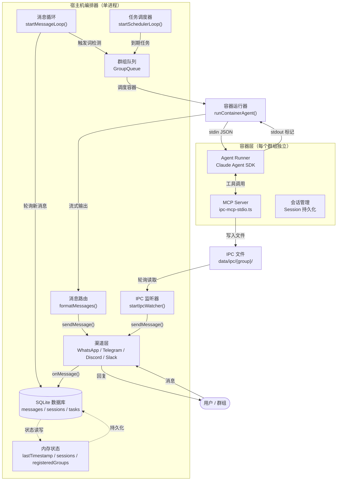

NanoClaw 的核心设计哲学可以用八个字概括：**编排器在主机，智能体在容器**。整个系统由一个运行在宿主机上的单进程 Node.js 编排器作为中枢，负责消息收集、状态管理、任务调度和容器生命周期控制；而实际的 AI 智能体推理则被完全封装在独立的 Docker 容器中执行，通过精心设计的 IPC 机制与编排器双向通信。这种架构在保证安全隔离的同时，实现了极其轻量的运维模型——一个进程、一个 SQLite 数据库、一组容器。

Sources: [src/index.ts](src/index.ts#L1-L589), [src/container-runner.ts](src/container-runner.ts#L1-L703)

## 架构全景图

在深入各个子系统之前，先从全局视角理解 NanoClaw 的运行时结构。下图展示了系统启动后的完整数据流与组件关系——从消息渠道接收用户输入，经编排器处理、排队、格式化，最终由容器内的 Claude Agent SDK 产生响应并通过 IPC 回传。

> **图表说明**：以下使用 Mermaid 流程图展示 NanoClaw 的核心数据流。节点的颜色区分了运行环境——蓝色为宿主机进程内组件，绿色为容器内组件，橙色为持久化存储。



Sources: [src/index.ts](src/index.ts#L465-L574), [src/container-runner.ts](src/container-runner.ts#L258-L638), [src/channels/registry.ts](src/channels/registry.ts#L1-L29)

## 编排器：单进程事件循环

NanoClaw 的宿主端编排器是一个纯粹的 Node.js 单进程应用，没有使用任何集群管理器或消息中间件。其核心 `main()` 函数在启动时依次完成以下初始化步骤：

1. **容器运行时检查**：通过 `docker info` 确认 Docker 守护进程可用，并清理上次运行遗留的孤儿容器
2. **数据库初始化**：使用 better-sqlite3 创建或迁移 SQLite schema（消息表、任务表、会话表等）
3. **状态恢复**：从数据库加载游标位置（`lastTimestamp`）、会话映射（`sessions`）、注册群组（`registeredGroups`）到内存
4. **渠道连接**：通过自注册工厂模式实例化所有已配置的消息渠道
5. **子系统启动**：依次启动任务调度器、IPC 监听器、消息循环

整个编排器包含三个并发运行的异步循环，加上一个事件驱动的 IPC 监听器：

| 子系统 | 入口函数 | 轮询间隔 | 职责 |
|--------|----------|----------|------|
| 消息循环 | `startMessageLoop()` | 2000ms | 从 SQLite 读取新消息，检测触发词，调度容器 |
| 任务调度器 | `startSchedulerLoop()` | 60000ms | 检查到期任务，将其注入群组队列 |
| IPC 监听器 | `startIpcWatcher()` | 1000ms | 扫描各群组的 IPC 目录，处理来自容器的消息和任务请求 |

这三个循环共享同一个 SQLite 数据库和内存状态对象，通过 Node.js 的事件循环实现协作式并发，无需锁机制。

Sources: [src/index.ts](src/index.ts#L465-L574), [src/config.ts](src/config.ts#L16-L51), [src/container-runtime.ts](src/container-runtime.ts#L26-L87)

### 消息循环：从入库到触发

消息循环是编排器的心脏。它采用 **拉取模式**（pull-based）而非推送模式——每 2 秒从 SQLite 的 `messages` 表中查询自上次游标以来新增的所有消息，然后按群组（`chat_jid`）分组处理。

对于每个有新消息的群组，处理逻辑分为两个分支：

- **活跃容器存在**：如果该群组已有正在运行的容器，且容器处于空闲等待状态，则将消息通过 IPC 文件管道（pipe）注入容器 stdin，复用现有会话上下文
- **无活跃容器**：将该群组的 JID 入队到 `GroupQueue`，等待容器调度

对于非主群组，还必须满足触发词检测条件（`TRIGGER_PATTERN` 匹配 `@助手名`），同时发送者必须在白名单内。未触发期间的消息仍然被存储在数据库中，在触发时会作为上下文一并注入。

Sources: [src/index.ts](src/index.ts#L341-L439), [src/sender-allowlist.ts](src/sender-allowlist.ts)

### 群组队列：并发控制的枢纽

`GroupQueue` 是连接消息循环与容器运行器的关键中间层，它实现了两级并发控制：

- **群组级隔离**：每个群组同一时间最多只能有一个活跃容器（消息容器或任务容器互斥）
- **全局级限制**：系统同时运行的容器总数受 `MAX_CONCURRENT_CONTAINERS`（默认 5）限制

当群组的容器已达上限时，后续消息和任务会被暂存在该群组的 `pendingMessages` 和 `pendingTasks` 队列中。当全局容器数达到上限时，群组被加入 `waitingGroups` 等待列表，按先来先服务的顺序在有空位时被唤醒。

队列还提供了**消息管道**能力：当容器已处于空闲等待状态（`idleWaiting`）时，新消息通过写入 IPC 文件直接注入容器，无需启动新容器。这种设计使得连续对话的响应延迟从"启动容器+初始化会话"的秒级降低到文件轮询的亚秒级。

当容器处理失败时，队列采用**指数退避重试**策略（5s → 10s → 20s → 40s → 80s），最多重试 5 次后放弃，等待下一条消息重新触发。

Sources: [src/group-queue.ts](src/group-queue.ts#L1-L366), [src/config.ts](src/config.ts#L52-L55)

## 容器化智能体：隔离的推理引擎

### 容器运行器与卷挂载

`runContainerAgent()` 是编排器与容器交互的核心接口。每次调用时，它会：

1. **构建卷挂载清单**：根据群组身份（主群组 vs 普通群组）组装不同的挂载集
2. **生成容器参数**：包括用户映射、时区环境变量、卷挂载标志
3. **spawn 子进程**：通过 `child_process.spawn()` 启动 `docker run -i --rm`
4. **传递输入**：通过 stdin 写入包含 prompt、session、secrets 的 JSON 后立即关闭
5. **流式解析输出**：使用 `---NANOCLAW_OUTPUT_START---` / `---NANOCLAW_OUTPUT_END---` 标记对实时解析容器输出

下表对比了主群组与普通群组的卷挂载差异，这直接体现了安全隔离的设计思路：

| 挂载目标 | 主群组 | 普通群组 | 说明 |
|----------|--------|----------|------|
| `/workspace/project` | ✅ 只读 | ❌ | 项目源码（`src/`、`package.json` 等） |
| `/workspace/project/.env` | 🔒 `/dev/null` 遮蔽 | — | 阻止读取宿主机的 .env 文件 |
| `/workspace/group` | ✅ 读写 | ✅ 读写 | 群组工作目录 |
| `/workspace/global` | ❌ | ✅ 只读 | 全局记忆目录（`groups/global/CLAUDE.md`） |
| `/home/node/.claude` | ✅ 读写 | ✅ 读写 | 群组独立的会话与设置 |
| `/workspace/ipc` | ✅ 读写 | ✅ 读写 | 群组独立的 IPC 命名空间 |
| `/app/src` | ✅ 读写 | ✅ 读写 | agent-runner 源码（可定制） |
| `/workspace/extra/*` | 按配置 | 按配置 | 额外挂载（经白名单校验） |

值得特别注意的是 **secrets 的传递方式**：API 密钥和 OAuth Token 通过 stdin JSON 传入容器，而非挂载文件。容器内的 agent-runner 读取后立即删除临时文件，并通过 `PreToolUse` Hook 在所有 Bash 工具调用前自动 unset 这些环境变量，防止智能体通过子进程泄露密钥。

Sources: [src/container-runner.ts](src/container-runner.ts#L57-L256), [container/agent-runner/src/index.ts](container/agent-runner/src/index.ts#L191-L209)

### 容器内的查询循环

容器启动后，`agent-runner` 的 `main()` 函数执行一个**无限查询循环**：

```
读取 stdin JSON → 运行 query() → 等待 IPC 消息 → 运行 query() → ... → 收到 _close 哨兵 → 退出
```

每次 `query()` 调用都会创建一个 `MessageStream`（异步可迭代对象），将初始 prompt 推入流中，然后在查询执行期间持续轮询 IPC 输入目录，将后续消息也注入同一个流。这使得 Claude Agent SDK 的 `isSingleUserTurn` 保持为 `false`，允许多轮对话和子智能体（agent teams）完整运行。

每个查询结果通过 stdout 的标记对输出，编排器的流式解析器在收到标记后立即调用回调函数，将响应文本通过原始渠道发回用户——这实现了**流式响应**，用户无需等待整个容器执行结束。

容器退出的触发条件有三个：
- **空闲超时**（默认 30 分钟）：最后一个输出后无新消息，编排器写入 `_close` 哨兵
- **硬超时**（默认 30 分钟，可按群组配置）：容器运行总时长上限
- **任务完成**：对于定时任务，输出结果后 10 秒自动关闭

Sources: [container/agent-runner/src/index.ts](container/agent-runner/src/index.ts#L493-L589), [src/container-runner.ts](src/container-runner.ts#L398-L428)

### MCP Server：容器内的能力扩展

容器内运行着一个基于标准 MCP（Model Context Protocol）协议的 stdio 服务器 `ipc-mcp-stdio.ts`，它作为 Claude Agent 可调用的工具集，提供了以下能力：

| 工具名 | 功能 | 权限控制 |
|--------|------|----------|
| `send_message` | 向用户/群组发送即时消息 | 仅限本群组 JID |
| `schedule_task` | 创建定时/循环任务 | 主群组可跨群组，普通群组仅限自身 |
| `list_tasks` | 查看已调度任务列表 | 主群组看全部，普通群组看自身 |
| `pause_task` / `resume_task` | 暂停/恢复任务 | 同上 |
| `cancel_task` | 取消并删除任务 | 同上 |
| `update_task` | 修改已有任务 | 同上 |
| `register_group` | 注册新的聊天群组 | 仅主群组 |

所有工具调用的实质都是**写入 IPC 文件**——MCP Server 将请求序列化为 JSON，原子写入（先写临时文件再 rename）到 `/workspace/ipc/tasks/` 或 `/workspace/ipc/messages/`，然后由宿主机的 IPC 监听器读取并执行。这种设计确保了容器内的智能体永远不会直接访问宿主机的网络或数据库。

Sources: [container/agent-runner/src/ipc-mcp-stdio.ts](container/agent-runner/src/ipc-mcp-stdio.ts#L1-L339)

## IPC 系统：基于文件的进程间通信

NanoClaw 的宿主机与容器之间的通信完全基于**文件系统**，没有使用 socket、管道或 HTTP。这种选择带来三个关键优势：

1. **天然隔离**：每个群组有独立的 IPC 目录（`data/ipc/{group_folder}/`），权限校验由目录归属而非网络端口决定
2. **原子性保证**：通过 `writeFileSync(temp) + renameSync(temp, target)` 模式确保文件要么完整可见要么不可见
3. **调试友好**：所有通信记录以 JSON 文件形式保存在磁盘上，可直接检查

IPC 目录结构如下：

```
data/ipc/{group_folder}/
├── messages/       ← 容器 → 宿主：发送消息请求
├── tasks/          ← 容器 → 宿主：任务管理请求
├── input/          ← 宿主 → 容器：后续消息与 _close 哨兵
├── current_tasks.json    ← 宿主 → 容器：任务快照（只读）
└── available_groups.json ← 宿主 → 容器：群组列表快照（主群组可见全部）
```

宿主机的 `startIpcWatcher()` 以 1 秒间隔轮询所有群组的 IPC 目录，读取并处理文件后立即删除。这种"读取即消费"的语义配合原子写入，确保了消息不丢失且不重复处理。

Sources: [src/ipc.ts](src/ipc.ts#L1-L154), [src/group-folder.ts](src/group-folder.ts#L38-L44)

## 状态管理与持久化

编排器的运行时状态分为两层：

**内存状态**（每次启动从数据库恢复）：
- `lastTimestamp`：消息循环的全局游标，标记已处理到的最新时间戳
- `lastAgentTimestamp`：每个群组的智能体游标，标记该群组最后被处理的消息时间
- `sessions`：群组到 Claude 会话 ID 的映射，用于跨容器重启的会话恢复
- `registeredGroups`：已注册群组的完整配置（名称、文件夹、触发词、权限等）

**SQLite 持久化**（`data/nanoclaw.db`）：
- `messages` 表：所有渠道的原始消息，按 `(id, chat_jid)` 联合主键
- `registered_groups` 表：群组注册信息
- `sessions` 表：群组会话映射的持久化备份
- `scheduled_tasks` 表：定时任务配置与状态
- `router_state` 表：键值对存储（游标、时间戳等）
- `chats` 表：聊天元数据（名称、最后活跃时间等）

这种双层设计的核心优势在于**崩溃恢复**：如果编排器进程异常退出，重启后通过 `recoverPendingMessages()` 扫描所有注册群组，找到游标之后仍有未处理消息的群组并重新入队，确保不丢消息。

Sources: [src/index.ts](src/index.ts#L59-L88), [src/index.ts](src/index.ts#L446-L458), [src/db.ts](src/db.ts#L17-L85)

## 容器运行时抽象

`container-runtime.ts` 提供了对容器运行时的薄封装，将运行时特定的命令集中在一个文件中。当前默认使用 Docker，但抽象层的设计使得切换到 Apple Container 或其他运行时只需修改这一个文件：

```typescript
export const CONTAINER_RUNTIME_BIN = 'docker';
export function readonlyMountArgs(hostPath, containerPath) { return ['-v', `${hostPath}:${containerPath}:ro`]; }
export function stopContainer(name) { return `${CONTAINER_RUNTIME_BIN} stop ${name}`; }
```

启动时的 `cleanupOrphans()` 函数会查找所有名为 `nanoclaw-*` 的运行中容器并强制停止，确保上次异常退出不会留下僵尸容器。

Sources: [src/container-runtime.ts](src/container-runtime.ts#L1-L88)

## 渠道注册表：自注册工厂模式

消息渠道（WhatsApp、Telegram、Discord、Slack）通过**自注册工厂模式**实现解耦。每个渠道模块在被 import 时自动调用 `registerChannel(name, factory)`，将自己的工厂函数注册到全局 Map 中。

编排器通过桶文件 `channels/index.ts` 触发注册——当某个渠道的技能被安装后，对应的 import 语句会被添加到该文件中。工厂函数接收 `ChannelOpts`（消息回调、群组信息），返回 `Channel` 实例或 `null`（凭证缺失时优雅跳过）。

`Channel` 接口定义了统一的行为契约：`connect()`、`sendMessage()`、`isConnected()`、`ownsJid()`、`disconnect()`，以及可选的 `setTyping()` 和 `syncGroups()`。

Sources: [src/channels/registry.ts](src/channels/registry.ts#L1-L29), [src/channels/index.ts](src/channels/index.ts#L1-L13), [src/types.ts](src/types.ts#L82-L93)

## 架构设计总结

| 设计决策 | 实现方式 | 收益 |
|----------|----------|------|
| 单进程编排 | Node.js 事件循环 | 零依赖部署，无分布式复杂性 |
| 容器化智能体 | `docker run -i --rm` | 完整的文件系统与进程隔离 |
| 文件 IPC | 原子写入 + 轮询读取 | 天然按群组隔离，可调试 |
| SQLite 持久化 | better-sqlite3 同步调用 | 无异步数据库驱动复杂性，崩溃恢复可靠 |
| 流式输出 | stdout 标记对解析 | 用户实时看到响应，无需等待容器完成 |
| 会话复用 | 跨容器的 session ID 传递 | 连续对话无上下文丢失 |
| 密钥保护 | stdin 传递 + Bash Hook 清除 | 智能体无法通过子进程泄露密钥 |

**继续深入**：要理解消息从用户发送到智能体响应的完整链路，请参阅 [消息流转全链路：从渠道到智能体响应](10-xiao-xi-liu-zhuan-quan-lian-lu-cong-qu-dao-dao-zhi-neng-ti-xiang-ying)。要了解渠道如何自注册和统一接口，请参阅 [渠道注册表：自注册工厂模式与渠道接口设计](11-qu-dao-zhu-ce-biao-zi-zhu-ce-gong-han-mo-shi-yu-qu-dao-jie-kou-she-ji)。要深入了解编排器的内部运作，请参阅 [编排器（src/index.ts）：状态管理、消息循环与智能体调度](12-bian-pai-qi-src-index-ts-zhuang-tai-guan-li-xiao-xi-xun-huan-yu-zhi-neng-ti-diao-du)。