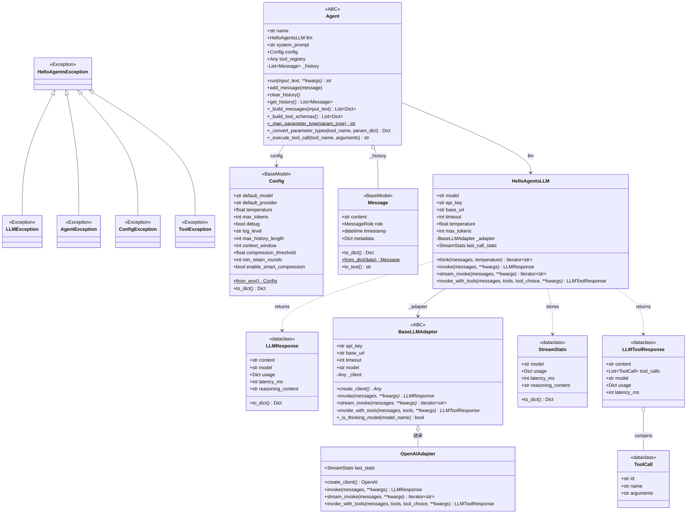
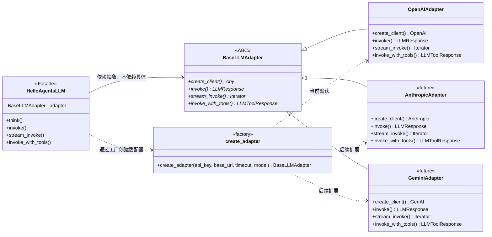
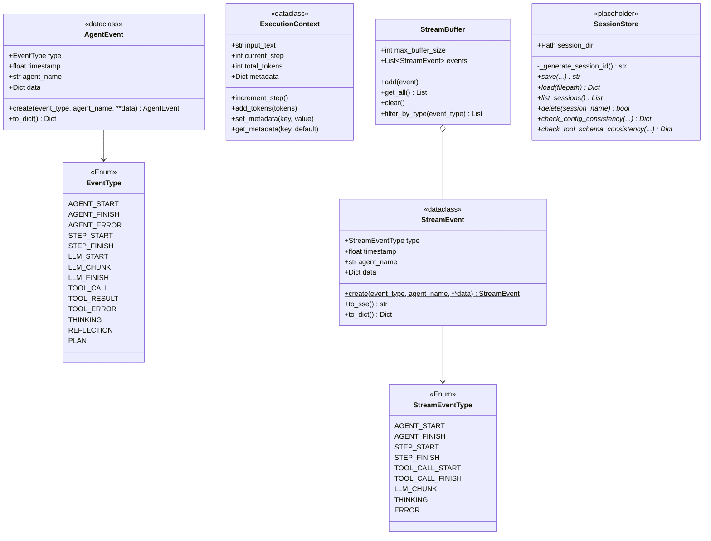
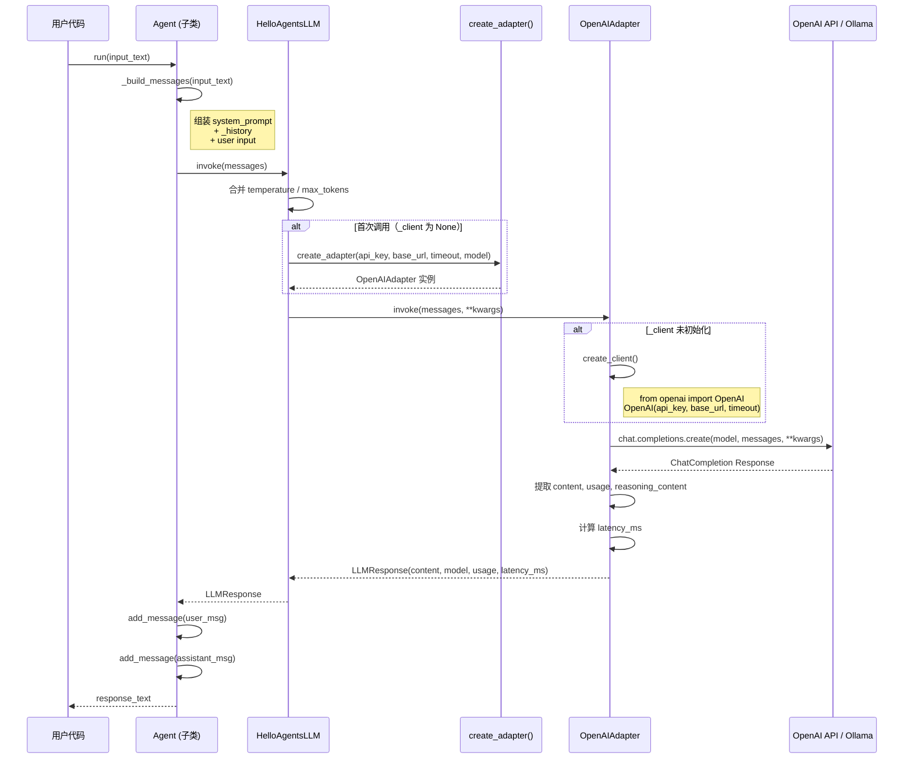
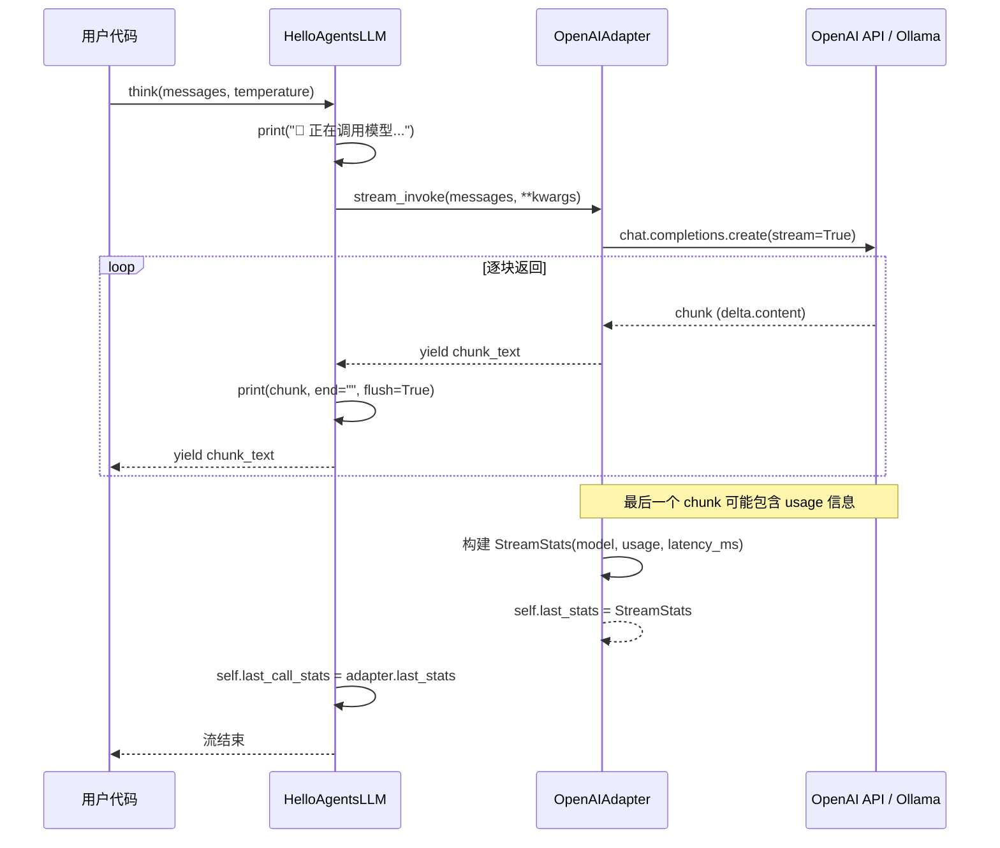
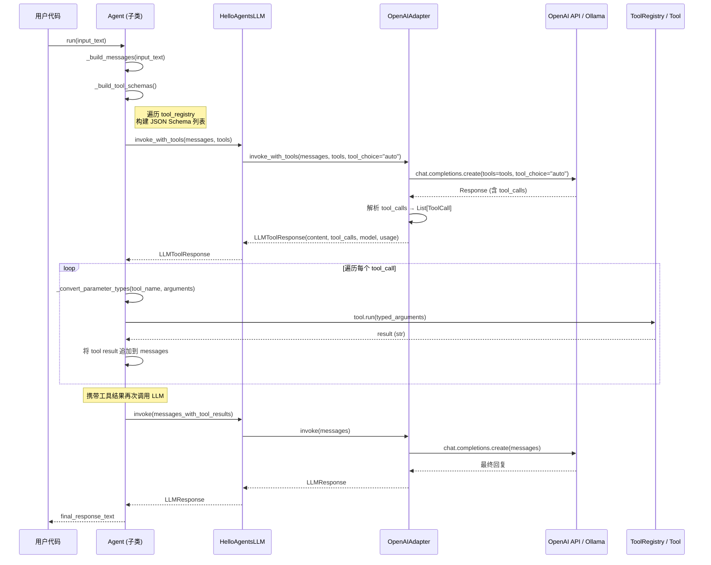
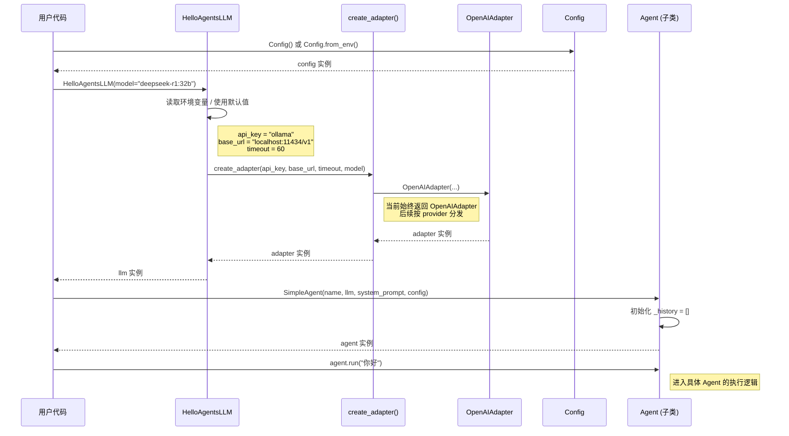

# HelloAgents v0.1 — 架构 UML 图

> 基于 Mermaid 语法，可在 VS Code（Mermaid 插件）或 GitHub 上直接渲染

---

## 1. 类图 — 整体架构

---

## 2. 类图 — 适配器工厂模式

---

## 3. 类图 — 占位模块（Lifecycle / Streaming / SessionStore）

---

## 4. 时序图 — 非流式调用（invoke）

---

## 5. 时序图 — 流式调用（think / stream_invoke）

---

## 6. 时序图 — 工具调用（Function Calling）

---

## 7. 时序图 — 对象创建流程

